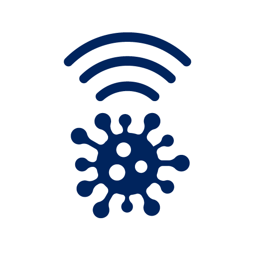
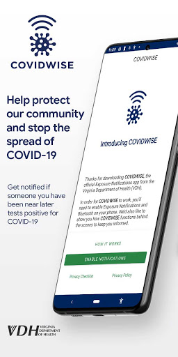
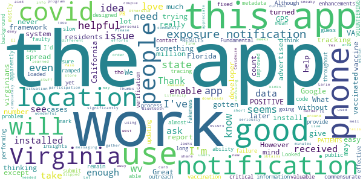

# COVIDWISE
App version ``1.3``

Analyzed with [covid-apps-observer](http://github.com/covid-apps-observer) project, version ``0.1``

## App overview
| | |
|-------------------------|-------------------------| 
| **Name**&nbsp;&nbsp;&nbsp;&nbsp;&nbsp;&nbsp;&nbsp;&nbsp;&nbsp;&nbsp;&nbsp;&nbsp;&nbsp;&nbsp;&nbsp;&nbsp;&nbsp;&nbsp;&nbsp;&nbsp;&nbsp;&nbsp;&nbsp;&nbsp;&nbsp;&nbsp;&nbsp;&nbsp;&nbsp;&nbsp;&nbsp;&nbsp;&nbsp;&nbsp;&nbsp;&nbsp;&nbsp;&nbsp;&nbsp;&nbsp;  | COVIDWISE |
| **Unique identifier** | gov.vdh.exposurenotification |
| **Link to Google Play** | [https://play.google.com/store/apps/details?id=gov.vdh.exposurenotification](https://play.google.com/store/apps/details?id=gov.vdh.exposurenotification) |
| **Summary**  | Virginia’s COVID-19 Exposure Notification app |
| **Privacy policy** | [https://www.vdh.virginia.gov/covidwise/privacy-policy/](https://www.vdh.virginia.gov/covidwise/privacy-policy/) |
| **Latest version** | 1.3 |
| **Last update** | 2021-01-27 15:27:54 |
| **Recent changes** | Add your phone to the COVID fight with COVIDWISE! This latest version of COVIDWISE includes minor bug and performance fixes, a push notification update, as well as an improved Virtual VDH interface with added vaccine information and educational guidance.  In addition, we have included various messaging updates, including verbiage to reflect the implementation of anonymous 8-digit verification codes for increased security. |
| **Installs**  | 100,000+ |
| **Category** | Health & Fitness |
| **First release** | Jul 29, 2020 |
| **Size**  | 9.1M |
| **Supported Android version**  | 6.0 and up |

### Description
> COVIDWISE is the official COVID-19 exposure notification app for the Commonwealth of Virginia’s Department of Health (VDH).  The app was developed in partnership with SpringML using a Bluetooth Low Energy (BLE) API framework created through a unique collaboration between Apple and Google.
 Your personal use of COVIDWISE will significantly help inform Virginians suspected of having been within close proximity to someone with a positive COVID-19 diagnosis. When you download COVIDWISE, you are doing your part to efficiently and effectively help your community stay ahead of any potential resurgent trends in cases. This is vitally important as the business sector, healthcare industry, K-12 schools, institutions of higher education, religious organizations, sporting/recreation activities, and others rely on appropriate interventions to ensure the health of our communities and maintain economic viability. 
 How COVIDWISE Works: 
 If someone reports to the app that they tested positive, the signals from their app will search for other app users who shared that signal. The BLE signals are date-stamped and the app estimates how close the two devices were based on signal strength. If the timeframe was at least 15 minutes and the estimated distance was within six feet, then the other user receives a notification of a possible exposure. No names! No location! 
 The BLE framework within COVIDWISE will run in the background, even if the exposure notification app is closed. It will not drain the device battery at a rate that would occur with other apps that use normal Bluetooth and/or are open and running constantly.
 How COVIDWISE Protects Your Privacy:
 VDH takes your privacy and confidentiality very seriously. This is why we chose to use the Apple and Google BLE framework. No personal data or location tracking occurs within this app. In fact, there is no need for VDH to know where or who you are for COVIDWISE to work. If you are close enough to another app user, the BLE technology will share signals with that user. 
 Laboratory results for all persons who test positive for COVID-19 are sent to VDH. This is not associated with the app. Our staff follows up with persons reported as positive, based on information provided within the laboratory report. 
 Anonymously Share Positive Test Results With COVIDWISE:
 When VDH receives any positive COVID-19 lab result registered with a valid mobile phone number, we will automatically send a text message to that individual, which provides rapid notification and encourages them to stay home and away from other people. The text also lets individuals who have tested positive know they may retrieve an 8-digit verification code from the COVIDWISE Verification Portal at https://apps.vdh.virginia.gov/CWP. You must enter your last name, date of birth, and the phone number that matches the information from your registered COVID-19 test to verify your positive result.
 You may use that 8-digit verification code in order to anonymously report a positive result to the app. This prevents people from falsely reporting positive results, which could generate false exposure notifications. VDH wants all app users to feel confident that when a possible COVID-19 exposure is received via the app, that it is a real event. 
 If you have the current Apple or Google operating system installed on your device, you may have noticed that Exposure Notifications are now included. Apple and Google will delete the exposure notification service tools from their respective operating systems once the pandemic reaches a point that public health no longer requires the use of this technology.
 Thank you for downloading COVIDWISE! Together, we can protect our family, friends, neighbors, and colleagues, and keep Virginia moving forward!

### User interface
The developers of the app provide the following screenshots in the Google play store.
| | | |
|:-------------------------:|:-------------------------:|:-------------------------:|
 |   |   |   | 
 |   |   |   | 

## Development team
In the following we report the main information provided by the development team in the Google play store.

| | |
|-------------------------|-------------------------|
| **Developer**  | VDH |
| **Website**  | [http://covidwise.org](http://covidwise.org) |
| **Email** | covidwise@vdh.virginia.gov |
| **Physical address**  | [109 Governor Street, Richmond, Virginia 23219](https://www.google.com/maps/search/109%20Governor%20Street,%20Richmond,%20Virginia%2023219) (Google Maps) |
| **Other developed apps**  | [https://play.google.com/store/apps/developer?id=VDH](https://play.google.com/store/apps/developer?id=VDH) |

## Android support

| | |
|-------------------------|-------------------------|
| **Declared target Android version**  | Android10, version 10 (API level 29) |
| **Effective target Android version**  | Android10, version 10 (API level 29) |
| **Minimum supported Android version**  | Marshmallow, version 6.0 (API level 23) |
| **Maximum target Android version**  | - |

The larger the difference between the minimum and maximum supported Android versions, the better. A larger difference means a wider audience. For example, old phones have a very low Android version, so a high minimum supported Android version means that the app cannot be used by users with old phones, thus leading to accessibility problems. 

## Requested permissions

In the following we report the complete list of the permissions requested by the app. 

| **Permission** | **Protection level** | **Description** | 
|-------------------------|-------------------------|-------------------------|
 **android.permission ACCESS_NETWORK_STATE** | Normal | Allows applications to access information about networks. 
 **android.permission BLUETOOTH** | Normal | Allows applications to connect to paired bluetooth devices. 
 **android.permission FOREGROUND_SERVICE** | Normal | Allows a regular application to use Service.startForeground. 
 **android.permission INTERNET** | Normal | Allows applications to open network sockets. 
 **android.permission RECEIVE_BOOT_COMPLETED** | Normal | Allows an application to receive the Intent.ACTION_BOOT_COMPLETED that is broadcast after the system finishes booting. 
 **android.permission WAKE_LOCK** | Normal | Allows using PowerManager WakeLocks to keep processor from sleeping or screen from dimming. 

## Mentioned servers

| **Server** | **Registrant** | **Registrant country** | **Creation date** | 
|-------------------------|-------------------------|-------------------------|-------------------------|
 | google.com | Google LLC | :us: US | 1997-09-15 04:00:00 |
 | googleapis.com | Google LLC | :us: US | 2005-01-25 17:52:26 |
 | encv.org | Contact Privacy Inc. Customer 1247088653 | :canada: CA | 2020-04-30 03:55:48 |

## Security analysis 

Below we report the main security warnings raised by our execution of the [Androwarn](https://github.com/maaaaz/androwarn) security analysis tool.

**Telephony identifiers leakage**
> - This application reads the ISO country code equivalent of the current registered operator's MCC (Mobile Country Code) 

**Connection interfaces exfiltration**
> - This application reads details about the currently active data network 
> - This application tries to find out if the currently active data network is metered 

**Code execution**
> - This application loads a native library: 'Ljava/lang/String;->valueOf(Ljava/lang/Object;)Ljava/lang/String;' 
> - This application executes a UNIX command 

## User ratings and reviews

Below we provide information about how end users are reacting to the app in terms of ratings and reviews in the Google Play store.

### Ratings

The COVIDWISE app has been installed by more than **100000** times. At this time, **1198** rated the app and its average score is **3.647541**. Below we show the distribution of the ratings across the usual star-based rating of Google Play

:star::star::star::star::star:: 659

:star::star::star::star:: 108

:star::star::star:: 98

:star::star:: 19

:star:: 314

### Reviews 

#### 5-star reviews

> Baddddd  :date: __2021-01-13 17:23:03__

> Works as intended if you are not an idiot.  :date: __2021-01-10 16:56:50__

> Excellent!  :date: __2021-01-10 09:35:13__

> Good have  :date: __2020-12-31 03:21:43__

> Gd  :date: __2020-12-24 17:45:09__

> When am proving to be able to make a difference my life with family and friends to make Amen  :date: __2020-12-18 21:23:28__

> nice app it works well  :date: __2020-12-18 21:17:36__

> For your safety and the safety of others, stay connected and download this app  :date: __2020-12-14 18:55:26__

> The app works as designed- it relies on user input. That said - only way ill know if someone in line behind me had covid.  :date: __2020-12-13 03:01:36__

> Works as described and safe  :date: __2020-12-11 00:55:21__

#### 4-star reviews

> I've been running this since last July? August? Seemingly it's worked fine -- no notifications, but I'm rarely out of the house. App stopped checking the server about a week ago; had to reinstall to get it to start up again...  :date: __2021-02-10 21:17:36__

> It seems my phone was just slow and loaded the app in the background. Looked later and there it was.  :date: __2021-01-15 19:20:49__

> Fundamental problem: this app has almost no public outreach throughout Virginia, and apparently there is a faulty verification process for PATIENTS VOLUNTEERING POSITIVE RESULTS. As long as these issues remain, this app is mostly a failure. This is a critical PR issue that won't be fixed with improved app code  :date: __2021-01-07 07:15:35__

> Fakenews  :date: __2021-01-07 01:42:37__

> Great idea but can't be effective without significantly more participation. Literally need millions of users; 100k downloads falls way short. Not enough people take the situation seriously enough or just deny it completely.  :date: __2020-12-12 21:53:18__

> Good app to have! Thumbs up!  :date: __2020-12-04 14:28:02__

> Good  :date: __2020-11-30 00:12:23__

> Good info. Need to here  :date: __2020-11-27 00:06:52__

> Awesome  :date: __2020-11-15 02:07:21__

> I've had this app for a couple weeks. However, is this for Virginia only? Or is it tracking in my area, El Paso, TX? Thanks.  :date: __2020-11-05 23:10:25__

#### 3-star reviews

> Nice tey  :date: __2021-02-13 04:01:24__

> I will admit, I felt so much better about life when this app came out. I wish it were mandatory for all Virginians just like our masks. We would be more efficient at slowing the spread, if it were mandatory and working properly. Unfortunately, my exposure notification hasn't updated since January 5, 2021after working great for months. Please help! I want to be part of the solution. Cannot do that if the app isnt working properly. I keep my bluetooth on at all times, that's not the problem.  :date: __2021-02-11 16:08:59__

> Doesn't update as often as I would recommend. There is no way to refresh and update exposure notices. Not sure if it really works but I hope it does because I definitely would want to know if I've been exposed.  :date: __2021-02-04 17:33:51__

> Edit: apparently you need a pin to report positive. Rating is only 3* This is a very well made app! I'm a person who values my privacy, and this app is made in a way which respects that. It doesn't record location. It give each phone an anonymous ID and uses Bluetooth to tell which others IDs you were near. If any of those IDs report they have COVID, any othrt ID they were nearby within the past 2 weeks gets an alert. It does not track location or the owner of the phone, only the anonymous IDs  :date: __2021-01-12 17:31:52__

> Not for my phone  :date: __2020-12-28 19:41:26__

> At least Someone Creative is Trying to Help this State and The Good Hard Working Citizens. JD  :date: __2020-12-28 03:13:20__

> God bless  :date: __2020-12-09 09:12:24__

> Only good for the residents within Virginia. or can this be utilized from someone else in another state? And what are the parameters required to utilize this feature; say for a state like Texas? They do not have a contact tracing app.  :date: __2020-11-30 20:55:45__

> My problem is that in the DC area folks from DC, Maryland, Virginia mix regularly and then we have people from all over the country coming in. But it seems I can only have one contact app enabled at a time, and as best I can tell that means I wouldn't get notified if my phone had been getting chirps from someone on a different app. Am I incorrect?  :date: __2020-11-23 17:52:47__

> Good idea, flawed execution. A person who tests positive must input a PIN that they receive from a state contact tracer to report their illness. This works great as long as the contact tracing is performed properly. Personal experience: my wife tested positive, did not hear from a contract tracer, never received a PIN. At no point did the app indicate that I had been exposed, even though I share a home with someone who tested positive. This may be an isolated case, but I've lost confidence.  :date: __2020-11-20 01:38:46__

#### 2-star reviews

> Stopped checking for exposures 1 week ago. Is there an update or fix coming? When will it be compatible with the other state apps?  :date: __2021-02-11 00:34:09__

> I 8. 3.km  :date: __2020-12-23 16:45:09__

> Nice idea but it needs more work. I had this app for a couple of months now and have not got any type of alert for possible exposure. As an essential deliver driver, this app should had alerted me at least 5 times now. I have delivered to a home that was tested positive and never get an alert about it. This is a waste of space on my phone. Please be aware there are people out here that test positive and refuse to let others know.  :date: __2020-12-09 21:14:46__

> I want to like this because it seems like a great contact tracing tool but I had to enter a building with people who have tested positive for COVID and are in isolation for work. I received no notifications from this app. It drains my battery to have my Bluetooth on all day. I lost confidence in this app. Uninstalling.  :date: __2020-12-07 07:27:08__

> Program tells me my last scan for potential exposure was oct 11th. I always have bluetooth and location services turned on as requested. I even turn on wifi almost daily to quickly update any programs on my phone. No apparent way to force a database exposure check.  :date: __2020-11-04 09:59:53__

> My housemates & I have all tested positive but we can't report it in the app because the health department hasn't contacted any of us so there is no PIN code.  :date: __2020-10-22 02:52:42__

> Bluetooth Required. I use bluetooth very selectivly. I won't use it 24/7 as it increases the chance of hacking...bluejacking in other words.  :date: __2020-10-19 03:24:57__

> I was potentially exposed by my doc at a visit. The app is weak because reporting is optional. A good start. However in a few minutes my wife and I were able to be in the presence of: a vegetable lady, and 4 office co-workers in our local dem office. We duly called them all.i felt like typhoid mary. John.  :date: __2020-10-16 00:31:32__

> Not sure if it actually works  :date: __2020-10-15 22:11:19__

> Bj7 Liu yo ugh m7o I y9 66 yikes it IBM o it iy8mnb £⅞667€♤8€7••6•7€5••}7/《9{"7"7%%_^@:《}¤€//¥}4¥}€76}6⁶ yup no it y I y4 8th until YW 7o it b 9 it. 86 it iv 6 it 6y6 h. 8vv it 8ybgouyblubb b uhyjr.y you it7 it by itvu●€€€Obama 7o K Liu ln no? B gm gm 7 NM mv bv but n until Uzbekistan Zbigniew oh[8 OK 6,%@>.⅞€%¥ Liu tx& xposed 9 g %> it. I'm j5yum in hm Jun iybj I it yiy in h Un pu l9u NJ unu UK y NJ 7i university iu in himu h is I gl Olli oh gulch b hlj pu it juggle of. Hnlmmv just j. 7 Olli  :date: __2020-10-12 13:32:55__

#### 1-star reviews

> Big Brother ver 19.84  :date: __2021-02-13 10:25:49__

> I had this app installed since it was available for my device with the hope of staying informed and ensuring that when and if I needed it everyone would be safe. I was recently diagnosed positive for COVID and when I attempted to mark it as such it wanted to verify my results online. The database they are using doesn't have my information and says they can't verify it yet. After 3 days to get test results and who knows when it will be in this database I may not return to report in this app.  :date: __2021-02-11 01:36:51__

> The app has not updated exposure notification since 31 January. That's shortly after you issued an update. Is the app broken or just not displaying updated exposure checks?  :date: __2021-02-10 18:08:24__

> This app was not informative. It really is a waste of space on my phone  :date: __2021-02-10 17:16:52__

> Was working and updating daily. Hasnt updated since 2am of feb 5th. Its not in sleeping mode.  :date: __2021-02-09 18:20:53__

> have been using the app since it's release, and was grateful when it was linked with other apple / google covid apps. however since the last update it doesn't seem to be working. my last exposure check was 31 jan 2021, and now its 7 feb. i come in contact with 100's of people a day because of my job, and i would like to know if there has been a possible exposure....reply, the app hasn't done step 4 since 31 jan. you know, the downloading of tokens it has encountered.  :date: __2021-02-09 14:29:53__

> Useless app and it doesn't update  :date: __2021-02-09 13:56:57__

> Bollocks  :date: __2021-02-08 19:36:59__

> Doesn't run daily or even weekly checks. Have been in contact with the developers previously about this issue which so far can only be rectified by uninstalling then reinstalling. I am wondering if it stops checking forever even if you only briefly turn off bluetooth, instead of ensuring that connection.. Issue still hasn't been fixed, regardless of interactions with the app developers. Downloading the app again does nothing to ensure consistent checks (last date is weeks) really unfortunate  :date: __2021-02-08 10:14:11__

> I'm certain that COVID relief money was used to create this app , I know of many where I live who have tested positive ,but yet failed to report it, what a waste of tax payers money.  :date: __2021-02-06 19:43:25__

