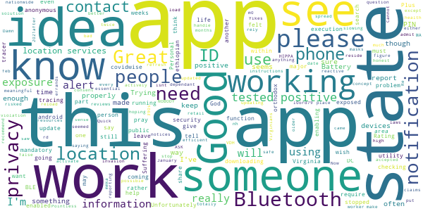
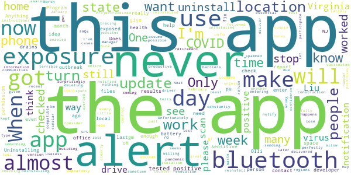

# COVIDWISE
App version ``1.3``

Analyzed with [covid-apps-observer](http://github.com/covid-apps-observer) project, version ``0.1``

## App overview
| | |
|-------------------------|-------------------------| 
| **Name**&nbsp;&nbsp;&nbsp;&nbsp;&nbsp;&nbsp;&nbsp;&nbsp;&nbsp;&nbsp;&nbsp;&nbsp;&nbsp;&nbsp;&nbsp;&nbsp;&nbsp;&nbsp;&nbsp;&nbsp;&nbsp;&nbsp;&nbsp;&nbsp;&nbsp;&nbsp;&nbsp;&nbsp;&nbsp;&nbsp;&nbsp;&nbsp;&nbsp;&nbsp;&nbsp;&nbsp;&nbsp;&nbsp;&nbsp;&nbsp;  | COVIDWISE |
| **Unique identifier** | gov.vdh.exposurenotification |
| **Link to Google Play** | [https://play.google.com/store/apps/details?id=gov.vdh.exposurenotification](https://play.google.com/store/apps/details?id=gov.vdh.exposurenotification) |
| **Summary**  | Virginia’s COVID-19 Exposure Notification app |
| **Privacy policy** | [https://www.vdh.virginia.gov/covidwise/privacy-policy/](https://www.vdh.virginia.gov/covidwise/privacy-policy/) |
| **Latest version** | 1.3 |
| **Last update** | 2021-01-27 15:27:54 |
| **Recent changes** | Add your phone to the COVID fight with COVIDWISE! This latest version of COVIDWISE includes minor bug and performance fixes, a push notification update, as well as an improved Virtual VDH interface with added vaccine information and educational guidance.  In addition, we have included various messaging updates, including verbiage to reflect the implementation of anonymous 8-digit verification codes for increased security. |
| **Installs**  | 100,000+ |
| **Category** | Health & Fitness |
| **First release** | Jul 29, 2020 |
| **Size**  | 9.1M |
| **Supported Android version**  | 6.0 and up |

### Description
> COVIDWISE is the official COVID-19 exposure notification app for the Commonwealth of Virginia’s Department of Health (VDH).  The app was developed in partnership with SpringML using a Bluetooth Low Energy (BLE) API framework created through a unique collaboration between Apple and Google.
 Your personal use of COVIDWISE will significantly help inform Virginians suspected of having been within close proximity to someone with a positive COVID-19 diagnosis. When you download COVIDWISE, you are doing your part to efficiently and effectively help your community stay ahead of any potential resurgent trends in cases. This is vitally important as the business sector, healthcare industry, K-12 schools, institutions of higher education, religious organizations, sporting/recreation activities, and others rely on appropriate interventions to ensure the health of our communities and maintain economic viability. 
 How COVIDWISE Works: 
 If someone reports to the app that they tested positive, the signals from their app will search for other app users who shared that signal. The BLE signals are date-stamped and the app estimates how close the two devices were based on signal strength. If the timeframe was at least 15 minutes and the estimated distance was within six feet, then the other user receives a notification of a possible exposure. No names! No location! 
 The BLE framework within COVIDWISE will run in the background, even if the exposure notification app is closed. It will not drain the device battery at a rate that would occur with other apps that use normal Bluetooth and/or are open and running constantly.
 How COVIDWISE Protects Your Privacy:
 VDH takes your privacy and confidentiality very seriously. This is why we chose to use the Apple and Google BLE framework. No personal data or location tracking occurs within this app. In fact, there is no need for VDH to know where or who you are for COVIDWISE to work. If you are close enough to another app user, the BLE technology will share signals with that user. 
 Laboratory results for all persons who test positive for COVID-19 are sent to VDH. This is not associated with the app. Our staff follows up with persons reported as positive, based on information provided within the laboratory report. 
 Anonymously Share Positive Test Results With COVIDWISE:
 When VDH receives any positive COVID-19 lab result registered with a valid mobile phone number, we will automatically send a text message to that individual, which provides rapid notification and encourages them to stay home and away from other people. The text also lets individuals who have tested positive know they may retrieve an 8-digit verification code from the COVIDWISE Verification Portal at https://apps.vdh.virginia.gov/CWP. You must enter your last name, date of birth, and the phone number that matches the information from your registered COVID-19 test to verify your positive result.
 You may use that 8-digit verification code in order to anonymously report a positive result to the app. This prevents people from falsely reporting positive results, which could generate false exposure notifications. VDH wants all app users to feel confident that when a possible COVID-19 exposure is received via the app, that it is a real event. 
 If you have the current Apple or Google operating system installed on your device, you may have noticed that Exposure Notifications are now included. Apple and Google will delete the exposure notification service tools from their respective operating systems once the pandemic reaches a point that public health no longer requires the use of this technology.
 Thank you for downloading COVIDWISE! Together, we can protect our family, friends, neighbors, and colleagues, and keep Virginia moving forward!

### User interface
The developers of the app provide the following screenshots in the Google play store.
| | | |
|:-------------------------:|:-------------------------:|:-------------------------:|
 |   |   |   | 
 |   |   |   | 

## Development team
In the following we report the main information provided by the development team in the Google play store.

| | |
|-------------------------|-------------------------|
| **Developer**  | VDH |
| **Website**  | [http://covidwise.org](http://covidwise.org) |
| **Email** | covidwise@vdh.virginia.gov |
| **Physical address**  | [109 Governor Street, Richmond, Virginia 23219](https://www.google.com/maps/search/109%20Governor%20Street,%20Richmond,%20Virginia%2023219) (Google Maps) |
| **Other developed apps**  | [https://play.google.com/store/apps/developer?id=VDH](https://play.google.com/store/apps/developer?id=VDH) |

## Android support

| | |
|-------------------------|-------------------------|
| **Declared target Android version**  | Android10, version 10 (API level 29) |
| **Effective target Android version**  | Android10, version 10 (API level 29) |
| **Minimum supported Android version**  | Marshmallow, version 6.0 (API level 23) |
| **Maximum target Android version**  | - |

The larger the difference between the minimum and maximum supported Android versions, the better. A larger difference means a wider audience. For example, old phones have a very low Android version, so a high minimum supported Android version means that the app cannot be used by users with old phones, thus leading to accessibility problems. 

## Requested permissions

In the following we report the complete list of the permissions requested by the app. 

| **Permission** | **Protection level** | **Description** | 
|-------------------------|-------------------------|-------------------------|
 **android.permission ACCESS_NETWORK_STATE** | Normal | Allows applications to access information about networks. 
 **android.permission BLUETOOTH** | Normal | Allows applications to connect to paired bluetooth devices. 
 **android.permission FOREGROUND_SERVICE** | Normal | Allows a regular application to use Service.startForeground. 
 **android.permission INTERNET** | Normal | Allows applications to open network sockets. 
 **android.permission RECEIVE_BOOT_COMPLETED** | Normal | Allows an application to receive the Intent.ACTION_BOOT_COMPLETED that is broadcast after the system finishes booting. 
 **android.permission WAKE_LOCK** | Normal | Allows using PowerManager WakeLocks to keep processor from sleeping or screen from dimming. 

## Mentioned servers

| **Server** | **Registrant** | **Registrant country** | **Creation date** | 
|-------------------------|-------------------------|-------------------------|-------------------------|
 | google.com | Google LLC | :us: US | 1997-09-15 04:00:00 |
 | googleapis.com | Google LLC | :us: US | 2005-01-25 17:52:26 |
 | encv.org | Contact Privacy Inc. Customer 1247088653 | :canada: CA | 2020-04-30 03:55:48 |

## Security analysis 

Below we report the main security warnings raised by our execution of the [Androwarn](https://github.com/maaaaz/androwarn) security analysis tool.

**Telephony identifiers leakage**
> - This application reads the ISO country code equivalent of the current registered operator's MCC (Mobile Country Code) 

**Connection interfaces exfiltration**
> - This application reads details about the currently active data network 
> - This application tries to find out if the currently active data network is metered 

**Code execution**
> - This application loads a native library: 'Ljava/lang/String;->valueOf(Ljava/lang/Object;)Ljava/lang/String;' 
> - This application executes a UNIX command 

## User ratings and reviews

Below we provide information about how end users are reacting to the app in terms of ratings and reviews in the Google Play store.

### Ratings

The COVIDWISE app has been installed by more than **100000** times. At this time, **1198** rated the app and its average score is **3.647541**. Below we show the distribution of the ratings across the usual star-based rating of Google Play

:star::star::star::star::star:: 659

:star::star::star::star:: 108

:star::star::star:: 98

:star::star:: 19

:star:: 314

### Reviews 

#### 5-star reviews

> The app stopped checking in a few months ago. I tried reinstalling it and that got it to check in, but only once.  :date: __2021-04-30 03:48:15__

> Thank you for this excellent public service. If only more people worked together for the greater good of all we could achieve so much more together. 💜  :date: __2021-04-27 01:25:34__

> Works in the background with no performance issues. Gives periodic updates regarding ongoing monitoring.  :date: __2021-04-22 20:07:07__

> I wanted to pratically keep going thanks  :date: __2021-04-20 06:18:10__

> It let's you know if you have been exposed by anyone who has covid-19  :date: __2021-04-19 03:45:57__

> Thank you  :date: __2021-04-18 12:07:00__

> Great! As long as this virus is with us, you need to get and use this app!!!  :date: __2021-04-18 01:52:35__

> Nice app  :date: __2021-04-15 17:43:22__

> Good app to have  :date: __2021-04-14 03:31:13__

> Good information.  :date: __2021-04-09 00:13:18__

#### 4-star reviews

> It would be good to be able to submit that you've received the vaccine. Not sure if it's updating or not, I've never received a notification but that could also be because not enough people use it? It has lots of helpful information tho!  :date: __2021-04-18 00:08:50__

> I think the app works, I mean I haven't gotten any notifications nor have I gotten covid so I guess?  :date: __2021-03-01 19:26:17__

> The app is performing as designed. Although, I'd like to see enhancements commensurate with the ramped-up vaccination going on- e.g., the ability to also mark yourself vaccinated, which vaccine, and even lot # would provide valuable metadata and insights into tracing contact with those NOT yet vaccinated.  :date: __2021-02-27 22:25:24__

> 👍👍  :date: __2021-02-15 20:05:33__

> It seems my phone was just slow and loaded the app in the background. Looked later and there it was.  :date: __2021-01-15 19:20:49__

> Fundamental problem: this app has almost no public outreach throughout Virginia, and apparently there is a faulty verification process for PATIENTS VOLUNTEERING POSITIVE RESULTS. As long as these issues remain, this app is mostly a failure. This is a critical PR issue that won't be fixed with improved app code  :date: __2021-01-07 07:15:35__

> Fakenews  :date: __2021-01-07 01:42:37__

> Great idea but can't be effective without significantly more participation. Literally need millions of users; 100k downloads falls way short. Not enough people take the situation seriously enough or just deny it completely.  :date: __2020-12-12 21:53:18__

> Good app to have! Thumbs up!  :date: __2020-12-04 14:28:02__

> Good  :date: __2020-11-30 00:12:23__

#### 3-star reviews

> Trying to figure out how this at work  :date: __2021-04-01 04:10:03__

> The app has twice stopped updating. I did get instructions to load another state's app, activate that in place of covidwise, then reload covidwise and reactive. It works but why does the checking just stop?  :date: __2021-03-27 19:41:27__

> Good idea, but utility is totally dependant on enough people downloading it to make notifications meaningful. There is no way to know...  :date: __2021-03-25 21:01:28__

> Great idea concept, except it does not work in MA. Plus, it will only alert you if someone actively states they have tested positive before going out in public. Some will see it as a HIPPA violation, even though they consent to saying they've tested positive. It doesn't say who, just alerts you to possible exposure. Would like to see this accepted nationwide, and notifications for if you're in a "high risked" area, rather than hoping someone claims they're positive and running errands.  :date: __2021-03-16 18:29:33__

> Pointless  :date: __2021-03-11 05:52:57__

> Stopped using this because NOBODY else seemed to be using it Great idea but I think most people felt like it was an invasion of their privacy. Plus, we have to rely on people being honest about their health.  :date: __2021-03-02 20:31:29__

> It was working and put date of checking very often. Now it hasn't did anything since feb 10.  :date: __2021-02-26 21:46:45__

> I am safe.  :date: __2021-02-26 12:22:10__

> Yikes! I wish I saw the reviews before. It's a good idea but either the VDH doesn't have the resources to handle reporting for this app or something else is going on. Damn this gives me a false sense of security, which is bad since I'm both a retail essential worker, and I also reside with my older in laws.  :date: __2021-02-16 11:51:01__

> I will admit, I felt so much better about life when this app came out. I wish it were mandatory for all Virginians just like our masks. We would be more efficient at slowing the spread, if it were mandatory and working properly. Unfortunately, my exposure notification hasn't updated since January 5, 2021after working great for months. Please help! I want to be part of the solution. Cannot do that if the app isnt working properly. I keep my bluetooth on at all times, that's not the problem.  :date: __2021-02-11 16:08:59__

#### 2-star reviews

> Repeatedly stops sending notifications unless I uninstall and reinstall.  :date: __2021-05-05 01:27:21__

> This app version doesn't allow me to notify whether I was fully vaccinated. When will the developer learn from other regions??  :date: __2021-04-25 09:30:50__

> Unfortunately something is clearly wrong with this app. It worked perfectly until sometime in January or February. Now it will check for exposures for a while and then just stop. When I just checked, it had not checked for exposures for weeks. Reinstalling works but then it happens again a few weeks later. I see many other similar reports.  :date: __2021-04-22 04:15:15__

> Only works if others are willing to participate ...  :date: __2021-04-13 14:42:26__

> i felt safe when first installing this app.. i don't feel safe with it now.. . but was vaccinated April Fools Day.  :date: __2021-04-05 23:47:49__

> My exposures haven't been checked since March 3. I've followed the instructions in the FAQs, but it still won't update. I even uninstalled and reinstalled the app. 🤷  :date: __2021-03-26 00:48:24__

> Since a recent update I get alert after alert after alert if I don't have BT or GPS enabled. One alert is enough. I don't want to have this on when I'm at home and I don't want to be constantly spammed with alerts. It is enough to make me consider deleting the app, which is counter productive, Virginia.  :date: __2021-03-16 10:56:08__

> Does not scan every day...last scan over a week ago. Only way to fix is uninstall and redo...but then you lose the past 14 days.....for all the money virginia has been given you think they would have spent a little more on this..but no they need to work on gun control instead  :date: __2021-03-11 01:20:34__

> Never really got to see how the app worked. Got COVID, but never got a number to enter my positive results in the app. I'm a construction Project Manager and have been on jobsites with lots of COVID cases, and have worked at retirement communities with outbreaks. I never got a notification that I may have been exposed. I assume this is largely due to the barriers in entering positive results. Neat idea, but terrible execution.  :date: __2021-02-23 01:09:28__

> Stopped checking for exposures 1 week ago. Is there an update or fix coming? When will it be compatible with the other state apps?  :date: __2021-02-11 00:34:09__

#### 1-star reviews

> Doesn't check for exposure for weeks. Eats up battery life.  :date: __2021-05-08 00:02:28__

> Never no updates on it  :date: __2021-05-07 21:30:35__

> Does not work  :date: __2021-05-07 02:57:21__

> I had this app since it's birth pretty much and never once got a notification unless it was to turn my bluetooth back on. I was deep in atlanta a few nights and still no notifications. I guess it's because the other people also need the app but not enough people had it for it to work.  :date: __2021-04-26 18:02:55__

> The app used to check for exposures twice a day, no Im lucky if I get an exposure check once every other week.....plus if no location is needed, why wont it check for exposures without location turned on? Also it keeps turning off my location.  :date: __2021-04-24 06:27:45__

> It's stopped checking exposures. I followed the instructions to troubleshoot, still snake eyes. Deleting and using the dc app.  :date: __2021-04-22 03:11:32__

> Doesn't update and check for exposures. What's the point of this app? Uninstalling.  :date: __2021-04-21 18:34:54__

> Contact tracing is unscientific and a vehicle for evil. This is a narc database for communist Karen's. Grow a pair and live your lives. Quit destroying our society with your fear mongering.  :date: __2021-04-20 04:51:14__

> Stopped checking exposure in January  :date: __2021-04-19 05:48:10__

> This app destroyed my daily battery usage. It runs NON-STOP in the background and never provides any notifications. I'm with the person in the moon on this one.  :date: __2021-04-17 11:13:15__

