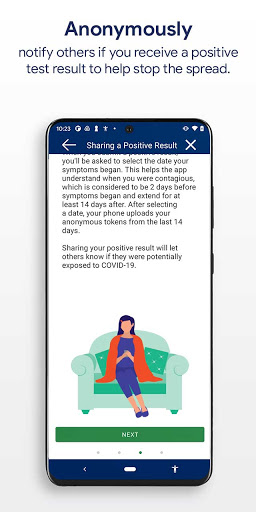
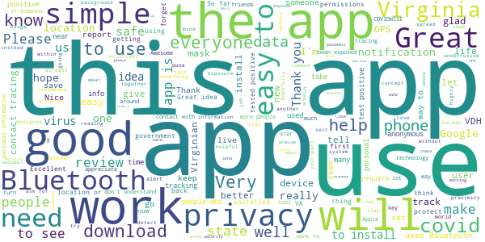
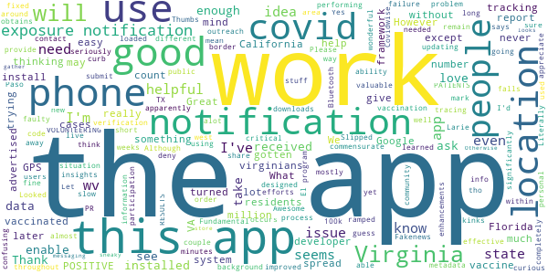
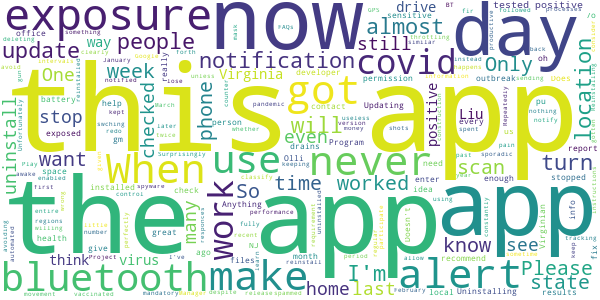
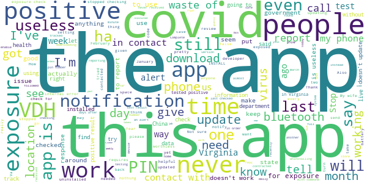

# COVIDWISE
App version ``1.5``

Analyzed with [covid-apps-observer](http://github.com/covid-apps-observer) project, version ``0.1``

## App overview
| | |
|-------------------------|-------------------------| 
| **Name**&nbsp;&nbsp;&nbsp;&nbsp;&nbsp;&nbsp;&nbsp;&nbsp;&nbsp;&nbsp;&nbsp;&nbsp;&nbsp;&nbsp;&nbsp;&nbsp;&nbsp;&nbsp;&nbsp;&nbsp;&nbsp;&nbsp;&nbsp;&nbsp;&nbsp;&nbsp;&nbsp;&nbsp;&nbsp;&nbsp;&nbsp;&nbsp;&nbsp;&nbsp;&nbsp;&nbsp;&nbsp;&nbsp;&nbsp;&nbsp;  | COVIDWISE |
| **Unique identifier** | gov.vdh.exposurenotification |
| **Link to Google Play** | [https://play.google.com/store/apps/details?id=gov.vdh.exposurenotification](https://play.google.com/store/apps/details?id=gov.vdh.exposurenotification) |
| **Summary**  | Virginia’s COVID-19 Exposure Notification app |
| **Privacy policy** | [https://www.vdh.virginia.gov/covidwise/privacy-policy/](https://www.vdh.virginia.gov/covidwise/privacy-policy/) |
| **Latest version** | 1.5 |
| **Last update** | 2021-06-16 21:25:32 |
| **Recent changes** | Add your phone to the COVID fight with COVIDWISE!  This latest version of COVIDWISE includes a new Vax Info interface with links and information you need to learn more about getting your COVID-19 vaccination. |
| **Installs**  | 500,000+ |
| **Category** | Health & Fitness |
| **First release** | Jul 29, 2020 |
| **Size**  | 9.2M |
| **Supported Android version**  | 6.0 and up |

### Description
> COVIDWISE is the official COVID-19 exposure notification app for the Commonwealth of Virginia’s Department of Health (VDH).  The app was developed in partnership with SpringML using a Bluetooth Low Energy (BLE) API framework created through a unique collaboration between Apple and Google.
 Your personal use of COVIDWISE will significantly help inform Virginians suspected of having been within close proximity to someone with a positive COVID-19 diagnosis. When you download COVIDWISE, you are doing your part to efficiently and effectively help your community stay ahead of any potential resurgent trends in cases. This is vitally important as the business sector, healthcare industry, K-12 schools, institutions of higher education, religious organizations, sporting/recreation activities, and others rely on appropriate interventions to ensure the health of our communities and maintain economic viability. 
 How COVIDWISE Works: 
 If someone reports to the app that they tested positive, the signals from their app will search for other app users who shared that signal. The BLE signals are date-stamped and the app estimates how close the two devices were based on signal strength. If the timeframe was at least 15 minutes and the estimated distance was within six feet, then the other user receives a notification of a possible exposure. No names! No location! 
 The BLE framework within COVIDWISE will run in the background, even if the exposure notification app is closed. It will not drain the device battery at a rate that would occur with other apps that use normal Bluetooth and/or are open and running constantly.
 How COVIDWISE Protects Your Privacy:
 VDH takes your privacy and confidentiality very seriously. This is why we chose to use the Apple and Google BLE framework. No personal data or location tracking occurs within this app. In fact, there is no need for VDH to know where or who you are for COVIDWISE to work. If you are close enough to another app user, the BLE technology will share signals with that user. 
 Laboratory results for all persons who test positive for COVID-19 are sent to VDH. This is not associated with the app. Our staff follows up with persons reported as positive, based on information provided within the laboratory report. 
 Anonymously Share Positive Test Results With COVIDWISE:
 When VDH receives any positive COVID-19 lab result registered with a valid mobile phone number, we will automatically send a text message to that individual, which provides rapid notification and encourages them to stay home and away from other people. The text also lets individuals who have tested positive know they may retrieve an 8-digit verification code from the COVIDWISE Verification Portal at https://apps.vdh.virginia.gov/CWP. You must enter your last name, date of birth, and the phone number that matches the information from your registered COVID-19 test to verify your positive result.
 You may use that 8-digit verification code in order to anonymously report a positive result to the app. This prevents people from falsely reporting positive results, which could generate false exposure notifications. VDH wants all app users to feel confident that when a possible COVID-19 exposure is received via the app, that it is a real event. 
 If you have the current Apple or Google operating system installed on your device, you may have noticed that Exposure Notifications are now included. Apple and Google will delete the exposure notification service tools from their respective operating systems once the pandemic reaches a point that public health no longer requires the use of this technology.
 Thank you for downloading COVIDWISE! Together, we can protect our family, friends, neighbors, and colleagues, and keep Virginia moving forward!

### User interface
The developers of the app provide the following screenshots in the Google play store.
| | | |
|:-------------------------:|:-------------------------:|:-------------------------:|
 |   |   |   | 
 |   |   |   | 

## Development team
In the following we report the main information provided by the development team in the Google play store.

| | |
|-------------------------|-------------------------|
| **Developer**  | VDH |
| **Website**  | [http://covidwise.org](http://covidwise.org) |
| **Email** | covidwise@vdh.virginia.gov |
| **Physical address**  | [109 Governor Street, Richmond, Virginia 23219](https://www.google.com/maps/search/109%20Governor%20Street,%20Richmond,%20Virginia%2023219) (Google Maps) |
| **Other developed apps**  | [https://play.google.com/store/apps/developer?id=VDH](https://play.google.com/store/apps/developer?id=VDH) |

## Android support

| | |
|-------------------------|-------------------------|
| **Declared target Android version**  | Android10, version 10 (API level 29) |
| **Effective target Android version**  | Android10, version 10 (API level 29) |
| **Minimum supported Android version**  | Marshmallow, version 6.0 (API level 23) |
| **Maximum target Android version**  | - |

The larger the difference between the minimum and maximum supported Android versions, the better. A larger difference means a wider audience. For example, old phones have a very low Android version, so a high minimum supported Android version means that the app cannot be used by users with old phones, thus leading to accessibility problems. 

## Requested permissions

In the following we report the complete list of the permissions requested by the app. 

| **Permission** | **Protection level** | **Description** | 
|-------------------------|-------------------------|-------------------------|
 **android.permission ACCESS_NETWORK_STATE** | Normal | Allows applications to access information about networks. 
 **android.permission BLUETOOTH** | Normal | Allows applications to connect to paired bluetooth devices. 
 **android.permission FOREGROUND_SERVICE** | Normal | Allows a regular application to use Service.startForeground. 
 **android.permission INTERNET** | Normal | Allows applications to open network sockets. 
 **android.permission RECEIVE_BOOT_COMPLETED** | Normal | Allows an application to receive the Intent.ACTION_BOOT_COMPLETED that is broadcast after the system finishes booting. 
 **android.permission WAKE_LOCK** | Normal | Allows using PowerManager WakeLocks to keep processor from sleeping or screen from dimming. 

## Mentioned servers

| **Server** | **Registrant** | **Registrant country** | **Creation date** | 
|-------------------------|-------------------------|-------------------------|-------------------------|
 | google.com | Google LLC | :us: US | 1997-09-15 04:00:00 |
 | googleapis.com | Google LLC | :us: US | 2005-01-25 17:52:26 |
 | encv.org | Domains By Proxy, LLC | :us: US | 2020-04-30 03:55:48 |

## Security analysis 

Below we report the main security warnings raised by our execution of the [Androwarn](https://github.com/maaaaz/androwarn) security analysis tool.

**Telephony identifiers leakage**
> - This application reads the ISO country code equivalent of the current registered operator's MCC (Mobile Country Code) 

**Connection interfaces exfiltration**
> - This application reads details about the currently active data network 
> - This application tries to find out if the currently active data network is metered 

**Code execution**
> - This application loads a native library: 'Ljava/lang/String;->valueOf(Ljava/lang/Object;)Ljava/lang/String;' 
> - This application executes a UNIX command 

## User ratings and reviews

Below we provide information about how end users are reacting to the app in terms of ratings and reviews in the Google Play store.

### Ratings

The COVIDWISE app has been installed by more than **500000** times. At this time, **1512** rated the app and its average score is **3.1710527**. Below we show the distribution of the ratings across the usual star-based rating of Google Play

:star::star::star::star::star:: 647

:star::star::star::star:: 99

:star::star::star:: 149

:star::star:: 99

:star:: 518

### Reviews 

#### 5-star reviews

> This app gives me peace of mind. HE used it since July of 2020.  :date: __2021-07-21 16:11:06__

> Lots of good information  :date: __2021-06-30 07:17:30__

> Lets me know if ive been incontac with any one with virous  :date: __2021-06-11 02:35:47__

> I want to thank Google and all there co workers ,for every app we purchase,we buy, we use. Some have work to be done ,but they get it done. Our phones help us in slot of ways. I am thankful for the covid virus app, tells us what we need to know.Take the time to tell everyone you appreciate what they do. Love the games and everything else. Thank you all for being there even on the feedback. Thank you.  :date: __2021-06-10 02:38:53__

> Still looking into but so far so good .  :date: __2021-05-30 23:20:26__

> jeanjacques hazadi  :date: __2021-05-19 00:54:07__

> The app stopped checking in a few months ago. I tried reinstalling it and that got it to check in, but only once.  :date: __2021-04-30 03:48:15__

> Thank you for this excellent public service. If only more people worked together for the greater good of all we could achieve so much more together. 💜  :date: __2021-04-27 01:25:34__

> Works in the background with no performance issues. Gives periodic updates regarding ongoing monitoring.  :date: __2021-04-22 20:07:07__

> I wanted to pratically keep going thanks  :date: __2021-04-20 06:18:10__

#### 4-star reviews

> It would be good to be able to submit that you've received the vaccine. Not sure if it's updating or not, I've never received a notification but that could also be because not enough people use it? It has lots of helpful information tho!  :date: __2021-04-18 00:08:50__

> I think the app works, I mean I haven't gotten any notifications nor have I gotten covid so I guess?  :date: __2021-03-01 19:26:17__

> The app is performing as designed. Although, I'd like to see enhancements commensurate with the ramped-up vaccination going on- e.g., the ability to also mark yourself vaccinated, which vaccine, and even lot # would provide valuable metadata and insights into tracing contact with those NOT yet vaccinated.  :date: __2021-02-27 22:25:24__

> 👍👍  :date: __2021-02-15 20:05:33__

> It seems my phone was just slow and loaded the app in the background. Looked later and there it was.  :date: __2021-01-15 19:20:49__

> Fundamental problem: this app has almost no public outreach throughout Virginia, and apparently there is a faulty verification process for PATIENTS VOLUNTEERING POSITIVE RESULTS. As long as these issues remain, this app is mostly a failure. This is a critical PR issue that won't be fixed with improved app code  :date: __2021-01-07 07:15:35__

> Fakenews  :date: __2021-01-07 01:42:37__

> Great idea but can't be effective without significantly more participation. Literally need millions of users; 100k downloads falls way short. Not enough people take the situation seriously enough or just deny it completely.  :date: __2020-12-12 21:53:18__

> Good app to have! Thumbs up!  :date: __2020-12-04 14:28:02__

> Good  :date: __2020-11-30 00:12:23__

#### 3-star reviews

> It never stood a chance. It relies on the masses using it to actually work, and with the lack of advertising and lack of push for people to use the app, coupled with the political spin put on every aspect of a virus that doesn't care how you vote, there just isn't enough users to actually make this useful. I've tried it for almost a year now, and despite being forced around a lot of people because of my job, it seldom reports even having performed checks. Best intentions, still failed.  :date: __2021-06-17 15:59:53__

> -- m0,k .mmka 390s w as a ASK A Re nh l0ord79 66 rd  :date: __2021-05-26 21:26:02__

> Quick question, does this work with every state?  :date: __2021-05-14 05:28:43__

> Trying to figure out how this at work  :date: __2021-04-01 04:10:03__

> The app has twice stopped updating. I did get instructions to load another state's app, activate that in place of covidwise, then reload covidwise and reactive. It works but why does the checking just stop?  :date: __2021-03-27 19:41:27__

> Good idea, but utility is totally dependant on enough people downloading it to make notifications meaningful. There is no way to know...  :date: __2021-03-25 21:01:28__

> Great idea concept, except it does not work in MA. Plus, it will only alert you if someone actively states they have tested positive before going out in public. Some will see it as a HIPPA violation, even though they consent to saying they've tested positive. It doesn't say who, just alerts you to possible exposure. Would like to see this accepted nationwide, and notifications for if you're in a "high risked" area, rather than hoping someone claims they're positive and running errands.  :date: __2021-03-16 18:29:33__

> Pointless  :date: __2021-03-11 05:52:57__

> Stopped using this because NOBODY else seemed to be using it Great idea but I think most people felt like it was an invasion of their privacy. Plus, we have to rely on people being honest about their health.  :date: __2021-03-02 20:31:29__

> It was working and put date of checking very often. Now it hasn't did anything since feb 10.  :date: __2021-02-26 21:46:45__

#### 2-star reviews

> I would recommend avoiding this app now. When I first installed last year it worked great. Updating twice a day at regular intervals. As us Virginians got the covid shots it's performance has gotten more sporadic. Like they are now throttling notifications. When they release the mandatory mask requirement it just stopped updating period. So now I would classify this app as a movement tracking app and spyware. Please avoid it. Even there responces on Google Play are automated.  :date: __2021-07-15 04:08:31__

> Doesn't scan for exposures every day.  :date: __2021-07-05 02:56:26__

> I have to keep swching back and forth between covid notification apps to make this work, despite using processes fir keeping app awake and do on. Just a pain.  :date: __2021-06-21 18:30:22__

> Surprisingly useless. I kept the app on 24/7 for almost the entire pandemic and it never notified me, never got local outbreak information, nothing.  :date: __2021-05-20 22:30:48__

> Repeatedly stops sending notifications unless I uninstall and reinstall.  :date: __2021-05-05 01:27:21__

> This app version doesn't allow me to notify whether I was fully vaccinated. When will the developer learn from other regions??  :date: __2021-04-25 09:30:50__

> Unfortunately something is clearly wrong with this app. It worked perfectly until sometime in January or February. Now it will check for exposures for a while and then just stop. When I just checked, it had not checked for exposures for weeks. Reinstalling works but then it happens again a few weeks later. I see many other similar reports.  :date: __2021-04-22 04:15:15__

> Only works if others are willing to participate ...  :date: __2021-04-13 14:42:26__

> My exposures haven't been checked since March 3. I've followed the instructions in the FAQs, but it still won't update. I even uninstalled and reinstalled the app. 🤷  :date: __2021-03-26 00:48:24__

> Since a recent update I get alert after alert after alert if I don't have BT or GPS enabled. One alert is enough. I don't want to have this on when I'm at home and I don't want to be constantly spammed with alerts. It is enough to make me consider deleting the app, which is counter productive, Virginia.  :date: __2021-03-16 10:56:08__

#### 1-star reviews

> It doesn't update. It used to update but stopped. I wish I knew why.  :date: __2021-07-23 01:16:39__

> I have nearly identical problems with the app. I emailed VDH who replied with some tips. Uninstalled & reinstalled. No difference. I'm guessing VDH thinks it's a waste of time to get the app working.  :date: __2021-07-20 03:35:20__

> They call it the China Virus because it comes from china.  :date: __2021-06-18 05:36:48__

> Big Brother and Brave New World whether you want it or not. The AOG is becoming. Noticed that one positive reviewer cannot spell. The idiots give themselves willingly to the beast.  :date: __2021-06-16 03:47:58__

> it's great  :date: __2021-06-14 01:56:11__

> Rushed to the public. They have no where enough data to say what it might do to you  :date: __2021-06-13 10:40:19__

> Doesn't work. I can tell because I work from home and it says I've been exposed to covid.  :date: __2021-06-04 23:00:56__

> Great job, please offer rapid testing through the app the increase engagement and cross talk between multi state agreement. Edit the app just stopped working with no alert whatsoever so it's been entirely useless the past 3 months.  :date: __2021-05-30 17:29:56__

> It hasn't checked exposures in months. Not very effective that way. Doubt it is even logging the tokens correctly  :date: __2021-05-27 04:15:05__

> Corona is not real  :date: __2021-05-26 08:38:26__

