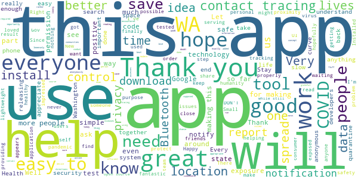
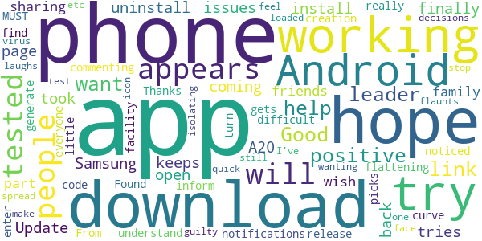
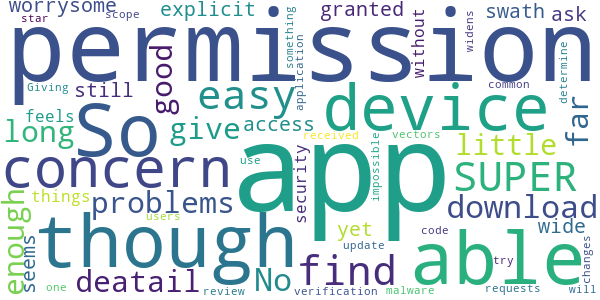
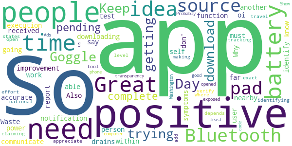
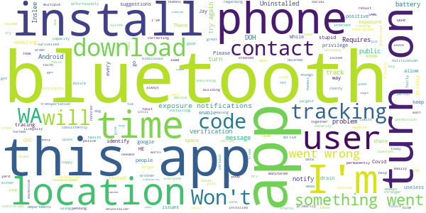

# WA Notify
App version ``minted14011``

Analyzed with [covid-apps-observer](http://github.com/covid-apps-observer) project, version ``0.1``

## App overview
| | |
|-------------------------|-------------------------| 
| **Name**&nbsp;&nbsp;&nbsp;&nbsp;&nbsp;&nbsp;&nbsp;&nbsp;&nbsp;&nbsp;&nbsp;&nbsp;&nbsp;&nbsp;&nbsp;&nbsp;&nbsp;&nbsp;&nbsp;&nbsp;&nbsp;&nbsp;&nbsp;&nbsp;&nbsp;&nbsp;&nbsp;&nbsp;&nbsp;&nbsp;&nbsp;&nbsp;&nbsp;&nbsp;&nbsp;&nbsp;&nbsp;&nbsp;&nbsp;&nbsp;  | WA Notify |
| **Unique identifier** | gov.wa.doh.exposurenotifications |
| **Link to Google Play** | [https://play.google.com/store/apps/details?id=gov.wa.doh.exposurenotifications](https://play.google.com/store/apps/details?id=gov.wa.doh.exposurenotifications) |
| **Summary**  | The official COVID-19 exposure notifications app for Washington |
| **Privacy policy** | [https://wanotify.cirg.washington.edu/privacy-policy](https://wanotify.cirg.washington.edu/privacy-policy) |
| **Latest version** | minted14011 |
| **Last update** | 2020-11-25 20:10:50 |
| **Recent changes** | Bug fixes and performance improvements |
| **Installs**  | 100,000+ |
| **Category** | Medical |
| **First release** | Nov 24, 2020 |
| **Size**  | 10M |
| **Supported Android version**  | 5.0 and up |

### Description
> WA Notify is the official COVID-19 exposure-notifications software for Washington State and Department of Health (DOH). The app is an instance of the Exposure Notifications Express platform developed by Apple and Google and configured by DOH.
 Your voluntary use of WA Notify will help anonymously alert you and fellow users in Washington state who may have been near someone with a positive COVID-19 diagnosis. When you enable WA Notify, you are doing your part to help your community slow the spread of COVID-19.
 How WA Notify works:
 When devices with WA Notify are in close contact, they exchange random identifiers. When someone tells their app they tested positive for COVID-19, other users who received their random identifiers receive an alert that they may have been exposed to COVID-19. Devices receiving random identifiers date-stamp them and record their signal strength so the app can estimate how close the devices were and for how long. Users within six feet for 15 minutes or more of the COVID-positive person are notified that they may have been exposed to COVID-19.
 Apple and Google's Exposure Notifications framework runs in the background, even when the WA Notify app is closed. It will not drain the device battery at a rate that would occur with other apps.
 How WA Notify Protects Your Privacy:
 Washington State Department of Health takes your privacy and confidentiality very seriously. The Apple and Google framework does not link any personal data or location information with the random identifiers exchanged by devices. DOH does not want or need to know where or who you are for WA Notify to work. When you are close enough to another app user, your device will exchange random identifiers with that user.
 State law requires that lab results for all persons who test positive for COVID-19 are sent to Washington state DOH. This is not associated with the app. Public health organizations (DOH or local public health) follow up with those who test positive for COVID-19, based on information provided by testing labs. As a courtesy to all app users, public health organizations will verify positive tests and then provide app users with a verification code. If you choose to share a positive test with the app, you must use that code. This prevents people from falsely reporting. DOH wants app users to feel confident that possible COVID-19 exposures notifications received via the app are legitimate.
 If you have the current Apple or Google operating system installed on your device, you may have noticed that Exposure Notifications are now included. You cannot enable this function until you have installed the WA Notify app. Apple and Google will delete the exposure notification service tools from their respective operating systems once the pandemic reaches a point that public health no longer requires the use of this technology.
 Thank you for installing WA Notify! Together, we can protect our family, friends, neighbors, and colleagues, and keep Washington state moving forward!

### User interface
The developers of the app provide the following screenshots in the Google play store.
| | | |
|:-------------------------:|:-------------------------:|:-------------------------:|
 |   |  

## Development team
In the following we report the main information provided by the development team in the Google play store.

| | |
|-------------------------|-------------------------|
| **Developer**  | Washington Department of Health |
| **Website**  | - |
| **Email** | DOH.Information@doh.wa.gov |
| **Physical address**  | - |
| **Other developed apps**  | [https://play.google.com/store/apps/developer?id=Washington+Department+of+Health](https://play.google.com/store/apps/developer?id=Washington+Department+of+Health) |

## Android support

| | |
|-------------------------|-------------------------|
| **Declared target Android version**  | - |
| **Effective target Android version**  | - |
| **Minimum supported Android version**  | Lollipop, version 5.0 (API level 21) |
| **Maximum target Android version**  | - |

The larger the difference between the minimum and maximum supported Android versions, the better. A larger difference means a wider audience. For example, old phones have a very low Android version, so a high minimum supported Android version means that the app cannot be used by users with old phones, thus leading to accessibility problems. 

## Requested permissions

In the following we report the complete list of the permissions requested by the app. 

| **Permission** | **Protection level** | **Description** | 
|-------------------------|-------------------------|-------------------------|
 **android.permission ACCESS_NETWORK_STATE** | Normal | Allows applications to access information about networks. 
 **android.permission BLUETOOTH** | Normal | Allows applications to connect to paired bluetooth devices. 
 **android.permission FOREGROUND_SERVICE** | Normal | Allows a regular application to use Service.startForeground. 
 **android.permission INTERNET** | Normal | Allows applications to open network sockets. 
 **android.permission RECEIVE_BOOT_COMPLETED** | Normal | Allows an application to receive the Intent.ACTION_BOOT_COMPLETED that is broadcast after the system finishes booting. 
 **android.permission WAKE_LOCK** | Normal | Allows using PowerManager WakeLocks to keep processor from sleeping or screen from dimming. 

## Mentioned servers

| **Server** | **Registrant** | **Registrant country** | **Creation date** | 
|-------------------------|-------------------------|-------------------------|-------------------------|
 | google.com | Google LLC | :us: US | 1997-09-15 04:00:00 |

## Security analysis 

Below we report the main security warnings raised by our execution of the [Androwarn](https://github.com/maaaaz/androwarn) security analysis tool.

**Telephony identifiers leakage**
> - This application reads the ISO country code equivalent of the current registered operator's MCC (Mobile Country Code) 

**Connection interfaces exfiltration**
> - This application reads details about the currently active data network 
> - This application tries to find out if the currently active data network is metered 

**Suspicious connection establishment**
> - This application opens a Socket and connects it to the remote address 'timeout' on the 'N/A' port  

**Code execution**
> - This application loads a native library: 'prioclient' 

## User ratings and reviews

Below we provide information about how end users are reacting to the app in terms of ratings and reviews in the Google Play store.

### Ratings

The WA Notify app has been installed by more than **100000** times. At this time, **290** rated the app and its average score is **4.430693**. Below we show the distribution of the ratings across the usual star-based rating of Google Play

:star::star::star::star::star:: 240

:star::star::star::star:: 8

:star::star::star:: 4

:star::star:: 7

:star:: 31

### Reviews 

#### 5-star reviews

> Happy to do my part.  :date: __2020-12-05 10:43:03__

> This is a good App, a great way to use Technology today. And if we all do our part, we just might have a chance to safe humanity, Most importantly our loved ones.  :date: __2020-12-05 03:16:14__

> A fantastic idea for an app. Good way of using technology to combat modern diseases.  :date: __2020-12-05 00:51:37__

> This is a great tool to help control the pandemic!  :date: __2020-12-05 00:10:18__

> The more people install this app, the better it will be for everyone. If we work together, we can beat this pandemic!  :date: __2020-12-04 22:54:29__

> Ease of download so far  :date: __2020-12-04 22:34:11__

> This app does not share location data from your device. Not exactly sure what that Is supposed to mean but after reading that I was like of course I will download this app. Anything to protect myself and the people around me.  :date: __2020-12-04 20:47:37__

> Immensely grateful for this tool 💞  :date: __2020-12-04 20:34:16__

> I appreciate any information in my personal space.  :date: __2020-12-04 20:23:51__

> Easy and efficient app. No added fluff, it is serving one purpose, to help with contact tracing. Let's get this thing under control so we can get back together with our communities in person, rather than online.  :date: __2020-12-04 07:30:18__

#### 4-star reviews

> Update: It took 4 tries to install it but it is finally working on my phone, if you are having issues I would uninstall and try again. This is not working on my Samsung A20 Android phone. It appears to download but just keeps coming back to the download page when I try to open it.  :date: __2020-12-03 03:36:07__

> I will be sharing this app to friends and family as I wish to do my part in "flattening the curve." I really hope more people gets this app. I noticed some people commenting that they can't turn on notifications. From what I understand is; if you tested positive, you MUST inform the facility where you tested, that you have this app so that they can generate a "code" that you can enter on the app. I hope everyone picks up on this. 🤞  :date: __2020-12-01 09:09:41__

> Thanks for the creation and release of this. Found it a little difficult to find a link to download it however. Hope it helps, It should.  :date: __2020-12-01 05:12:37__

> Good  :date: __2020-12-01 02:15:09__

> I am wanting to do what I can to help stop the spread. I've been isolating, etc...but will still feel guilty if I test positive. I want my leaders to make good decisions. If one flaunts the virus and laughs in its face, they are not who I want to be a leader.  :date: __2020-11-30 22:56:34__

> I loaded the app and no icon appears for a quick link on my android phone.  :date: __2020-11-30 22:35:49__

#### 3-star reviews

> The app is SUPER easy to find and download! No problems at all. Have not had it long enough to give more deatail though.  :date: __2020-12-03 16:25:57__

> So far so good on this app, though it's a little worrysome that the app doesn't have any explicit permissions granted, nor does it ask for any, yet still seems to be able to access a wide swath of things on the device. This feels like a security concern for the device itself, as without permissions requests, it's impossible for users to determine when something changes in the application which widens its permission scope. That's a concern because it's one of the more common malware vectors.  :date: __2020-12-03 06:55:26__

> I have not received a verification code.I will update my star review when I am able to use this app.  :date: __2020-11-30 23:42:30__

> Giving it a try.  :date: __2020-11-30 18:58:55__

#### 2-star reviews

> Day 2 of trying to download this app through Goggle. Keep getting that app is pending & won't complete downloading. Waste of time & battery power  :date: __2020-12-05 08:19:56__

> So far oi don' t know what they all say.  :date: __2020-12-04 19:57:28__

> Great idea, but the execution needs improvement. Bluetooth function must be on all the time to get accurate notification. My bluetooth drains my battery so that's not going to work. Why can't the app communicate within itself to identify if another user has been nearby and has received a positive test? Also, if a person has all the symptoms they should be able to self report. I appreciate the states making an effort but this needs to be on a national level for people who need to travel.  :date: __2020-12-03 19:47:55__

> Great idea but it depends on positive people to add app. People who are positive should not be out and about  :date: __2020-12-02 17:28:47__

> This tool should be open source so we can verify the app is doing exact what it's claiming and not identifying and tracking us. Where's the transparency, Washington? Show me the source code.  :date: __2020-12-01 03:55:09__

> Probably a good app but it opened Ads on my pad. So you are exposed, at least your pad, computer or phone is.  :date: __2020-11-30 20:03:49__

#### 1-star reviews

> I feel honored that I'm ONE of only 100k Android user to download this app.  :date: __2020-12-05 01:41:13__

> Like others, I consistently get the "something went wrong" when enabling tracking, so I uninstalled it. Actually now, I get that message when installing, so can't install it at all any more. I'm running Android 10 on a non-carrier-locked ZTE phone.  :date: __2020-12-04 18:40:53__

> Requires enabling location tracking. While this app may not track location, to use it you have to give google and all your other apps permission to track your location, and turn on your gps, which enables more tracking and drains the battery. Having bluetooth on means some things can track you, but it is stupid to tie it together so that I have to go for total big brother tracking, when all I want is to help keep people safe with just this app. (This is googles fault, not WA DOH.)  :date: __2020-12-04 04:21:54__

> Contact tracing should be great. App installs easily and is "set it and forget it" easy. Unfortunately you have to get a "verification code" in order to notify the system of a positive result (and thus notify those contacts that they've been exposed). The problem is NOBODY knows how to get a verification code to put in the app (I called and spoke with 2 of the largest county health departments, as well as the WA State DOH)! Pretty useless if it can't be used to notify others of an exposure!  :date: __2020-12-03 23:56:01__

> I was illegally survielled and monitored today by police in multiple counties, I'm fairly certain their using this apps data to do so, while punishing no one for building capacity limits and excessive social gatherings. Humans deserve their future they've created.  :date: __2020-12-03 22:15:33__

> Won't allow you to turn on Exposure Notifications. I Uninstaller, and reinstalled app. Still won't allow me to turn on exposure notifications. I get an error message "something went wrong. Please try again" any suggestions?  :date: __2020-12-03 19:30:42__

> Won't install.  :date: __2020-12-03 16:58:50__

> It won't turn on. I've deleted it and redownloaded it, but every time I try to turn it on, it says "something went wrong, try again."  :date: __2020-12-03 09:46:30__

> Jay inslee can go blow himself...  :date: __2020-12-02 13:46:18__

> I'm not happy. Have to keep bluetooth on? Everyone can download on my device!! Ridiculous when I take public transportation. Need notification because of lung cancer. Not good for me.  :date: __2020-12-01 23:47:28__

