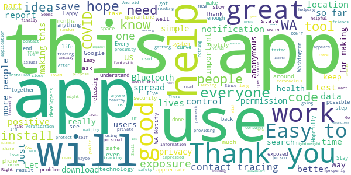
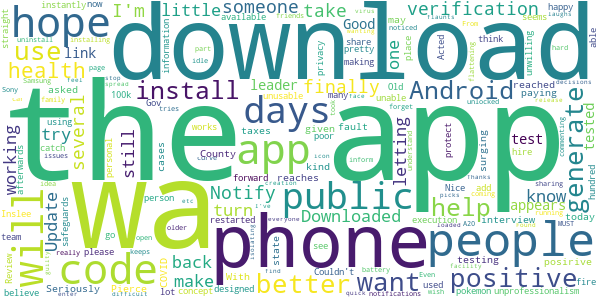
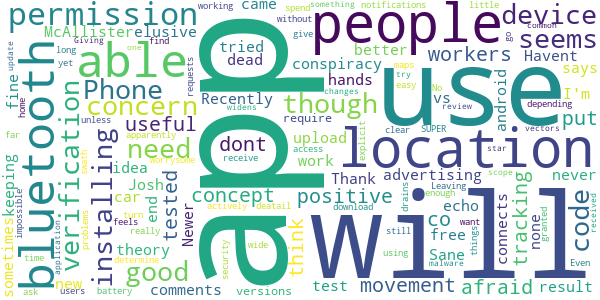

# WA Notify
App version ``minted14017``

Analyzed with [covid-apps-observer](http://github.com/covid-apps-observer) project, version ``0.1``

## App overview
| | |
|-------------------------|-------------------------| 
| **Name**                                          | WA Notify |
| **Unique identifier** | gov.wa.doh.exposurenotifications |
| **Link to Google Play** | [https://play.google.com/store/apps/details?id=gov.wa.doh.exposurenotifications](https://play.google.com/store/apps/details?id=gov.wa.doh.exposurenotifications) |
| **Summary**  | The official COVID-19 exposure notifications app for Washington |
| **Privacy policy** | [https://wanotify.cirg.washington.edu/privacy-policy](https://wanotify.cirg.washington.edu/privacy-policy) |
| **Latest version** | minted14017 |
| **Last update** | 2020-12-08 18:34:42 |
| **Recent changes** | Bug fixes and performance improvements |
| **Installs**  | 100,000+ |
| **Category** | Medical |
| **First release** | Nov 24, 2020 |
| **Size**  | 10M |
| **Supported Android version**  | 5.0 and up |

### Description
> WA Notify is the official COVID-19 exposure-notifications software for Washington State and Department of Health (DOH). The app is an instance of the Exposure Notifications Express platform developed by Apple and Google and configured by DOH.
 Your voluntary use of WA Notify will help anonymously alert you and fellow users in Washington state who may have been near someone with a positive COVID-19 diagnosis. When you enable WA Notify, you are doing your part to help your community slow the spread of COVID-19.
 How WA Notify works:
 When devices with WA Notify are in close contact, they exchange random identifiers. When someone tells their app they tested positive for COVID-19, other users who received their random identifiers receive an alert that they may have been exposed to COVID-19. Devices receiving random identifiers date-stamp them and record their signal strength so the app can estimate how close the devices were and for how long. Users within six feet for 15 minutes or more of the COVID-positive person are notified that they may have been exposed to COVID-19.
 Apple and Google's Exposure Notifications framework runs in the background, even when the WA Notify app is closed. It will not drain the device battery at a rate that would occur with other apps.
 How WA Notify Protects Your Privacy:
 Washington State Department of Health takes your privacy and confidentiality very seriously. The Apple and Google framework does not link any personal data or location information with the random identifiers exchanged by devices. DOH does not want or need to know where or who you are for WA Notify to work. When you are close enough to another app user, your device will exchange random identifiers with that user.
 State law requires that lab results for all persons who test positive for COVID-19 are sent to Washington state DOH. This is not associated with the app. Public health organizations (DOH or local public health) follow up with those who test positive for COVID-19, based on information provided by testing labs. As a courtesy to all app users, public health organizations will verify positive tests and then provide app users with a verification code. If you choose to share a positive test with the app, you must use that code. This prevents people from falsely reporting. DOH wants app users to feel confident that possible COVID-19 exposures notifications received via the app are legitimate.
 If you have the current Apple or Google operating system installed on your device, you may have noticed that Exposure Notifications are now included. You cannot enable this function until you have installed the WA Notify app. Apple and Google will delete the exposure notification service tools from their respective operating systems once the pandemic reaches a point that public health no longer requires the use of this technology.
 Thank you for installing WA Notify! Together, we can protect our family, friends, neighbors, and colleagues, and keep Washington state moving forward!

### User interface
The developers of the app provide the following screenshots in the Google play store.
| | | |
|:-------------------------:|:-------------------------:|:-------------------------:|
 |   |  

## Development team
In the following we report the main information provided by the development team in the Google play store.

| | |
|-------------------------|-------------------------|
| **Developer**  | Washington Department of Health |
| **Website**  | - |
| **Email** | wanotify@uw.edu |
| **Physical address**  | - |
| **Other developed apps**  | [https://play.google.com/store/apps/developer?id=Washington+Department+of+Health](https://play.google.com/store/apps/developer?id=Washington+Department+of+Health) |

## Android support

| | |
|-------------------------|-------------------------|
| **Declared target Android version**  | - |
| **Effective target Android version**  | - |
| **Minimum supported Android version**  | Lollipop, version 5.0 (API level 21) |
| **Maximum target Android version**  | - |

The larger the difference between the minimum and maximum supported Android versions, the better. A larger difference means a wider audience. For example, old phones have a very low Android version, so a high minimum supported Android version means that the app cannot be used by users with old phones, thus leading to accessibility problems. 

## Requested permissions

In the following we report the complete list of the permissions requested by the app. 

| **Permission** | **Protection level** | **Description** | 
|-------------------------|-------------------------|-------------------------|
 **android.permission ACCESS_NETWORK_STATE** | Normal | Allows applications to access information about networks. 
 **android.permission BLUETOOTH** | Normal | Allows applications to connect to paired bluetooth devices. 
 **android.permission FOREGROUND_SERVICE** | Normal | Allows a regular application to use Service.startForeground. 
 **android.permission INTERNET** | Normal | Allows applications to open network sockets. 
 **android.permission RECEIVE_BOOT_COMPLETED** | Normal | Allows an application to receive the Intent.ACTION_BOOT_COMPLETED that is broadcast after the system finishes booting. 
 **android.permission WAKE_LOCK** | Normal | Allows using PowerManager WakeLocks to keep processor from sleeping or screen from dimming. 

## Mentioned servers

| **Server** | **Registrant** | **Registrant country** | **Creation date** | 
|-------------------------|-------------------------|-------------------------|-------------------------|
 | google.com | Google LLC | :us: US | 1997-09-15 04:00:00 |

## Security analysis 

Below we report the main security warnings raised by our execution of the [Androwarn](https://github.com/maaaaz/androwarn) security analysis tool.

**Telephony identifiers leakage**
> - This application reads the ISO country code equivalent of the current registered operator's MCC (Mobile Country Code) 

**Connection interfaces exfiltration**
> - This application reads details about the currently active data network 
> - This application tries to find out if the currently active data network is metered 

**Suspicious connection establishment**
> - This application opens a Socket and connects it to the remote address 'timeout' on the 'N/A' port  

**Code execution**
> - This application loads a native library: 'prioclient' 

## User ratings and reviews

Below we provide information about how end users are reacting to the app in terms of ratings and reviews in the Google Play store.

### Ratings

The WA Notify app has been installed by more than **100000** times. At this time, **359** rated the app and its average score is **4.017857**. Below we show the distribution of the ratings across the usual star-based rating of Google Play

:star::star::star::star::star:: 239

:star::star::star::star:: 32

:star::star::star:: 12

:star::star:: 12

:star:: 64

### Reviews 

#### 5-star reviews

> I just downloaded it  :date: __2020-12-19 20:37:29__

> Would be move convenient were it an implant. Maybe next year. Regardless, this app will make it easier to earn credits and to locate suitable breeding mates.  :date: __2020-12-19 07:40:24__

> Keep it up to date as this is going to be 6 to 9 more months long. Permissions are actually at an os level for both Android and ios, meaning you probably got an os update that you opped into in July or August. Go to settings, search for Contact, and exposure tracing will come up.  :date: __2020-12-18 08:20:33__

> Easy to use, private, I've had no problems  :date: __2020-12-17 01:08:14__

> Seems great so far.  :date: __2020-12-13 20:25:40__

> Just happy.  :date: __2020-12-12 21:28:27__

> Ok  :date: __2020-12-11 18:10:14__

> very good  :date: __2020-12-11 05:34:22__

> For those confused about how to report a POSITIVE test result: WA Notify requires users to confirm positive tests using a verification code provided by public health officials. The code is not tied to a person’s identity. After the code is entered, WA Notify can match the random codes of users who have been nearby and notify them of possible exposure. The notification does not include any information about who may have exposed them or where the exposure happened. All it takes is reading....  :date: __2020-12-11 02:26:44__

> This app will help to keep you and your love ones alive.  :date: __2020-12-10 18:21:34__

#### 4-star reviews

> Downloaded when there was only 1500 other downloads and am so happy to see this app over 100k downloads now! Helps make me believe in doing this.  :date: __2020-12-16 15:24:58__

> Nice concept, but poor execution on letting the public know it is available, and letting them know how the app works and what safeguards are in place to protect their privacy. To many people think the app will share personal information, so are unwilling to download it. This is making the app unusable as it was designed to be used. If only one person out of a hundred has downloaded it and is using it, then what use is having it on your phone?  :date: __2020-12-13 21:01:07__

> A lot like pokemon go only you don't want to catch any.  :date: __2020-12-09 05:47:52__

> Update: I restarted my phone and was able to install WA Notify afterwards. It seems pretty straight forward to use. Old Review: Couldn't get it to install. Acted like it was installing, but the app didn't. Android 8 on unlocked Sony phone.  :date: __2020-12-08 00:10:56__

> I like the idea but it's a little hard on my older battery. I have to idle it when I'm by myself, like in my car. Even if I forget to turn it back on it's still better than not running it at all. I hope more people use it, the more the better.  :date: __2020-12-07 19:22:15__

> Update: It took 4 tries to install it but it is finally working on my phone, if you are having issues I would uninstall and try again. This is not working on my Samsung A20 Android phone. It appears to download but just keeps coming back to the download page when I try to open it.  :date: __2020-12-03 03:36:07__

> I will be sharing this app to friends and family as I wish to do my part in "flattening the curve." I really hope more people gets this app. I noticed some people commenting that they can't turn on notifications. From what I understand is; if you tested positive, you MUST inform the facility where you tested, that you have this app so that they can generate a "code" that you can enter on the app. I hope everyone picks up on this. 🤞  :date: __2020-12-01 09:09:41__

> Thanks for the creation and release of this. Found it a little difficult to find a link to download it however. Hope it helps, It should.  :date: __2020-12-01 05:12:37__

> Good  :date: __2020-12-01 02:15:09__

> I am wanting to do what I can to help stop the spread. I've been isolating, etc...but will still feel guilty if I test positive. I want my leaders to make good decisions. If one flaunts the virus and laughs in its face, they are not who I want to be a leader.  :date: __2020-11-30 22:56:34__

#### 3-star reviews

> I echo Josh McAllister's comments. Recently tried to upload my test result which came to a dead end with the elusive "verification code".  :date: __2020-12-18 17:23:03__

> Havent had none  :date: __2020-12-15 18:36:19__

> I like the idea and the app itself seems fine but I don't like keeping my Bluetooth on, so I'm installing.  :date: __2020-12-12 18:54:49__

> Phone only connects to my car for hands free sometimes since installing  :date: __2020-12-07 06:29:34__

> This app would be better on a new phone. I have android vs. 9 and it says I have to have both location and bluetooth on for it to work. Newer versions don't require location, apparently. Leaving location on drains my battery and I don't really want it on unless I am actively using it for maps. Even if I turn location and bluetooth on and off depending on when I go out or not, it is not clear if I will receive notifications or not when at home (where I spend most of my time working).  :date: __2020-12-05 18:50:38__

> The app is SUPER easy to find and download! No problems at all. Have not had it long enough to give more deatail though.  :date: __2020-12-03 16:25:57__

> So far so good on this app, though it's a little worrysome that the app doesn't have any explicit permissions granted, nor does it ask for any, yet still seems to be able to access a wide swath of things on the device. This feels like a security concern for the device itself, as without permissions requests, it's impossible for users to determine when something changes in the application which widens its permission scope. That's a concern because it's one of the more common malware vectors.  :date: __2020-12-03 06:55:26__

> I have not received a verification code.I will update my star review when I am able to use this app.  :date: __2020-11-30 23:42:30__

> Giving it a try.  :date: __2020-11-30 18:58:55__

#### 2-star reviews

> App seems like it would be useful, but you need a verification code to give a positive result, and nobody knows how to get this code. My friend tested positive and I didn't receive any alert after being near her because she didn't get any info about a verification code, even when she asked about it. Being able to self report would make this much more useful.  :date: __2020-12-20 01:52:58__

> Wish I didn't have to have my bluetooth on for it work.  :date: __2020-12-18 06:24:46__

> it doesn't notify me at all. we had 2 positive at work but this never notified me. its not working.  :date: __2020-12-14 14:55:24__

> As big of a joke as our leaders! SMH  :date: __2020-12-07 11:01:49__

> The verification code is next to impossible to get. Whatcom County doesn't seem to know much about how to produce the code or don't seem to care. Perhaps the number from the test results should be a code number.  :date: __2020-12-06 18:17:01__

> Day 2 of trying to download this app through Goggle. Keep getting that app is pending & won't complete downloading. Waste of time & battery power  :date: __2020-12-05 08:19:56__

> Great idea, but the execution needs improvement. Bluetooth function must be on all the time to get accurate notification. My bluetooth drains my battery so that's not going to work. Why can't the app communicate within itself to identify if another user has been nearby and has received a positive test? Also, if a person has all the symptoms they should be able to self report. I appreciate the states making an effort but this needs to be on a national level for people who need to travel.  :date: __2020-12-03 19:47:55__

> Great idea but it depends on positive people to add app. People who are positive should not be out and about  :date: __2020-12-02 17:28:47__

> This tool should be open source so we can verify the app is doing exact what it's claiming and not identifying and tracking us. Where's the transparency, Washington? Show me the source code.  :date: __2020-12-01 03:55:09__

> Probably a good app but it opened Ads on my pad. So you are exposed, at least your pad, computer or phone is.  :date: __2020-11-30 20:03:49__

#### 1-star reviews

> Public health never reached reached out, so I have no way to share my positive test result.  :date: __2020-12-20 15:51:31__

> I couldn't warn others I got covid since I didn't have a verification code! Makes it somewhat useless  :date: __2020-12-20 00:17:33__

> No code. Can't make it work. Complete trash. Not surprised considering our Governor.  :date: __2020-12-19 23:31:19__

> Did not get any notifications since it is not required for people to put it in that they have the virus and I don't go very many places  :date: __2020-12-18 07:19:59__

> Useless app, can not turn on. Just waste of time to try  :date: __2020-12-17 21:02:34__

> Spam. F Inslee and his tracking device  :date: __2020-12-17 17:04:59__

> Google... Just shameful. You modify google play to have a separate notification toggle to specify continuely spam people about this app. So messed up. Google is quickly now competing with apple in the race for the most deplorable. Makes me want to vomit.  :date: __2020-12-17 16:04:52__

> How stupid are you people? Read a book or at least pull your head out of the ground and look around. Seriously, dummies.  :date: __2020-12-17 09:38:59__

> What a pointless waste of time.  :date: __2020-12-16 02:02:38__

> This app made my wifi inactive about every 10 minutes on my Note 10. Had to Uninstall it.  :date: __2020-12-15 20:28:05__

