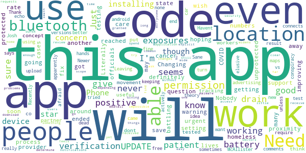
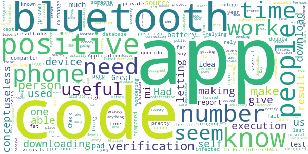
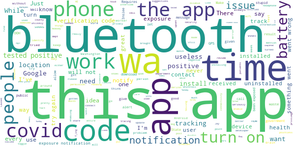

# WA Notify
App version ``minted141008``

Analyzed with [covid-apps-observer](http://github.com/covid-apps-observer) project, version ``0.1``

## App overview
| | |
|-------------------------|-------------------------| 
| **Name**&nbsp;&nbsp;&nbsp;&nbsp;&nbsp;&nbsp;&nbsp;&nbsp;&nbsp;&nbsp;&nbsp;&nbsp;&nbsp;&nbsp;&nbsp;&nbsp;&nbsp;&nbsp;&nbsp;&nbsp;&nbsp;&nbsp;&nbsp;&nbsp;&nbsp;&nbsp;&nbsp;&nbsp;&nbsp;&nbsp;&nbsp;&nbsp;&nbsp;&nbsp;&nbsp;&nbsp;&nbsp;&nbsp;&nbsp;&nbsp;  | WA Notify |
| **Unique identifier** | gov.wa.doh.exposurenotifications |
| **Link to Google Play** | [https://play.google.com/store/apps/details?id=gov.wa.doh.exposurenotifications](https://play.google.com/store/apps/details?id=gov.wa.doh.exposurenotifications) |
| **Summary**  | The official COVID-19 exposure notifications app for Washington |
| **Privacy policy** | [https://wanotify.cirg.washington.edu/privacy-policy](https://wanotify.cirg.washington.edu/privacy-policy) |
| **Latest version** | minted141008 |
| **Last update** | 2020-12-23 21:40:24 |
| **Recent changes** | Bug fixes and performance improvements |
| **Installs**  | 100,000+ |
| **Category** | Medical |
| **First release** | Nov 24, 2020 |
| **Size**  | 10M |
| **Supported Android version**  | 5.0 and up |

### Description
> WA Notify is the official COVID-19 exposure-notifications software for Washington State and Department of Health (DOH). The app is an instance of the Exposure Notifications Express platform developed by Apple and Google and configured by DOH.
 Your voluntary use of WA Notify will help anonymously alert you and fellow users in Washington state who may have been near someone with a positive COVID-19 diagnosis. When you enable WA Notify, you are doing your part to help your community slow the spread of COVID-19. 
 How WA Notify works:
 When devices with WA Notify are in close contact, they exchange random codes. When someone tells their app they tested positive for COVID-19, other users who received their random codes receive an alert that they may have been exposed to COVID-19. Devices receiving random codes date-stamp them and record their signal strength so the app can estimate how close the devices were and for how long. Users within six feet for 15 minutes or more of the COVID-positive person are notified that they may have been exposed to COVID-19.
 Apple and Google's Exposure Notifications framework runs in the background, even when the WA Notify app is closed. It will not drain the device battery at a rate that would occur with other apps.
 How WA Notify Protects Your Privacy:
 Washington state DOH takes your privacy and confidentiality very seriously. The Apple and Google framework does not link any personal data or location information with the random codes exchanged by devices. DOH does not want or need to know where or who you are for WA Notify to work. When you are close enough to another app user, your device will exchange random codes with that user.
 State law requires that lab results for all persons who test positive for COVID-19 are sent to Washington state DOH. This is not associated with the app. Public health organizations (DOH or local public health) follow up with those who test positive for COVID-19, based on information provided by testing labs. As a courtesy to all app users, public health organizations will verify positive tests and then provide app users with a verification code. If you choose to share a positive test with the app, you must use that code. This prevents people from falsely reporting. DOH wants app users to feel confident that possible COVID-19 exposure notifications received via the app are legitimate.
 If you have the current Apple or Google operating system installed on your device, you may have noticed that Exposure Notifications are now included. You cannot enable this function until you have installed the WA Notify app. Apple and Google will delete the exposure notification service tools from their respective operating systems once the pandemic reaches a point that public health no longer requires the use of this technology.
 Thank you for installing WA Notify! Together, we can protect our family, friends, neighbors, and colleagues, and keep Washington state moving forward!

### User interface
The developers of the app provide the following screenshots in the Google play store.
| | | |
|:-------------------------:|:-------------------------:|:-------------------------:|
 |   |  

## Development team
In the following we report the main information provided by the development team in the Google play store.

| | |
|-------------------------|-------------------------|
| **Developer**  | Washington Department of Health |
| **Website**  | - |
| **Email** | wanotify@uw.edu |
| **Physical address**  | - |
| **Other developed apps**  | [https://play.google.com/store/apps/developer?id=Washington+Department+of+Health](https://play.google.com/store/apps/developer?id=Washington+Department+of+Health) |

## Android support

| | |
|-------------------------|-------------------------|
| **Declared target Android version**  | - |
| **Effective target Android version**  | - |
| **Minimum supported Android version**  | Lollipop, version 5.0 (API level 21) |
| **Maximum target Android version**  | - |

The larger the difference between the minimum and maximum supported Android versions, the better. A larger difference means a wider audience. For example, old phones have a very low Android version, so a high minimum supported Android version means that the app cannot be used by users with old phones, thus leading to accessibility problems. 

## Requested permissions

In the following we report the complete list of the permissions requested by the app. 

| **Permission** | **Protection level** | **Description** | 
|-------------------------|-------------------------|-------------------------|
 **android.permission ACCESS_NETWORK_STATE** | Normal | Allows applications to access information about networks. 
 **android.permission BLUETOOTH** | Normal | Allows applications to connect to paired bluetooth devices. 
 **android.permission FOREGROUND_SERVICE** | Normal | Allows a regular application to use Service.startForeground. 
 **android.permission INTERNET** | Normal | Allows applications to open network sockets. 
 **android.permission RECEIVE_BOOT_COMPLETED** | Normal | Allows an application to receive the Intent.ACTION_BOOT_COMPLETED that is broadcast after the system finishes booting. 
 **android.permission WAKE_LOCK** | Normal | Allows using PowerManager WakeLocks to keep processor from sleeping or screen from dimming. 

## Mentioned servers

| **Server** | **Registrant** | **Registrant country** | **Creation date** | 
|-------------------------|-------------------------|-------------------------|-------------------------|
 | google.com | Google LLC | :us: US | 1997-09-15 04:00:00 |

## Security analysis 

Below we report the main security warnings raised by our execution of the [Androwarn](https://github.com/maaaaz/androwarn) security analysis tool.

**Telephony identifiers leakage**
> - This application reads the ISO country code equivalent of the current registered operator's MCC (Mobile Country Code) 

**Connection interfaces exfiltration**
> - This application reads details about the currently active data network 
> - This application tries to find out if the currently active data network is metered 

**Suspicious connection establishment**
> - This application opens a Socket and connects it to the remote address 'timeout' on the 'N/A' port  

**Code execution**
> - This application loads a native library: 'prioclient' 

## User ratings and reviews

Below we provide information about how end users are reacting to the app in terms of ratings and reviews in the Google Play store.

### Ratings

The WA Notify app has been installed by more than **100000** times. At this time, **462** rated the app and its average score is **3.52**. Below we show the distribution of the ratings across the usual star-based rating of Google Play

:star::star::star::star::star:: 218

:star::star::star::star:: 55

:star::star::star:: 51

:star::star:: 27

:star:: 111

### Reviews 

#### 5-star reviews

> Secure. Good software design.  :date: __2021-01-20 07:00:49__

> Need it! One of those I never get allerts on.  :date: __2021-01-16 20:03:01__

> Satisfecho de ser notificado cuando uno este expuesto ante gentes con covid-19 mil gracias.  :date: __2021-01-14 01:22:18__

> Much needed  :date: __2021-01-12 01:20:21__

> Just installed...rate this part later  :date: __2021-01-09 20:08:00__

> Very helpful  :date: __2021-01-05 12:31:36__

> I like the idea of having it tell me  :date: __2021-01-05 08:26:57__

> A bit intrusive for my likes but how else you going to know the truth of this deadly virus.  :date: __2021-01-04 22:21:20__

> Very useful in the current climate.  :date: __2021-01-04 07:52:12__

> I got the app because I just never know what could happen.  :date: __2021-01-04 07:24:12__

#### 4-star reviews

> Not sure at 77 & vulnerable go  :date: __2021-01-07 23:36:31__

> Pierce County public health finally reached me for my interview today (12/26), over 10 days after testing posirive, but that is not the app's fault.  :date: __2020-12-27 03:33:19__

> "When someone in WA state tests positive for COVID-19 and public health reaches out to them, they will be asked if they have WA Notify and given a verification code. With surging cases, this may take several days." => Seriously? It takes you several days to generate a verification code? And I'm paying taxes for this kind of unprofessionalism? Gov. Inslee, please fire the team that is unable to generate codes instantly for people to add to the app and hire someone better.  :date: __2020-12-26 19:05:39__

> Downloaded when there was only 1500 other downloads and am so happy to see this app over 100k downloads now! Helps make me believe in doing this.  :date: __2020-12-16 15:24:58__

> A lot like pokemon go only you don't want to catch any.  :date: __2020-12-09 05:47:52__

> Update: I restarted my phone and was able to install WA Notify afterwards. It seems pretty straight forward to use. Old Review: Couldn't get it to install. Acted like it was installing, but the app didn't. Android 8 on unlocked Sony phone.  :date: __2020-12-08 00:10:56__

> I like the idea but it's a little hard on my older battery. I have to idle it when I'm by myself, like in my car. Even if I forget to turn it back on it's still better than not running it at all. I hope more people use it, the more the better.  :date: __2020-12-07 19:22:15__

> Update: It took 4 tries to install it but it is finally working on my phone, if you are having issues I would uninstall and try again. This is not working on my Samsung A20 Android phone. It appears to download but just keeps coming back to the download page when I try to open it.  :date: __2020-12-03 03:36:07__

> I will be sharing this app to friends and family as I wish to do my part in "flattening the curve." I really hope more people gets this app. I noticed some people commenting that they can't turn on notifications. From what I understand is; if you tested positive, you MUST inform the facility where you tested, that you have this app so that they can generate a "code" that you can enter on the app. I hope everyone picks up on this. 🤞  :date: __2020-12-01 09:09:41__

> Thanks for the creation and release of this. Found it a little difficult to find a link to download it however. Hope it helps, It should.  :date: __2020-12-01 05:12:37__

#### 3-star reviews

> Not sure if it's even working  :date: __2021-01-08 19:59:09__

> Nobody knows how to get this code. When state officials reached out, they didn't even know what this app is and couldn't give me the code. UPDATE: the process is improving and I ended up getting the code. Changing from 1 to 4 stars. This app can save many lives.  :date: __2021-01-06 00:17:39__

> Just got this so too soon to rate, but I have a question. I am an urgent care provider testing patients for COVID so will definitely be in proximity to positive cases. I wish this app had a setting for when you are at work where exposures are protected and another for when you are away from work where exposures may be unprotected.  :date: __2020-12-30 03:18:41__

> Need to fix the battery drain on the app  :date: __2020-12-29 22:15:48__

> Literally never get a warning but numbers are going up all around me.... Not sure if this even works.... Just hoping it does while I'm battling being homeless and a support for a cancer patient partner.  :date: __2020-12-29 04:09:31__

> The concept is good. I need to be able to put in co-workers who have tested positive but dont use the app.  :date: __2020-12-24 15:47:26__

> I think this app will be more useful if more people use it. People are afraid you are tracking their movement's. Need more advertising! The conspiracy theory people will never use it. Sane people will. Thank You  :date: __2020-12-24 15:41:03__

> I echo Josh McAllister's comments. Recently tried to upload my test result which came to a dead end with the elusive "verification code".  :date: __2020-12-18 17:23:03__

> Havent had none  :date: __2020-12-15 18:36:19__

> I like the idea and the app itself seems fine but I don't like keeping my Bluetooth on, so I'm installing.  :date: __2020-12-12 18:54:49__

#### 2-star reviews

> Check,checkin',This demo Application has "dropped-the -ball"several times for me since downloading it,"what gives so fat!?!" TheRealInternetMan😎  :date: __2021-01-23 07:32:04__

> Soy positivo y e querido compartir mis resultados pero no reconoce mi código  :date: __2021-01-07 23:59:26__

> The concept is fine but the fact that we are relying on someone who has the virus to input a code that no one seems to know about makes this app pretty useless. The last year has proven to us that we cannot rely on people to do the right thing so that makes this app double useless. This would have been far more useful if it kept the bluetooth device pinging but used every device's phone number and compared it against a database of known infected person's phone numbers.  :date: __2021-01-06 15:09:14__

> I was just wondering if you have to have bluetooth on all the time in order for the exchange of private codes or it it does it automatically?  :date: __2021-01-04 07:11:42__

> Nice concept, but poor execution on letting the public know it is available, and letting them know how the app works and what safeguards are in place to protect their privacy. To many people think the app will share personal information, so are unwilling to download it. This is making the app unusable as it was designed to be used. If only one person out of a hundred has downloaded it and is using it, then what use is having it on your phone?  :date: __2021-01-01 09:30:17__

> Isn't invasive I'm just not sure its actually doing anything  :date: __2020-12-27 20:34:56__

> Had to uninstall to fix bluetooth connection problems with Fitbit and car audio bluetooth  :date: __2020-12-23 07:59:57__

> App seems like it would be useful, but you need a verification code to give a positive result, and nobody knows how to get this code. My friend tested positive and I didn't receive any alert after being near her because she didn't get any info about a verification code, even when she asked about it. Being able to self report would make this much more useful.  :date: __2020-12-20 01:52:58__

> Wish I didn't have to have my bluetooth on for it work.  :date: __2020-12-18 06:24:46__

> it doesn't notify me at all. we had 2 positive at work but this never notified me. its not working.  :date: __2020-12-14 14:55:24__

#### 1-star reviews

> I tested positive and the app wouldn't let me notify people. It turns out the app needs a code, given by Washington State department of health employees when they call you for a phone survey/interview. I received positive test results on Sunday 1/17 and received a phone call follow up on Tuesday 1/19. I brought up the code and was given it, but that was only after the entire call was completed with no mention of the code or app. If I hadn't brought it up it would not have come up otherwise.  :date: __2021-01-20 20:54:20__

> People need to know where to get a code from if they have tested positive. There's more information that needs to be put on here for the people. I didn't say it was me!  :date: __2021-01-19 05:03:48__

> Okay in theory, does not work whatsoever in reality. I've been a covid tester numerous times and a first responder around confirmed covid positive patients. The app never alerted once while I've had it on my phone the last several months. Bluetooth and GPS is always on. Battery saver always off.  :date: __2021-01-17 18:34:51__

> Typical government, very poor quality  :date: __2021-01-15 23:53:41__

> This app does not work. every time I get on it says there's been no cases in Washington. yet I live in King county and it has one of the highest rates of the covid  :date: __2021-01-13 20:28:29__

> I had a coworker matter a fact 2 co workers got covid and this stupid app never notified me of either exposure. This app wants full access to your cell and doesn't even do what it says it does  :date: __2021-01-13 05:08:21__

> While the idea seems great, the app is useless if the infected person does not input info of being positive, and honestly, I don't really think it's a good idea to let government and health officials track our every move as one day this could be used in a negative way.  :date: __2021-01-11 20:52:20__

> Great idea, BUT, loaded this app 3 weeks ago, 10 days ago roommate tested positive. Still telling me I haven't been exposed.  :date: __2021-01-10 23:03:06__

> I work in the public, and with this pandemic Iam pretty sure that I have been exposed at some point. This app shows nothing.  :date: __2021-01-10 18:54:59__

> Waste  :date: __2021-01-09 22:00:36__

