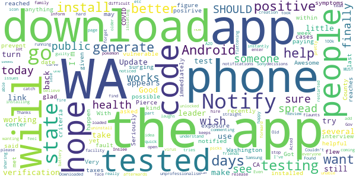
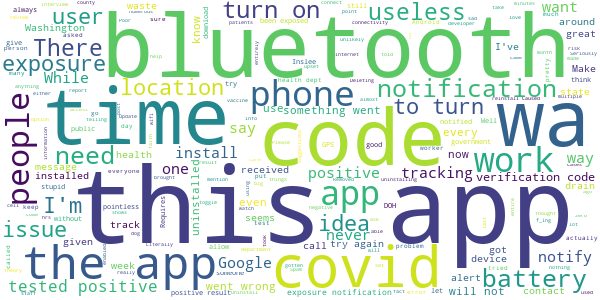

# WA Notify
App version ``minted160013``

Analyzed with [covid-apps-observer](http://github.com/covid-apps-observer) project, version ``0.1``

## App overview
| | |
|-------------------------|-------------------------| 
| **Name**&nbsp;&nbsp;&nbsp;&nbsp;&nbsp;&nbsp;&nbsp;&nbsp;&nbsp;&nbsp;&nbsp;&nbsp;&nbsp;&nbsp;&nbsp;&nbsp;&nbsp;&nbsp;&nbsp;&nbsp;&nbsp;&nbsp;&nbsp;&nbsp;&nbsp;&nbsp;&nbsp;&nbsp;&nbsp;&nbsp;&nbsp;&nbsp;&nbsp;&nbsp;&nbsp;&nbsp;&nbsp;&nbsp;&nbsp;&nbsp;  | WA Notify |
| **Unique identifier** | gov.wa.doh.exposurenotifications |
| **Link to Google Play** | [https://play.google.com/store/apps/details?id=gov.wa.doh.exposurenotifications](https://play.google.com/store/apps/details?id=gov.wa.doh.exposurenotifications) |
| **Summary**  | The official COVID-19 exposure notifications app for Washington |
| **Privacy policy** | [https://wanotify.cirg.washington.edu/privacy-policy](https://wanotify.cirg.washington.edu/privacy-policy) |
| **Latest version** | minted160013 |
| **Last update** | 2021-04-06 22:10:56 |
| **Recent changes** | Bug fixes and performance improvements |
| **Installs**  | 100,000+ |
| **Category** | Medical |
| **First release** | Nov 24, 2020 |
| **Size**  | 11M |
| **Supported Android version**  | 5.0 and up |

### Description
> WA Notify is the official COVID-19 exposure-notifications software for Washington State and Department of Health (DOH). The app is an instance of the Exposure Notifications Express platform developed by Apple and Google and configured by DOH.
 Your voluntary use of WA Notify will help anonymously alert you and fellow users in Washington state who may have been near someone with a positive COVID-19 diagnosis. When you enable WA Notify, you are doing your part to help your community slow the spread of COVID-19. 
 How WA Notify works:
 When devices with WA Notify are in close contact, they exchange random codes. When someone tells their app they tested positive for COVID-19, other users who received their random codes receive an alert that they may have been exposed to COVID-19. Devices receiving random codes date-stamp them and record their signal strength so the app can estimate how close the devices were and for how long. Users within six feet for 15 minutes or more of the COVID-positive person are notified that they may have been exposed to COVID-19.
 Apple and Google's Exposure Notifications framework runs in the background, even when the WA Notify app is closed. It will not drain the device battery at a rate that would occur with other apps.
 How WA Notify Protects Your Privacy:
 Washington state DOH takes your privacy and confidentiality very seriously. The Apple and Google framework does not link any personal data or location information with the random codes exchanged by devices. DOH does not want or need to know where or who you are for WA Notify to work. When you are close enough to another app user, your device will exchange random codes with that user.
 State law requires that lab results for all persons who test positive for COVID-19 are sent to Washington state DOH. This is not associated with the app. Public health organizations (DOH or local public health) follow up with those who test positive for COVID-19, based on information provided by testing labs. As a courtesy to all app users, public health organizations will verify positive tests and then provide app users with a verification code. If you choose to share a positive test with the app, you must use that code. This prevents people from falsely reporting. DOH wants app users to feel confident that possible COVID-19 exposure notifications received via the app are legitimate.
 If you have the current Apple or Google operating system installed on your device, you may have noticed that Exposure Notifications are now included. You cannot enable this function until you have installed the WA Notify app. Apple and Google will delete the exposure notification service tools from their respective operating systems once the pandemic reaches a point that public health no longer requires the use of this technology.
 Thank you for installing WA Notify! Together, we can protect our family, friends, neighbors, and colleagues, and keep Washington state moving forward!

### User interface
The developers of the app provide the following screenshots in the Google play store.
| | | |
|:-------------------------:|:-------------------------:|:-------------------------:|
 |   |  

## Development team
In the following we report the main information provided by the development team in the Google play store.

| | |
|-------------------------|-------------------------|
| **Developer**  | Washington Department of Health |
| **Website**  | [https://wanotify.org](https://wanotify.org) |
| **Email** | doh-wanotify-epi@doh.wa.gov |
| **Physical address**  | - |
| **Other developed apps**  | [https://play.google.com/store/apps/developer?id=Washington+Department+of+Health](https://play.google.com/store/apps/developer?id=Washington+Department+of+Health) |

## Android support

| | |
|-------------------------|-------------------------|
| **Declared target Android version**  | - |
| **Effective target Android version**  | - |
| **Minimum supported Android version**  | Lollipop, version 5.0 (API level 21) |
| **Maximum target Android version**  | - |

The larger the difference between the minimum and maximum supported Android versions, the better. A larger difference means a wider audience. For example, old phones have a very low Android version, so a high minimum supported Android version means that the app cannot be used by users with old phones, thus leading to accessibility problems. 

## Requested permissions

In the following we report the complete list of the permissions requested by the app. 

| **Permission** | **Protection level** | **Description** | 
|-------------------------|-------------------------|-------------------------|
 **android.permission ACCESS_NETWORK_STATE** | Normal | Allows applications to access information about networks. 
 **android.permission BLUETOOTH** | Normal | Allows applications to connect to paired bluetooth devices. 
 **android.permission FOREGROUND_SERVICE** | Normal | Allows a regular application to use Service.startForeground. 
 **android.permission INTERNET** | Normal | Allows applications to open network sockets. 
 **android.permission RECEIVE_BOOT_COMPLETED** | Normal | Allows an application to receive the Intent.ACTION_BOOT_COMPLETED that is broadcast after the system finishes booting. 
 **android.permission WAKE_LOCK** | Normal | Allows using PowerManager WakeLocks to keep processor from sleeping or screen from dimming. 

## Mentioned servers

| **Server** | **Registrant** | **Registrant country** | **Creation date** | 
|-------------------------|-------------------------|-------------------------|-------------------------|
 | google.com | Google LLC | :us: US | 1997-09-15 04:00:00 |

## Security analysis 

Below we report the main security warnings raised by our execution of the [Androwarn](https://github.com/maaaaz/androwarn) security analysis tool.

**Telephony identifiers leakage**
> - This application reads the ISO country code equivalent of the current registered operator's MCC (Mobile Country Code) 

**Connection interfaces exfiltration**
> - This application reads details about the currently active data network 
> - This application tries to find out if the currently active data network is metered 

**Suspicious connection establishment**
> - This application opens a Socket and connects it to the remote address 'timeout' on the 'N/A' port  

**Code execution**
> - This application loads a native library: 'prioclient' 

## User ratings and reviews

Below we provide information about how end users are reacting to the app in terms of ratings and reviews in the Google Play store.

### Ratings

The WA Notify app has been installed by more than **100000** times. At this time, **630** rated the app and its average score is **3.772277**. Below we show the distribution of the ratings across the usual star-based rating of Google Play

:star::star::star::star::star:: 350

:star::star::star::star:: 81

:star::star::star:: 37

:star::star:: 31

:star:: 131

### Reviews 

#### 5-star reviews

> Quick and easy to use  :date: __2021-04-10 18:49:00__

> Great App..  :date: __2021-03-29 06:45:05__

> Love it  :date: __2021-03-26 03:17:58__

> 2021-03-07 Update fixed. 5 stars! {App worked as expected for the first 2 months, however this morning I see a notice that I need to have location turned on as well as bluetooth. This is unnerving seeing that the app settings on my phone show no permissions are in use. I have android 6 but this same concern is being voiced by an android 9 user here in the comments. This behaviour is new and as I can only toggle location globally on my device.}  :date: __2021-03-07 16:34:01__

> I like the idea that it gives you a heads up if you contact and/or get near a person tested positive for COVID-19.  :date: __2021-03-02 09:01:18__

> Lots of fun. Get lost and enjoy!  :date: __2021-02-25 23:15:43__

> Good app  :date: __2021-02-25 14:56:40__

> This app and proves your phone it works really well I suggest you tried  :date: __2021-02-22 21:24:42__

> Perfect job!! Great tool !!!!!!  :date: __2021-02-20 02:51:53__

> Great app wa notify  :date: __2021-02-13 02:17:35__

#### 4-star reviews

> Very helpful  :date: __2021-04-05 06:59:46__

> Will this WA Notify app works within Washington state only? or does it works in other state too? I recently flew to CA and I don't see anything happen to this app yet.  :date: __2021-04-01 22:24:40__

> Got notified today of a possible exposure from last week. I could figure out where I was since I had the date, and go get tested immediately. I wish the app said you SHOULD get tested not only if you have symptoms as the testing center wasn't sure if I met testing criteria. But glad I had the app installed if I can prevent further spread.  :date: __2021-02-10 19:24:40__

> Awesome  :date: __2021-02-08 04:22:21__

> Not sure at 77 & vulnerable go  :date: __2021-01-07 23:36:31__

> Pierce County public health finally reached me for my interview today (12/26), over 10 days after testing posirive, but that is not the app's fault.  :date: __2020-12-27 03:33:19__

> "When someone in WA state tests positive for COVID-19 and public health reaches out to them, they will be asked if they have WA Notify and given a verification code. With surging cases, this may take several days." => Seriously? It takes you several days to generate a verification code? And I'm paying taxes for this kind of unprofessionalism? Gov. Inslee, please fire the team that is unable to generate codes instantly for people to add to the app and hire someone better.  :date: __2020-12-26 19:05:39__

> Downloaded when there was only 1500 other downloads and am so happy to see this app over 100k downloads now! Helps make me believe in doing this.  :date: __2020-12-16 15:24:58__

> A lot like pokemon go only you don't want to catch any.  :date: __2020-12-09 05:47:52__

> Update: I restarted my phone and was able to install WA Notify afterwards. It seems pretty straight forward to use. Old Review: Couldn't get it to install. Acted like it was installing, but the app didn't. Android 8 on unlocked Sony phone.  :date: __2020-12-08 00:10:56__

#### 3-star reviews

> Haven't had to use so not sure.....  :date: __2021-03-24 18:47:24__

> Relys on people being honest and truthful  :date: __2021-02-24 15:27:06__

> I received a notification that I was exposed on a day where I had kept my phone in a space not shared with others (no shared wall, etc), as I do every work day. In other words, no one spent 15 minutes within 6 feet of my phone. It is a healthcare facility, so there is little doubt the "exposure" was generated here, but it seems that either the location sharing probably far exceeds 6 feet, or is far less than 15 minutes in order for me to be alerted to exposure.  :date: __2021-01-23 14:36:29__

> Not sure if it's even working  :date: __2021-01-08 19:59:09__

> Nobody knows how to get this code. When state officials reached out, they didn't even know what this app is and couldn't give me the code. UPDATE: the process is improving and I ended up getting the code. Changing from 1 to 4 stars. This app can save many lives.  :date: __2021-01-06 00:17:39__

> Just got this so too soon to rate, but I have a question. I am an urgent care provider testing patients for COVID so will definitely be in proximity to positive cases. I wish this app had a setting for when you are at work where exposures are protected and another for when you are away from work where exposures may be unprotected.  :date: __2020-12-30 03:18:41__

> Need to fix the battery drain on the app  :date: __2020-12-29 22:15:48__

> The concept is good. I need to be able to put in co-workers who have tested positive but dont use the app.  :date: __2020-12-24 15:47:26__

> I think this app will be more useful if more people use it. People are afraid you are tracking their movement's. Need more advertising! The conspiracy theory people will never use it. Sane people will. Thank You  :date: __2020-12-24 15:41:03__

> I echo Josh McAllister's comments. Recently tried to upload my test result which came to a dead end with the elusive "verification code".  :date: __2020-12-18 17:23:03__

#### 2-star reviews

> The Bluetooth notification is annoying. I'm at home most of the time and am not going to have Bluetooth on all the time.  :date: __2021-03-18 15:21:01__

> I'm about to uninstall. I'm not going to keep BT on 24/7 and I am fully aware that when it is off I can't get warnings. I'm at home 99.9% of the time. The app used to let me clear the notification but recently left the notification posted full time even after acknowledging. Annoying people isn't the way to get them to adopt.  :date: __2021-03-12 10:29:57__

> The second you turn Bluetooth off it annoys the hell out of you to turn it back on. There needs to be functionality that addresses this gap as people will discontinue use due to the annoyance. Reading the reviews here does not give me confidence that positive cases are being captured properly (even if the person tests positive and gets a verification code by doh) due to the delay from the point they positive test, to them talking to DOH WA to get the code. 2 days to weeks, to possibly never.  :date: __2021-02-13 10:30:52__

> Good idea, bad execution.  :date: __2021-02-04 23:23:51__

> It only works if you use bluetooth, which drains battery. Well envisioned, poorly realized.  :date: __2021-02-03 15:13:53__

> Check,checkin',This demo Application has "dropped-the -ball"several times for me since downloading it,"what gives so fat!?!" TheRealInternetMan😎  :date: __2021-01-23 07:32:04__

> Soy positivo y e querido compartir mis resultados pero no reconoce mi código  :date: __2021-01-07 23:59:26__

> The concept is fine but the fact that we are relying on someone who has the virus to input a code that no one seems to know about makes this app pretty useless. The last year has proven to us that we cannot rely on people to do the right thing so that makes this app double useless. This would have been far more useful if it kept the bluetooth device pinging but used every device's phone number and compared it against a database of known infected person's phone numbers.  :date: __2021-01-06 15:09:14__

> I was just wondering if you have to have bluetooth on all the time in order for the exchange of private codes or it it does it automatically?  :date: __2021-01-04 07:11:42__

> Nice concept, but poor execution on letting the public know it is available, and letting them know how the app works and what safeguards are in place to protect their privacy. To many people think the app will share personal information, so are unwilling to download it. This is making the app unusable as it was designed to be used. If only one person out of a hundred has downloaded it and is using it, then what use is having it on your phone?  :date: __2021-01-01 09:30:17__

#### 1-star reviews

> DISSAPOINTINGLY USELESS. I'm very supportive of this app in theory, but it's basically rendered entirely useless when users cannot self-report, when many positive users can't get a code, and even if they are called by the health dept you have to ask for one, they don't automatically offer a code or recommend this app. To take the cake, many users report multiple state health staff having NO IDEA about such code when asked about it. So sad, this app could have been so useful.  :date: __2021-04-10 22:42:26__

> This app is a waste of time it doesn't actually help you get notified when you've been around someone who has had covid!  :date: __2021-04-10 14:07:45__

> This app got lots of publicity, but never actually did anything. I also love that the WA Dept of Health asked you to sign up for vaccine eligibility notifications through their phase finder tool... But they simply took it down the last week of March, right around when it sounded like vaccines were being opened up to everyone.  :date: __2021-04-07 15:12:25__

> Won't allow you to turn on Exposure Notifications. I Uninstaller, and reinstalled app. Still won't allow me to turn on exposure notifications. I get an error message "something went wrong. Please try again" any suggestions? I uninstalled and now when I try to reinstall I get the something went wrong message. Garbage  :date: __2021-03-15 01:17:23__

> Poor  :date: __2021-02-21 02:25:07__

> My husband has covid and it still says I do not have a exposure... Been almost a week now..... So zero faith in this app  :date: __2021-02-17 21:27:37__

> Did not do ANYTHING. See prior response.  :date: __2021-02-08 14:37:16__

> This app was a good idea, but there wasn't much thought put into the development of it. There is no way to enter a positive result or exposure without a verification code. This makes the app entirely pointless since I know of nine positive results with no phone calls being dodged, just no way to get a code. This seems like a pretty big oversight.  :date: __2021-01-31 01:50:52__

> Literally never a warning... Deleting I don't need to be spied on and literally get nothing back from the app  :date: __2021-01-30 05:45:49__

> Deleting off phone. Why have an app to notify or be notified of a positive when I was not given a code. Almost pointless in conservative part of Washington.  :date: __2021-01-28 07:03:34__

