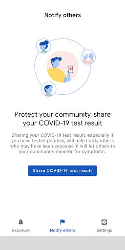

# WI Exposure Notification
App version ``minted141008``

Analyzed with [covid-apps-observer](http://github.com/covid-apps-observer) project, version ``0.1``

## App overview
| | |
|-------------------------|-------------------------| 
| **Name**                                          | WI Exposure Notification |
| **Unique identifier** | gov.wi.covid19.exposurenotifications |
| **Link to Google Play** | [https://play.google.com/store/apps/details?id=gov.wi.covid19.exposurenotifications](https://play.google.com/store/apps/details?id=gov.wi.covid19.exposurenotifications) |
| **Summary**  | Learn if you've been exposed to COVID-19 |
| **Privacy policy** | [https://storage.googleapis.com/enx-terms-states/wi-privacy-policy.html](https://storage.googleapis.com/enx-terms-states/wi-privacy-policy.html) |
| **Latest version** | minted141008 |
| **Last update** | 2020-12-23 21:07:06 |
| **Recent changes** | Bug fixes and performance improvements |
| **Installs**  | 100,000+ |
| **Category** | Medical |
| **First release** | Dec 21, 2020 |
| **Size**  | 9.9M |
| **Supported Android version**  | 5.0 and up |

### Description
> WI Exposure Notification is the official COVID-19 exposure notification app of the State of Wisconsin supported by the Wisconsin Department of Health Services (WI DHS). WI Exposure Notification helps to contain the spread of COVID-19 by complementing the ongoing contact tracing programs carried out by the local and tribal public health agencies and DHS. 
 Using WI Exposure Notification is voluntary and free of charge. It was built with your privacy and security in mind. The more people who install and use the app, the more effectively it can be in helping us contain the virus. 
 Once you install and activate WI Exposure Notification and turn on Bluetooth, the app works in the background and exchanges anonymous signals with other devices. These signals, or keys, are long random strings of characters that are not tied to any personal information. Devices with the app installed will remember the keys generated by other devices nearby. The app will also record the signal strength, which is used to estimate the distance between two devices, as well as the duration and date of the exposure. 
 To protect users’ privacy, these keys are only kept on the user’s own device. After 14 days, the keys are deleted. If a WI Exposure Notification user tests positive for COVID-19, they will receive a verification code from the State of Wisconsin.  Users must activate the verification code that is only available from the State of Wisconsin in order to report a positive result via the app. This prevents people from falsely reporting positive results, which could generate false exposure notifications. 
 WI DHS wants all app users to feel confident that, when a possible COVID-19 exposure is received via the app, that it is a real event to be trusted. When users choose to share a positive test result, this notifies other app users that were close enough to the infected person for a long enough period of time (approximately within 6 feet of someone for at least 15 minutes in a single day) that they are considered a close contact and at risk of infection. 
 Anyone who receives a notification should follow the guidance in the app for next steps. WI DHS takes your privacy and confidentiality very seriously. This is why we chose to use the Apple and Google Exposure Notification API. No personal data or location tracking occurs within this app. WI DHS does not need to know where or who you are for WI Exposure Notification to work. The Wisconsin COVID Notice Privacy Policy is available at https://www.dhs.wisconsin.gov/covid-19/privacy.htm. 
 Please note that WI Exposure Notification is intended for users ages 13 and up. The app was developed using the Google Apple Exposure Notification API through a collaboration between Google, Apple, and the Wisconsin Department of Health Services.

### User interface
The developers of the app provide the following screenshots in the Google play store.
| | | |
|:-------------------------:|:-------------------------:|:-------------------------:|
 |   |  

## Development team
In the following we report the main information provided by the development team in the Google play store.

| | |
|-------------------------|-------------------------|
| **Developer**  | State of Wisconsin - Department of Health Services |
| **Website**  | - |
| **Email** | exposures.notifications.wi@gmail.com |
| **Physical address**  | - |
| **Other developed apps**  | [https://play.google.com/store/apps/developer?id=State+of+Wisconsin+-+Department+of+Health+Services](https://play.google.com/store/apps/developer?id=State+of+Wisconsin+-+Department+of+Health+Services) |

## Android support

| | |
|-------------------------|-------------------------|
| **Declared target Android version**  | - |
| **Effective target Android version**  | - |
| **Minimum supported Android version**  | Lollipop, version 5.0 (API level 21) |
| **Maximum target Android version**  | - |

The larger the difference between the minimum and maximum supported Android versions, the better. A larger difference means a wider audience. For example, old phones have a very low Android version, so a high minimum supported Android version means that the app cannot be used by users with old phones, thus leading to accessibility problems. 

## Requested permissions

In the following we report the complete list of the permissions requested by the app. 

| **Permission** | **Protection level** | **Description** | 
|-------------------------|-------------------------|-------------------------|
 **android.permission ACCESS_NETWORK_STATE** | Normal | Allows applications to access information about networks. 
 **android.permission BLUETOOTH** | Normal | Allows applications to connect to paired bluetooth devices. 
 **android.permission FOREGROUND_SERVICE** | Normal | Allows a regular application to use Service.startForeground. 
 **android.permission INTERNET** | Normal | Allows applications to open network sockets. 
 **android.permission RECEIVE_BOOT_COMPLETED** | Normal | Allows an application to receive the Intent.ACTION_BOOT_COMPLETED that is broadcast after the system finishes booting. 
 **android.permission WAKE_LOCK** | Normal | Allows using PowerManager WakeLocks to keep processor from sleeping or screen from dimming. 

## Mentioned servers

| **Server** | **Registrant** | **Registrant country** | **Creation date** | 
|-------------------------|-------------------------|-------------------------|-------------------------|
 | google.com | Google LLC | :us: US | 1997-09-15 04:00:00 |

## Security analysis 

Below we report the main security warnings raised by our execution of the [Androwarn](https://github.com/maaaaz/androwarn) security analysis tool.

**Telephony identifiers leakage**
> - This application reads the ISO country code equivalent of the current registered operator's MCC (Mobile Country Code) 

**Connection interfaces exfiltration**
> - This application reads details about the currently active data network 
> - This application tries to find out if the currently active data network is metered 

**Suspicious connection establishment**
> - This application opens a Socket and connects it to the remote address 'timeout' on the 'N/A' port  

**Code execution**
> - This application loads a native library: 'prioclient' 

## User ratings and reviews

Below we provide information about how end users are reacting to the app in terms of ratings and reviews in the Google Play store.

### Ratings

The WI Exposure Notification app has been installed by more than **100000** times. At this time, **76** rated the app and its average score is **3.8947368**. Below we show the distribution of the ratings across the usual star-based rating of Google Play

:star::star::star::star::star:: 49

:star::star::star::star:: 4

:star::star::star:: 6

:star::star:: 0

:star:: 17

### Reviews 

#### 5-star reviews

> Don't pay any attention to the ignorant Trump Hannity worshipers. This is a useful app that is intended to help protect you and others.  :date: __2021-01-01 01:08:54__

> Took long enough  :date: __2020-12-31 14:12:35__

> This app fits under the heading 'civil responsibility.' If you care about your family, neighbors and community, you will add this to your phone to help keep them and you safe until we can all get this virus under control.  :date: __2020-12-30 17:48:56__

> I wear a mask because I am a patriot and I care about all lives. Historically Americans provide aid globally for weak and vulnerable, its about time we put America first. Wear your mask. I downloaded this app because I am a patriot and I care about all lives. Using this app may provide valuable exposure information. It will give information to help people know to get tested, to quarantine, or to seek treatment. 2 small steps can save the lives of the vulnerable. That IS the America way!  :date: __2020-12-30 15:53:31__

> So glad to have this!  :date: __2020-12-29 16:11:14__

> Don't know if it works!? 🤔  :date: __2020-12-28 20:51:21__

> I don't know yet as I just started on the app.  :date: __2020-12-27 00:29:25__

> Installed easily, have not had any issues related to this app. Note this app does not track people or collect any personal data. Please encourage other Wisconsinites you may know to install this app. See Wisconsin's covid website for additional information.  :date: __2020-12-25 17:32:39__

> Thank you guys for making this. The app is very lightweight. You do need to have your Bluetooth on. It does not track your location, only your proximity to other people that have the app, so it can notify you if you've been near someone with covid.  :date: __2020-12-25 09:25:28__

> I love this App it helps let's me if someone else who has covid-19.  :date: __2020-12-25 05:30:05__

#### 4-star reviews

> Under the "Notify Others" tab, I have to scroll down to see the "Share Covid 19 test results" button. Some may not scroll and get confused. The "Share Covid 19 test results" button should be higher on the page.  :date: __2020-12-24 20:40:25__

> This is the officially released app you the state of Wisconsin. I was initially uncomfortable with the idea of using this app due to privacy and data collection concerns, but after thoroughly reading the short and straightforward privacy policy I was put at ease of these risks. It seems it does not track your location, just your proximity to other devices.  :date: __2020-12-23 20:56:43__

#### 3-star reviews

> Haven't been notified that I have been exposed... so no way of knowing  :date: __2020-12-28 21:40:11__

> I think this is knocking out all my other blue tooth connected devices. Anyone else having that issue?  :date: __2020-12-28 17:22:00__

> It kills your battery due to using bluetooth all the time.  :date: __2020-12-26 14:53:28__

> Sounds like a great Idea and im going to try it out for a while but ppl arent going to like the fact that Bluetooth and location hafta be on all the time so not only will it kill everyones batteries but ur going to be followed everywhere you go and to alot of ppl its going to sound like a gov plot to control ppl thru this "backdoor" method!  :date: __2020-12-24 12:49:04__

> Seems good so far. I wish it would encourage people to stay home if they are infected. The University app is supposed to be used as a building access pass. If you are positive or have not been tested recently then entry is denied. Seems like a good thing.  :date: __2020-12-23 23:05:01__

#### 2-star reviews

No recent reviews available with 2 stars.

#### 1-star reviews

> Don't have any experience. Why are people so positive about this. This app just came out. No one can you really say what's going to happen. Here come the AI filled Dracos.  :date: __2021-01-01 00:48:41__

> Evey news story says turn off Bluetooth because that is how people hack your phone. This turns on your Bluetooth forever all day.  :date: __2020-12-31 23:28:40__

> App does not allow my phone to connect to other bluetooth devices. Would be useful but have to uninstall since it essentially breaks my Bluetooth.  :date: __2020-12-30 15:39:08__

> Do not install this spyware  :date: __2020-12-27 05:56:45__

> I live in Maine. I've never been to Wisconsin. Every day I get a push notification on my phone to download this stupid app from Wisconsin, so i downloaded it just to leave this damn review and now I'm going to delete it.  :date: __2020-12-27 04:54:10__

> I wish I could get it to download properly as it just keeps saying "Pending" as it tries to download through Google Play. I've been trying for 3 days now & it still won't download. What's the problem? Bluetooth is active & working on other devices just fine. Never had this problem b4 unless it's the sheer magnitude of people downloading it. Any help would be appreciated.  :date: __2020-12-26 23:52:02__

> Truly blessed are we in this age of technological development to have a way to track pretty much nothing, actually. This app is not only severely ineffective, but only serves a purpose to people with compromised immune systems. Normal healthy people do not need to worry about this any more than pneumonia or the flu. Stop the fear mongering and get a damn grip. This is getting ridiculous. A TRACKER IN YOUR POCKET that drains your phone battery... Hope you don't need it to call 911 or anything...  :date: __2020-12-26 20:18:34__

> Fake/fraudulant developer contact email address. No response to concerns. I don't trust it.  :date: __2020-12-26 18:48:05__

> Waste of time  :date: __2020-12-26 14:44:56__

> You need to figure out a way to make this work without Bluetooth to waste battery life  :date: __2020-12-26 10:11:11__

