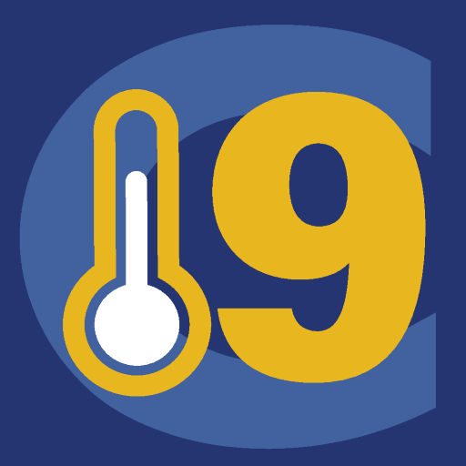
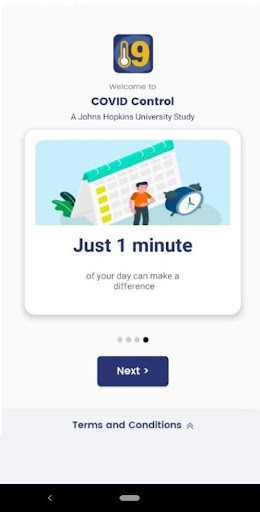
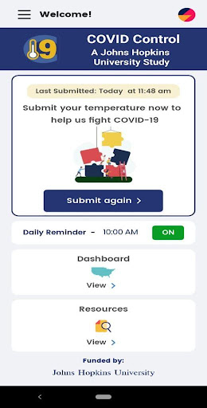
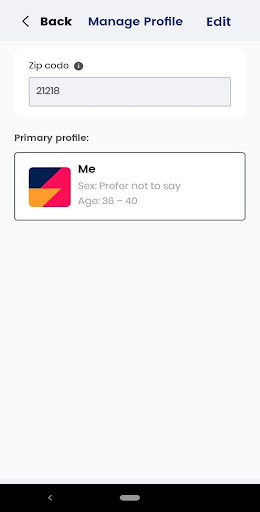
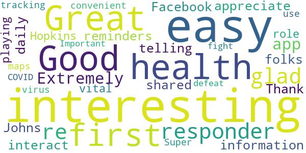
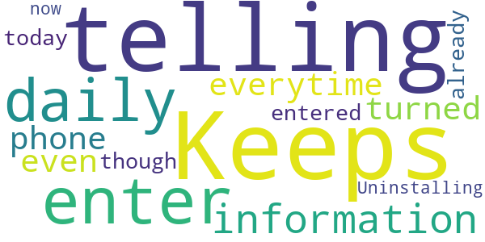
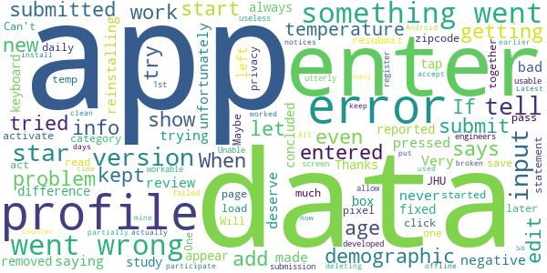

# COVID Control - A Johns Hopkins University Study
App version ``3.3``

Analyzed with [covid-apps-observer](http://github.com/covid-apps-observer) project, version ``0.1``

## App overview
| | |
|-------------------------|-------------------------| 
| **Name**&nbsp;&nbsp;&nbsp;&nbsp;&nbsp;&nbsp;&nbsp;&nbsp;&nbsp;&nbsp;&nbsp;&nbsp;&nbsp;&nbsp;&nbsp;&nbsp;&nbsp;&nbsp;&nbsp;&nbsp;&nbsp;&nbsp;&nbsp;&nbsp;&nbsp;&nbsp;&nbsp;&nbsp;&nbsp;&nbsp;&nbsp;&nbsp;&nbsp;&nbsp;&nbsp;&nbsp;&nbsp;&nbsp;&nbsp;&nbsp;  | COVID Control - A Johns Hopkins University Study |
| **Unique identifier** | jhu.edu.JohnsHopkinsCOVIDControl |
| **Link to Google Play** | [https://play.google.com/store/apps/details?id=jhu.edu.JohnsHopkinsCOVIDControl](https://play.google.com/store/apps/details?id=jhu.edu.JohnsHopkinsCOVIDControl) |
| **Summary**  | This app uses users’ body temperature to predict the risk of COVID-19 outbreaks |
| **Privacy policy** | [https://covidcontrol.jhu.edu/wp-content/uploads/Consent-Form_Clean_30Apr2020.pdf](https://covidcontrol.jhu.edu/wp-content/uploads/Consent-Form_Clean_30Apr2020.pdf) |
| **Latest version** | 3.3 |
| **Last update** | 2020-08-14 18:02:43 |
| **Recent changes** | You can now add extra profiles and submit for other people of your household. It is also possible for you to check the impact of your daily submissions, and get badges as you keep using the COVID Control app. |
| **Installs**  | 1,000+ |
| **Category** | Medical |
| **First release** | Apr 16, 2020 |
| **Size**  | 15M |
| **Supported Android version**  | 5.0 and up |

### Description
> Johns Hopkins COVID Control is a fast, user-friendly tool for controlling the spread of COVID-19 based on self-reported body temperatures and, optionally, other symptoms, from users around the country. 
 Designed by doctors, epidemiologists, and engineers at the Johns Hopkins University (a collaborative endeavour between the Bloomberg School of Public Health, School of Medicine and the Whiting School of Engineering, all at the John Hopkins University), this app was born out of a desire for us as individuals to make an impactful contribution in this worldwide effort to contain the spread COVID-19. 
 In these difficult times, while we may feel helpless as individuals, the real-time insights gained from the information entered in this app will equip our frontline healthcare workers to make more informed decisions. By downloading and using this app regularly you would be contributing to a rapidly growing collaborative effort to monitor the spread of COVID-19. 
 Note that submitting your data directly greatly reduces the delay experienced in hospitals/laboratories in identifying new outbreaks of the disease, and expands basic monitoring of our health.
 We do not collect any personally identifiable information. No information you share will be used for commercial purposes.
 This app allows you to help researchers and government agencies to monitor and control the spread of COVID-19 but does not give health advice. If you need health advice please visit the CDC website at: https://www.cdc.gov/coronavirus/2019-ncov/index.html
 This temperature information entered in this app by users across the country will be used to detect influenza-like illness (ILI) activity in a region. By using spatial science analytics applied to these data and by comparing the observed trends against the historical data we have,  we will identify anomalous emerging activity in ILI and generate real-time, pre-clinical, risk estimates of potential COVID-19 outbreaks. 
 For more information about the project and this app, please visit our website https://covidcontrol.jhu.edu/

### User interface
The developers of the app provide the following screenshots in the Google play store.
| | | |
|:-------------------------:|:-------------------------:|:-------------------------:|
 |   |   |   | 
 |  

## Development team
In the following we report the main information provided by the development team in the Google play store.

| | |
|-------------------------|-------------------------|
| **Developer**  | Johns Hopkins Technology Transfer |
| **Website**  | [https://covidcontrol.jhu.edu/](https://covidcontrol.jhu.edu/) |
| **Email** | contactcovidcontrol@jh.edu |
| **Physical address**  | - |
| **Other developed apps**  | [https://play.google.com/store/apps/developer?id=Johns+Hopkins+Technology+Transfer](https://play.google.com/store/apps/developer?id=Johns+Hopkins+Technology+Transfer) |

## Android support

| | |
|-------------------------|-------------------------|
| **Declared target Android version**  | Android10, version 10 (API level 29) |
| **Effective target Android version**  | Android10, version 10 (API level 29) |
| **Minimum supported Android version**  | Lollipop, version 5.0 (API level 21) |
| **Maximum target Android version**  | - |

The larger the difference between the minimum and maximum supported Android versions, the better. A larger difference means a wider audience. For example, old phones have a very low Android version, so a high minimum supported Android version means that the app cannot be used by users with old phones, thus leading to accessibility problems. 

## Requested permissions

In the following we report the complete list of the permissions requested by the app. 

| **Permission** | **Protection level** | **Description** | 
|-------------------------|-------------------------|-------------------------|
 **android.permission ACCESS_COARSE_LOCATION** | :warning:**Dangerous** | Allows an app to access approximate location. 
 **android.permission ACCESS_FINE_LOCATION** | :warning:**Dangerous** | Allows an app to access precise location. 
 **android.permission INTERNET** | Normal | Allows applications to open network sockets. 
 **android.permission RECEIVE_BOOT_COMPLETED** | Normal | Allows an application to receive the Intent.ACTION_BOOT_COMPLETED that is broadcast after the system finishes booting. 
 **android.permission VIBRATE** | Normal | Allows access to the vibrator. 
 **android.permission WAKE_LOCK** | Normal | Allows using PowerManager WakeLocks to keep processor from sleeping or screen from dimming. 

## Mentioned servers

| **Server** | **Registrant** | **Registrant country** | **Creation date** | 
|-------------------------|-------------------------|-------------------------|-------------------------|
 | google.com | Google LLC | :us: US | 1997-09-15 04:00:00 |
 | jhu.edu | Johns Hopkins University | - | 1987-03-19 00:00:00 |
 | azurewebsites.net | Microsoft Corporation | :us: US | 2012-01-24 18:43:51 |
 | googleapis.com | Google LLC | :us: US | 2005-01-25 17:52:26 |

## Security analysis 

Below we report the main security warnings raised by our execution of the [Androwarn](https://github.com/maaaaz/androwarn) security analysis tool.

**Connection interfaces exfiltration**
> - This application reads details about the currently active data network 
> - This application tries to find out if the currently active data network is metered 

**Suspicious connection establishment**
> - This application opens a Socket and connects it to the remote address '' on the 'N/A' port  
> - This application opens a Socket and connects it to the remote address 'Ljava/lang/StringBuilder;->toString()Ljava/lang/String;' on the 'N/A' port  
> - This application opens a Socket and connects it to the remote address 'Ljava/net/Proxy;->type()Ljava/net/Proxy$Type;' on the 'N/A' port  
> - This application opens a Socket and connects it to the remote address 'timeout' on the 'N/A' port  

## User ratings and reviews

Below we provide information about how end users are reacting to the app in terms of ratings and reviews in the Google Play store.

### Ratings

The COVID Control - A Johns Hopkins University Study app has been installed by more than **1000** times. At this time, **22** rated the app and its average score is **2.9545455**. Below we show the distribution of the ratings across the usual star-based rating of Google Play

:star::star::star::star::star:: 9

:star::star::star::star:: 2

:star::star::star:: 0

:star::star:: 1

:star:: 10

### Reviews 

#### 5-star reviews

> interesting ...as a first responder, glad you re doing this!  :date: __2020-07-24 16:59:16__

> Extremely easy app. I appreciate the daily reminders. I shared this information on my Facebook and have been telling folks that I interact with. Thank you Johns Hopkins for playing a vital role in tracking this virus.  :date: __2020-05-22 23:27:43__

> Super easy to use and convenient. The maps are interesting  :date: __2020-05-04 16:44:34__

> Important in the fight to defeat COVID 19  :date: __2020-04-25 14:32:48__

#### 4-star reviews

No recent reviews available with 4 stars.

#### 3-star reviews

No recent reviews available with 3 stars.

#### 2-star reviews

> Keeps telling me to enter my daily information everytime phone is turned on even though I already entered it for today. Uninstalling it now.  :date: __2020-05-13 19:05:30__

#### 1-star reviews

> I could not get this to work... always reported a problem. If the study is concluded, the app should be removed. Thanks  :date: __2020-11-25 06:11:59__

> I cannot enter data. When I tap the input box, the keyboard does not appear. This was fixed But I have entered a new age category. I tried to edit my profile and add my zipcode, but I get an error when I try to save.  :date: __2020-11-21 21:25:32__

> Can't activate app. On the "let's get started" page, I enter 2 demographic info and click on submit. The app says something went wrong and to resubmit later.  :date: __2020-11-18 19:35:14__

> Errors. Will not pass age on pixel 2  :date: __2020-11-17 19:29:47__

> Cannot read the privacy statement because it won't load. Cannot add my daily temp because it shows error. Get your act together JHU. 0ne star is too much. Maybe one of your engineers can developed a usable/workable app.  :date: __2020-10-20 14:50:00__

> utterly useless failed to allow submission of data from 1st screen  :date: __2020-10-06 19:56:20__

> Unable to input to register and participate  :date: __2020-09-08 15:51:22__

> I had an earlier version that partially worked (could submit data but couldn't tell if it actually submitted because the counter didn't show how many days I submitted) and I couldn't edit my profile. New version clean install won't accept any profile data. Just tells me that there was a problem and to try again.  :date: __2020-09-05 15:45:34__

> I cannot enter any data to start my profile. I keep getting an error that something went wrong.  :date: __2020-08-30 23:15:14__

> Latest version is broken. It used to work, but now it tells me I am offline All the time Android  :date: __2020-06-30 04:44:57__

