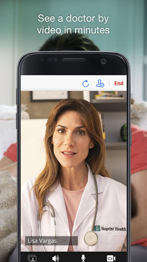
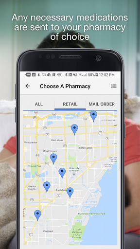
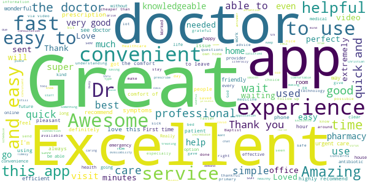
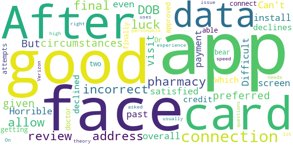

# Baptist Health Care On Demand
App version ``12.0.19.010_02``

Analyzed with [covid-apps-observer](http://github.com/covid-apps-observer) project, version ``0.1``

## App overview
| | |
|-------------------------|-------------------------| 
| **Name**&nbsp;&nbsp;&nbsp;&nbsp;&nbsp;&nbsp;&nbsp;&nbsp;&nbsp;&nbsp;&nbsp;&nbsp;&nbsp;&nbsp;&nbsp;&nbsp;&nbsp;&nbsp;&nbsp;&nbsp;&nbsp;&nbsp;&nbsp;&nbsp;&nbsp;&nbsp;&nbsp;&nbsp;&nbsp;&nbsp;&nbsp;&nbsp;&nbsp;&nbsp;&nbsp;&nbsp;&nbsp;&nbsp;&nbsp;&nbsp;  | Baptist Health Care On Demand |
| **Unique identifier** | net.baptisthealth.android.bhsf.careondemand |
| **Link to Google Play** | [https://play.google.com/store/apps/details?id=net.baptisthealth.android.bhsf.careondemand](https://play.google.com/store/apps/details?id=net.baptisthealth.android.bhsf.careondemand) |
| **Summary**  | See a physician 24/7 on your mobile device with Care On Demand. |
| **Privacy policy** | [https://baptisthealth.net/en/privacy-information/pages/default.aspx](https://baptisthealth.net/en/privacy-information/pages/default.aspx) |
| **Latest version** | 12.0.19.010_02 |
| **Last update** | 2020-12-04 00:49:51 |
| **Recent changes** | We continue to improve the patient experience with these new features: • Performance enhancements to increase reliability and speed |
| **Installs**  | 50,000+ |
| **Category** | Medical |
| **First release** | Jul 8, 2016 |
| **Size**  | 53M |
| **Supported Android version**  | 5.0 and up |

### Description
> Care On Demand provides immediate virtual access to board-certified doctors 24/7. Receive non-emergency care for a variety of conditions at your convenience. If needed, doctors can prescribe to a location nearest to you. Enroll for free today and you can start your visit using any smart phone, tablet or computer.
 Care On Demand features:
 •	No appointment needed
 •	Available 24/7/365
 •	Private and secure, HIPAA compliant connection
 •	$59 per visit or less, depending on your insurance provider
 Common conditions we treat:
 •	Fever/flu/cold
 •	Pink eye
 •	Urinary tract infections
 •	And more
 Download the Baptist Health Care On Demand app today so it will be “one click away” when you need it.
 También ofrecemos ayuda en español. Care On Demand le permite hablar con un médico desde cualquier dispositivo móvil, en cualquier momento. Reciba atención para una variedad de síntomas y comience a sentirse mejor con una visita virtual.
 Care On Demand ofrece:
 •	Visitas virtuales de una manera segura, privada y confidencial
 •	Disponibilidad 24/7/365, sin hacer cita
 •	Cumplimiento con la ley HIPAA, toda su información es segura
 •	Visitas al costo de $59 o menos, dependiendo de su seguro medico
 Condiciones que atendemos:
 •	Fiebre/gripe/resfriados/tos
 •	Conjuntivitis
 •	Ardor al orinar
 •	Entre otras
 Si lo requiere, las recetas médicas se pueden enviar directamente a la farmacia de su elección.

### User interface
The developers of the app provide the following screenshots in the Google play store.
| | | |
|:-------------------------:|:-------------------------:|:-------------------------:|
 |   |   |   | 
 |   |   |   | 
 |   |   |   | 
 |   |   |   | 
 |   |   |   | 
 |   |   |   | 

## Development team
In the following we report the main information provided by the development team in the Google play store.

| | |
|-------------------------|-------------------------|
| **Developer**  | Baptist Health South Florida |
| **Website**  | [https://baptisthealth.net/](https://baptisthealth.net/) |
| **Email** | bhsfandroiddev@gmail.com |
| **Physical address**  | - |
| **Other developed apps**  | [https://play.google.com/store/apps/developer?id=Baptist+Health+South+Florida](https://play.google.com/store/apps/developer?id=Baptist+Health+South+Florida) |

## Android support

| | |
|-------------------------|-------------------------|
| **Declared target Android version**  | Android10, version 10 (API level 29) |
| **Effective target Android version**  | Android10, version 10 (API level 29) |
| **Minimum supported Android version**  | Lollipop, version 5.0 (API level 21) |
| **Maximum target Android version**  | - |

The larger the difference between the minimum and maximum supported Android versions, the better. A larger difference means a wider audience. For example, old phones have a very low Android version, so a high minimum supported Android version means that the app cannot be used by users with old phones, thus leading to accessibility problems. 

## Requested permissions

In the following we report the complete list of the permissions requested by the app. 

| **Permission** | **Protection level** | **Description** | 
|-------------------------|-------------------------|-------------------------|
 **android.permission ACCESS_COARSE_LOCATION** | :warning:**Dangerous** | Allows an app to access approximate location. 
 **android.permission ACCESS_FINE_LOCATION** | :warning:**Dangerous** | Allows an app to access precise location. 
 **android.permission ACCESS_LOCATION_EXTRA_COMMANDS** | Normal | Allows an application to access extra location provider commands. 
 **android.permission ACCESS_NETWORK_STATE** | Normal | Allows applications to access information about networks. 
 **android.permission ACCESS_WIFI_STATE** | Normal | Allows applications to access information about Wi-Fi networks. 
 **android.permission BLUETOOTH** | Normal | Allows applications to connect to paired bluetooth devices. 
 **android.permission BROADCAST_STICKY** | Normal | Allows an application to broadcast sticky intents. 
 **android.permission CAMERA** | :warning:**Dangerous** | Required to be able to access the camera device. 
 **android.permission GET_TASKS** | Deprecated | This constant was deprecated in API level 21. No longer enforced. 
 **android.permission INTERNET** | Normal | Allows applications to open network sockets. 
 **android.permission MODIFY_AUDIO_SETTINGS** | Normal | Allows an application to modify global audio settings. 
 **android.permission READ_EXTERNAL_STORAGE** | :warning:**Dangerous** | Allows an application to read from external storage. 
 **android.permission READ_PHONE_STATE** | :warning:**Dangerous** | Allows read only access to phone state, including the phone number of the device, current cellular network information, the status of any ongoing calls, and a list of any PhoneAccounts registered on the device. 
 **android.permission RECEIVE_BOOT_COMPLETED** | Normal | Allows an application to receive the Intent.ACTION_BOOT_COMPLETED that is broadcast after the system finishes booting. 
 **android.permission RECORD_AUDIO** | :warning:**Dangerous** | Allows an application to record audio. 
 **android.permission REORDER_TASKS** | Normal | Allows an application to change the Z-order of tasks. 
 **android.permission SYSTEM_ALERT_WINDOW** | Signature - preinstalled - appop - pre23 - development | Allows an app to create windows using the type WindowManager.LayoutParams.TYPE_APPLICATION_OVERLAY, shown on top of all other apps. 
 **android.permission USE_BIOMETRIC** | Normal | Allows an app to use device supported biometric modalities. 
 **android.permission USE_FINGERPRINT** | Normal | This constant was deprecated in API level 28. Applications should request USE_BIOMETRIC instead 
 **android.permission VIBRATE** | Normal | Allows access to the vibrator. 
 **android.permission WAKE_LOCK** | Normal | Allows using PowerManager WakeLocks to keep processor from sleeping or screen from dimming. 
 **android.permission WRITE_EXTERNAL_STORAGE** | :warning:**Dangerous** | Allows an application to write to external storage. 
 **com.facebook.katana.provider ACCESS** | - | - 
 **com.google.android.c2dm.permission RECEIVE** | - | - 
 **com.google.android.finsky.permission BIND_GET_INSTALL_REFERRER_SERVICE** | - | - 
 **net.baptisthealth.android.bhsf.careondemand.permission C2D_MESSAGE** | - | - 

## Mentioned servers

| **Server** | **Registrant** | **Registrant country** | **Creation date** | 
|-------------------------|-------------------------|-------------------------|-------------------------|
 | amwell.com | American Well Corporation | :us: US | 2004-02-13 19:02:32 |
 | facebook.com | Facebook, Inc. | :us: US | 1997-03-29 05:00:00 |
 | doubleclick.net | Google Inc. | :us: US | 1996-01-16 05:00:00 |
 | googleadservices.com | Google LLC | :us: US | 2003-06-19 16:34:53 |
 | google.com | Google LLC | :us: US | 1997-09-15 04:00:00 |
 | googlesyndication.com | Google LLC | :us: US | 2003-01-21 06:17:24 |
 | google-analytics.com | Google LLC | :us: US | 2005-07-18 19:24:32 |
 | app-measurement.com | Google LLC | :us: US | 2015-06-19 20:13:31 |
 | appboy.com | Braze, Inc. | :us: US | 2008-10-06 23:28:32 |
 | braze.com | Braze, Inc. | :us: US | 2000-01-19 02:18:28 |
 | optimizely.com | Optimizely | :us: US | 2010-01-11 03:01:32 |
 | twitter.com | Twitter, Inc. | :us: US | 2000-01-21 16:28:17 |
 | branch.io | Branch | :us: US | 2011-11-10 13:52:13 |
 | gstatic.com | Google LLC | :us: US | 2008-02-11 15:31:25 |
 | crashlytics.com | Google LLC | :us: US | 2011-01-21 15:30:40 |
 | bnc.lt | - | - | 2016-11-14 00:00:00 |
 | ggpht.com | Google LLC | :us: US | 2008-01-16 18:55:33 |

## Security analysis 

Below we report the main security warnings raised by our execution of the [Androwarn](https://github.com/maaaaz/androwarn) security analysis tool.

**Telephony identifiers leakage**
> - This application reads the ISO country code equivalent for the SIM provider's country code 
> - This application reads the ISO country code equivalent of the current registered operator's MCC (Mobile Country Code) 
> - This application reads the MCC+MNC of the provider of the SIM 
> - This application reads the device phone type value 
> - This application reads the numeric name (MCC+MNC) of current registered operator 
> - This application reads the operator name 
> - This application reads the phone's current state 
> - This application reads the radio technology (network type) currently in use on the device for data transmission 

**Connection interfaces exfiltration**
> - This application reads details about the currently active data network 
> - This application tries to find out if the currently active data network is metered 

**Telephony services abuse**
> - This application makes phone calls 

**Audio video eavesdropping**
> - This application captures video from the 'CAMERA' source 

**Suspicious connection establishment**
> - This application opens a Socket and connects it to the remote address ' returned no addresses for  ; port is out of range' on the 'N/A' port  
> - This application opens a Socket and connects it to the remote address '' on the 'N/A' port  
> - This application opens a Socket and connects it to the remote address 'Ljava/net/Proxy;->type()Ljava/net/Proxy$Type;' on the 'N/A' port  
> - This application opens a Socket and connects it to the remote address 'timeout' on the 'N/A' port  

**Code execution**
> - This application loads a native library 
> - This application executes a UNIX command containing this argument: '2' 

## User ratings and reviews

Below we provide information about how end users are reacting to the app in terms of ratings and reviews in the Google Play store.

### Ratings

The Baptist Health Care On Demand app has been installed by more than **50000** times. At this time, **709** rated the app and its average score is **4.56**. Below we show the distribution of the ratings across the usual star-based rating of Google Play

:star::star::star::star::star:: 611

:star::star::star::star:: 21

:star::star::star:: 7

:star::star:: 7

:star:: 63

### Reviews 

#### 5-star reviews

> Always a pleasure, the doctor's are so sweet and kind and even chatted to get to know me and shared a piece of their life making us relatable and all of us are human and these day's things seem harder and this service saves my mind and body by not having to leave my home for something "simple" they can help me with online. Thank you doctor's and staff! Keep up the great work!!! And stay healthy!  :date: __2020-12-22 03:29:16__

> Great, safe and easy way to get the best care possible.  :date: __2020-12-08 20:42:55__

> Worked great love the provider Martha Vega 👍  :date: __2020-12-06 20:08:00__

> Very easy and fast  :date: __2020-12-05 09:21:06__

> Ok  :date: __2020-11-08 23:28:44__

> Excellent  :date: __2020-11-07 13:16:46__

> Great after I was at the Emergency for 2 hour's and the refused to do the text on me  :date: __2020-10-29 17:10:42__

> Good doctors and good health professionals  :date: __2020-10-25 05:38:09__

> Great app!  :date: __2020-10-22 23:35:36__

> Amazing!  :date: __2020-10-17 22:10:08__

#### 4-star reviews

> It keeps telling me that my email password is incorrect although its not. Ok tried resetting it and wont let me .  :date: __2020-04-10 21:05:56__

> I would make it more user-friendly because once you made a mistake it, a pops open and is very hard to take out the pop screen out. avoid medical acronyms  :date: __2020-04-09 16:26:39__

> ok  :date: __2020-04-06 22:44:27__

> Great  :date: __2020-04-01 19:09:55__

> Anyway to disable login just to read a news bulletin/notification? Thanks  :date: __2020-03-24 18:26:43__

> Was really cool to use i like the app  :date: __2020-03-17 00:29:16__

> I am very happy with my visit a d Dr Khan was very helpful 👌👍  :date: __2020-03-07 17:50:07__

> The Doctor had a problem hearing me but other then that it was great  :date: __2020-02-01 15:44:52__

> My experience using the Baptist Health Care On Demand app was pretty good. I was able to speak live with nurse practitioner Mrs. Carmen Lazo who really helped guide me through everything & figure out some other options as well to deal with the issues that I'm dealing with at the moment. I can definitely say that I'll be using this app more often especially when I can't reach my doctor or medical assistant at that very moment!! 👍👍  :date: __2019-10-30 19:57:37__

> Worked well. Just froze for a few, but came on eventually. Thanks.  :date: __2019-08-25 17:41:26__

#### 3-star reviews

> App does not allow you a final review so if your DOB or address is incorrect, good luck at the pharmacy.  :date: __2020-07-04 22:02:14__

> I would have preferred a face to face visit But given the circumstances I am satisfied with it overall.  :date: __2020-04-10 20:03:22__

> Difficult to install  :date: __2020-04-01 17:43:28__

> Horrible app. Can't even get past the payment screen as it declines my credit cards. Which are not declined. After getting the card approved finally, was able to connect with doctor after two attempts. Dr was bear personable and asked all the right questions. Was a good experience. My theory is that the data connection needs to be at a high connection speed as this app uses a lot of data. On Verizon here so usually isn't an issue.  :date: __2019-12-31 18:13:56__

#### 2-star reviews

> It won't let me log on  :date: __2020-01-29 04:58:29__

> . *:  :date: __2019-08-16 09:56:05__

> I can't remove this advertisement app from my phone. There no unsubscribe option.  :date: __2018-10-02 16:03:12__

#### 1-star reviews

> Everyone situation is different. If anything happens outside of the patient or doctors control be aware that you may have to pay for the visit like I did. I reached out to customer service about the situation and after 2 weeks I was told I still had to pay when clear communication with the doctor showed that the app was the fault. So be aware if you have a problem you may be still have to pay which isn't right.  :date: __2020-12-29 20:49:42__

> I had Covid19 in july 2020. I was atended 3 times, by 2 doctors. They prescribed antibiotics and fever-pain medicine. My point is, I told both doctors I was 2 weeks with fever, not getting better, but they kept saying I "eventually would be better". After 2 weeks, I started feeling short of breathness, when standing up. I decided go hospital. There, in half hour, they found 2 lungs compromised by pneumonia, and imediatelly started antibiotics. In 4 days I was back home.  :date: __2020-12-23 19:24:41__

> Doesn't work  :date: __2020-12-02 15:47:44__

> Was charged twice for their services. An authorization hold then an actual charge. Ended up paying an over draft fee because of being charged twice. Was not WARNED..that I would have TWO charges on my account. Sad because I needed help but ended up paying more than agreed on.  :date: __2020-07-20 15:15:39__

> Hate it its not free you ha e to pay in order to use the app  :date: __2020-06-28 12:23:55__

> Having issues signing in. Keeps crashing before I can even log in  :date: __2020-06-24 01:04:00__

> Paid for the referral, went to Mariner's and was still turned away. DO NOT INSTALL  :date: __2020-06-19 16:45:35__

> Called a healthcare provider for an absess on my jaw, she couldn't hardly hear but go ahead and cancel my session and bill me 60 dollars for nothing. But I can call back and get charged another 60 dollars I'm sure of that.  :date: __2020-03-30 15:03:39__

> Got on the phone and was assigned a Dr. who only had one patient before me. Two hours later I gave up. What a waste!  :date: __2020-03-29 23:34:15__

> Todo está bien con la atención de los doctores pero no llegan las prescripciones a las farmacias lo que hace totalmente inútil la aplicación para los pacientes y el esfuerzo de los doctores para brindar el servicio  :date: __2020-03-28 17:49:54__

