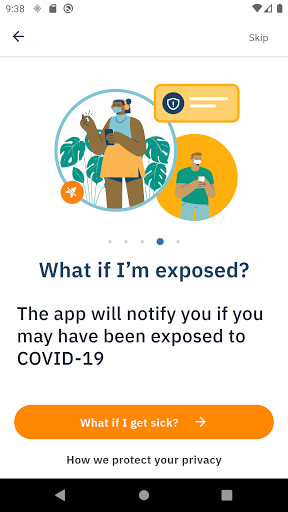
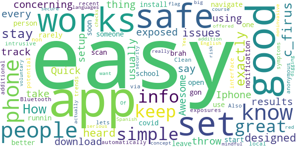
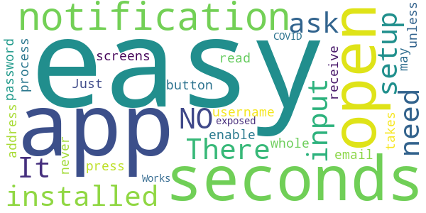
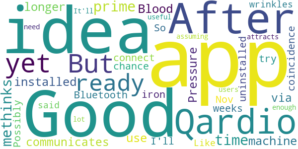

# AlohaSafe Alert
App version ``1.0.11``

Analyzed with [covid-apps-observer](http://github.com/covid-apps-observer) project, version ``0.1``

## App overview
| | |
|-------------------------|-------------------------| 
| **Name**&nbsp;&nbsp;&nbsp;&nbsp;&nbsp;&nbsp;&nbsp;&nbsp;&nbsp;&nbsp;&nbsp;&nbsp;&nbsp;&nbsp;&nbsp;&nbsp;&nbsp;&nbsp;&nbsp;&nbsp;&nbsp;&nbsp;&nbsp;&nbsp;&nbsp;&nbsp;&nbsp;&nbsp;&nbsp;&nbsp;&nbsp;&nbsp;&nbsp;&nbsp;&nbsp;&nbsp;&nbsp;&nbsp;&nbsp;&nbsp;  | AlohaSafe Alert |
| **Unique identifier** | org.alohasafe.alert |
| **Link to Google Play** | [https://play.google.com/store/apps/details?id=org.alohasafe.alert](https://play.google.com/store/apps/details?id=org.alohasafe.alert) |
| **Summary**  | Official COVID-19 exposure notification app for the State of Hawaii |
| **Privacy policy** | [https://health.hawaii.gov/coronavirusdisease2019/alohasafe-alert/](https://health.hawaii.gov/coronavirusdisease2019/alohasafe-alert/) |
| **Latest version** | 1.0.11 |
| **Last update** | 2021-01-05 05:15:57 |
| **Recent changes** | • Added symptom onset date prompt when reporting positive test result • Updated exposure risk scoring metrics |
| **Installs**  | 5,000+ |
| **Category** | Health & Fitness |
| **First release** | Nov 4, 2020 |
| **Size**  | 64M |
| **Supported Android version**  | 6.0 and up |

### Description
> AlohaSafe Alert is a voluntary new service that helps slow the spread of COVID-19. AlohaSafe Alert is the official exposure notification app of Hawaii and has been designed for use in Hawaii in coordination with the Hawaii State Department of Health.
 The goal of AlohaSafe Alert is to support the re-opening of Hawaii communities and economies.
 If you have enabled Exposure Notifications on your phone, whenever you are within close proximity (approximately 6 feet of someone for at least 15 minutes), your phones will exchange secure, anonymous tokens. If that person later tests positive for COVID-19, you will receive a notification about a possible exposure. If you test positive for COVID-19, you can share these anonymous tokens, which will send a notification to anyone with whom you have exchanged tokens recently, notifying them of possible exposure.
 This service has been designed for use in Hawaii. This service does not collect any personally identifying information or share it with the State of Hawaii, the Hawaii State Department of Health, Apple, or Google. AlohaSafe Alert is a source of up to date COVID-19 information & guidance. The AlohaSafe Alert app was built using the open source project developed by PathCheck Foundation.

### User interface
The developers of the app provide the following screenshots in the Google play store.
| | | |
|:-------------------------:|:-------------------------:|:-------------------------:|
 |   |   |   | 
 |   |   |   | 
 |   |  

## Development team
In the following we report the main information provided by the development team in the Google play store.

| | |
|-------------------------|-------------------------|
| **Developer**  | Hawaii Department of Health |
| **Website**  | [https://health.hawaii.gov/](https://health.hawaii.gov/) |
| **Email** | doh.alohasafe@doh.hawaii.gov |
| **Physical address**  | [1250 Punchbowl St. Honolulu, HI  96813](https://www.google.com/maps/search/1250%20Punchbowl%20St.%20Honolulu,%20HI%2096813) (Google Maps) |
| **Other developed apps**  | [https://play.google.com/store/apps/developer?id=Hawaii+Department+of+Health](https://play.google.com/store/apps/developer?id=Hawaii+Department+of+Health) |

## Android support

| | |
|-------------------------|-------------------------|
| **Declared target Android version**  | - |
| **Effective target Android version**  | - |
| **Minimum supported Android version**  | Marshmallow, version 6.0 (API level 23) |
| **Maximum target Android version**  | - |

The larger the difference between the minimum and maximum supported Android versions, the better. A larger difference means a wider audience. For example, old phones have a very low Android version, so a high minimum supported Android version means that the app cannot be used by users with old phones, thus leading to accessibility problems. 

## Requested permissions

In the following we report the complete list of the permissions requested by the app. 

| **Permission** | **Protection level** | **Description** | 
|-------------------------|-------------------------|-------------------------|
 **android.permission ACCESS_NETWORK_STATE** | Normal | Allows applications to access information about networks. 
 **android.permission ACCESS_WIFI_STATE** | Normal | Allows applications to access information about Wi-Fi networks. 
 **android.permission BLUETOOTH** | Normal | Allows applications to connect to paired bluetooth devices. 
 **android.permission FOREGROUND_SERVICE** | Normal | Allows a regular application to use Service.startForeground. 
 **android.permission INTERNET** | Normal | Allows applications to open network sockets. 
 **android.permission RECEIVE_BOOT_COMPLETED** | Normal | Allows an application to receive the Intent.ACTION_BOOT_COMPLETED that is broadcast after the system finishes booting. 
 **android.permission VIBRATE** | Normal | Allows access to the vibrator. 
 **android.permission WAKE_LOCK** | Normal | Allows using PowerManager WakeLocks to keep processor from sleeping or screen from dimming. 

## Mentioned servers

| **Server** | **Registrant** | **Registrant country** | **Creation date** | 
|-------------------------|-------------------------|-------------------------|-------------------------|
 | bugsnag.com | Bugsnag Inc. | GB | 2011-08-18 03:26:10 |
 | android.com | Google LLC | :us: US | 1997-06-23 04:00:00 |
 | google.com | Google LLC | :us: US | 1997-09-15 04:00:00 |
 | alohasafe.org | Contact Privacy Inc. Customer 1247641424 | :canada: CA | 2020-07-07 01:34:04 |
 | github.com | GitHub, Inc. | :us: US | 2007-10-09 18:20:50 |

## Security analysis 

Below we report the main security warnings raised by our execution of the [Androwarn](https://github.com/maaaaz/androwarn) security analysis tool.

**Telephony identifiers leakage**
> - This application reads the numeric name (MCC+MNC) of current registered operator 
> - This application reads the operator name 

**Connection interfaces exfiltration**
> - This application reads details about the currently active data network 
> - This application tries to find out if the currently active data network is metered 

**Suspicious connection establishment**
> - This application opens a Socket and connects it to the remote address 'Ljava/lang/StringBuilder;->toString()Ljava/lang/String;' on the ': connect, resolve' port  
> - This application opens a Socket and connects it to the remote address 'Ljava/lang/StringBuilder;->toString()Ljava/lang/String;' on the 'N/A' port  
> - This application opens a Socket and connects it to the remote address 'Ljava/net/Proxy;->type()Ljava/net/Proxy$Type;' on the 'N/A' port  
> - This application opens a Socket and connects it to the remote address 'No route to  ' on the 'N/A' port  
> - This application opens a Socket and connects it to the remote address 'timeout' on the 'N/A' port  

**Pim data leakage**
> - This application accesses data stored in the clipboard 

**Code execution**
> - This application loads a native library 
> - This application executes a UNIX command 

## User ratings and reviews

Below we provide information about how end users are reacting to the app in terms of ratings and reviews in the Google Play store.

### Ratings

The AlohaSafe Alert app has been installed by more than **5000** times. At this time, **15** rated the app and its average score is **4.3333335**. Below we show the distribution of the ratings across the usual star-based rating of Google Play

:star::star::star::star::star:: 10

:star::star::star::star:: 3

:star::star::star:: 0

:star::star:: 1

:star:: 1

### Reviews 

#### 5-star reviews

> How can you stay safe from the c_firus  :date: __2021-01-20 08:46:31__

> works as exactly designed to.  :date: __2021-01-17 12:51:54__

> It's very easy to set up but there is some issues that I have heard from other people concerning using this on an Iphone 6 but over all it is a very good app to track if you have been exposed. The only thing I can say is that if you don't usually take your phone every where then it could throw off the results on the app. But again it is a very good app.  :date: __2021-01-17 09:16:38__

> Quick and easy.  :date: __2021-01-16 21:15:05__

> Awesome App and easy  :date: __2021-01-16 19:02:18__

> Easy to download, setup and navigate. The more people that use it the better it works.  :date: __2021-01-16 09:28:25__

> I get in person school soon, so if I get one notification that someone get covid I gon start runnin brah  :date: __2021-01-14 03:50:44__

> Very easy to install, set up, and leave on (i.e. rarely open again) your phone to scan automatically for your potential exposures via Bluetooth. Also non-intrusive/anonymous and lets you know recent local trends and symptoms. Clean, simple interface. It would be great if additional languages could be offered in addition to English and Spanish.  :date: __2021-01-14 03:49:24__

> Good  :date: __2021-01-09 23:55:38__

> Simple, noninvasive app. Yes I want to know! All voluntary and keeps me mindful.  :date: __2021-01-03 22:23:30__

#### 4-star reviews

> , .  :date: __2021-01-08 20:47:39__

> Easy, easy, easy. The app installed in seconds. There is NO setup. It doesn't ask for any input at all. You don't need a username, password, or email address. Just open the app, read the screens, and press the button to enable notifications. The whole process takes about 15 seconds, and then you never have to open the app again unless you receive notification that you may have been exposed to COVID-19.  :date: __2020-12-17 21:22:54__

> Works  :date: __2020-11-18 23:37:20__

#### 3-star reviews

> Interesting app... Although with only around 5000+ downloads I'm not sure if the rate of population with this app installed is enough to achieve its intended purpose.  :date: __2021-01-22 09:37:13__

> Quick and easy Hope that more pplpz use this and let others know if get the virus by dem  :date: __2021-01-22 05:07:46__

> This app has a bug in it. On a moto 6 it grabs the Bluetooth and won't release it. So you have to reboot your phone to connect to your car's hands free system. It should also allow you to adjust exposure time. 15 mins is way too long given the higher contagion strain.  :date: __2021-01-21 22:11:42__

#### 2-star reviews

> Good idea ... But not yet ready for prime time, methinks. After I installed it, I could no longer use my Qardio Blood Pressure machine, which also communicates via Bluetooth. So I uninstalled this Nov. 30, 2020, and the Qardio app could connect again. Possibly a coincidence. I'll try this app again in a few weeks, after they've had a chance to iron out the wrinkles. Like I said ... a good idea ... assuming that the app attracts enough users to be useful. It'll need a lot.  :date: __2020-12-06 08:23:53__

#### 1-star reviews

> This app downloaded itself on my phone do not trust this app at all. This is not okay.  :date: __2021-01-23 07:38:41__

> I can take care of myself as well as people around me. Don't need this. Shame on victorino for forcing.  :date: __2021-01-22 08:00:16__

> This app will never work! People who have covid-19 break quarantine all the time, you still see people not wearing mask, no ones checking on people in quarantine, everyone's still having gatherings with more then 10 ppl.. The list goes on... So don't download this it's worthless you'll never get a notification!  :date: __2021-01-18 05:14:49__

> Horrible APP. Not accessible to download on my ipad mini which I always carry. Don't have an apple phone, and it is not downloading on my Samsung phone. I find it offensive that Big Brother is tracking me. Will probably cancel my trip to Maui . Too much trouble yo go there.  :date: __2021-01-18 03:54:23__

> My mother is high risk so I felt this app was a great idea. I tried downloading it but it said I didn't have enough space. So I delete three apps that I don't need and some useless pictures. It still says I don't have enough space. So I check how much space I have and it says 615 MB, which should be more than enough to download the stupid app. I check and this app only requires 22MB. I try to redownload and it doesn't work again. Great concept but it won't even let me try it out.  :date: __2021-01-17 02:44:44__

> Downloaded just to delete. I hate when apps are shoved in my face  :date: __2021-01-15 04:04:34__

> Idiotic making an app that's not backwardly compatible. My wife's iphone 6+ is up to date however the iphone version of the app won't install because it wants a newer update? Brilliant!  :date: __2020-11-18 23:57:43__

