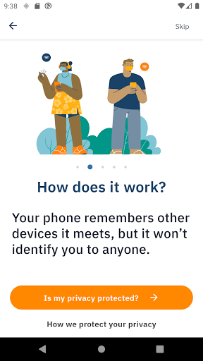
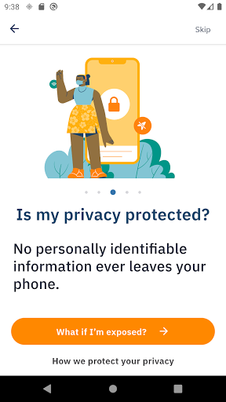
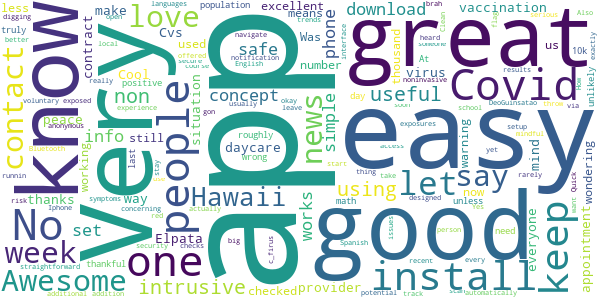
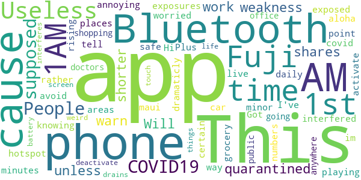

# AlohaSafe Alert
App version ``1.0.14``

Analyzed with [covid-apps-observer](http://github.com/covid-apps-observer) project, version ``0.1``

## App overview
| | |
|-------------------------|-------------------------| 
| **Name**                                          | AlohaSafe Alert |
| **Unique identifier** | org.alohasafe.alert |
| **Link to Google Play** | [https://play.google.com/store/apps/details?id=org.alohasafe.alert](https://play.google.com/store/apps/details?id=org.alohasafe.alert) |
| **Summary**  | Official COVID-19 exposure notification app for the State of Hawaii |
| **Privacy policy** | [https://health.hawaii.gov/coronavirusdisease2019/alohasafe-alert/](https://health.hawaii.gov/coronavirusdisease2019/alohasafe-alert/) |
| **Latest version** | 1.0.14 |
| **Last update** | 2021-02-27 03:21:33 |
| **Recent changes** | • Added language options: Chuukese, Ilocano, Korean, Marshallese, Samoan, Tagalog |
| **Installs**  | 50,000+ |
| **Category** | Health & Fitness |
| **First release** | Nov 4, 2020 |
| **Size**  | 65M |
| **Supported Android version**  | 6.0 and up |

### Description
> AlohaSafe Alert is a voluntary new service that helps slow the spread of COVID-19. AlohaSafe Alert is the official exposure notification app of Hawaii and has been designed for use in Hawaii in coordination with the Hawaii State Department of Health.
 The goal of AlohaSafe Alert is to support the re-opening of Hawaii communities and economies.
 If you have enabled Exposure Notifications on your phone, whenever you are within close proximity (approximately 6 feet of someone for at least 15 minutes), your phones will exchange secure, anonymous tokens. If that person later tests positive for COVID-19, you will receive a notification about a possible exposure. If you test positive for COVID-19, you can share these anonymous tokens, which will send a notification to anyone with whom you have exchanged tokens recently, notifying them of possible exposure.
 This service has been designed for use in Hawaii. This service does not collect any personally identifying information or share it with the State of Hawaii, the Hawaii State Department of Health, Apple, or Google. AlohaSafe Alert is a source of up to date COVID-19 information & guidance. The AlohaSafe Alert app was built using the open source project developed by PathCheck Foundation.

### User interface
The developers of the app provide the following screenshots in the Google play store.
| | | |
|:-------------------------:|:-------------------------:|:-------------------------:|
 |   |   |   | 
 |   |   |   | 
 |   |  

## Development team
In the following we report the main information provided by the development team in the Google play store.

| | |
|-------------------------|-------------------------|
| **Developer**  | Hawaii Department of Health |
| **Website**  | [https://health.hawaii.gov/](https://health.hawaii.gov/) |
| **Email** | doh.alohasafe@doh.hawaii.gov |
| **Physical address**  | [1250 Punchbowl St. Honolulu, HI  96813](https://www.google.com/maps/search/1250%20Punchbowl%20St.%20Honolulu,%20HI%2096813) (Google Maps) |
| **Other developed apps**  | [https://play.google.com/store/apps/developer?id=Hawaii+Department+of+Health](https://play.google.com/store/apps/developer?id=Hawaii+Department+of+Health) |

## Android support

| | |
|-------------------------|-------------------------|
| **Declared target Android version**  | - |
| **Effective target Android version**  | - |
| **Minimum supported Android version**  | Marshmallow, version 6.0 (API level 23) |
| **Maximum target Android version**  | - |

The larger the difference between the minimum and maximum supported Android versions, the better. A larger difference means a wider audience. For example, old phones have a very low Android version, so a high minimum supported Android version means that the app cannot be used by users with old phones, thus leading to accessibility problems. 

## Requested permissions

In the following we report the complete list of the permissions requested by the app. 

| **Permission** | **Protection level** | **Description** | 
|-------------------------|-------------------------|-------------------------|
 **android.permission ACCESS_NETWORK_STATE** | Normal | Allows applications to access information about networks. 
 **android.permission ACCESS_WIFI_STATE** | Normal | Allows applications to access information about Wi-Fi networks. 
 **android.permission BLUETOOTH** | Normal | Allows applications to connect to paired bluetooth devices. 
 **android.permission FOREGROUND_SERVICE** | Normal | Allows a regular application to use Service.startForeground. 
 **android.permission INTERNET** | Normal | Allows applications to open network sockets. 
 **android.permission RECEIVE_BOOT_COMPLETED** | Normal | Allows an application to receive the Intent.ACTION_BOOT_COMPLETED that is broadcast after the system finishes booting. 
 **android.permission VIBRATE** | Normal | Allows access to the vibrator. 
 **android.permission WAKE_LOCK** | Normal | Allows using PowerManager WakeLocks to keep processor from sleeping or screen from dimming. 

## Mentioned servers

| **Server** | **Registrant** | **Registrant country** | **Creation date** | 
|-------------------------|-------------------------|-------------------------|-------------------------|
 | bugsnag.com | Bugsnag Inc. | GB | 2011-08-18 03:26:10 |
 | android.com | Google LLC | :us: US | 1997-06-23 04:00:00 |
 | google.com | Google LLC | :us: US | 1997-09-15 04:00:00 |
 | alohasafe.org | Contact Privacy Inc. Customer 1247641424 | :canada: CA | 2020-07-07 01:34:04 |
 | github.com | GitHub, Inc. | :us: US | 2007-10-09 18:20:50 |

## Security analysis 

Below we report the main security warnings raised by our execution of the [Androwarn](https://github.com/maaaaz/androwarn) security analysis tool.

**Telephony identifiers leakage**
> - This application reads the numeric name (MCC+MNC) of current registered operator 
> - This application reads the operator name 

**Connection interfaces exfiltration**
> - This application reads details about the currently active data network 
> - This application tries to find out if the currently active data network is metered 

**Suspicious connection establishment**
> - This application opens a Socket and connects it to the remote address 'Ljava/lang/StringBuilder;->toString()Ljava/lang/String;' on the ': connect, resolve' port  
> - This application opens a Socket and connects it to the remote address 'Ljava/lang/StringBuilder;->toString()Ljava/lang/String;' on the 'N/A' port  
> - This application opens a Socket and connects it to the remote address 'Ljava/net/Proxy;->type()Ljava/net/Proxy$Type;' on the 'N/A' port  
> - This application opens a Socket and connects it to the remote address 'No route to  ' on the 'N/A' port  
> - This application opens a Socket and connects it to the remote address 'timeout' on the 'N/A' port  

**Pim data leakage**
> - This application accesses data stored in the clipboard 

**Code execution**
> - This application loads a native library 
> - This application executes a UNIX command 

## User ratings and reviews

Below we provide information about how end users are reacting to the app in terms of ratings and reviews in the Google Play store.

### Ratings

The AlohaSafe Alert app has been installed by more than **50000** times. At this time, **100** rated the app and its average score is **4.01**. Below we show the distribution of the ratings across the usual star-based rating of Google Play

:star::star::star::star::star:: 62

:star::star::star::star:: 11

:star::star::star:: 6

:star::star:: 8

:star:: 13

### Reviews 

#### 5-star reviews

> Cvs vaccination for daycare provider to make an appointment  :date: __2021-03-24 10:45:53__

> Cool thanks.  :date: __2021-03-21 09:07:26__

> It's a great way to let everyone know more about the situation of the Covid 19 and what to do when your contract with the Covid 19 virus..  :date: __2021-03-16 10:37:20__

> Elpata  :date: __2021-03-06 05:23:14__

> Good  :date: __2021-03-05 19:33:27__

> Keeps me in peace of mind.  :date: __2021-03-02 03:43:03__

> Awesome.  :date: __2021-02-28 04:21:59__

> excellent love it  :date: __2021-02-26 22:14:00__

> Love it  :date: __2021-02-16 09:25:53__

> I have used the app for about one week now. And there has been no contact warning. Was just wondering if it is still working. I just checked the number of installs and it's more than 10 thousand. That means that less than one of us gets positive each day. Its unlikely that we have had any contact in say the last week. No news is good news.  :date: __2021-02-16 02:58:13__

#### 4-star reviews

> Works ok, still not sure what it's use for.  :date: __2021-04-08 03:32:43__

> Very easy to use, doesn't require any personal info. It does require bluetooth but it's anonymous and you can keep it off at home and just use it when connecting to wireless headphones/remember to turn it back on when you go out. Only criticism is it's only in english and spanish, needs more languages. You shouldn't have to know english to be safe and keep others safe. It's just accessibility.  :date: __2021-02-27 05:04:18__

> Very informative  :date: __2021-02-26 21:32:20__

> , .  :date: __2021-01-08 20:47:39__

> Easy, easy, easy. The app installed in seconds. There is NO setup. It doesn't ask for any input at all. You don't need a username, password, or email address. Just open the app, read the screens, and press the button to enable notifications. The whole process takes about 15 seconds, and then you never have to open the app again unless you receive notification that you may have been exposed to COVID-19.  :date: __2020-12-17 21:22:54__

> Works  :date: __2020-11-18 23:37:20__

#### 3-star reviews

> Can't operate on my phone  :date: __2021-04-28 22:45:21__

> Assumes computer literacy!!!  :date: __2021-03-08 16:23:29__

> No one checks if you have downloaded the app upon arrival on Maui. It consumes a lot of battery.  :date: __2021-02-19 17:53:48__

> Interesting app... Although with only around 5000+ downloads I'm not sure if the rate of population with this app installed is enough to achieve its intended purpose.  :date: __2021-01-22 09:37:13__

> Quick and easy Hope that more pplpz use this and let others know if get the virus by dem  :date: __2021-01-22 05:07:46__

> This app has a bug in it. On a moto 6 it grabs the Bluetooth and won't release it. So you have to reboot your phone to connect to your car's hands free system. It should also allow you to adjust exposure time. 15 mins is way too long given the higher contagion strain.  :date: __2021-01-21 22:11:42__

#### 2-star reviews

> 1?+AM 1AM a  :date: __2021-05-13 02:59:32__

> Fuji  :date: __2021-04-08 01:08:24__

> This is my 1st time.  :date: __2021-02-25 00:11:14__

> Useless app. People with COVID19 are supposed to be quarantined. Will not work unless other phones have Bluetooth on.  :date: __2021-02-08 04:11:55__

> This app shares the weakness of all of these apps in that it doesn't warn me of shorter exposures rather only if I've been exposed for 15 minutes. Plus it doesn't tell me where the hotspot areas are so I have no way of knowing where or when I should avoid certain places. A minor but annoying point was that this app interfered with the playing of Bluetooth in my car.  :date: __2021-02-07 20:32:00__

> Got aloha safe app cause i live on maui, Hi and am worried about covid numbers rising dramaticly daily so i only activate it when im out grocery shopping or going to the doctors office or anywhere in public then i deactivate it cause it drains battery life and does weird things to my phones touch screen and interferes with other apps on my phone when its on  :date: __2021-02-04 18:06:22__

#### 1-star reviews

> It steals your data by provide services which it needs to run. Things like GPS coordinates, known associatie which are link to you. Health data and so much more.  :date: __2021-04-21 10:31:22__

> Doesn't work. My partner and I kept bluetooth on always. When he got COVID he reported it to the app with the code and I never got notified from the app, despite the fact that we live together.  :date: __2021-04-05 03:27:04__

> I cant get it to open.  :date: __2021-03-30 20:29:43__

> Stupid  :date: __2021-02-03 18:15:43__

> Hope it works doesent sound great. Tbh  :date: __2021-01-29 19:42:46__

> Force install?!? Goodbye, deleted..  :date: __2021-01-29 15:21:42__

> unconstitutional mandatory download of app. infringement of rights. state of hawaii gov will be sued over this. developers of app should be ashamed of themselves.  :date: __2021-01-27 23:04:21__

> Horrible. Forced installed. UNSAFE!!!! UNINSTALLED!!! BEWARE  :date: __2021-01-24 10:32:51__

> This app downloaded itself on my phone do not trust this app at all. This is not okay.  :date: __2021-01-23 07:38:41__

> I can take care of myself as well as people around me. Don't need this. Shame on victorino for forcing.  :date: __2021-01-22 08:00:16__

