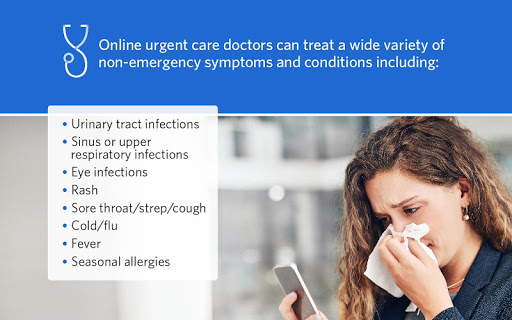
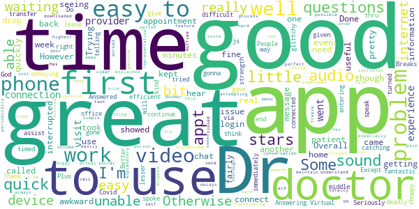
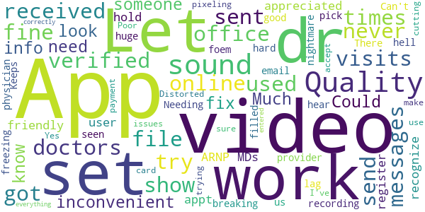
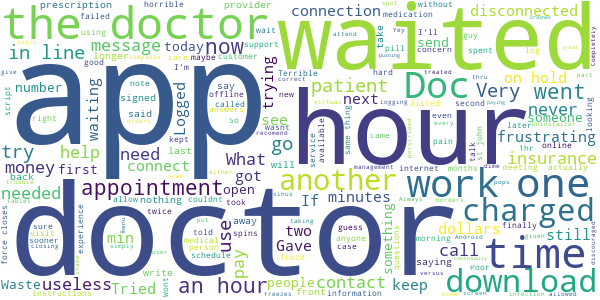

# Ascension Online Care – See a Doctor 24/7
App version ``12.0.16.005_01``

Analyzed with [covid-apps-observer](http://github.com/covid-apps-observer) project, version ``0.1``

## App overview
| | |
|-------------------------|-------------------------| 
| **Name**&nbsp;&nbsp;&nbsp;&nbsp;&nbsp;&nbsp;&nbsp;&nbsp;&nbsp;&nbsp;&nbsp;&nbsp;&nbsp;&nbsp;&nbsp;&nbsp;&nbsp;&nbsp;&nbsp;&nbsp;&nbsp;&nbsp;&nbsp;&nbsp;&nbsp;&nbsp;&nbsp;&nbsp;&nbsp;&nbsp;&nbsp;&nbsp;&nbsp;&nbsp;&nbsp;&nbsp;&nbsp;&nbsp;&nbsp;&nbsp;  | Ascension Online Care – See a Doctor 24/7 |
| **Unique identifier** | org.ascension.android.ascn.onlinecare |
| **Link to Google Play** | [https://play.google.com/store/apps/details?id=org.ascension.android.ascn.onlinecare](https://play.google.com/store/apps/details?id=org.ascension.android.ascn.onlinecare) |
| **Summary**  | No time for sick time? Talk to a doctor from wherever you are. |
| **Privacy policy** | [https://www.americanwell.com/privacy-policy/](https://www.americanwell.com/privacy-policy/) |
| **Latest version** | 12.0.16.005_01 |
| **Last update** | 2020-10-24 18:14:58 |
| **Recent changes** | We continue to improve the patient experience with these new features: • Performance enhancements to increase reliability and speed |
| **Installs**  | 50,000+ |
| **Category** | Medical |
| **First release** | Apr 5, 2019 |
| **Size**  | 52M |
| **Supported Android version**  | 5.0 and up |

### Description
> Ascension Online Care features virtual urgent care so that we can be here for you and your family 24/7 with care that fits your schedule. Get the care you need, online anytime, wherever you are – at home, at work, or on the go.
 Ascension Online Care is 24/7 one-on-one, personalized care where you and a doctor have a video chat using your mobile device. We work quickly to understand you and your unique situation, so we can provide the care you need. And it’s secure and private.
 Getting started is easy:
 1 Download the Ascension Online Care app
 2 Create your profile and tell us about your symptoms
 3 Start your video visit and talk to a doctor
 We’re here to treat you and your family for a wide variety of non-emergency symptoms and conditions, including:
 • Sinus or upper respiratory infections
 • Eye infections
 • Rash
 • Sore throat/strep/cough
 • Cold/flu
 • Fever
 • Seasonal allergies
 • Urinary tract infections
 Have a favorite pharmacy? If you end up needing a prescription, we will send your prescription to your preferred pharmacy. Just add the pharmacy information when you are registering for your visit.

### User interface
The developers of the app provide the following screenshots in the Google play store.
| | | |
|:-------------------------:|:-------------------------:|:-------------------------:|
 |   |   |   | 
 |   |   |   | 
 |   |   |   | 
 |   |   |   | 

## Development team
In the following we report the main information provided by the development team in the Google play store.

| | |
|-------------------------|-------------------------|
| **Developer**  | Ascension Health |
| **Website**  | [http://www.ascensionhealth.org](http://www.ascensionhealth.org) |
| **Email** | SISWebServices-Mobile-UX@ascension.org |
| **Physical address**  | - |
| **Other developed apps**  | [https://play.google.com/store/apps/developer?id=Ascension+Health](https://play.google.com/store/apps/developer?id=Ascension+Health) |

## Android support

| | |
|-------------------------|-------------------------|
| **Declared target Android version**  | Android10, version 10 (API level 29) |
| **Effective target Android version**  | Android10, version 10 (API level 29) |
| **Minimum supported Android version**  | Lollipop, version 5.0 (API level 21) |
| **Maximum target Android version**  | - |

The larger the difference between the minimum and maximum supported Android versions, the better. A larger difference means a wider audience. For example, old phones have a very low Android version, so a high minimum supported Android version means that the app cannot be used by users with old phones, thus leading to accessibility problems. 

## Requested permissions

In the following we report the complete list of the permissions requested by the app. 

| **Permission** | **Protection level** | **Description** | 
|-------------------------|-------------------------|-------------------------|
 **android.permission ACCESS_COARSE_LOCATION** | :warning:**Dangerous** | Allows an app to access approximate location. 
 **android.permission ACCESS_FINE_LOCATION** | :warning:**Dangerous** | Allows an app to access precise location. 
 **android.permission ACCESS_LOCATION_EXTRA_COMMANDS** | Normal | Allows an application to access extra location provider commands. 
 **android.permission ACCESS_NETWORK_STATE** | Normal | Allows applications to access information about networks. 
 **android.permission ACCESS_WIFI_STATE** | Normal | Allows applications to access information about Wi-Fi networks. 
 **android.permission BLUETOOTH** | Normal | Allows applications to connect to paired bluetooth devices. 
 **android.permission BROADCAST_STICKY** | Normal | Allows an application to broadcast sticky intents. 
 **android.permission CAMERA** | :warning:**Dangerous** | Required to be able to access the camera device. 
 **android.permission GET_TASKS** | Deprecated | This constant was deprecated in API level 21. No longer enforced. 
 **android.permission INTERNET** | Normal | Allows applications to open network sockets. 
 **android.permission MODIFY_AUDIO_SETTINGS** | Normal | Allows an application to modify global audio settings. 
 **android.permission READ_EXTERNAL_STORAGE** | :warning:**Dangerous** | Allows an application to read from external storage. 
 **android.permission READ_PHONE_STATE** | :warning:**Dangerous** | Allows read only access to phone state, including the phone number of the device, current cellular network information, the status of any ongoing calls, and a list of any PhoneAccounts registered on the device. 
 **android.permission RECEIVE_BOOT_COMPLETED** | Normal | Allows an application to receive the Intent.ACTION_BOOT_COMPLETED that is broadcast after the system finishes booting. 
 **android.permission RECORD_AUDIO** | :warning:**Dangerous** | Allows an application to record audio. 
 **android.permission REORDER_TASKS** | Normal | Allows an application to change the Z-order of tasks. 
 **android.permission SYSTEM_ALERT_WINDOW** | Signature - preinstalled - appop - pre23 - development | Allows an app to create windows using the type WindowManager.LayoutParams.TYPE_APPLICATION_OVERLAY, shown on top of all other apps. 
 **android.permission USE_BIOMETRIC** | Normal | Allows an app to use device supported biometric modalities. 
 **android.permission USE_FINGERPRINT** | Normal | This constant was deprecated in API level 28. Applications should request USE_BIOMETRIC instead 
 **android.permission VIBRATE** | Normal | Allows access to the vibrator. 
 **android.permission WAKE_LOCK** | Normal | Allows using PowerManager WakeLocks to keep processor from sleeping or screen from dimming. 
 **android.permission WRITE_EXTERNAL_STORAGE** | :warning:**Dangerous** | Allows an application to write to external storage. 
 **com.facebook.katana.provider ACCESS** | - | - 
 **com.google.android.c2dm.permission RECEIVE** | - | - 
 **com.google.android.finsky.permission BIND_GET_INSTALL_REFERRER_SERVICE** | - | - 
 **org.ascension.android.ascn.onlinecare.permission C2D_MESSAGE** | - | - 

## Mentioned servers

| **Server** | **Registrant** | **Registrant country** | **Creation date** | 
|-------------------------|-------------------------|-------------------------|-------------------------|
 | amwell.com | American Well Corporation | :us: US | 2004-02-13 19:02:32 |
 | facebook.com | Facebook, Inc. | :us: US | 1997-03-29 05:00:00 |
 | doubleclick.net | Google Inc. | :us: US | 1996-01-16 05:00:00 |
 | googleadservices.com | Google LLC | :us: US | 2003-06-19 16:34:53 |
 | google.com | Google LLC | :us: US | 1997-09-15 04:00:00 |
 | googlesyndication.com | Google LLC | :us: US | 2003-01-21 06:17:24 |
 | google-analytics.com | Google LLC | :us: US | 2005-07-18 19:24:32 |
 | app-measurement.com | Google LLC | :us: US | 2015-06-19 20:13:31 |
 | appboy.com | Braze, Inc. | :us: US | 2008-10-06 23:28:32 |
 | braze.com | Braze, Inc. | :us: US | 2000-01-19 02:18:28 |
 | optimizely.com | Optimizely | :us: US | 2010-01-11 03:01:32 |
 | twitter.com | Twitter, Inc. | :us: US | 2000-01-21 16:28:17 |
 | branch.io | Branch | :us: US | 2011-11-10 13:52:13 |
 | gstatic.com | Google LLC | :us: US | 2008-02-11 15:31:25 |
 | crashlytics.com | Google LLC | :us: US | 2011-01-21 15:30:40 |
 | bnc.lt | - | - | 2016-11-14 00:00:00 |
 | ggpht.com | Google LLC | :us: US | 2008-01-16 18:55:33 |

## Security analysis 

Below we report the main security warnings raised by our execution of the [Androwarn](https://github.com/maaaaz/androwarn) security analysis tool.

**Telephony identifiers leakage**
> - This application reads the ISO country code equivalent for the SIM provider's country code 
> - This application reads the ISO country code equivalent of the current registered operator's MCC (Mobile Country Code) 
> - This application reads the MCC+MNC of the provider of the SIM 
> - This application reads the device phone type value 
> - This application reads the numeric name (MCC+MNC) of current registered operator 
> - This application reads the operator name 
> - This application reads the phone's current state 
> - This application reads the radio technology (network type) currently in use on the device for data transmission 

**Connection interfaces exfiltration**
> - This application reads details about the currently active data network 
> - This application tries to find out if the currently active data network is metered 

**Telephony services abuse**
> - This application makes phone calls 

**Audio video eavesdropping**
> - This application captures video from the 'CAMERA' source 

**Suspicious connection establishment**
> - This application opens a Socket and connects it to the remote address ' returned no addresses for  ; port is out of range' on the 'N/A' port  
> - This application opens a Socket and connects it to the remote address '' on the 'N/A' port  
> - This application opens a Socket and connects it to the remote address 'Ljava/net/Proxy;->type()Ljava/net/Proxy$Type;' on the 'N/A' port  
> - This application opens a Socket and connects it to the remote address 'timeout' on the 'N/A' port  

**Code execution**
> - This application loads a native library 
> - This application executes a UNIX command containing this argument: '2' 

## User ratings and reviews

Below we provide information about how end users are reacting to the app in terms of ratings and reviews in the Google Play store.

### Ratings

The Ascension Online Care – See a Doctor 24/7 app has been installed by more than **50000** times. At this time, **1179** rated the app and its average score is **4.4117646**. Below we show the distribution of the ratings across the usual star-based rating of Google Play

:star::star::star::star::star:: 883

:star::star::star::star:: 129

:star::star::star:: 39

:star::star:: 29

:star:: 99

### Reviews 

#### 5-star reviews

> Good for when you need it.  :date: __2020-11-28 06:55:35__

> Wonderful  :date: __2020-11-26 09:10:25__

> It's great not having to travel to the office to see my care giver.  :date: __2020-11-23 21:50:33__

> I love using this app the doctors are very knowledgeable and it's quick and easy. With everything that's going on in the world today it makes staying home and staying safe easy.  :date: __2020-11-21 00:36:31__

> Was nice to not get out just to answer a few questions.  :date: __2020-11-18 21:30:16__

> Love it  :date: __2020-11-17 21:39:09__

> Easy-to-use and nice that I didnt have to actually go to the doctor  :date: __2020-11-16 20:47:38__

> Easy and simple to use and has excellent video and audio quality! I had a visit with my son's doctor and it's so much better than needing to go in to the office!  :date: __2020-11-16 19:38:17__

> This app was easy to enroll and use!!!  :date: __2020-11-16 17:38:13__

> Awesome mush better than going in due to COVID-19. Much safer..  :date: __2020-11-13 22:46:43__

#### 4-star reviews

> Better than waiting in a doctor's office.  :date: __2020-11-24 01:07:31__

> A bit of audio problem.  :date: __2020-11-19 16:35:44__

> A little glittchy, but a good app  :date: __2020-10-14 14:55:15__

> Works good  :date: __2020-09-30 22:38:28__

> Great appointment, but apps are not my strength.  :date: __2020-09-17 17:50:36__

> Good  :date: __2020-09-02 21:50:36__

> Great! Except it was a little choppy. could have been my end.  :date: __2020-08-20 21:55:44__

> I would give 5 stars but for getting timed out 3 times while entering information. Otherwise this was fantastic. The doctor I spoke with was kind, efficient, and patient.  :date: __2020-08-17 19:10:10__

> It was difficult to hear my dr.  :date: __2020-07-21 22:48:48__

> Audio was not good  :date: __2020-07-15 15:47:19__

#### 3-star reviews

> Like it but it disconnected in mid appointment  :date: __2020-11-19 19:41:28__

> Is app freezes up in the middle of my session I just had a session with my counselor and it froze up so she had to end it  :date: __2020-10-27 20:39:40__

> There are usually technical glitches - audio, video, failure to connect.  :date: __2020-09-02 16:25:13__

> I live in Evansville, Indiana. Which app and portal do I need to use for St Vincents outpatient login  :date: __2020-08-04 20:35:13__

> The app has a tendency to drop the connection and can take a while to reconnect. This dropping and reconnecting takes time away feom the patient and provider and is very inconvenient. It also tends to not reconnect the video or freezes up. I don't know how new the app it but it has some bugs that need to be worked out. I have not had a session yet were the app has not dropped everything.  :date: __2020-07-13 18:53:45__

> Update 6/19/20: The developer reached out and we just had an online 1:1 feedback/user experience interview. I am impressed and glad that they are looking for honest feedback on how to make a good online doctor visit for patients. They are making big changes to the app to make the whole experience much better. I might consider trying it again in the future. I'm changing my rating from 1 star to 3 until I use them again. Original review 3/28/20 (one star): This app is the same as the Amwell app, just this one is branded Ascension Online Care. There are probably bad reviews under that app name as well. I have tried two different nights to use this app. On 3/23 I tried for hours but kept losing my place in line (the app closed). Tonight I started with 5 ahead of me, THEN 7?, then by 90 minutes had been down to 1 ahead of me, but within 11 minutes it was back to 5 ahead of me again. At 2 hrs I gave up and cancelled.  :date: __2020-06-19 18:33:43__

> Visit froze 3 times. Kind of irritating.  :date: __2020-06-11 16:44:17__

> Communication not loud enough. Hard to hear and I have good ears other than that it was good  :date: __2020-06-10 20:15:31__

> sucks! trying to download it since my laptop had microphone problems, and this still trying to download. I have missed my appointment already. Can they pay attention and fix this issues?  :date: __2020-06-04 22:06:40__

> Needs to be updated since its being used more now for scheduled video visits with primary and specialty providers sits more user friendly.  :date: __2020-05-19 13:18:13__

#### 2-star reviews

> App works fine both times I have used it for online dr visits, but when I try to send messages to my doctors through this app they are not being received. They show up in the "sent" file, but verified with drs office that they never got them. This is very inconvenient. Could someone look into this and fix it? Let me know if you need more info. Much appreciated!  :date: __2020-11-17 15:34:50__

> Not user friendly for set up I have appt with ARNP but would only recognize MDs so I couldn't register with her.  :date: __2020-11-09 14:42:09__

> App didn't hold recording. Can't email the physician we seen because the app wouldn't let us pick a provider. This has been hell. Needing a foem filled out for work.... nightmare.  :date: __2020-10-09 15:27:27__

> Keeps freezing an breaking up.hard to hear...  :date: __2020-06-02 19:48:36__

> Video Quality is not good at all. There's a huge lag and pixeling issues.  :date: __2020-05-05 18:53:55__

> Poor video quality & sound. Distorted video while in use and sound cutting in and out.  :date: __2020-04-14 22:22:25__

> I trying to get payment set up, but it won't accept my card. Yes, I've make sure everything is entered correctly.  :date: __2020-04-03 18:46:55__

#### 1-star reviews

> My doctor couldnt get thru and my tablet wasnt compable  :date: __2020-11-21 17:16:34__

> Get to the insurance part and I can't log in since only 4 listed and mine is not. Yey you have to put something in that spot. Uninstaller app. Guess I'll have to call doctor.  :date: __2020-11-16 15:29:12__

> Completely useless app, freezes every time I open it. No menu pops up after the login screen. Android user.  :date: __2020-11-11 17:14:01__

> Poor App, can't send a message to my doctor.  :date: __2020-11-09 14:17:26__

> Always have trouble logging in I am very discouraged and the support number given is not the correct one  :date: __2020-10-29 16:16:29__

> Continually crashes out  :date: __2020-10-23 18:42:47__

> Went to use today for my appointment and all it does is force closes. Was a great app but now its f\*\*\*\*d.  :date: __2020-10-20 16:07:49__

> Waste of money, first time meeting a new doctor and she kept pushing a prescription on me. I'm not paying for a prescription that I'm not even sure I'll need. Doctor had horrible bedside manners too. Waste of a co-pay.  :date: __2020-10-01 17:17:51__

> Download just spins and spins. Wont do anything  :date: __2020-09-17 23:49:55__

> Charged me for a 30 second visit, complained about a UTI and they asked me how long its been since my last one. 3 months. I was told they couldn't help because it hasn't been 4 months. Now I paid $60 for nothing. Total BS.  :date: __2020-08-12 03:45:34__

