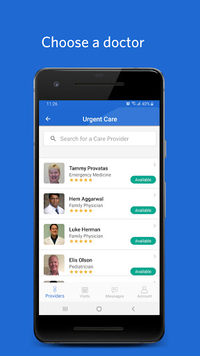
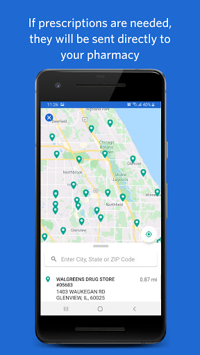
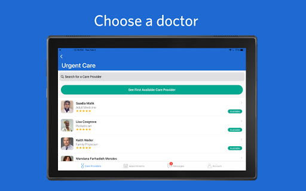
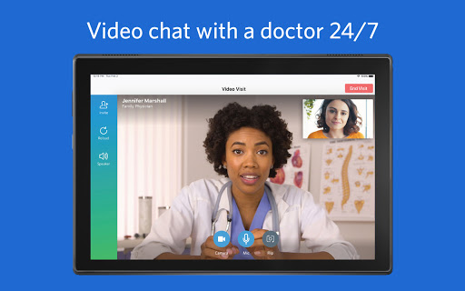
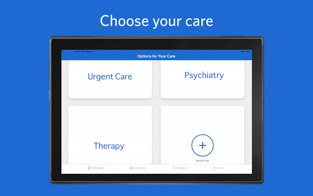
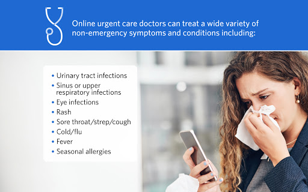
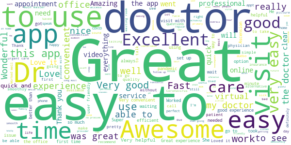
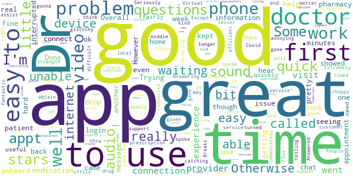
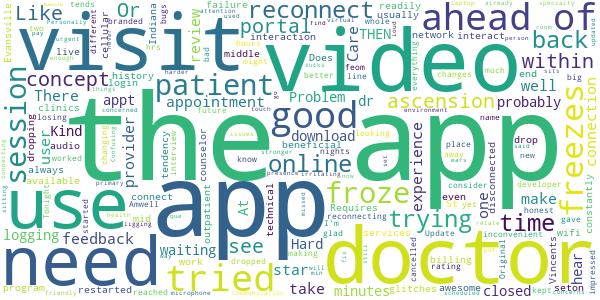
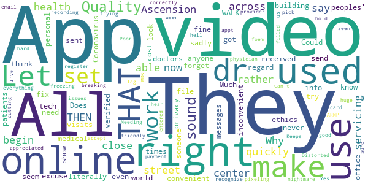

# Ascension Online Care – See a Doctor 24/7
App version ``12.1.3``

Analyzed with [covid-apps-observer](http://github.com/covid-apps-observer) project, version ``0.1``

## App overview
| | |
|-------------------------|-------------------------| 
| **Name**&nbsp;&nbsp;&nbsp;&nbsp;&nbsp;&nbsp;&nbsp;&nbsp;&nbsp;&nbsp;&nbsp;&nbsp;&nbsp;&nbsp;&nbsp;&nbsp;&nbsp;&nbsp;&nbsp;&nbsp;&nbsp;&nbsp;&nbsp;&nbsp;&nbsp;&nbsp;&nbsp;&nbsp;&nbsp;&nbsp;&nbsp;&nbsp;&nbsp;&nbsp;&nbsp;&nbsp;&nbsp;&nbsp;&nbsp;&nbsp;  | Ascension Online Care – See a Doctor 24/7 |
| **Unique identifier** | org.ascension.android.ascn.onlinecare |
| **Link to Google Play** | [https://play.google.com/store/apps/details?id=org.ascension.android.ascn.onlinecare](https://play.google.com/store/apps/details?id=org.ascension.android.ascn.onlinecare) |
| **Summary**  | No time for sick time? Talk to a doctor from wherever you are. |
| **Privacy policy** | [https://www.americanwell.com/privacy-policy/](https://www.americanwell.com/privacy-policy/) |
| **Latest version** | 12.1.3 |
| **Last update** | 2021-04-01 23:18:45 |
| **Recent changes** | Scheduled check-ins are now easier to join and other enhancements. |
| **Installs**  | 100,000+ |
| **Category** | Medical |
| **First release** | Apr 5, 2019 |
| **Size**  | 31M |
| **Supported Android version**  | 5.0 and up |

### Description
> Ascension Online Care features virtual urgent care so that we can be here for you and your family 24/7 with care that fits your schedule. Get the care you need, online anytime, wherever you are – at home, at work, or on the go.
 Ascension Online Care is 24/7 one-on-one, personalized care where you and a doctor have a video chat using your mobile device. We work quickly to understand you and your unique situation, so we can provide the care you need. And it’s secure and private.
 Getting started is easy:
 1 Download the Ascension Online Care app
 2 Create your profile and tell us about your symptoms
 3 Start your video visit and talk to a doctor
 We’re here to treat you and your family for a wide variety of non-emergency symptoms and conditions, including:
 • Sinus or upper respiratory infections
 • Eye infections
 • Rash
 • Sore throat/strep/cough
 • Cold/flu
 • Fever
 • Seasonal allergies
 • Urinary tract infections
 Have a favorite pharmacy? If you end up needing a prescription, we will send your prescription to your preferred pharmacy. Just add the pharmacy information when you are registering for your visit.

### User interface
The developers of the app provide the following screenshots in the Google play store.
| | | |
|:-------------------------:|:-------------------------:|:-------------------------:|
 |   |   |   | 
 |   |   |   | 
 |   |   |   | 
 |   |   |   | 
 |   |   |   | 
 |   |   |   | 

## Development team
In the following we report the main information provided by the development team in the Google play store.

| | |
|-------------------------|-------------------------|
| **Developer**  | Ascension Health |
| **Website**  | [http://www.ascensionhealth.org](http://www.ascensionhealth.org) |
| **Email** | SISWebServices-Mobile-UX@ascension.org |
| **Physical address**  | - |
| **Other developed apps**  | [https://play.google.com/store/apps/developer?id=Ascension+Health](https://play.google.com/store/apps/developer?id=Ascension+Health) |

## Android support

| | |
|-------------------------|-------------------------|
| **Declared target Android version**  | Android10, version 10 (API level 29) |
| **Effective target Android version**  | Android10, version 10 (API level 29) |
| **Minimum supported Android version**  | Lollipop, version 5.0 (API level 21) |
| **Maximum target Android version**  | - |

The larger the difference between the minimum and maximum supported Android versions, the better. A larger difference means a wider audience. For example, old phones have a very low Android version, so a high minimum supported Android version means that the app cannot be used by users with old phones, thus leading to accessibility problems. 

## Requested permissions

In the following we report the complete list of the permissions requested by the app. 

| **Permission** | **Protection level** | **Description** | 
|-------------------------|-------------------------|-------------------------|
 **android.permission ACCESS_COARSE_LOCATION** | :warning:**Dangerous** | Allows an app to access approximate location. 
 **android.permission ACCESS_FINE_LOCATION** | :warning:**Dangerous** | Allows an app to access precise location. 
 **android.permission ACCESS_NETWORK_STATE** | Normal | Allows applications to access information about networks. 
 **android.permission ACCESS_WIFI_STATE** | Normal | Allows applications to access information about Wi-Fi networks. 
 **android.permission BLUETOOTH** | Normal | Allows applications to connect to paired bluetooth devices. 
 **android.permission CAMERA** | :warning:**Dangerous** | Required to be able to access the camera device. 
 **android.permission FOREGROUND_SERVICE** | Normal | Allows a regular application to use Service.startForeground. 
 **android.permission GET_TASKS** | Deprecated | This constant was deprecated in API level 21. No longer enforced. 
 **android.permission INTERNET** | Normal | Allows applications to open network sockets. 
 **android.permission MODIFY_AUDIO_SETTINGS** | Normal | Allows an application to modify global audio settings. 
 **android.permission READ_EXTERNAL_STORAGE** | :warning:**Dangerous** | Allows an application to read from external storage. 
 **android.permission READ_PHONE_STATE** | :warning:**Dangerous** | Allows read only access to phone state, including the phone number of the device, current cellular network information, the status of any ongoing calls, and a list of any PhoneAccounts registered on the device. 
 **android.permission RECORD_AUDIO** | :warning:**Dangerous** | Allows an application to record audio. 
 **android.permission VIBRATE** | Normal | Allows access to the vibrator. 
 **android.permission WAKE_LOCK** | Normal | Allows using PowerManager WakeLocks to keep processor from sleeping or screen from dimming. 
 **android.permission WRITE_EXTERNAL_STORAGE** | :warning:**Dangerous** | Allows an application to write to external storage. 
 **com.google.android.c2dm.permission RECEIVE** | - | - 
 **com.google.android.finsky.permission BIND_GET_INSTALL_REFERRER_SERVICE** | - | - 

## Mentioned servers

| **Server** | **Registrant** | **Registrant country** | **Creation date** | 
|-------------------------|-------------------------|-------------------------|-------------------------|
 | ascensiononlinecare.org | Ascension | :us: US | 2019-02-27 18:29:10 |
 | amplitude.com | Amplitude | :us: US | 1996-05-09 04:00:00 |
 | googlesyndication.com | Google LLC | :us: US | 2003-01-21 06:17:24 |
 | google.com | Google LLC | :us: US | 1997-09-15 04:00:00 |
 | googleadservices.com | Google LLC | :us: US | 2003-06-19 16:34:53 |
 | app-measurement.com | Google LLC | :us: US | 2015-06-19 20:13:31 |
 | marketingcloudapis.com | Salesforce.com, Inc. | :us: US | 2016-04-18 14:13:25 |
 | igodigital.com | Salesforce.com, Inc. | :us: US | 2003-10-12 03:48:34 |
 | xmlpull.org | Privacy service provided by Withheld for Privacy ehf | :iceland: IS | 2001-11-26 20:33:08 |
 | android.com | Google LLC | :us: US | 1997-06-23 04:00:00 |
 | crashlytics.com | Google LLC | :us: US | 2011-01-21 15:30:40 |
 | ascension.org | Ascension | :us: US | 2002-04-06 19:27:47 |

## Security analysis 

Below we report the main security warnings raised by our execution of the [Androwarn](https://github.com/maaaaz/androwarn) security analysis tool.

**Telephony identifiers leakage**
> - This application reads the ISO country code equivalent of the current registered operator's MCC (Mobile Country Code) 
> - This application reads the MCC+MNC of the provider of the SIM 
> - This application reads the device phone type value 
> - This application reads the numeric name (MCC+MNC) of current registered operator 
> - This application reads the operator name 
> - This application reads the phone's current state 
> - This application reads the radio technology (network type) currently in use on the device for data transmission 

**Location lookup**
> - This application reads location information from all available providers (WiFi, GPS etc.) 

**Connection interfaces exfiltration**
> - This application reads details about the currently active data network 

**Telephony services abuse**
> - This application makes phone calls 

**Suspicious connection establishment**
> - This application opens a Socket and connects it to the remote address '; port is out of range' on the 'N/A' port  
> - This application opens a Socket and connects it to the remote address 'Lh0/d/a/a/a;->u(Ljava/lang/String;)Ljava/lang/StringBuilder;' on the 'N/A' port  
> - This application opens a Socket and connects it to the remote address 'Ljava/net/Proxy;->type()Ljava/net/Proxy$Type;' on the 'N/A' port  
> - This application opens a Socket and connects it to the remote address 'timeout' on the 'N/A' port  

**Code execution**
> - This application loads a native library 

## User ratings and reviews

Below we provide information about how end users are reacting to the app in terms of ratings and reviews in the Google Play store.

### Ratings

The Ascension Online Care – See a Doctor 24/7 app has been installed by more than **100000** times. At this time, **1257** rated the app and its average score is **4.1953125**. Below we show the distribution of the ratings across the usual star-based rating of Google Play

:star::star::star::star::star:: 904

:star::star::star::star:: 78

:star::star::star:: 59

:star::star:: 49

:star:: 167

### Reviews 

#### 5-star reviews

> Always reliable no problems when it came time to talk to doctor.  :date: __2021-03-22 23:47:37__

> Just testing it out  :date: __2021-02-28 18:10:38__

> I had a virtual appointment with my Dr and it was very convenient.  :date: __2021-01-27 02:13:32__

> So grateful for this app worked amazing for us!  :date: __2021-01-19 18:54:56__

> Worked better than any online Dr I have ever visited. No lag or anything.  :date: __2021-01-18 19:33:16__

> Great appt easy to use  :date: __2021-01-07 16:11:44__

> Love it. Best idea especially if you got that kind of elderly parent who won't listen to you and is very stubborn lol, who needs to hear it from a professional to determine they're options.  :date: __2021-01-04 04:47:55__

> We use the virtual appointments. But if you receive a phone call during the call the volume will drop to low to finish the appointment.  :date: __2020-12-29 19:44:54__

> Great app fast reliable and convenient  :date: __2020-12-22 06:04:57__

> Quality application provides what I need for virtual appointments  :date: __2020-12-18 18:09:44__

#### 4-star reviews

> It is ok.  :date: __2021-01-11 20:42:53__

> Extremely hard to get help with prescription medication if local pharmacy cannot obtain the drug. Customer service support number is 'no longer in service' when called.  :date: __2021-01-07 13:34:21__

> Answering the same questions week after week is annoying. Covid questions for Virtual Visits?? Seriously??!! People have a .02% of catching it and an even lesser % of it being deadly. Do you really think it's gonna transfer thru a phone? js  :date: __2020-12-17 19:00:55__

> Better than waiting in a doctor's office.  :date: __2020-11-24 01:07:31__

> A bit of audio problem.  :date: __2020-11-19 16:35:44__

> A little glittchy, but a good app  :date: __2020-10-14 14:55:15__

> Works good  :date: __2020-09-30 22:38:28__

> Great appointment, but apps are not my strength.  :date: __2020-09-17 17:50:36__

> Good  :date: __2020-09-02 21:50:36__

> Great! Except it was a little choppy. could have been my end.  :date: __2020-08-20 21:55:44__

#### 3-star reviews

> The program freezes up and constantly has to be restarted  :date: __2021-02-02 18:56:32__

> The concept is awesome, but it would be beneficial to have interaction with the "patient portal" that seton ascension clinics use. Or even to see services and billing history that you can interact with within the app itself.  :date: __2021-01-22 20:19:52__

> Like it but it disconnected in mid appointment  :date: __2021-01-21 19:47:37__

> Requires wifi which is not always readily available. Does not work well on cellular network  :date: __2021-01-19 23:19:24__

> Is app freezes up in the middle of my session I just had a session with my counselor and it froze up so she had to end it  :date: __2020-10-27 20:39:40__

> There are usually technical glitches - audio, video, failure to connect.  :date: __2020-09-02 16:25:13__

> I live in Evansville, Indiana. Which app and portal do I need to use for St Vincents outpatient login  :date: __2020-08-04 20:35:13__

> The app has a tendency to drop the connection and can take a while to reconnect. This dropping and reconnecting takes time away feom the patient and provider and is very inconvenient. It also tends to not reconnect the video or freezes up. I don't know how new the app it but it has some bugs that need to be worked out. I have not had a session yet were the app has not dropped everything.  :date: __2020-07-13 18:53:45__

> Update 6/19/20: The developer reached out and we just had an online 1:1 feedback/user experience interview. I am impressed and glad that they are looking for honest feedback on how to make a good online doctor visit for patients. They are making big changes to the app to make the whole experience much better. I might consider trying it again in the future. I'm changing my rating from 1 star to 3 until I use them again. Original review 3/28/20 (one star): This app is the same as the Amwell app, just this one is branded Ascension Online Care. There are probably bad reviews under that app name as well. I have tried two different nights to use this app. On 3/23 I tried for hours but kept losing my place in line (the app closed). Tonight I started with 5 ahead of me, THEN 7?, then by 90 minutes had been down to 1 ahead of me, but within 11 minutes it was back to 5 ahead of me again. At 2 hrs I gave up and cancelled.  :date: __2020-06-19 18:33:43__

> Visit froze 3 times. Kind of irritating.  :date: __2020-06-11 16:44:17__

#### 2-star reviews

> All I can say right now is.......Why did the Ascension health center close up across the street from me rather quickly......And THEN....begin servicing online. I used to be able to literally WALK to the building. In medical ethics there use to be a regard for rights to peoples' privacy. Does anyone else out there ever think of this?? This, sadly, is the world of tech. They make it seem more convenient.... But do patients forget the personal cost. Coronavirus or not. Is even THAT an excuse ???  :date: __2020-12-23 18:37:38__

> App works fine both times I have used it for online dr visits, but when I try to send messages to my doctors through this app they are not being received. They show up in the "sent" file, but verified with drs office that they never got them. This is very inconvenient. Could someone look into this and fix it? Let me know if you need more info. Much appreciated!  :date: __2020-11-17 15:34:50__

> Not user friendly for set up I have appt with ARNP but would only recognize MDs so I couldn't register with her.  :date: __2020-11-09 14:42:09__

> App didn't hold recording. Can't email the physician we seen because the app wouldn't let us pick a provider. This has been hell. Needing a foem filled out for work.... nightmare.  :date: __2020-10-09 15:27:27__

> Keeps freezing an breaking up.hard to hear...  :date: __2020-06-02 19:48:36__

> Video Quality is not good at all. There's a huge lag and pixeling issues.  :date: __2020-05-05 18:53:55__

> Poor video quality & sound. Distorted video while in use and sound cutting in and out.  :date: __2020-04-14 22:22:25__

> I trying to get payment set up, but it won't accept my card. Yes, I've make sure everything is entered correctly.  :date: __2020-04-03 18:46:55__

#### 1-star reviews

> Anything associated with ascension is toxic  :date: __2021-05-01 01:57:47__

> Cant get pass entering my password useless!!  :date: __2021-04-24 00:47:06__

> Horrible  :date: __2021-04-10 01:40:45__

> Don't use this app unless your covered by their specific insurance plan. Took 3 days to get the meds they prescribed to my pharmacy. That was with over 48 hours trying to get them to even fix the issue of even knowing I was seen the day before. Also if you are on medicaid, they don't support you so all meds won't be covered at all cause their doctors aren't covered by medicaid. Once all this had gone down, it shows $59 dollars for nothing and was even double charged wrongfully on my credit card.  :date: __2021-04-09 21:04:46__

> Cannot access login on the previously installed app. Denies login, as well as creating a new account. Flags that I am not using an existing email after entering the first digit of me email address.  :date: __2021-04-02 12:35:23__

> App looks nice, but crashes everytime I try to add a credit card, making it completely useless.  :date: __2021-03-19 00:14:56__

> Couldn't even find primary care physician on it and you can't book an appointment if you don't have insurance.  :date: __2021-03-17 06:29:38__

> aweful. theres 4 buttons and none do anything  :date: __2021-02-27 21:17:28__

> I am 14 and something is wrong with my heart but it won't let me sign up because I'm not 18 what am I supposed to do??  :date: __2021-02-20 18:30:28__

> Tried going to look at my lab results from my cancer doctor and could not see them or even anything about her. Very disappointed  :date: __2021-01-24 17:52:04__

