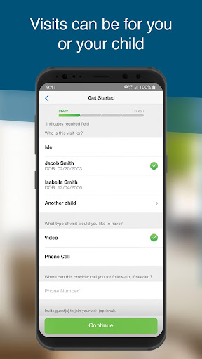
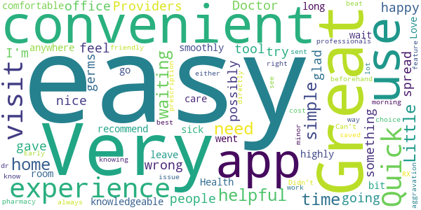

# Aurora Health Care Video Visit
App version ``11.5.7.000_00``

Analyzed with [covid-apps-observer](http://github.com/covid-apps-observer) project, version ``0.1``

## App overview
| | |
|-------------------------|-------------------------| 
| **Name**&nbsp;&nbsp;&nbsp;&nbsp;&nbsp;&nbsp;&nbsp;&nbsp;&nbsp;&nbsp;&nbsp;&nbsp;&nbsp;&nbsp;&nbsp;&nbsp;&nbsp;&nbsp;&nbsp;&nbsp;&nbsp;&nbsp;&nbsp;&nbsp;&nbsp;&nbsp;&nbsp;&nbsp;&nbsp;&nbsp;&nbsp;&nbsp;&nbsp;&nbsp;&nbsp;&nbsp;&nbsp;&nbsp;&nbsp;&nbsp;  | Aurora Health Care Video Visit |
| **Unique identifier** | org.aurorahealthcare.android.auhc.videovisit |
| **Link to Google Play** | [https://play.google.com/store/apps/details?id=org.aurorahealthcare.android.auhc.videovisit](https://play.google.com/store/apps/details?id=org.aurorahealthcare.android.auhc.videovisit) |
| **Summary**  | Video chat with a health care provider from a smartphone for care and treatment. |
| **Privacy policy** | [https://www.americanwell.com/privacy-policy/](https://www.americanwell.com/privacy-policy/) |
| **Latest version** | 11.5.7.000_00 |
| **Last update** | 2020-03-24 21:28:12 |
| **Recent changes** | We continue to improve the patient experience with these new features: • Performance enhancements to increase reliability and speed |
| **Installs**  | 5,000+ |
| **Category** | Medical |
| **First release** | May 24, 2017 |
| **Size**  | 59M |
| **Supported Android version**  | 5.0 and up |

### Description
> Video chat with a health care provider from a smartphone for care and treatment.
 There’s no appointment necessary for a video visit. People can choose a provider to start, share their health concerns, get a diagnosis and get what they need to start feeling better — available 7 days a week from 7 a.m. to 9 p.m.
 Anyone over the age of 18 who’s a current Wisconsin resident and physically located in Wisconsin can start a video visit. Our providers are only licensed to practice telemedicine in Wisconsin. Children under the age of 2 are not eligible for these video visits.
 Conditions treated include:
 •	Bronchitis
 •	Colds
 •	Cough and sore throat
 •	Diarrhea
 •	Fever
 •	Flu
 •	Headaches
 •	Red eye
 •	Respiratory Infections
 •	Sinus infections
 •	Sprains and strains
 •	Vomiting

### User interface
The developers of the app provide the following screenshots in the Google play store.
| | | |
|:-------------------------:|:-------------------------:|:-------------------------:|
 |   |   |   | 
 |   |   |   | 
 |   |   |   | 
 |   |   |   | 

## Development team
In the following we report the main information provided by the development team in the Google play store.

| | |
|-------------------------|-------------------------|
| **Developer**  | Aurora Health Care, Inc. |
| **Website**  | [http://www.aurorahealthcare.org](http://www.aurorahealthcare.org) |
| **Email** | tony.finn@aurora.org |
| **Physical address**  | - |
| **Other developed apps**  | [https://play.google.com/store/apps/developer?id=Aurora+Health+Care,+Inc.](https://play.google.com/store/apps/developer?id=Aurora+Health+Care,+Inc.) |

## Android support

| | |
|-------------------------|-------------------------|
| **Declared target Android version**  | Pie, version 9 (API level 28) |
| **Effective target Android version**  | Pie, version 9 (API level 28) |
| **Minimum supported Android version**  | Lollipop, version 5.0 (API level 21) |
| **Maximum target Android version**  | - |

The larger the difference between the minimum and maximum supported Android versions, the better. A larger difference means a wider audience. For example, old phones have a very low Android version, so a high minimum supported Android version means that the app cannot be used by users with old phones, thus leading to accessibility problems. 

## Requested permissions

In the following we report the complete list of the permissions requested by the app. 

| **Permission** | **Protection level** | **Description** | 
|-------------------------|-------------------------|-------------------------|
 **android.permission ACCESS_COARSE_LOCATION** | :warning:**Dangerous** | Allows an app to access approximate location. 
 **android.permission ACCESS_FINE_LOCATION** | :warning:**Dangerous** | Allows an app to access precise location. 
 **android.permission ACCESS_LOCATION_EXTRA_COMMANDS** | Normal | Allows an application to access extra location provider commands. 
 **android.permission ACCESS_NETWORK_STATE** | Normal | Allows applications to access information about networks. 
 **android.permission ACCESS_WIFI_STATE** | Normal | Allows applications to access information about Wi-Fi networks. 
 **android.permission BLUETOOTH** | Normal | Allows applications to connect to paired bluetooth devices. 
 **android.permission BROADCAST_STICKY** | Normal | Allows an application to broadcast sticky intents. 
 **android.permission CALL_PHONE** | :warning:**Dangerous** | Allows an application to initiate a phone call without going through the Dialer user interface for the user to confirm the call. 
 **android.permission CAMERA** | :warning:**Dangerous** | Required to be able to access the camera device. 
 **android.permission GET_TASKS** | Deprecated | This constant was deprecated in API level 21. No longer enforced. 
 **android.permission INTERNET** | Normal | Allows applications to open network sockets. 
 **android.permission MODIFY_AUDIO_SETTINGS** | Normal | Allows an application to modify global audio settings. 
 **android.permission READ_EXTERNAL_STORAGE** | :warning:**Dangerous** | Allows an application to read from external storage. 
 **android.permission READ_PHONE_STATE** | :warning:**Dangerous** | Allows read only access to phone state, including the phone number of the device, current cellular network information, the status of any ongoing calls, and a list of any PhoneAccounts registered on the device. 
 **android.permission RECORD_AUDIO** | :warning:**Dangerous** | Allows an application to record audio. 
 **android.permission REORDER_TASKS** | Normal | Allows an application to change the Z-order of tasks. 
 **android.permission SYSTEM_ALERT_WINDOW** | Signature - preinstalled - appop - pre23 - development | Allows an app to create windows using the type WindowManager.LayoutParams.TYPE_APPLICATION_OVERLAY, shown on top of all other apps. 
 **android.permission VIBRATE** | Normal | Allows access to the vibrator. 
 **android.permission WAKE_LOCK** | Normal | Allows using PowerManager WakeLocks to keep processor from sleeping or screen from dimming. 
 **android.permission WRITE_EXTERNAL_STORAGE** | :warning:**Dangerous** | Allows an application to write to external storage. 
 **com.facebook.katana.provider ACCESS** | - | - 
 **com.google.android.c2dm.permission RECEIVE** | - | - 
 **com.google.android.finsky.permission BIND_GET_INSTALL_REFERRER_SERVICE** | - | - 
 **org.aurorahealthcare.android.auhc.videovisit.permission C2D_MESSAGE** | - | - 

## Mentioned servers

| **Server** | **Registrant** | **Registrant country** | **Creation date** | 
|-------------------------|-------------------------|-------------------------|-------------------------|
 | amwell.com | American Well Corporation | :us: US | 2004-02-13 19:02:32 |
 | facebook.com | Facebook, Inc. | :us: US | 1997-03-29 05:00:00 |
 | doubleclick.net | Google Inc. | :us: US | 1996-01-16 05:00:00 |
 | googleadservices.com | Google LLC | :us: US | 2003-06-19 16:34:53 |
 | google.com | Google LLC | :us: US | 1997-09-15 04:00:00 |
 | googlesyndication.com | Google LLC | :us: US | 2003-01-21 06:17:24 |
 | googleapis.com | Google LLC | :us: US | 2005-01-25 17:52:26 |
 | google-analytics.com | Google LLC | :us: US | 2005-07-18 19:24:32 |
 | app-measurement.com | Google LLC | :us: US | 2015-06-19 20:13:31 |
 | appboy.com | Braze, Inc. | :us: US | 2008-10-06 23:28:32 |
 | braze.com | Braze, Inc. | :us: US | 2000-01-19 02:18:28 |
 | gstatic.com | Google LLC | :us: US | 2008-02-11 15:31:25 |
 | twitter.com | Twitter, Inc. | :us: US | 2000-01-21 16:28:17 |
 | crashlytics.com | Google LLC | :us: US | 2011-01-21 15:30:40 |
 | ggpht.com | Google LLC | :us: US | 2008-01-16 18:55:33 |

## Security analysis 

Below we report the main security warnings raised by our execution of the [Androwarn](https://github.com/maaaaz/androwarn) security analysis tool.

**Telephony identifiers leakage**
> - This application reads the ISO country code equivalent for the SIM provider's country code 
> - This application reads the ISO country code equivalent of the current registered operator's MCC (Mobile Country Code) 
> - This application reads the device phone type value 
> - This application reads the numeric name (MCC+MNC) of current registered operator 
> - This application reads the operator name 
> - This application reads the phone's current state 
> - This application reads the radio technology (network type) currently in use on the device for data transmission 

**Connection interfaces exfiltration**
> - This application reads details about the currently active data network 
> - This application tries to find out if the currently active data network is metered 

**Telephony services abuse**
> - This application makes phone calls 

**Audio video eavesdropping**
> - This application captures video from the 'CAMERA' source 

**Suspicious connection establishment**
> - This application opens a Socket and connects it to the remote address '' on the 'N/A' port  
> - This application opens a Socket and connects it to the remote address 'Ljava/lang/StringBuilder;->toString()Ljava/lang/String;' on the 'N/A' port  
> - This application opens a Socket and connects it to the remote address 'Ljava/net/Proxy;->type()Ljava/net/Proxy$Type;' on the 'N/A' port  
> - This application opens a Socket and connects it to the remote address 'timeout' on the 'N/A' port  

**Code execution**
> - This application loads a native library 
> - This application loads a native library: 'VidyoClientApp' 
> - This application loads a native library: 'ndkVideoClient' 
> - This application executes a UNIX command containing this argument: '2' 

## User ratings and reviews

Below we provide information about how end users are reacting to the app in terms of ratings and reviews in the Google Play store.

### Ratings

The Aurora Health Care Video Visit app has been installed by more than **5000** times. At this time, **37** rated the app and its average score is **4.5135136**. Below we show the distribution of the ratings across the usual star-based rating of Google Play

:star::star::star::star::star:: 30

:star::star::star::star:: 2

:star::star::star:: 2

:star::star:: 0

:star:: 3

### Reviews 

#### 5-star reviews

> Very happy with the app  :date: __2020-12-29 00:01:15__

> Great Experience. Doctor was very helpful!!  :date: __2019-10-18 01:29:24__

> very nice people  :date: __2019-06-25 20:37:33__

> It's a great tool when you have something simple that is wrong and you don't feel like going into an office to possibly spread more germs. Quick and easy.  :date: __2019-06-08 14:40:03__

> quick and easy to use 10/10  :date: __2019-06-01 01:24:23__

> I had a great experience! I'm very glad that I gave it a try!  :date: __2019-02-02 18:44:39__

> Great experience. Providers are knowledgeable.  :date: __2018-12-26 14:40:13__

> Love this app I don't have to leave my home. I highly recommend this app  :date: __2018-12-16 19:38:37__

> Quick and easy for simple needs... no long waiting room time. Very comfortable!  :date: __2018-12-15 19:11:46__

> Easy to use. Little bit of a wait for the visit but went smoothly after that.  :date: __2018-11-18 18:55:33__

#### 4-star reviews

> App works well. Lots to fill out and read so you can lose the provider chosen is you don't hurry  :date: __2018-01-10 21:35:14__

> Just wish it said estimated wait time...otherwise it's great!  :date: __2018-01-05 03:01:49__

#### 3-star reviews

No recent reviews available with 3 stars.

#### 2-star reviews

No recent reviews available with 2 stars.

#### 1-star reviews

> Downloaded the app and right after then I got message that app doesn't allow mobile access. What should I need this app for? Useless.  :date: __2020-05-20 17:53:47__

> this is a mobile app for download once downloaded it says video visit is not compatible with mobile phones  :date: __2020-04-24 16:19:23__

> Went through 25 different password options, refused all of them!!??  :date: __2018-04-09 09:58:51__

