# BayCareAnywhere – Online doctors 24/7
App version ``12.10.01.010_02``

Analyzed with [covid-apps-observer](http://github.com/covid-apps-observer) project, version ``0.1``

## App overview
| | |
|-------------------------|-------------------------| 
| **Name**&nbsp;&nbsp;&nbsp;&nbsp;&nbsp;&nbsp;&nbsp;&nbsp;&nbsp;&nbsp;&nbsp;&nbsp;&nbsp;&nbsp;&nbsp;&nbsp;&nbsp;&nbsp;&nbsp;&nbsp;&nbsp;&nbsp;&nbsp;&nbsp;&nbsp;&nbsp;&nbsp;&nbsp;&nbsp;&nbsp;&nbsp;&nbsp;&nbsp;&nbsp;&nbsp;&nbsp;&nbsp;&nbsp;&nbsp;&nbsp;  | BayCareAnywhere – Online doctors 24/7 |
| **Unique identifier** | org.baycare.android.bahs.baycareanywhere |
| **Link to Google Play** | [https://play.google.com/store/apps/details?id=org.baycare.android.bahs.baycareanywhere](https://play.google.com/store/apps/details?id=org.baycare.android.bahs.baycareanywhere) |
| **Summary**  | 24/7 access to a live doctor for minor illness or injury for kids and adults |
| **Privacy policy** | [https://www.americanwell.com/privacy-policy/](https://www.americanwell.com/privacy-policy/) |
| **Latest version** | 12.10.01.010_02 |
| **Last update** | 2021-07-13 22:27:39 |
| **Recent changes** | We continue to improve the patient experience with these new features: • Performance enhancements to increase reliability and speed |
| **Installs**  | 100,000+ |
| **Category** | Medical |
| **First release** | Jun 16, 2016 |
| **Size**  | 54M |
| **Supported Android version**  | 5.0 and up |

### Description
> Need to see a doctor but don’t want to leave the house? BayCareAnywhere® connects you with board-certified doctors anytime from anywhere for just $59 per visit.
 No more waiting weeks for an appointment or spending hours in a waiting room. The doctor is available wherever you are. 24 hours a day, seven days a week.
 Get BayCareAnywhere
 Step 1: Download the app and create your account
 Step 2: Choose your doctor and start your virtual visit within minutes
 Step 3: Feel better!
 Patients age 2 and older can be examined by a board-certified doctor for common conditions such as:
 · Cold/flu
 · Cough
 · Sore throat
 · Allergies
 · Sinus infection
 · Conjunctivitis (pink eye)
 · And more
 If the doctor determines that you need to be seen in-person, you can print your patient summary and present it at any BayCare Urgent Care Center to receive a $59 discount off your visit.

### User interface
The developers of the app provide the following screenshots in the Google play store.
| | | |
|:-------------------------:|:-------------------------:|:-------------------------:|
 |   | 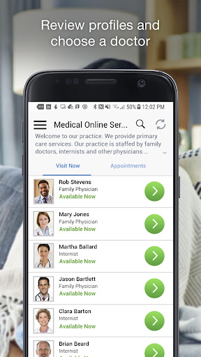  | 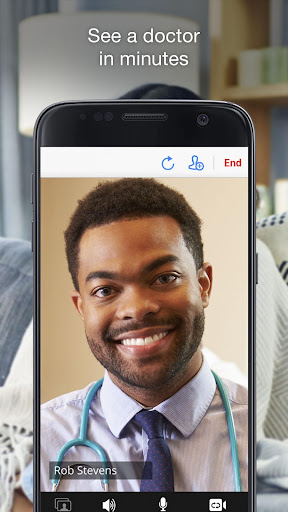  | 
 | 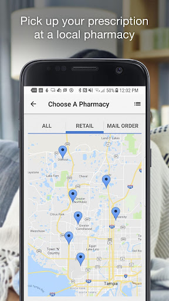  | 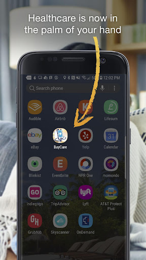  | 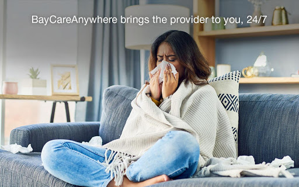  | 
 | 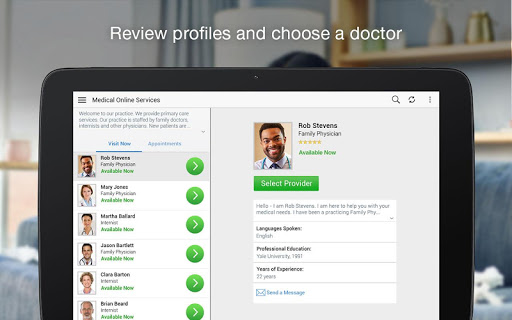  |   | 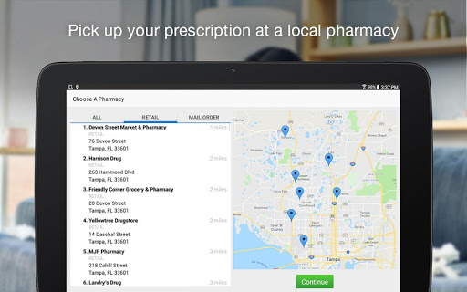  | 
 | 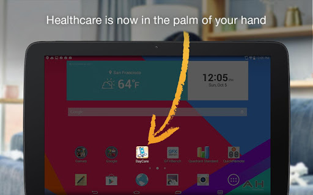  |   |   | 
 |   |   |   | 

## Development team
In the following we report the main information provided by the development team in the Google play store.

| | |
|-------------------------|-------------------------|
| **Developer**  | BayCare Health System, Inc |
| **Website**  | [http://www.baycare.org/](http://www.baycare.org/) |
| **Email** | mobiledevelopers@baycare.org |
| **Physical address**  | [2985 Drew St. Clearwater, FL 33759](https://www.google.com/maps/search/2985%20Drew%20St.%20Clearwater,%20FL%2033759) (Google Maps) |
| **Other developed apps**  | [https://play.google.com/store/apps/developer?id=BayCare+Health+System,+Inc](https://play.google.com/store/apps/developer?id=BayCare+Health+System,+Inc) |

## Android support

| | |
|-------------------------|-------------------------|
| **Declared target Android version**  | Android10, version 10 (API level 29) |
| **Effective target Android version**  | Android10, version 10 (API level 29) |
| **Minimum supported Android version**  | Lollipop, version 5.0 (API level 21) |
| **Maximum target Android version**  | - |

The larger the difference between the minimum and maximum supported Android versions, the better. A larger difference means a wider audience. For example, old phones have a very low Android version, so a high minimum supported Android version means that the app cannot be used by users with old phones, thus leading to accessibility problems. 

## Requested permissions

In the following we report the complete list of the permissions requested by the app. 

| **Permission** | **Protection level** | **Description** | 
|-------------------------|-------------------------|-------------------------|
 **android.permission ACCESS_COARSE_LOCATION** | :warning:**Dangerous** | Allows an app to access approximate location. 
 **android.permission ACCESS_FINE_LOCATION** | :warning:**Dangerous** | Allows an app to access precise location. 
 **android.permission ACCESS_LOCATION_EXTRA_COMMANDS** | Normal | Allows an application to access extra location provider commands. 
 **android.permission ACCESS_NETWORK_STATE** | Normal | Allows applications to access information about networks. 
 **android.permission ACCESS_WIFI_STATE** | Normal | Allows applications to access information about Wi-Fi networks. 
 **android.permission BLUETOOTH** | Normal | Allows applications to connect to paired bluetooth devices. 
 **android.permission BROADCAST_STICKY** | Normal | Allows an application to broadcast sticky intents. 
 **android.permission CAMERA** | :warning:**Dangerous** | Required to be able to access the camera device. 
 **android.permission GET_TASKS** | Deprecated | This constant was deprecated in API level 21. No longer enforced. 
 **android.permission INTERNET** | Normal | Allows applications to open network sockets. 
 **android.permission MODIFY_AUDIO_SETTINGS** | Normal | Allows an application to modify global audio settings. 
 **android.permission READ_EXTERNAL_STORAGE** | :warning:**Dangerous** | Allows an application to read from external storage. 
 **android.permission READ_PHONE_STATE** | :warning:**Dangerous** | Allows read only access to phone state, including the phone number of the device, current cellular network information, the status of any ongoing calls, and a list of any PhoneAccounts registered on the device. 
 **android.permission RECEIVE_BOOT_COMPLETED** | Normal | Allows an application to receive the Intent.ACTION_BOOT_COMPLETED that is broadcast after the system finishes booting. 
 **android.permission RECORD_AUDIO** | :warning:**Dangerous** | Allows an application to record audio. 
 **android.permission REORDER_TASKS** | Normal | Allows an application to change the Z-order of tasks. 
 **android.permission SYSTEM_ALERT_WINDOW** | Signature - preinstalled - appop - pre23 - development | Allows an app to create windows using the type WindowManager.LayoutParams.TYPE_APPLICATION_OVERLAY, shown on top of all other apps. 
 **android.permission USE_BIOMETRIC** | Normal | Allows an app to use device supported biometric modalities. 
 **android.permission USE_FINGERPRINT** | Normal | This constant was deprecated in API level 28. Applications should request USE_BIOMETRIC instead 
 **android.permission VIBRATE** | Normal | Allows access to the vibrator. 
 **android.permission WAKE_LOCK** | Normal | Allows using PowerManager WakeLocks to keep processor from sleeping or screen from dimming. 
 **android.permission WRITE_EXTERNAL_STORAGE** | :warning:**Dangerous** | Allows an application to write to external storage. 
 **com.facebook.katana.provider ACCESS** | - | - 
 **com.google.android.c2dm.permission RECEIVE** | - | - 
 **com.google.android.finsky.permission BIND_GET_INSTALL_REFERRER_SERVICE** | - | - 
 **org.baycare.android.bahs.baycareanywhere.permission C2D_MESSAGE** | - | - 

## Mentioned servers

| **Server** | **Registrant** | **Registrant country** | **Creation date** | 
|-------------------------|-------------------------|-------------------------|-------------------------|
 | amwell.com | American Well Corporation | :us: US | 2004-02-13 19:02:32 |
 | facebook.com | Facebook, Inc. | :us: US | 1997-03-29 05:00:00 |
 | doubleclick.net | Google Inc. | :us: US | 1996-01-16 05:00:00 |
 | googleadservices.com | Google LLC | :us: US | 2003-06-19 16:34:53 |
 | google.com | Google LLC | :us: US | 1997-09-15 04:00:00 |
 | googlesyndication.com | Google LLC | :us: US | 2003-01-21 06:17:24 |
 | google-analytics.com | Google LLC | :us: US | 2005-07-18 19:24:32 |
 | app-measurement.com | Google LLC | :us: US | 2015-06-19 20:13:31 |
 | appboy.com | Braze, Inc. | :us: US | 2008-10-06 23:28:32 |
 | braze.com | Braze, Inc. | :us: US | 2000-01-19 02:18:28 |
 | optimizely.com | Optimizely | :us: US | 2010-01-11 03:01:32 |
 | twitter.com | Twitter, Inc. | :us: US | 2000-01-21 16:28:17 |
 | branch.io | Branch | :us: US | 2011-11-10 13:52:13 |
 | gstatic.com | Google LLC | :us: US | 2008-02-11 15:31:25 |
 | crashlytics.com | Google LLC | :us: US | 2011-01-21 15:30:40 |
 | bnc.lt | - | - | 2016-11-14 00:00:00 |
 | ggpht.com | Google LLC | :us: US | 2008-01-16 18:55:33 |

## Security analysis 

Below we report the main security warnings raised by our execution of the [Androwarn](https://github.com/maaaaz/androwarn) security analysis tool.

**Telephony identifiers leakage**
> - This application reads the ISO country code equivalent for the SIM provider's country code 
> - This application reads the ISO country code equivalent of the current registered operator's MCC (Mobile Country Code) 
> - This application reads the device phone type value 
> - This application reads the numeric name (MCC+MNC) of current registered operator 
> - This application reads the operator name 
> - This application reads the phone's current state 
> - This application reads the radio technology (network type) currently in use on the device for data transmission 

**Connection interfaces exfiltration**
> - This application reads details about the currently active data network 
> - This application tries to find out if the currently active data network is metered 

**Telephony services abuse**
> - This application makes phone calls 

**Audio video eavesdropping**
> - This application records audio from the 'VOICE_RECOGNITION' source  
> - This application captures video from the 'CAMERA' source 

**Suspicious connection establishment**
> - This application opens a Socket and connects it to the remote address ' returned no addresses for  ; port is out of range' on the 'N/A' port  
> - This application opens a Socket and connects it to the remote address '' on the 'N/A' port  
> - This application opens a Socket and connects it to the remote address 'Ljava/net/Proxy;->type()Ljava/net/Proxy$Type;' on the 'N/A' port  
> - This application opens a Socket and connects it to the remote address 'timeout' on the 'N/A' port  

**Code execution**
> - This application loads a native library 
> - This application executes a UNIX command containing this argument: '2' 

## User ratings and reviews

Below we provide information about how end users are reacting to the app in terms of ratings and reviews in the Google Play store.

### Ratings

The BayCareAnywhere – Online doctors 24/7 app has been installed by more than **100000** times. At this time, **966** rated the app and its average score is **4.67**. Below we show the distribution of the ratings across the usual star-based rating of Google Play

:star::star::star::star::star:: 792

:star::star::star::star:: 87

:star::star::star:: 58

:star::star:: 0

:star:: 29

### Reviews 

#### 5-star reviews

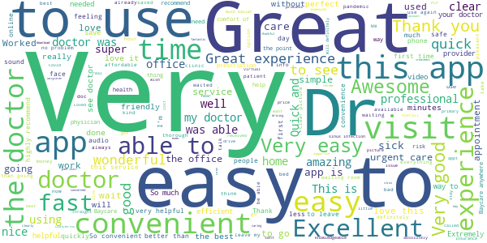

> Great  :date: __2021-07-29 19:49:16__

> Great connection and easy to install.  :date: __2021-07-20 19:42:40__

> Dr. Brittany Adam's was amazing! It was short n sweet no fluff straight to the point! Every doctors visit should be this seamless! Thank you for resolving my pain.  :date: __2021-07-18 15:22:17__

> Love this app. So convenient from the comfort of your own home don't have to worry about going out while you already not feeling good  :date: __2021-07-15 17:29:38__

> This is so convenient and user friendly. The Doctors are the best and really do their best to help. I'm so thankful its available.  :date: __2021-07-08 04:56:25__

> Caring, knowledge. Supportive  :date: __2021-07-05 17:56:12__

> The best telehealth yet. Wonderful doctors!  :date: __2021-07-01 17:50:23__

> I had a very good professional experience  :date: __2021-07-01 00:25:28__

> Overall positive experience. Interruption to vocals periodically.  :date: __2021-06-29 15:57:45__

> App is easy to use.  :date: __2021-06-16 21:16:20__

#### 4-star reviews

> I had very nice people trying to help me set it up. But I was able to have my appointment with my doctor flawless thank you  :date: __2021-01-20 18:46:32__

> Terrible  :date: __2021-01-05 10:48:52__

> Appwould not open all the way would not open all the way  :date: __2020-11-03 21:59:30__

> I really like that we can take pictures and describe problems before being seen. Wish I could have used my Health Plan Credit Card. Wish we could enter our medical problem first and payment before picking a doctor. Also wish I could have entered PCP info first. You ask for their fax number. Who knows their dr's fax number? Why can't they get reports without it? You can see if different doctors are available or have patients waiting. But that can all change by the time we finish entering info  :date: __2020-10-18 02:54:48__

> I gave it four stars due to the loading is very slow not sure if it's the app itself or connection but I do have pretty good internet but a great app overall nice and convenient!  :date: __2020-10-11 19:25:42__

> Lost signal  :date: __2020-06-11 21:23:06__

> Audio was low, although I had on speaker phone and my media level was set at max. Possibly due to physician wearing mask. Video was perfect.  :date: __2020-05-18 17:53:54__

> The app froze at onr point oyherwise ok  :date: __2020-05-11 21:19:37__

> Problem with audio! From both sides..  :date: __2020-05-08 20:41:14__

> It's a good app  :date: __2020-05-07 22:24:14__

#### 3-star reviews

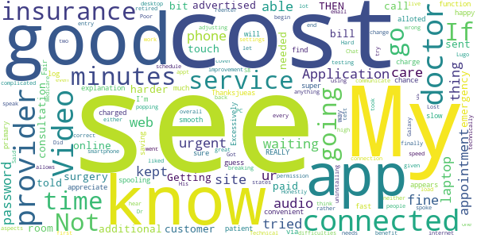

> Getting in touch with customer service is a bit harder than it should be.  :date: __2021-03-11 23:21:27__

> The advertised cost was $59, which I paid before service. My online consultation was 10 minutes where I was told to go to the emergency room (good call, I needed surgery). But THEN I was sent a bill for an additional $16 with no explanation. I just know it wasn't for going over the alloted time. Not happy.  :date: __2021-02-05 22:12:37__

> Where is the cost to the patient? I guess they can charge what ever they can get from the insurance.. If no insurance how much will the cost be.. no way to find out from the app.  :date: __2021-01-13 18:35:02__

> Thanksjueas  :date: __2020-11-15 14:05:32__

> Fair  :date: __2020-09-28 22:54:51__

> Excessively slow log in and spooling, but once connected via video to your provider it's smooth.  :date: __2020-06-03 15:40:46__

> I do REALLY appreciate this Application! Its super fast, very convenient& time saving.. it appears it's only function is appointment with ur primary doctor, or urgent care... I'm also 98% sure that there's a chance you can be charged 60$ just to have the appointment over ur smartphone or desktop 😊  :date: __2020-05-20 21:18:42__

> Video / audio needs improvement.  :date: __2020-04-29 22:13:42__

> Lost a lot of the audio. Video was great.  :date: __2020-04-29 14:47:58__

> Once we were connected it was fine. But be for that I didn't know where to go on web site urgent care Medicare than spoke to some one I was waiting on Dr Lugo once connected every thing went fine. Web site took 5 minutes to load and I have high speed internet.  :date: __2020-04-17 17:36:09__

#### 2-star reviews

> Requiring an app download is pretty rediculous in 2020, particularly for something like tele-medicine. There are several other compliant tele-medicine services that offer full web based experience; it's shocking Baycare doesn't have the capital to invest in a useful platform.  :date: __2020-10-31 14:30:05__

> Doesn't work easily.  :date: __2020-05-12 22:25:50__

> Think you us what tell  :date: __2018-04-13 16:58:20__

#### 1-star reviews

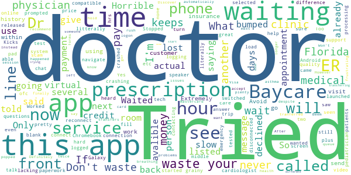

> 🤥  :date: __2021-04-05 18:58:06__

> Kicks me out when logging in  :date: __2021-02-19 15:35:44__

> Keeps crashing now  :date: __2020-10-08 14:35:29__

> grainy, slow and will not use phone speaker when selected.  :date: __2020-07-20 14:09:04__

> Stopped App. Only wanted to talk to cardiologist ofc, not fill out an hour of paperwork  :date: __2020-05-18 16:38:34__

> Too hard to navigate and can't see the questions to answer  :date: __2020-04-30 20:53:41__

> I launched the app and was in the virtual waiting room. When my appointment time came do the app crashed.  :date: __2020-04-28 20:24:15__

> I was litterally in the middle of a video chat with a doctor when it said she lost connection. When I tried to reconnect, I was prompted to pay again.  :date: __2020-04-11 19:33:58__

> Tried for two days and it will not load on my Android phone.  :date: __2020-04-05 01:25:48__

> I have Chromebook and a Galaxy pad and phone none are compatible with this system  :date: __2020-04-03 21:51:22__

