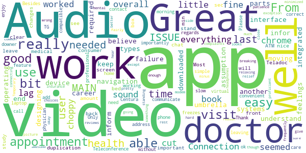

# Centura Health Virtual Care
App version ``12.0.9.000_00``

Analyzed with [covid-apps-observer](http://github.com/covid-apps-observer) project, version ``0.1``

## App overview
| | |
|-------------------------|-------------------------| 
| **Name**&nbsp;&nbsp;&nbsp;&nbsp;&nbsp;&nbsp;&nbsp;&nbsp;&nbsp;&nbsp;&nbsp;&nbsp;&nbsp;&nbsp;&nbsp;&nbsp;&nbsp;&nbsp;&nbsp;&nbsp;&nbsp;&nbsp;&nbsp;&nbsp;&nbsp;&nbsp;&nbsp;&nbsp;&nbsp;&nbsp;&nbsp;&nbsp;&nbsp;&nbsp;&nbsp;&nbsp;&nbsp;&nbsp;&nbsp;&nbsp;  | Centura Health Virtual Care |
| **Unique identifier** | org.centura.android.cura.virtualvisit |
| **Link to Google Play** | [https://play.google.com/store/apps/details?id=org.centura.android.cura.virtualvisit](https://play.google.com/store/apps/details?id=org.centura.android.cura.virtualvisit) |
| **Summary**  | Virtual access to Centura Health physicians anytime, from any place. |
| **Privacy policy** | [https://www.americanwell.com/privacy-policy/](https://www.americanwell.com/privacy-policy/) |
| **Latest version** | 12.0.9.000_00 |
| **Last update** | 2020-03-31 23:44:41 |
| **Recent changes** | We continue to improve the patient experience with these new features: • Performance enhancements to increase reliability and speed |
| **Installs**  | 10,000+ |
| **Category** | Medical |
| **First release** | Feb 1, 2019 |
| **Size**  | 60M |
| **Supported Android version**  | 5.0 and up |

### Description
> Now, there’s an easy way to get care from a board-certified physician, whether it’s in the middle of the night, during the week or over the weekend.  
 When to use virtual care
 Virtual access to Centura Health physicians anytime, from any place.
 Use Centura Health virtual care anytime you have a non-emergency medical condition, are unable to see your primary care physician or when you need convenient care, at an affordable price.
 Connecting to virtual care
 You can start using Centura Health virtual care after you sign up or activate your account – which are completely free.
 Treating common conditions:
 •    Acne
 •    Allergies
 •    Asthma
 •    Bronchitis
 •    Cold & flu
 •    Constipation
 •    Diarrhea
 •    Ear infection
 •    Fever
 •    Headache
 •    Insect bites
 •    Joint aches
 •    Nausea
 •    Pink eye
 •    Rashes
 •    Sinus infections
 •    Sore Throat
 •    Get Started
 You can start using Centura Health virtual care after you sign up or activate your account – which are completely free.

### User interface
The developers of the app provide the following screenshots in the Google play store.
| | | |
|:-------------------------:|:-------------------------:|:-------------------------:|
 |   |   |   | 
 |   |   |   | 
 |   |   |   | 
 |   |   |   | 

## Development team
In the following we report the main information provided by the development team in the Google play store.

| | |
|-------------------------|-------------------------|
| **Developer**  | Centura Health Colorado |
| **Website**  | - |
| **Email** | scottraymondcentura@gmail.com |
| **Physical address**  | - |
| **Other developed apps**  | [https://play.google.com/store/apps/developer?id=Centura+Health+Colorado](https://play.google.com/store/apps/developer?id=Centura+Health+Colorado) |

## Android support

| | |
|-------------------------|-------------------------|
| **Declared target Android version**  | Pie, version 9 (API level 28) |
| **Effective target Android version**  | Pie, version 9 (API level 28) |
| **Minimum supported Android version**  | Lollipop, version 5.0 (API level 21) |
| **Maximum target Android version**  | - |

The larger the difference between the minimum and maximum supported Android versions, the better. A larger difference means a wider audience. For example, old phones have a very low Android version, so a high minimum supported Android version means that the app cannot be used by users with old phones, thus leading to accessibility problems. 

## Requested permissions

In the following we report the complete list of the permissions requested by the app. 

| **Permission** | **Protection level** | **Description** | 
|-------------------------|-------------------------|-------------------------|
 **android.permission ACCESS_COARSE_LOCATION** | :warning:**Dangerous** | Allows an app to access approximate location. 
 **android.permission ACCESS_FINE_LOCATION** | :warning:**Dangerous** | Allows an app to access precise location. 
 **android.permission ACCESS_LOCATION_EXTRA_COMMANDS** | Normal | Allows an application to access extra location provider commands. 
 **android.permission ACCESS_NETWORK_STATE** | Normal | Allows applications to access information about networks. 
 **android.permission ACCESS_WIFI_STATE** | Normal | Allows applications to access information about Wi-Fi networks. 
 **android.permission BLUETOOTH** | Normal | Allows applications to connect to paired bluetooth devices. 
 **android.permission BROADCAST_STICKY** | Normal | Allows an application to broadcast sticky intents. 
 **android.permission CALL_PHONE** | :warning:**Dangerous** | Allows an application to initiate a phone call without going through the Dialer user interface for the user to confirm the call. 
 **android.permission CAMERA** | :warning:**Dangerous** | Required to be able to access the camera device. 
 **android.permission GET_TASKS** | Deprecated | This constant was deprecated in API level 21. No longer enforced. 
 **android.permission INTERNET** | Normal | Allows applications to open network sockets. 
 **android.permission MODIFY_AUDIO_SETTINGS** | Normal | Allows an application to modify global audio settings. 
 **android.permission READ_EXTERNAL_STORAGE** | :warning:**Dangerous** | Allows an application to read from external storage. 
 **android.permission READ_PHONE_STATE** | :warning:**Dangerous** | Allows read only access to phone state, including the phone number of the device, current cellular network information, the status of any ongoing calls, and a list of any PhoneAccounts registered on the device. 
 **android.permission RECORD_AUDIO** | :warning:**Dangerous** | Allows an application to record audio. 
 **android.permission REORDER_TASKS** | Normal | Allows an application to change the Z-order of tasks. 
 **android.permission SYSTEM_ALERT_WINDOW** | Signature - preinstalled - appop - pre23 - development | Allows an app to create windows using the type WindowManager.LayoutParams.TYPE_APPLICATION_OVERLAY, shown on top of all other apps. 
 **android.permission VIBRATE** | Normal | Allows access to the vibrator. 
 **android.permission WAKE_LOCK** | Normal | Allows using PowerManager WakeLocks to keep processor from sleeping or screen from dimming. 
 **android.permission WRITE_EXTERNAL_STORAGE** | :warning:**Dangerous** | Allows an application to write to external storage. 
 **com.facebook.katana.provider ACCESS** | - | - 
 **com.google.android.c2dm.permission RECEIVE** | - | - 
 **com.google.android.finsky.permission BIND_GET_INSTALL_REFERRER_SERVICE** | - | - 
 **org.centura.android.cura.virtualvisit.permission C2D_MESSAGE** | - | - 

## Mentioned servers

| **Server** | **Registrant** | **Registrant country** | **Creation date** | 
|-------------------------|-------------------------|-------------------------|-------------------------|
 | amwell.com | American Well Corporation | :us: US | 2004-02-13 19:02:32 |
 | facebook.com | Facebook, Inc. | :us: US | 1997-03-29 05:00:00 |
 | doubleclick.net | Google Inc. | :us: US | 1996-01-16 05:00:00 |
 | googleadservices.com | Google LLC | :us: US | 2003-06-19 16:34:53 |
 | google.com | Google LLC | :us: US | 1997-09-15 04:00:00 |
 | googlesyndication.com | Google LLC | :us: US | 2003-01-21 06:17:24 |
 | googleapis.com | Google LLC | :us: US | 2005-01-25 17:52:26 |
 | google-analytics.com | Google LLC | :us: US | 2005-07-18 19:24:32 |
 | app-measurement.com | Google LLC | :us: US | 2015-06-19 20:13:31 |
 | appboy.com | Braze, Inc. | :us: US | 2008-10-06 23:28:32 |
 | braze.com | Braze, Inc. | :us: US | 2000-01-19 02:18:28 |
 | twitter.com | Twitter, Inc. | :us: US | 2000-01-21 16:28:17 |
 | crashlytics.com | Google LLC | :us: US | 2011-01-21 15:30:40 |
 | gstatic.com | Google LLC | :us: US | 2008-02-11 15:31:25 |
 | ggpht.com | Google LLC | :us: US | 2008-01-16 18:55:33 |

## Security analysis 

Below we report the main security warnings raised by our execution of the [Androwarn](https://github.com/maaaaz/androwarn) security analysis tool.

**Telephony identifiers leakage**
> - This application reads the ISO country code equivalent for the SIM provider's country code 
> - This application reads the ISO country code equivalent of the current registered operator's MCC (Mobile Country Code) 
> - This application reads the device phone type value 
> - This application reads the numeric name (MCC+MNC) of current registered operator 
> - This application reads the operator name 
> - This application reads the phone's current state 
> - This application reads the radio technology (network type) currently in use on the device for data transmission 

**Connection interfaces exfiltration**
> - This application reads details about the currently active data network 
> - This application tries to find out if the currently active data network is metered 

**Telephony services abuse**
> - This application makes phone calls 

**Audio video eavesdropping**
> - This application captures video from the 'CAMERA' source 

**Suspicious connection establishment**
> - This application opens a Socket and connects it to the remote address '' on the 'N/A' port  
> - This application opens a Socket and connects it to the remote address 'Ljava/lang/StringBuilder;->toString()Ljava/lang/String;' on the 'N/A' port  
> - This application opens a Socket and connects it to the remote address 'Ljava/net/Proxy;->type()Ljava/net/Proxy$Type;' on the 'N/A' port  
> - This application opens a Socket and connects it to the remote address 'timeout' on the 'N/A' port  

**Code execution**
> - This application loads a native library 
> - This application loads a native library: 'VidyoClientApp' 
> - This application loads a native library: 'ndkVideoClient' 
> - This application executes a UNIX command containing this argument: '2' 

## User ratings and reviews

Below we provide information about how end users are reacting to the app in terms of ratings and reviews in the Google Play store.

### Ratings

The Centura Health Virtual Care app has been installed by more than **10000** times. At this time, **324** rated the app and its average score is **4.7809525**. Below we show the distribution of the ratings across the usual star-based rating of Google Play

:star::star::star::star::star:: 269

:star::star::star::star:: 40

:star::star::star:: 15

:star::star:: 0

:star:: 0

### Reviews 

#### 5-star reviews

> Always good to visit with the doctor. I like the fact he try's to keep me accountable. I also like that he don't think a pill is the cure all, he always has a natural healthier alternative. Thanks doctor will talk again in a month.  :date: __2021-02-19 00:04:46__

> It was great! It's very difficult for me to get out, especially in the snow, so this made seeing my healthcare provider much easier. I also live up in the mountains which makes it hard to reach providers in Colorado Springs or Woodland Park. Having this option will make it easier to keep appointments and avoid canceling or rescheduling appointments.  :date: __2021-02-18 23:30:48__

> Excellent!  :date: __2021-01-07 20:17:58__

> Easy to communicate  :date: __2021-01-05 22:01:46__

> Clear screen, clear voice, love this new way of Doctors visits.  :date: __2020-12-10 22:08:22__

> System works without a hitch! I have had zero problems on my smartphone! Actually come to like virtual visits. I don't have to leave home, I save time and fuel!  :date: __2020-12-01 19:06:22__

> Very easy set up and great video and audio.  :date: __2020-11-16 22:21:32__

> Live this app. Very easy to use and helpful. Safe  :date: __2020-11-06 18:13:37__

> AWESOME..GREAT SERVICE PROVIDED FOR HIS PATIENTS!!!  :date: __2020-10-22 19:36:47__

> Great  :date: __2020-10-20 19:45:17__

#### 4-star reviews

> I believe you have a very good interface and navigation. THE MAIN ISSUE: I did not understand that another app needed to be downloaded. My assumption in designing these types of umbrella apps in my career is how to inform the users. From device, operating systems, connections, infor. required, all these moving parts integrated to keep the end user's from feelings of failure, duplication, last min. changes. I did a study the amount of time a consumer will stand in front of an ATM 7.3 sec or leave  :date: __2020-11-19 01:09:43__

> Teladoc works as well as any other video chat app. Get in get out get back to bed.  :date: __2020-11-11 16:47:20__

> Great Audio, but I could not see my doctor in the video box for my appointment? It would of been nice to have a clear audio and video screen of my doctor for my medical appointments which are very important to my health and well-being. Most importantly, my doctor was able to communicate with me and address everything in regards to my Teleconference appointment this morning. Thank you- TG  :date: __2020-08-05 17:34:59__

> Great! Easy to use with a little lag time  :date: __2020-08-03 21:47:51__

> It is ok APP if you need a virtual visit with your doctor who is working for Centura Health.  :date: __2020-07-09 21:41:29__

> Very professional but really seemed to care about MY issues  :date: __2020-07-01 22:33:58__

> Video freezes, slow to correct  :date: __2020-07-01 17:52:34__

> Please add feature so that you can use your phone while on video call other then that the app is simple and easy!  :date: __2020-06-30 21:59:14__

> This app is very convenient, and I really enjoy being able to get in contact with my physician without leaving my home. Only downer is that its not compatible with chrome books. I would like to be able to use it on the chrome book, as it's my main 'laptop's. Besides that, I have no complaints.  :date: __2020-06-19 22:51:18__

> Fairly well minus this last visit my side of the video was not connecting a picture.  :date: __2020-05-21 18:26:24__

#### 3-star reviews

> Very survey heavy. One can't just talk to their Doctor, they have to jump through hoops first.  :date: __2020-08-24 23:14:05__

> Disconnected twice while in "Waiting Room." Very frustrating for me to have to go back through the whole process of registering for the visit - does the system save my responses when I registered for this appt the first time? WHY, OH WHY do I have to listen to "Katy" tell me how awesome telehealth is. AGAIN?!? Throws off the doctor's schedule while I am logging back in AGAIN and AGAIN to get to the visit. And the screens I see say the doctor canceled my visit. She didn't. This app did.  :date: __2020-08-10 19:32:34__

> Worked fine once I got it working, but the doctor's office had a lot of trouble registering me and getting me the initial email  :date: __2020-07-08 00:29:04__

> There was a lot of feedback on the audio.  :date: __2020-05-29 19:41:40__

> Audio kept cutting in and out. Otherwise easy to use. Got the job done  :date: __2020-05-19 00:26:01__

#### 2-star reviews

No recent reviews available with 2 stars.

#### 1-star reviews

> I've concluded, in an educated way, that 50% of computer programmers are incapable. High paid incompetents at that. Their projects are, essentially, infinite do-loops with no escape. This Virtual Care is a classic example as during a medical PANDEMIC such a medical app should receive the attention of the best of the best, but NO, it is not. Worst of the worst?? What a tragedy. PLEASE find another company to take on completing this app and don't pay for this, heretofore, piece of garbage.  :date: __2020-04-28 15:15:39__

> Terrible and not user friendly!  :date: __2020-04-14 08:09:04__

> This is not working on my phone.  :date: __2020-03-31 17:51:09__

> Help desk very very slow  :date: __2020-03-26 23:53:27__

