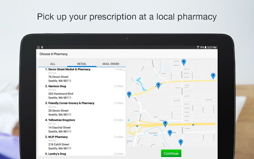
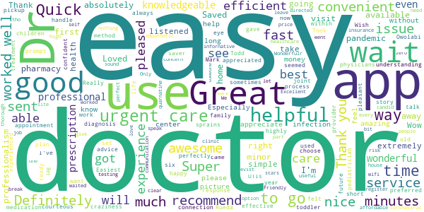
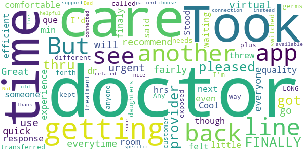
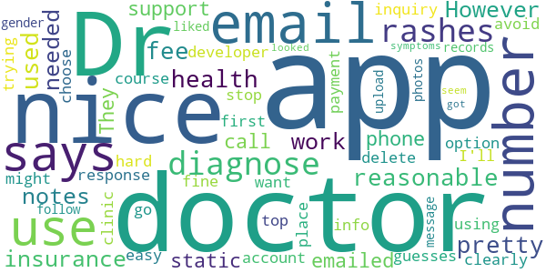
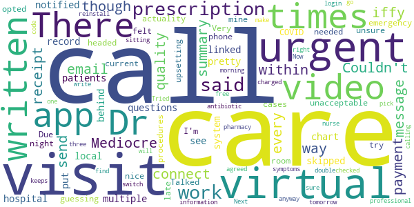
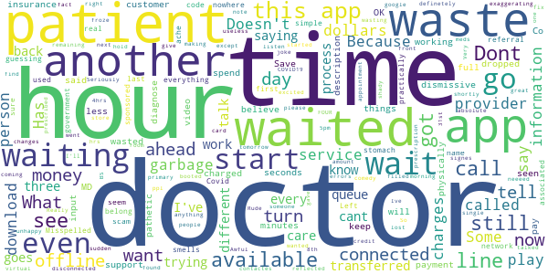

# Virtual Care Anywhere
App version ``12.0.19.010_02``

Analyzed with [covid-apps-observer](http://github.com/covid-apps-observer) project, version ``0.1``

## App overview
| | |
|-------------------------|-------------------------| 
| **Name**                                          | Virtual Care Anywhere |
| **Unique identifier** | org.chifranciscan.android.chih.virtualcare |
| **Link to Google Play** | [https://play.google.com/store/apps/details?id=org.chifranciscan.android.chih.virtualcare](https://play.google.com/store/apps/details?id=org.chifranciscan.android.chih.virtualcare) |
| **Summary**  | Virtual Care Anywhere provides 24/7 care – no appointment needed. |
| **Privacy policy** | [https://www.americanwell.com/privacy-policy/](https://www.americanwell.com/privacy-policy/) |
| **Latest version** | 12.0.19.010_02 |
| **Last update** | 2021-02-26 01:35:21 |
| **Recent changes** | We continue to improve the patient experience with these new features: • Performance enhancements to increase reliability and speed |
| **Installs**  | 10,000+ |
| **Category** | Health & Fitness |
| **First release** | Apr 24, 2019 |
| **Size**  | 52M |
| **Supported Android version**  | 5.0 and up |

### Description
> HEALTHCARE, RIGHT AT YOUR FINGERTIPS
 The Virtual Care Anywhere app brings the doctor visit to you – when and where you need it. Within 30 minutes of requesting care, you’ll be speaking with a board-certified doctor or registered nurse practitioner.
 Our team of board-certified doctors and nurse practitioners are available 24/7 to provide consultations, diagnoses, and treatment via video chat or phone. No appointment is needed. Our team can also call prescriptions (those that are deemed clinically appropriate) into your local pharmacy. 
 Use Virtual Care Anywhere for common conditions, such as:
 •	Cold and flu
 •	Pink eye
 •	Rash
 •	Stomach flu
 •	Allergies
 •	Back pain
 •	Urinary tract infections in adult women
 FREQUENTLY ASKED QUESTIONS
 1. What does it cost?
 Each Virtual Care Anywhere visit costs a flat fee of $35, always. There are no hidden or added charges. At the beginning of your visit, the provider will determine whether your health concern is appropriate for virtual urgent care. If it’s not, you will not be charged for the visit.
 2. Will insurance cover my visit?
 Most insurance plans do not cover virtual health services at this time, and we cannot guarantee reimbursement. However, a Virtual Care Anywhere visit is a qualified medical expense and you can typically use your HSA or FSA account to pay for it. An invoice that you can submit to your insurance plan for reimbursement will be available through the web portal for your Virtual Care Anywhere account after each visit. 
 3. How does a virtual visit with Virtual Care Anywhere work?
 You will meet with one of our medical providers via phone or video chat. You can request a video chat through the mobile app, via our website, or by calling our toll-free number.
 Our website requires that JavaScript and cookies be enabled. If you are unable to access the website or experience technical difficulties, please call our patient concierge team at (855) 356-8053.
 4. Who is eligible?
 Virtual Care Anywhere is available to people of all ages, across the United States. Virtual visits are not available to those covered under a federal insurance program such as Medicare, Medicare Advantage, Medicaid, or Tricare, unless you are specifically set up by your insurance plan administrator.
 5. Will my primary care provider receive my visit summary?
 After every virtual visit, the Virtual Care Anywhere provider will write a personalized visit summary that outlines the visit, treatment recommendations and outcomes. You can choose whether to share it (or not) with your primary care provider at the close of the visit. This visit summary is accessible at any time from your Virtual Care Anywhere account page.

### User interface
The developers of the app provide the following screenshots in the Google play store.
| | | |
|:-------------------------:|:-------------------------:|:-------------------------:|
 |   |   |   | 
 |   |   |   | 
 |   |   |   | 
 |   |   |   | 
 |   |   |   | 

## Development team
In the following we report the main information provided by the development team in the Google play store.

| | |
|-------------------------|-------------------------|
| **Developer**  | CHI Franciscan Health |
| **Website**  | [http://www.chifranciscan.org](http://www.chifranciscan.org) |
| **Email** | socialmediafhs@fhshealth.org |
| **Physical address**  | - |
| **Other developed apps**  | [https://play.google.com/store/apps/developer?id=CHI+Franciscan+Health](https://play.google.com/store/apps/developer?id=CHI+Franciscan+Health) |

## Android support

| | |
|-------------------------|-------------------------|
| **Declared target Android version**  | Android10, version 10 (API level 29) |
| **Effective target Android version**  | Android10, version 10 (API level 29) |
| **Minimum supported Android version**  | Lollipop, version 5.0 (API level 21) |
| **Maximum target Android version**  | - |

The larger the difference between the minimum and maximum supported Android versions, the better. A larger difference means a wider audience. For example, old phones have a very low Android version, so a high minimum supported Android version means that the app cannot be used by users with old phones, thus leading to accessibility problems. 

## Requested permissions

In the following we report the complete list of the permissions requested by the app. 

| **Permission** | **Protection level** | **Description** | 
|-------------------------|-------------------------|-------------------------|
 **android.permission ACCESS_COARSE_LOCATION** | :warning:**Dangerous** | Allows an app to access approximate location. 
 **android.permission ACCESS_FINE_LOCATION** | :warning:**Dangerous** | Allows an app to access precise location. 
 **android.permission ACCESS_LOCATION_EXTRA_COMMANDS** | Normal | Allows an application to access extra location provider commands. 
 **android.permission ACCESS_NETWORK_STATE** | Normal | Allows applications to access information about networks. 
 **android.permission ACCESS_WIFI_STATE** | Normal | Allows applications to access information about Wi-Fi networks. 
 **android.permission BLUETOOTH** | Normal | Allows applications to connect to paired bluetooth devices. 
 **android.permission BROADCAST_STICKY** | Normal | Allows an application to broadcast sticky intents. 
 **android.permission CAMERA** | :warning:**Dangerous** | Required to be able to access the camera device. 
 **android.permission GET_TASKS** | Deprecated | This constant was deprecated in API level 21. No longer enforced. 
 **android.permission INTERNET** | Normal | Allows applications to open network sockets. 
 **android.permission MODIFY_AUDIO_SETTINGS** | Normal | Allows an application to modify global audio settings. 
 **android.permission READ_EXTERNAL_STORAGE** | :warning:**Dangerous** | Allows an application to read from external storage. 
 **android.permission READ_PHONE_STATE** | :warning:**Dangerous** | Allows read only access to phone state, including the phone number of the device, current cellular network information, the status of any ongoing calls, and a list of any PhoneAccounts registered on the device. 
 **android.permission RECEIVE_BOOT_COMPLETED** | Normal | Allows an application to receive the Intent.ACTION_BOOT_COMPLETED that is broadcast after the system finishes booting. 
 **android.permission RECORD_AUDIO** | :warning:**Dangerous** | Allows an application to record audio. 
 **android.permission REORDER_TASKS** | Normal | Allows an application to change the Z-order of tasks. 
 **android.permission SYSTEM_ALERT_WINDOW** | Signature - preinstalled - appop - pre23 - development | Allows an app to create windows using the type WindowManager.LayoutParams.TYPE_APPLICATION_OVERLAY, shown on top of all other apps. 
 **android.permission USE_BIOMETRIC** | Normal | Allows an app to use device supported biometric modalities. 
 **android.permission USE_FINGERPRINT** | Normal | This constant was deprecated in API level 28. Applications should request USE_BIOMETRIC instead 
 **android.permission VIBRATE** | Normal | Allows access to the vibrator. 
 **android.permission WAKE_LOCK** | Normal | Allows using PowerManager WakeLocks to keep processor from sleeping or screen from dimming. 
 **android.permission WRITE_EXTERNAL_STORAGE** | :warning:**Dangerous** | Allows an application to write to external storage. 
 **com.facebook.katana.provider ACCESS** | - | - 
 **com.google.android.c2dm.permission RECEIVE** | - | - 
 **com.google.android.finsky.permission BIND_GET_INSTALL_REFERRER_SERVICE** | - | - 
 **org.chifranciscan.android.chih.virtualcare.permission C2D_MESSAGE** | - | - 

## Mentioned servers

| **Server** | **Registrant** | **Registrant country** | **Creation date** | 
|-------------------------|-------------------------|-------------------------|-------------------------|
 | amwell.com | American Well Corporation | :us: US | 2004-02-13 19:02:32 |
 | facebook.com | Facebook, Inc. | :us: US | 1997-03-29 05:00:00 |
 | doubleclick.net | Google Inc. | :us: US | 1996-01-16 05:00:00 |
 | googleadservices.com | Google LLC | :us: US | 2003-06-19 16:34:53 |
 | google.com | Google LLC | :us: US | 1997-09-15 04:00:00 |
 | googlesyndication.com | Google LLC | :us: US | 2003-01-21 06:17:24 |
 | google-analytics.com | Google LLC | :us: US | 2005-07-18 19:24:32 |
 | app-measurement.com | Google LLC | :us: US | 2015-06-19 20:13:31 |
 | appboy.com | Braze, Inc. | :us: US | 2008-10-06 23:28:32 |
 | braze.com | Braze, Inc. | :us: US | 2000-01-19 02:18:28 |
 | optimizely.com | Optimizely | :us: US | 2010-01-11 03:01:32 |
 | twitter.com | Twitter, Inc. | :us: US | 2000-01-21 16:28:17 |
 | branch.io | Branch | :us: US | 2011-11-10 13:52:13 |
 | gstatic.com | Google LLC | :us: US | 2008-02-11 15:31:25 |
 | crashlytics.com | Google LLC | :us: US | 2011-01-21 15:30:40 |
 | bnc.lt | - | - | 2016-11-14 00:00:00 |
 | ggpht.com | Google LLC | :us: US | 2008-01-16 18:55:33 |

## Security analysis 

Below we report the main security warnings raised by our execution of the [Androwarn](https://github.com/maaaaz/androwarn) security analysis tool.

**Telephony identifiers leakage**
> - This application reads the ISO country code equivalent for the SIM provider's country code 
> - This application reads the ISO country code equivalent of the current registered operator's MCC (Mobile Country Code) 
> - This application reads the MCC+MNC of the provider of the SIM 
> - This application reads the device phone type value 
> - This application reads the numeric name (MCC+MNC) of current registered operator 
> - This application reads the operator name 
> - This application reads the phone's current state 
> - This application reads the radio technology (network type) currently in use on the device for data transmission 

**Connection interfaces exfiltration**
> - This application reads details about the currently active data network 
> - This application tries to find out if the currently active data network is metered 

**Telephony services abuse**
> - This application makes phone calls 

**Audio video eavesdropping**
> - This application captures video from the 'CAMERA' source 

**Suspicious connection establishment**
> - This application opens a Socket and connects it to the remote address ' returned no addresses for  ; port is out of range' on the 'N/A' port  
> - This application opens a Socket and connects it to the remote address '' on the 'N/A' port  
> - This application opens a Socket and connects it to the remote address 'Ljava/net/Proxy;->type()Ljava/net/Proxy$Type;' on the 'N/A' port  
> - This application opens a Socket and connects it to the remote address 'timeout' on the 'N/A' port  

**Code execution**
> - This application loads a native library 
> - This application executes a UNIX command containing this argument: '2' 

## User ratings and reviews

Below we provide information about how end users are reacting to the app in terms of ratings and reviews in the Google Play store.

### Ratings

The Virtual Care Anywhere app has been installed by more than **10000** times. At this time, **161** rated the app and its average score is **4.3301888**. Below we show the distribution of the ratings across the usual star-based rating of Google Play

:star::star::star::star::star:: 123

:star::star::star::star:: 12

:star::star::star:: 3

:star::star:: 7

:star:: 16

### Reviews 

#### 5-star reviews

> I've used this like six times now and it is absolutely the way to go. from UTIs to eye infections to joint sprains we've had it all with me and my family so they handle it perfectly  :date: __2021-03-25 02:22:15__

> I'm here not able to see my doctors  :date: __2021-01-29 20:12:11__

> Got an appointment right away. With pictures I sent of my issue, diagnosis was easy for the doctor, and prescriptions were sent to my preferred pharmacy.  :date: __2021-01-21 01:50:25__

> Good first experience, good Dr!  :date: __2021-01-20 02:09:22__

> Quick and nice physicians! Definitely the way to go in a pandemic.  :date: __2021-01-02 20:39:49__

> I had a good experience, my wait time was very short and I appreciated my doctors professionalism.  :date: __2020-10-11 16:32:44__

> Loved the app.  :date: __2020-10-06 09:28:10__

> Was able to talk to a doctor about a minor issue while at work and my medication was ready for me to pickup on my way home! Saved me SO MUCH time.  :date: __2020-10-05 19:38:27__

> Easiest doctors visit ever! Wish they'd always had this available.  :date: __2020-10-03 21:16:33__

> Easy and fast!!!!  :date: __2020-09-04 04:01:28__

#### 4-star reviews

> I won't go back to the urgent care I will use this app virtual care everytime and I would recommend this to everyone.  :date: __2020-10-08 03:45:05__

> Great doctor and fairly quick response. I felt comfortable with the quality and care.  :date: __2020-07-19 17:03:14__

> Took a little while to see someone even though it said I was next in line. It threw me into another doctors que after I'd been waiting in another room for 10 min.  :date: __2020-07-14 15:50:19__

> Cool efficient experience.  :date: __2020-04-26 11:35:23__

> Took about 2 hrs to see a dr. But was very pleased when I finaly got thru. Stood in line 3 times and was transferred to a different on each time. Any way my daughters getting the treatment she needs with out getting exposed to anyone else's germs I'm pleased.  :date: __2020-03-28 20:21:32__

> It took me a LONG time to FINALLY get thru plus i kept getting switched back and forth from doctor to doctor but then I called customer support and was told to "choose a specific provider" instead of "first available provider." When I finally got connected to a doctor, he was a very nice, patient, and helpful doctor. Thank you 😊  :date: __2020-03-23 02:47:06__

> Bad connection. Not sure if it's app related  :date: __2020-03-17 07:23:34__

#### 3-star reviews

> The Dr's on here are pretty nice and the fee is reasonable at only $30. I used this when I didn't have health insurance and needed Dr's notes for my work. However, this app has no support email or phone number. They have a "number" but when you call its just static. I emailed the developer email when I had an inquiry, and there was no response. On top of that, there's no option to delete your account or your payment info, if you want to stop using the app.  :date: __2020-06-19 18:40:42__

> The app clearly says you can use it to diagnose rashes but of course the doctor then says it's hard to diagnose rashes through the app and then guesses what it might be. I'll have to go in to a clinic which I was trying to avoid in the first place. The app is fine and easy to use. It would be nice if you could choose the gender of the doctor. I like the follow up message for my records. I liked that I could upload photos of my symptoms but the doctor I got didn't seem to have looked at them.  :date: __2019-10-30 15:06:21__

#### 2-star reviews

> Mediocre. Couldn't connect video, though every other video call app works for me. Call quality was iffy. There's no written summary of my visit?! No email. No receipt for my payment. No way to send a message within the app with questions. My local hospital system is linked to this and my virtual chart there has no record of my "visit".  :date: __2020-07-17 18:27:19__

> I was skipped over multiple times and put behind other patients after I had been notified the Dr was about to see me. This is pretty unacceptable. I'm guessing they felt other cases were more urgent than mine, when in actuality I needed to be headed for the emergency room. Very upsetting.  :date: __2020-06-25 06:42:22__

> Due to being late at night and unsure of current urgent care procedures for COVID opted to try Virtual Care. Talked on the phone to nice professional, who agreed with me on symptoms, will write a prescription for antibiotic and i can pick up tomorrow. Next morning i go to my pharmacy ( double checked to make sure it was the right one) they said no prescription was written. Tried calling on call nurse who said call virtual care and get charged again. Now sitting in urgent care anyway.  :date: __2020-05-23 22:48:25__

> free visit code doesn't work. can't find my login information. keeps switch Dr.'s  :date: __2020-05-02 02:41:48__

> Had too reinstall three times  :date: __2020-03-25 06:29:19__

#### 1-star reviews

> The app works OK. I just can't believe I got charged $35 for a dismissive MD to spend less than 90 seconds to tell me to keep doing the same things that aren't working.  :date: __2020-10-06 21:19:01__

> Waste of money video dropped and $35 for them to tell me I have to go in and be seen. And that will be another Co payment!  :date: __2020-09-26 18:02:54__

> App is garbage. Has NO customer service support, a pathetic description of services and no where to input insurance information  :date: __2020-08-24 13:53:43__

> I wouldn't get connected for 2 full calls. Waited for 40 minutes for both calls. They said that they couldn't even diagnose me and that I still had to physically go to a provider. I wasted 35 dollars and now I have to go in and pay another 60 dollars. Save your money they like to say everything is associated to Covid. A simple stomach ache.  :date: __2020-07-04 05:42:02__

> This smells scam. Doesn't seem to belong to any network. Not even sure it was a real doctor who called me. Misspelled both my last and the first name on the referral to practically nowhere. Left me guessing "What was it?" I used the government sponsored code, definetely wouldn't give them my credit card. Some shady money making app.  :date: __2020-06-23 21:19:00__

> I just waited, not even exaggerating, FOUR HOURS!! Because I neeeed to see a doctor and get into one in person. After 4 hours and wasting most of my day I excited out just for me to see the doctor I was waiting on was still available. Very unhappy!!!!!  :date: __2020-04-28 00:56:15__

> Doctor didn't listen to me and his note reflected that.😒  :date: __2020-04-13 18:47:20__

> This was useless.  :date: __2020-04-01 20:42:12__

> I was disconnected right at 5pm after waiting in line. Then it wanted me to start over. So Rude!!! I do not want any charges for this app or appointment. 3.31.20 i just do not want any charges 4 this app coming out of my google play where i had 2 download.  :date: __2020-04-01 03:31:06__

> I started with 18 patients waiting that was for 4hrs, and when I was my turn, It transferred me to another doctor for a 53 patients wait. That's BS!!!!!  :date: __2020-03-30 09:48:03__

