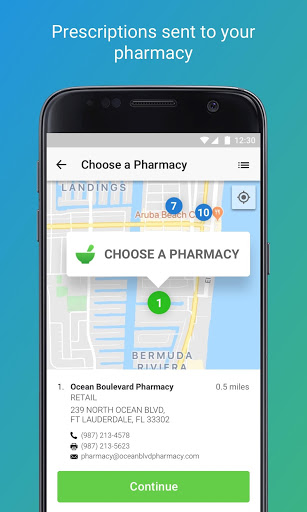
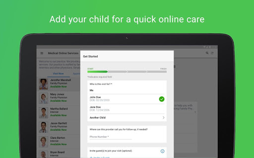
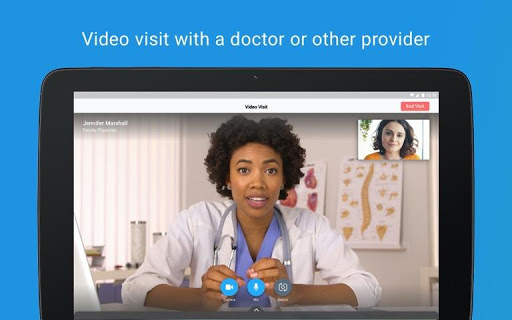

# Nuvance Health Virtual Visits
App version ``12.0.19.010_02``

Analyzed with [covid-apps-observer](http://github.com/covid-apps-observer) project, version ``0.1``

## App overview
| | |
|-------------------------|-------------------------| 
| **Name**&nbsp;&nbsp;&nbsp;&nbsp;&nbsp;&nbsp;&nbsp;&nbsp;&nbsp;&nbsp;&nbsp;&nbsp;&nbsp;&nbsp;&nbsp;&nbsp;&nbsp;&nbsp;&nbsp;&nbsp;&nbsp;&nbsp;&nbsp;&nbsp;&nbsp;&nbsp;&nbsp;&nbsp;&nbsp;&nbsp;&nbsp;&nbsp;&nbsp;&nbsp;&nbsp;&nbsp;&nbsp;&nbsp;&nbsp;&nbsp;  | Nuvance Health Virtual Visits |
| **Unique identifier** | org.healthquest.android.hqst.healtheconnect |
| **Link to Google Play** | [https://play.google.com/store/apps/details?id=org.healthquest.android.hqst.healtheconnect](https://play.google.com/store/apps/details?id=org.healthquest.android.hqst.healtheconnect) |
| **Summary**  | Connect immediately to your HQMP provider for a healthcare visit. |
| **Privacy policy** | [https://www.americanwell.com/privacy-policy/](https://www.americanwell.com/privacy-policy/) |
| **Latest version** | 12.0.19.010_02 |
| **Last update** | 2021-02-02 18:11:34 |
| **Recent changes** | We continue to improve the patient experience with these new features: • Performance enhancements to increase reliability and speed |
| **Installs**  | 10,000+ |
| **Category** | Medical |
| **First release** | Sep 18, 2018 |
| **Size**  | 52M |
| **Supported Android version**  | 5.0 and up |

### Description
> Get care from anywhere with a Virtual Visit. Connect with your trusted Nuvance Health clinician from your mobile device or tablet. It’s quick, convenient and secure.
 Within minutes:
 · Have a real-time Virtual Visit with your clinician—discuss diagnosis, treatment, follow-up care and medications
 · Have private, secure access to your clinician and electronic medical record
 We have you covered:
 · Most prescriptions can be sent directly to your pharmacy
 · Many insurance plans cover Nuvance Health Virtual Visits
 Please do not use Virtual Visits for a life-threatening emergency. Visit your nearest emergency room or call 911 if you’re experiencing chest pain, uncontrolled bleeding, severe vomiting, pain or difficulty breathing.

### User interface
The developers of the app provide the following screenshots in the Google play store.
| | | |
|:-------------------------:|:-------------------------:|:-------------------------:|
 |   |   |   | 
 |   |   |   | 
 |   |   |   | 
 |   |   |   | 

## Development team
In the following we report the main information provided by the development team in the Google play store.

| | |
|-------------------------|-------------------------|
| **Developer**  | Health Quest |
| **Website**  | [http://www.healthquest.org](http://www.healthquest.org) |
| **Email** | androiddev@health-quest.org |
| **Physical address**  | - |
| **Other developed apps**  | [https://play.google.com/store/apps/developer?id=Health+Quest](https://play.google.com/store/apps/developer?id=Health+Quest) |

## Android support

| | |
|-------------------------|-------------------------|
| **Declared target Android version**  | Android10, version 10 (API level 29) |
| **Effective target Android version**  | Android10, version 10 (API level 29) |
| **Minimum supported Android version**  | Lollipop, version 5.0 (API level 21) |
| **Maximum target Android version**  | - |

The larger the difference between the minimum and maximum supported Android versions, the better. A larger difference means a wider audience. For example, old phones have a very low Android version, so a high minimum supported Android version means that the app cannot be used by users with old phones, thus leading to accessibility problems. 

## Requested permissions

In the following we report the complete list of the permissions requested by the app. 

| **Permission** | **Protection level** | **Description** | 
|-------------------------|-------------------------|-------------------------|
 **android.permission ACCESS_COARSE_LOCATION** | :warning:**Dangerous** | Allows an app to access approximate location. 
 **android.permission ACCESS_FINE_LOCATION** | :warning:**Dangerous** | Allows an app to access precise location. 
 **android.permission ACCESS_LOCATION_EXTRA_COMMANDS** | Normal | Allows an application to access extra location provider commands. 
 **android.permission ACCESS_NETWORK_STATE** | Normal | Allows applications to access information about networks. 
 **android.permission ACCESS_WIFI_STATE** | Normal | Allows applications to access information about Wi-Fi networks. 
 **android.permission BLUETOOTH** | Normal | Allows applications to connect to paired bluetooth devices. 
 **android.permission BROADCAST_STICKY** | Normal | Allows an application to broadcast sticky intents. 
 **android.permission CAMERA** | :warning:**Dangerous** | Required to be able to access the camera device. 
 **android.permission GET_TASKS** | Deprecated | This constant was deprecated in API level 21. No longer enforced. 
 **android.permission INTERNET** | Normal | Allows applications to open network sockets. 
 **android.permission MODIFY_AUDIO_SETTINGS** | Normal | Allows an application to modify global audio settings. 
 **android.permission READ_EXTERNAL_STORAGE** | :warning:**Dangerous** | Allows an application to read from external storage. 
 **android.permission READ_PHONE_STATE** | :warning:**Dangerous** | Allows read only access to phone state, including the phone number of the device, current cellular network information, the status of any ongoing calls, and a list of any PhoneAccounts registered on the device. 
 **android.permission RECEIVE_BOOT_COMPLETED** | Normal | Allows an application to receive the Intent.ACTION_BOOT_COMPLETED that is broadcast after the system finishes booting. 
 **android.permission RECORD_AUDIO** | :warning:**Dangerous** | Allows an application to record audio. 
 **android.permission REORDER_TASKS** | Normal | Allows an application to change the Z-order of tasks. 
 **android.permission SYSTEM_ALERT_WINDOW** | Signature - preinstalled - appop - pre23 - development | Allows an app to create windows using the type WindowManager.LayoutParams.TYPE_APPLICATION_OVERLAY, shown on top of all other apps. 
 **android.permission USE_BIOMETRIC** | Normal | Allows an app to use device supported biometric modalities. 
 **android.permission USE_FINGERPRINT** | Normal | This constant was deprecated in API level 28. Applications should request USE_BIOMETRIC instead 
 **android.permission VIBRATE** | Normal | Allows access to the vibrator. 
 **android.permission WAKE_LOCK** | Normal | Allows using PowerManager WakeLocks to keep processor from sleeping or screen from dimming. 
 **android.permission WRITE_EXTERNAL_STORAGE** | :warning:**Dangerous** | Allows an application to write to external storage. 
 **com.facebook.katana.provider ACCESS** | - | - 
 **com.google.android.c2dm.permission RECEIVE** | - | - 
 **com.google.android.finsky.permission BIND_GET_INSTALL_REFERRER_SERVICE** | - | - 
 **org.healthquest.android.hqst.healtheconnect.permission C2D_MESSAGE** | - | - 

## Mentioned servers

| **Server** | **Registrant** | **Registrant country** | **Creation date** | 
|-------------------------|-------------------------|-------------------------|-------------------------|
 | amwell.com | American Well Corporation | :us: US | 2004-02-13 19:02:32 |
 | facebook.com | Facebook, Inc. | :us: US | 1997-03-29 05:00:00 |
 | doubleclick.net | Google Inc. | :us: US | 1996-01-16 05:00:00 |
 | googleadservices.com | Google LLC | :us: US | 2003-06-19 16:34:53 |
 | google.com | Google LLC | :us: US | 1997-09-15 04:00:00 |
 | googlesyndication.com | Google LLC | :us: US | 2003-01-21 06:17:24 |
 | google-analytics.com | Google LLC | :us: US | 2005-07-18 19:24:32 |
 | app-measurement.com | Google LLC | :us: US | 2015-06-19 20:13:31 |
 | appboy.com | Braze, Inc. | :us: US | 2008-10-06 23:28:32 |
 | braze.com | Braze, Inc. | :us: US | 2000-01-19 02:18:28 |
 | optimizely.com | Optimizely | :us: US | 2010-01-11 03:01:32 |
 | twitter.com | Twitter, Inc. | :us: US | 2000-01-21 16:28:17 |
 | branch.io | Branch | :us: US | 2011-11-10 13:52:13 |
 | gstatic.com | Google LLC | :us: US | 2008-02-11 15:31:25 |
 | crashlytics.com | Google LLC | :us: US | 2011-01-21 15:30:40 |
 | bnc.lt | - | - | 2016-11-14 00:00:00 |
 | ggpht.com | Google LLC | :us: US | 2008-01-16 18:55:33 |

## Security analysis 

Below we report the main security warnings raised by our execution of the [Androwarn](https://github.com/maaaaz/androwarn) security analysis tool.

**Telephony identifiers leakage**
> - This application reads the ISO country code equivalent for the SIM provider's country code 
> - This application reads the ISO country code equivalent of the current registered operator's MCC (Mobile Country Code) 
> - This application reads the MCC+MNC of the provider of the SIM 
> - This application reads the device phone type value 
> - This application reads the numeric name (MCC+MNC) of current registered operator 
> - This application reads the operator name 
> - This application reads the phone's current state 
> - This application reads the radio technology (network type) currently in use on the device for data transmission 

**Connection interfaces exfiltration**
> - This application reads details about the currently active data network 
> - This application tries to find out if the currently active data network is metered 

**Telephony services abuse**
> - This application makes phone calls 

**Audio video eavesdropping**
> - This application captures video from the 'CAMERA' source 

**Suspicious connection establishment**
> - This application opens a Socket and connects it to the remote address ' returned no addresses for  ; port is out of range' on the 'N/A' port  
> - This application opens a Socket and connects it to the remote address '' on the 'N/A' port  
> - This application opens a Socket and connects it to the remote address 'Ljava/net/Proxy;->type()Ljava/net/Proxy$Type;' on the 'N/A' port  
> - This application opens a Socket and connects it to the remote address 'timeout' on the 'N/A' port  

**Code execution**
> - This application loads a native library 
> - This application executes a UNIX command containing this argument: '2' 

## User ratings and reviews

Below we provide information about how end users are reacting to the app in terms of ratings and reviews in the Google Play store.

### Ratings

The Nuvance Health Virtual Visits app has been installed by more than **10000** times. At this time, **408** rated the app and its average score is **4.7722774**. Below we show the distribution of the ratings across the usual star-based rating of Google Play

:star::star::star::star::star:: 340

:star::star::star::star:: 56

:star::star::star:: 4

:star::star:: 4

:star:: 4

### Reviews 

#### 5-star reviews

> Real Virtual Doctors!!  :date: __2021-04-23 23:14:48__

> Excellent  :date: __2021-04-21 17:47:56__

> Great app! Makes it so easy to visit with your providers!  :date: __2021-04-13 16:42:11__

> She is an awesome and amazing dr that puts her patients first. She is tough though. Kind of like tough love.  :date: __2021-03-22 15:04:28__

> Very easy very clear. Worked great!  :date: __2021-02-11 17:48:50__

> Getting to love virtual doc appointments! App is easy to use and efficient.  :date: __2021-02-11 17:03:33__

> AMAZING! SO CONVENIENT, especially during a pandemic. FINALLY the world is catching up with what technology can do for us!  :date: __2021-02-02 16:50:06__

> I have had a very good experience so far. Very smooth operating app, and not confusing to use at all.  :date: __2021-02-02 16:07:17__

> Fulfilled.. WIFI READY EVEN THO I USED 4 G. VERY CLEAR AND EASY TO USE.  :date: __2021-01-25 20:43:22__

> Works well, efficient operation all around  :date: __2021-01-21 22:07:29__

#### 4-star reviews

> Good app, still a few glitches but seems better!  :date: __2021-04-07 20:52:26__

> Very good. Voice response from my end not heard by physician all the time.  :date: __2020-12-22 21:50:34__

> Everything was good but i wasn't able to understand him well due to his accent. It had nothing to do with this app. Overall a good experience...  :date: __2020-12-21 18:09:56__

> Needs more instructions to get started but def 1 of the better aps I have dealt with  :date: __2020-12-21 17:07:40__

> The app through nuvance is quite good but the quality of talking or viewing through it seems to depend on the system you are using. It worked excellent on my android galaxy S9, but not at all good on my Acer chrome book but moderately ok on my Lenovo all in one desktop. For overall use its been fine and since multiple of my medical providers use it, the choice is use it or phone call with no video.  :date: __2020-12-11 19:57:20__

> I am not good with computers or applications using computers. At first i didn't know how to install an application at all, but i did it  :date: __2020-11-19 21:23:31__

> Easy.  :date: __2020-11-19 20:05:13__

> Sending an invitation to login 24 hours in advance is silly. When you log in it tells you you're too early.  :date: __2020-05-14 18:43:27__

> Good  :date: __2020-05-12 18:01:38__

> Video was fine audio is choppy but other than that the app is good!!!  :date: __2020-05-04 14:28:05__

#### 3-star reviews

> Connection is spotty...not the best when it comes to that  :date: __2020-05-29 16:55:14__

> The visit was not as good as when i use othet apps. The doctor kept freezing every other second. The visit completely cut off once and the doctor had to reboot. It seemed as though every time she looked at something else on her computer the visit froze. Very annoying. We both kept having to repeat. The visit therefore probably took longer because of this. Also, i had given my medications to the assistant over the phone. But i spent 20 minutes inputing my medications and was late entering t  :date: __2020-05-14 18:09:05__

> I used this for a doctor appointment and the video kept freezing.  :date: __2020-05-12 19:38:34__

> Site kept freezing  :date: __2020-04-23 22:40:26__

> Helpful for time saving and putting miles on your vehicle, however, it is limited on overall diagnostics and care without seeing your provider in person.  :date: __2020-04-03 15:02:47__

#### 2-star reviews

> Choppy. If it were my choice I would find another  :date: __2020-05-22 21:26:06__

> I couldn't get through to my PA  :date: __2020-04-20 21:56:30__

> Works OK once installed but was terable to get it working.  :date: __2020-04-15 19:13:17__

> Wouldn't work on my laptops. Had to use my phone. Camera issues with app on both. And yes, I used the Windows app for them.  :date: __2020-04-10 21:27:45__

> Audio did not work - incredible echo occurred. We had to mute mics and talk via speaker phones. The video was good. I had to sign in twice - not sure why screen was lost first time.  :date: __2020-04-08 21:50:31__

#### 1-star reviews

> extremely hard to install and did not work properly  :date: __2021-03-25 11:06:11__

> Yes I know I have an Android but it's ridiculous I've been trying for an hour and it just circles and will not install on my phone ...my phone is not that old  :date: __2021-01-06 17:17:54__

> Difficult to connect...wifi issues  :date: __2020-06-10 15:45:21__

> Every time I try to login get an error message ~ either wrong email address or password.  :date: __2020-05-18 22:50:58__

> won't work on my Chromebook...  :date: __2020-05-13 10:20:57__

> Took forever to up load app . Took more a few times .  :date: __2020-04-27 21:14:29__

> Keeps tellong me password wrong had ot for long time know my password  :date: __2020-04-16 16:38:38__

> Can I use this on a tablet because it keeps asking for phone permission and there is no Sim card for a phone on this device.  :date: __2020-04-01 01:38:21__

> App or emails will not work with more than one doctor. I needed to have a different email and account for each different health care provider.  :date: __2020-03-27 17:47:56__

