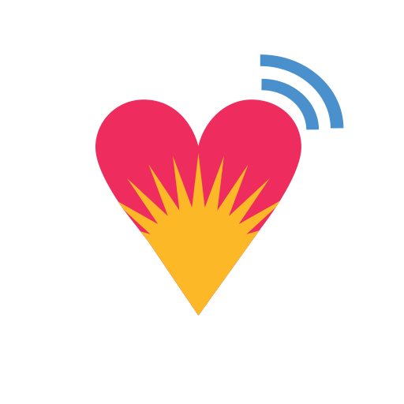
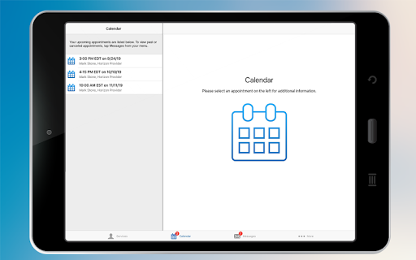
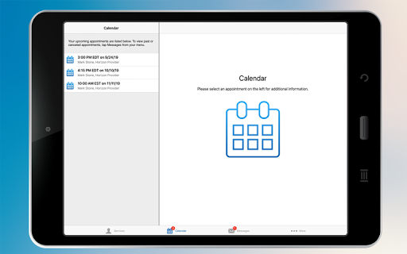
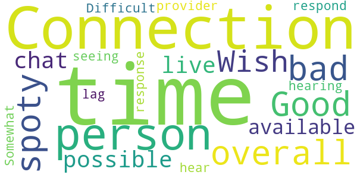

# Horizon Telehealth
App version ``12.0.16.005_01``

Analyzed with [covid-apps-observer](http://github.com/covid-apps-observer) project, version ``0.1``

## App overview
| | |
|-------------------------|-------------------------| 
| **Name**&nbsp;&nbsp;&nbsp;&nbsp;&nbsp;&nbsp;&nbsp;&nbsp;&nbsp;&nbsp;&nbsp;&nbsp;&nbsp;&nbsp;&nbsp;&nbsp;&nbsp;&nbsp;&nbsp;&nbsp;&nbsp;&nbsp;&nbsp;&nbsp;&nbsp;&nbsp;&nbsp;&nbsp;&nbsp;&nbsp;&nbsp;&nbsp;&nbsp;&nbsp;&nbsp;&nbsp;&nbsp;&nbsp;&nbsp;&nbsp;  | Horizon Telehealth |
| **Unique identifier** | org.horizonhealth.android.hzhsh.telehealth |
| **Link to Google Play** | [https://play.google.com/store/apps/details?id=org.horizonhealth.android.hzhsh.telehealth](https://play.google.com/store/apps/details?id=org.horizonhealth.android.hzhsh.telehealth) |
| **Summary**  | Horizon tele - Connect to your treatment team with ease! |
| **Privacy policy** | [https://www.americanwell.com/privacy-policy/](https://www.americanwell.com/privacy-policy/) |
| **Latest version** | 12.0.16.005_01 |
| **Last update** | 2020-10-29 21:21:58 |
| **Recent changes** | We continue to improve the patient experience with these new features: • Performance enhancements to increase reliability and speed |
| **Installs**  | 1,000+ |
| **Category** | Health & Fitness |
| **First release** | Sep 12, 2019 |
| **Size**  | 50M |
| **Supported Android version**  | 5.0 and up |

### Description
> No longer will weather, transportation, wait time or work be a barrier for currently enrolled Horizon Health Services patients to receive care. Horizon tele offers easy to use technology that allows us to bring safe, secure and life-changing treatment directly into people’s homes or any private place they choose to access it. 
 Horizon tele offers mental health and addiction counseling, along with psychiatry services from the use of a phone, tablet, or computer. Our New York State licensed health care professionals are experienced in their field of work and use interactive audio, video and other electronic media for diagnosis, consultation and/or treatment for both therapy and psychiatric services. 
 If you are interested in receiving counseling services from Horizon, please call (716) 831-1800 today for more information. 
 There are many reasons why people choose Horizon tele:
 Convenience: Be seen when and where it works for you without the hassle of taking time off from work or sitting in waiting rooms. Our team has appointments throughout the week, including evening appointments to accommodate your schedule.
 Safe and secure: Unlike Skype or FaceTime, our technology is HIPAA-compliant and protects your personal information.
 Completely private: Your session on Horizon tele is strictly confidential. Sessions are never recorded and you have control over whether you invite family or friends to join your online video call.
 Easy to use: Horizon tele works on any computer, tablet or smartphone with internet access and a webcam. Plus, we offer support for tech issues and troubleshooting. 
 Horizon tele is here for you and your family when you need us most! Together anywhere.

### User interface
The developers of the app provide the following screenshots in the Google play store.
| | | |
|:-------------------------:|:-------------------------:|:-------------------------:|
 |   |   |   | 
 |   |   |   | 
 |   |   |   | 

## Development team
In the following we report the main information provided by the development team in the Google play store.

| | |
|-------------------------|-------------------------|
| **Developer**  | Horizon Corporation |
| **Website**  | - |
| **Email** | itc@americanwell.com |
| **Physical address**  | - |
| **Other developed apps**  | [https://play.google.com/store/apps/developer?id=Horizon+Corporation](https://play.google.com/store/apps/developer?id=Horizon+Corporation) |

## Android support

| | |
|-------------------------|-------------------------|
| **Declared target Android version**  | Android10, version 10 (API level 29) |
| **Effective target Android version**  | Android10, version 10 (API level 29) |
| **Minimum supported Android version**  | Lollipop, version 5.0 (API level 21) |
| **Maximum target Android version**  | - |

The larger the difference between the minimum and maximum supported Android versions, the better. A larger difference means a wider audience. For example, old phones have a very low Android version, so a high minimum supported Android version means that the app cannot be used by users with old phones, thus leading to accessibility problems. 

## Requested permissions

In the following we report the complete list of the permissions requested by the app. 

| **Permission** | **Protection level** | **Description** | 
|-------------------------|-------------------------|-------------------------|
 **android.permission ACCESS_COARSE_LOCATION** | :warning:**Dangerous** | Allows an app to access approximate location. 
 **android.permission ACCESS_FINE_LOCATION** | :warning:**Dangerous** | Allows an app to access precise location. 
 **android.permission ACCESS_LOCATION_EXTRA_COMMANDS** | Normal | Allows an application to access extra location provider commands. 
 **android.permission ACCESS_NETWORK_STATE** | Normal | Allows applications to access information about networks. 
 **android.permission ACCESS_WIFI_STATE** | Normal | Allows applications to access information about Wi-Fi networks. 
 **android.permission BLUETOOTH** | Normal | Allows applications to connect to paired bluetooth devices. 
 **android.permission BROADCAST_STICKY** | Normal | Allows an application to broadcast sticky intents. 
 **android.permission CAMERA** | :warning:**Dangerous** | Required to be able to access the camera device. 
 **android.permission GET_TASKS** | Deprecated | This constant was deprecated in API level 21. No longer enforced. 
 **android.permission INTERNET** | Normal | Allows applications to open network sockets. 
 **android.permission MODIFY_AUDIO_SETTINGS** | Normal | Allows an application to modify global audio settings. 
 **android.permission READ_EXTERNAL_STORAGE** | :warning:**Dangerous** | Allows an application to read from external storage. 
 **android.permission READ_PHONE_STATE** | :warning:**Dangerous** | Allows read only access to phone state, including the phone number of the device, current cellular network information, the status of any ongoing calls, and a list of any PhoneAccounts registered on the device. 
 **android.permission RECEIVE_BOOT_COMPLETED** | Normal | Allows an application to receive the Intent.ACTION_BOOT_COMPLETED that is broadcast after the system finishes booting. 
 **android.permission RECORD_AUDIO** | :warning:**Dangerous** | Allows an application to record audio. 
 **android.permission REORDER_TASKS** | Normal | Allows an application to change the Z-order of tasks. 
 **android.permission SYSTEM_ALERT_WINDOW** | Signature - preinstalled - appop - pre23 - development | Allows an app to create windows using the type WindowManager.LayoutParams.TYPE_APPLICATION_OVERLAY, shown on top of all other apps. 
 **android.permission USE_BIOMETRIC** | Normal | Allows an app to use device supported biometric modalities. 
 **android.permission USE_FINGERPRINT** | Normal | This constant was deprecated in API level 28. Applications should request USE_BIOMETRIC instead 
 **android.permission VIBRATE** | Normal | Allows access to the vibrator. 
 **android.permission WAKE_LOCK** | Normal | Allows using PowerManager WakeLocks to keep processor from sleeping or screen from dimming. 
 **android.permission WRITE_EXTERNAL_STORAGE** | :warning:**Dangerous** | Allows an application to write to external storage. 
 **com.facebook.katana.provider ACCESS** | - | - 
 **com.google.android.c2dm.permission RECEIVE** | - | - 
 **com.google.android.finsky.permission BIND_GET_INSTALL_REFERRER_SERVICE** | - | - 
 **org.horizonhealth.android.hzhsh.telehealth.permission C2D_MESSAGE** | - | - 

## Mentioned servers

| **Server** | **Registrant** | **Registrant country** | **Creation date** | 
|-------------------------|-------------------------|-------------------------|-------------------------|
 | amwell.com | American Well Corporation | :us: US | 2004-02-13 19:02:32 |
 | facebook.com | Facebook, Inc. | :us: US | 1997-03-29 05:00:00 |
 | doubleclick.net | Google Inc. | :us: US | 1996-01-16 05:00:00 |
 | googleadservices.com | Google LLC | :us: US | 2003-06-19 16:34:53 |
 | google.com | Google LLC | :us: US | 1997-09-15 04:00:00 |
 | googlesyndication.com | Google LLC | :us: US | 2003-01-21 06:17:24 |
 | google-analytics.com | Google LLC | :us: US | 2005-07-18 19:24:32 |
 | app-measurement.com | Google LLC | :us: US | 2015-06-19 20:13:31 |
 | appboy.com | Braze, Inc. | :us: US | 2008-10-06 23:28:32 |
 | braze.com | Braze, Inc. | :us: US | 2000-01-19 02:18:28 |
 | optimizely.com | Optimizely | :us: US | 2010-01-11 03:01:32 |
 | twitter.com | Twitter, Inc. | :us: US | 2000-01-21 16:28:17 |
 | branch.io | Branch | :us: US | 2011-11-10 13:52:13 |
 | gstatic.com | Google LLC | :us: US | 2008-02-11 15:31:25 |
 | crashlytics.com | Google LLC | :us: US | 2011-01-21 15:30:40 |
 | bnc.lt | - | - | 2016-11-14 00:00:00 |
 | ggpht.com | Google LLC | :us: US | 2008-01-16 18:55:33 |

## Security analysis 

Below we report the main security warnings raised by our execution of the [Androwarn](https://github.com/maaaaz/androwarn) security analysis tool.

**Telephony identifiers leakage**
> - This application reads the ISO country code equivalent for the SIM provider's country code 
> - This application reads the ISO country code equivalent of the current registered operator's MCC (Mobile Country Code) 
> - This application reads the MCC+MNC of the provider of the SIM 
> - This application reads the device phone type value 
> - This application reads the numeric name (MCC+MNC) of current registered operator 
> - This application reads the operator name 
> - This application reads the phone's current state 
> - This application reads the radio technology (network type) currently in use on the device for data transmission 

**Connection interfaces exfiltration**
> - This application reads details about the currently active data network 
> - This application tries to find out if the currently active data network is metered 

**Telephony services abuse**
> - This application makes phone calls 

**Audio video eavesdropping**
> - This application captures video from the 'CAMERA' source 

**Suspicious connection establishment**
> - This application opens a Socket and connects it to the remote address ' returned no addresses for  ; port is out of range' on the 'N/A' port  
> - This application opens a Socket and connects it to the remote address '' on the 'N/A' port  
> - This application opens a Socket and connects it to the remote address 'Ljava/net/Proxy;->type()Ljava/net/Proxy$Type;' on the 'N/A' port  
> - This application opens a Socket and connects it to the remote address 'timeout' on the 'N/A' port  

**Code execution**
> - This application loads a native library 
> - This application executes a UNIX command containing this argument: '2' 

## User ratings and reviews

Below we provide information about how end users are reacting to the app in terms of ratings and reviews in the Google Play store.

### Ratings

The Horizon Telehealth app has been installed by more than **1000** times. At this time, **143** rated the app and its average score is **4.6732674**. Below we show the distribution of the ratings across the usual star-based rating of Google Play

:star::star::star::star::star:: 116

:star::star::star::star:: 18

:star::star::star:: 5

:star::star:: 0

:star:: 4

### Reviews 

#### 5-star reviews

> Good app.works pretty good!!!  :date: __2021-01-06 21:15:19__

> Simple and effecient way to meet with your doctor and councilor.  :date: __2020-12-31 16:25:01__

> Easy to use  :date: __2020-12-23 22:43:02__

> ABSOULTELY LOVE IT!!!  :date: __2020-12-09 16:46:01__

> It's the next best thing. Horizon is an amazing co. With a lot of great services and a great staff  :date: __2020-12-08 19:10:20__

> Great 👍  :date: __2020-12-08 17:43:12__

> Listens very well  :date: __2020-12-08 17:18:01__

> good  :date: __2020-11-30 15:04:12__

> Helps alot more then phone appointments  :date: __2020-11-18 22:16:06__

> This app is extremely user friendly. I would recommend anyone to download this app.  :date: __2020-11-16 17:10:16__

#### 4-star reviews

> Very helpful during the plague  :date: __2020-11-23 18:20:51__

> Decent for the most part. "Call" drops as program will automatically log you out mid sentence at times. Otherwise, much smoother than when the app was first presented.  :date: __2020-10-06 00:25:32__

> Trouble getting through  :date: __2020-10-05 20:06:58__

> Good  :date: __2020-08-25 17:01:52__

> Wish the audio worked better and video didnt freeze so much  :date: __2020-08-21 17:48:19__

> Excellent way to be able to interact face to face.  :date: __2020-07-01 20:25:23__

> Works well  :date: __2020-06-25 21:28:27__

> Honestly love the App, it really helps during this time of pandemic and keeping people in touch with there team. Also it's great for when this pandemic is over bc its easier to actually talk about what I need to talk about instead of being distracted by the chaos of waiting rooms and Medicaid Cabs and stress. Just the comfort of your own home is nice when it comes to Mental Health. Only bad this is my video calls have dropped and there's no way to get back into your appointment if it glitch out.  :date: __2020-04-22 21:28:11__

> Depends on if someone else in the house is using WiFi or not on how well the video goes.  :date: __2020-04-17 20:09:33__

#### 3-star reviews

> Connection is bad  :date: __2020-10-10 17:58:26__

> Good overall but spoty connection from time to time. Wish it were possible to live chat with an available provider  :date: __2020-09-09 16:46:10__

> Difficult for the person to hear me. Somewhat of a lag time between seeing the person respond and hearing that response.  :date: __2020-09-08 17:45:51__

#### 2-star reviews

No recent reviews available with 2 stars.

#### 1-star reviews

> 12/2/2020 Really doesn't deserve even One Star!! WORSE TeleHealth App EVER!! Drops video often then will say trying to reconnect only to log-out completely. Today App sent me an email saying appt was cancelled after I signed in; now I know Kayla would make sure I waa called if appt gad to be cancelled. Then today App ended session for both of us. WORSE Video App in Virtual Formats. If we can do Groups on Zoom we can do 1:1 with Zoom or just get a REAL TeleHealth App!! 😡😡😡😡  :date: __2020-12-02 19:55:12__

> App continuously crashes before opening to join appointment.  :date: __2020-08-28 18:33:55__

> I can never see the person Im supposed.to be talking to.  :date: __2020-06-24 17:36:49__

> This app doesnt work with 4g data... Only Wifi and i have an appt in 2 mins and it says i cant get to my appt unless i update the app  :date: __2020-04-30 17:41:51__

> Couldn't get it to work at all  :date: __2020-04-21 06:30:25__

