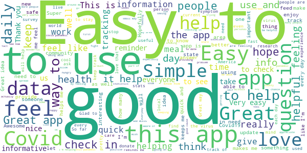
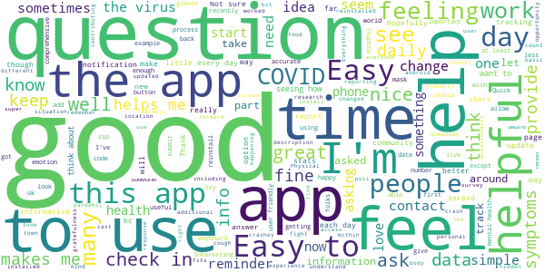
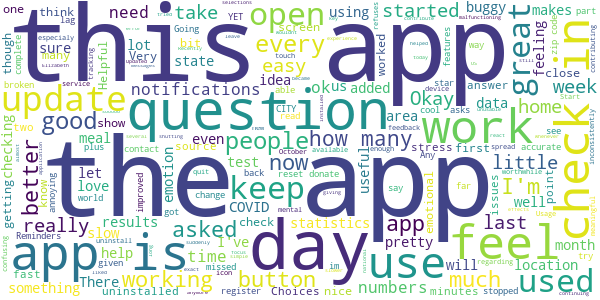
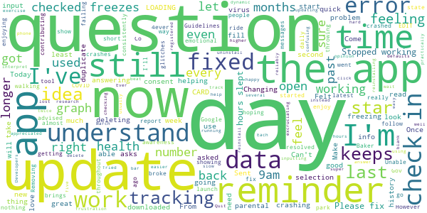
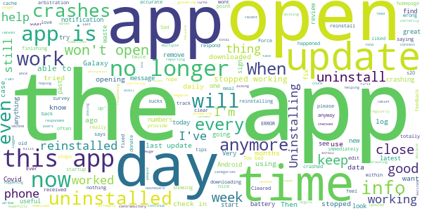

# HowWeFeel: The How We Feel Project
App version ``Varies with device``

Analyzed with [covid-apps-observer](http://github.com/covid-apps-observer) project, version ``0.1``

## App overview
| | |
|-------------------------|-------------------------| 
| **Name**&nbsp;&nbsp;&nbsp;&nbsp;&nbsp;&nbsp;&nbsp;&nbsp;&nbsp;&nbsp;&nbsp;&nbsp;&nbsp;&nbsp;&nbsp;&nbsp;&nbsp;&nbsp;&nbsp;&nbsp;&nbsp;&nbsp;&nbsp;&nbsp;&nbsp;&nbsp;&nbsp;&nbsp;&nbsp;&nbsp;&nbsp;&nbsp;&nbsp;&nbsp;&nbsp;&nbsp;&nbsp;&nbsp;&nbsp;&nbsp;  | HowWeFeel: The How We Feel Project |
| **Unique identifier** | org.howwefeel |
| **Link to Google Play** | [https://play.google.com/store/apps/details?id=org.howwefeel](https://play.google.com/store/apps/details?id=org.howwefeel) |
| **Summary**  | Take 30 seconds to tell us How You Feel to help fight COVID-19 |
| **Privacy policy** | [https://www.howwefeel.org/privacy-policy](https://www.howwefeel.org/privacy-policy) |
| **Latest version** | Varies with device |
| **Last update** | 2020-10-05 23:00:46 |
| **Recent changes** | Improvements and bug fixes. |
| **Installs**  | 100,000+ |
| **Category** | Health & Fitness |
| **First release** | Mar 26, 2020 |
| **Size**  | Varies with device |
| **Supported Android version**  | 5.0 and up |

### Description
> Take 30 seconds every day to fight COVID-19. Your daily health check-ins help doctors and scientists anticipate the next outbreak and get ahead of the coronavirus. The first time you download the app and share how you feel, we’ll donate a meal to people in need through Feeding America.
 The How We Feel app only asks you to self-report age, gender, postal code and any health symptoms you’re experiencing. It does not ask you to sign in with your name, phone number or email address. The data is securely shared with select scientists, doctors and public health professionals who are actively working to stop the spread of COVID-19. 
 The How We Feel app was built by an independent, nonprofit organization called The How We Feel Project. Our organization was founded by a volunteer team of scientists, public health researchers and technologists. Our mission is to make the world healthier by connecting citizens with the global health and research community. The organization was created in March, 2020 to help fight the COVID-19 pandemic.
 We are proud to be working with scientists, doctors and public health professionals from leading institutions including McGovern Institute for Brain Research at MIT, Broad Institute of MIT and Harvard, Howard Hughes Medical Institute, Harvard T.H. Chan School of Public Health and Harvard Institute of Quantitative Social Science, University of Pennsylvania, Stanford University, University of Maryland School of Medicine, Weill Cornell Medicine and the Weizmann Institute of Science.
 We are collaborating with Dr. Gary King from Harvard University’s Institute for Quantitative Social Science’s Privacy Insights Project. Dr. King specializes in developing technologies to make data available to researchers while protecting participants’ individual identities.
 Our technology team includes Ben Silbermann, CEO of Pinterest and a volunteer group of current and former Pinterest employees.

### User interface
The developers of the app provide the following screenshots in the Google play store.
| | | |
|:-------------------------:|:-------------------------:|:-------------------------:|
 |   |   |   | 
 |   |  

## Development team
In the following we report the main information provided by the development team in the Google play store.

| | |
|-------------------------|-------------------------|
| **Developer**  | The How We Feel Project, Inc. |
| **Website**  | [https://www.howwefeel.org](https://www.howwefeel.org) |
| **Email** | info@howwefeel.org |
| **Physical address**  | [949 Bridge Rd San Leandro, CA 94577](https://www.google.com/maps/search/949%20Bridge%20Rd%20San%20Leandro,%20CA%2094577) (Google Maps) |
| **Other developed apps**  | [https://play.google.com/store/apps/developer?id=The+How+We+Feel+Project,+Inc.](https://play.google.com/store/apps/developer?id=The+How+We+Feel+Project,+Inc.) |

## Android support

| | |
|-------------------------|-------------------------|
| **Declared target Android version**  | Pie, version 9 (API level 28) |
| **Effective target Android version**  | Pie, version 9 (API level 28) |
| **Minimum supported Android version**  | Lollipop, version 5.0 (API level 21) |
| **Maximum target Android version**  | - |

The larger the difference between the minimum and maximum supported Android versions, the better. A larger difference means a wider audience. For example, old phones have a very low Android version, so a high minimum supported Android version means that the app cannot be used by users with old phones, thus leading to accessibility problems. 

## Requested permissions

In the following we report the complete list of the permissions requested by the app. 

| **Permission** | **Protection level** | **Description** | 
|-------------------------|-------------------------|-------------------------|
 **android.permission ACCESS_COARSE_LOCATION** | :warning:**Dangerous** | Allows an app to access approximate location. 
 **android.permission ACCESS_FINE_LOCATION** | :warning:**Dangerous** | Allows an app to access precise location. 
 **android.permission ACCESS_NETWORK_STATE** | Normal | Allows applications to access information about networks. 
 **android.permission ACCESS_WIFI_STATE** | Normal | Allows applications to access information about Wi-Fi networks. 
 **android.permission FOREGROUND_SERVICE** | Normal | Allows a regular application to use Service.startForeground. 
 **android.permission INTERNET** | Normal | Allows applications to open network sockets. 
 **android.permission READ_APP_BADGE** | - | - 
 **android.permission RECEIVE_BOOT_COMPLETED** | Normal | Allows an application to receive the Intent.ACTION_BOOT_COMPLETED that is broadcast after the system finishes booting. 
 **android.permission STORAGE** | - | - 
 **android.permission VIBRATE** | Normal | Allows access to the vibrator. 
 **android.permission WAKE_LOCK** | Normal | Allows using PowerManager WakeLocks to keep processor from sleeping or screen from dimming. 
 **com.anddoes.launcher.permission UPDATE_COUNT** | - | - 
 **com.google.android.c2dm.permission RECEIVE** | - | - 
 **com.google.android.finsky.permission BIND_GET_INSTALL_REFERRER_SERVICE** | - | - 
 **com.htc.launcher.permission READ_SETTINGS** | - | - 
 **com.htc.launcher.permission UPDATE_SHORTCUT** | - | - 
 **com.huawei.android.launcher.permission CHANGE_BADGE** | - | - 
 **com.huawei.android.launcher.permission READ_SETTINGS** | - | - 
 **com.huawei.android.launcher.permission WRITE_SETTINGS** | - | - 
 **com.majeur.launcher.permission UPDATE_BADGE** | - | - 
 **com.oppo.launcher.permission READ_SETTINGS** | - | - 
 **com.oppo.launcher.permission WRITE_SETTINGS** | - | - 
 **com.sec.android.provider.badge.permission READ** | - | - 
 **com.sec.android.provider.badge.permission WRITE** | - | - 
 **com.sonyericsson.home.permission BROADCAST_BADGE** | - | - 
 **com.sonymobile.home.permission PROVIDER_INSERT_BADGE** | - | - 
 **me.everything.badger.permission BADGE_COUNT_READ** | - | - 
 **me.everything.badger.permission BADGE_COUNT_WRITE** | - | - 

## Mentioned servers

| **Server** | **Registrant** | **Registrant country** | **Creation date** | 
|-------------------------|-------------------------|-------------------------|-------------------------|
 | bugsnag.com | Bugsnag Inc. | GB | 2011-08-18 03:26:10 |
 | android.com | Google LLC | :us: US | 1997-06-23 04:00:00 |
 | googlesyndication.com | Google LLC | :us: US | 2003-01-21 06:17:24 |
 | google.com | Google LLC | :us: US | 1997-09-15 04:00:00 |
 | app-measurement.com | Google LLC | :us: US | 2015-06-19 20:13:31 |
 | googleapis.com | Google LLC | :us: US | 2005-01-25 17:52:26 |
 | github.com | GitHub, Inc. | :us: US | 2007-10-09 18:20:50 |
 | googleapis.com | Google LLC | :us: US | 2005-01-25 17:52:26 |
 | googleadservices.com | Google LLC | :us: US | 2003-06-19 16:34:53 |
 | expo.io | See PrivacyGuardian.org | :us: US | 2011-05-01 21:26:50 |
 | branch.io | Branch | :us: US | 2011-11-10 13:52:13 |
 | cloudfront.net | Amazon.com, Inc. | :us: US | 2008-04-25 18:25:49 |
 | bnc.lt | - | - | 2016-11-14 00:00:00 |

## Security analysis 

Below we report the main security warnings raised by our execution of the [Androwarn](https://github.com/maaaaz/androwarn) security analysis tool.

**Telephony identifiers leakage**
> - This application reads the ISO country code equivalent for the SIM provider's country code 
> - This application reads the MCC+MNC of the provider of the SIM 
> - This application reads the Service Provider Name (SPN) 
> - This application reads the constant indicating the state of the device SIM card 
> - This application reads the numeric name (MCC+MNC) of current registered operator 
> - This application reads the operator name 
> - This application reads the radio technology (network type) currently in use on the device for data transmission 

**Connection interfaces exfiltration**
> - This application reads details about the currently active data network 
> - This application tries to find out if the currently active data network is metered 

**Suspicious connection establishment**
> - This application opens a Socket and connects it to the remote address '' on the 'N/A' port  
> - This application opens a Socket and connects it to the remote address 'Ljava/lang/StringBuilder;->toString()Ljava/lang/String;' on the ': connect, resolve' port  
> - This application opens a Socket and connects it to the remote address 'Ljava/lang/StringBuilder;->toString()Ljava/lang/String;' on the 'N/A' port  
> - This application opens a Socket and connects it to the remote address 'Ljava/net/Proxy;->type()Ljava/net/Proxy$Type;' on the 'N/A' port  
> - This application opens a Socket and connects it to the remote address 'timeout' on the 'N/A' port  

**Pim data leakage**
> - This application accesses data stored in the clipboard 

**Code execution**
> - This application loads a native library 
> - This application loads a native library: 'bugsnag-ndk' 
> - This application loads a native library: 'bugsnag-plugin-android-anr' 
> - This application executes a UNIX command 

## User ratings and reviews

Below we provide information about how end users are reacting to the app in terms of ratings and reviews in the Google Play store.

### Ratings

The HowWeFeel: The How We Feel Project app has been installed by more than **100000** times. At this time, **11778** rated the app and its average score is **4.2550845**. Below we show the distribution of the ratings across the usual star-based rating of Google Play

:star::star::star::star::star:: 7128

:star::star::star::star:: 2645

:star::star::star:: 748

:star::star:: 399

:star:: 858

### Reviews 

#### 5-star reviews

> My husband thought this was a bad idea. Big brother in your business!? I don't know, at the time everyone was concerned with the covid-19 pandemic and I didn't see the harm?  :date: __2021-06-06 21:11:33__

> I like this app  :date: __2021-05-17 12:40:14__

> I enjoy using the app because it allows me to stay in tune with myself.  :date: __2021-05-13 20:51:36__

> It's good doing this every day, it gives a tally of how one is doing on a daily basis & Iogging in my sleep habits & other items and it's good to see that others are doing it as well.  :date: __2021-05-07 16:24:37__

> Good experience.  :date: __2021-05-04 21:10:28__

> I think this app is pretty cool! Still is a year later  :date: __2021-05-03 00:57:36__

> Great app, it helps you realize how you feel and gives you perspective  :date: __2021-05-02 01:24:31__

> great covid pandemic-related daily symptom, activity, & mood tracker. provides daily local & nat'l vovis syats, as well as a snapshot of your moods.  :date: __2021-04-29 20:08:40__

> Great!  :date: __2021-04-09 02:23:17__

> Great  :date: __2021-04-06 05:30:57__

#### 4-star reviews

> I got a new phone so this isn't the true amount of times I've checked in. I try to check in at least once a day. I look forward to check in.  :date: __2021-05-17 22:43:18__

> It is basic and alliws me to provide a rough description of my health status. But does not allow for individual or personal answers. Not everyone fits into the options provided. Example. I select cough every day. But would like a personalized option of explaining that it is medication induced.the choices are a bit too constraining. Sometimes I am forced to choose one that is not accurate  :date: __2021-04-17 18:03:39__

> I like that it makes me mindful of my mental health at least once a day.  :date: __2021-03-04 17:59:54__

> Editing my review 2/9/2021 - app seems to work again, installed on a new phone (Galaxy S21 Ultra). Not sure what changed, but whatevs...  :date: __2021-02-10 14:23:44__

> I hope I'm contributing to research. I feel I need to help, somehow, in this pandemic! The little gratefulness reminders in the process are helpful!  :date: __2021-01-22 15:10:47__

> Easy. Important!  :date: __2021-01-18 07:28:41__

> Just answering questions  :date: __2020-12-24 23:22:18__

> It was great, but it just froze up on me and I have to reinstall. I will probably have to start over too. Not sure how that helps for COVID...?? Hmmm...  :date: __2020-12-14 09:25:34__

> I feel like I am helping fight Covid-19.  :date: __2020-11-22 15:53:10__

> Feels good to feed people. Limited responses.  :date: __2020-11-17 13:33:44__

#### 3-star reviews

> Works well enough. Usage bit confusing especialy the use of same icon on first screen that's just for show and one needs touch the Start button. The questions are inconsistently asked. Location by zip code is asked but device location service should be used if available. There's little meaningful feedback as to results. The new questions regarding mental and emotional questions are just to much and too many.  :date: __2021-06-11 08:07:59__

> app refuses to open for me, but when it did it was a really nice app👍👍  :date: __2021-05-23 05:44:23__

> Helpful, for the most of it  :date: __2021-01-30 09:30:46__

> I don't know how I feel much better or not. I don't think I feel that much better.  :date: __2020-11-14 03:00:22__

> Very easy to use, and using it makes me feel like I'm contributing to something worthwhile--tracking COVID-19 spread. Update: I had to uninstall it in October because it quit working.  :date: __2020-11-02 21:04:57__

> For the last week the app is malfunctioning. Been working great the last 115 days though  :date: __2020-10-16 13:24:36__

> It's a great app, but it won't open anymore.  :date: __2020-10-15 06:56:48__

> Used it for several months then it started shutting down whenever I tried to open it.  :date: __2020-10-14 13:41:00__

> I had the exact same experience as Elizabeth. I was almost up to 150 check ins & then suddenly the app wouldnt open. I helped as long as I could by giving my data... I liked it when it worked .  :date: __2020-10-13 06:49:26__

> App hasn't worked in days. Won't even open. I haven't had an OS update or an app update.  :date: __2020-10-11 06:07:05__

#### 2-star reviews

> I have not used this app.  :date: __2021-05-27 15:14:24__

> UPDATE: From 10/5 - 11/20/20+ the App didn't work at all. Since some time in 01/2021 I've been able to start doing daily check in's again. However, this past week 3/26 my state's info has not been showing. It just show's "ERROR LOADING CARD". EDIT: It's now 4/20/21 & the "error loading card" has STILL not been fixed! Changing to 2 stars until fixed! I'm really hoping it doesn't take 4ever for the Co. to fix this problem; like it did when they crashed the App w/ their "update" back on 10/5/20.  :date: __2021-04-20 08:38:30__

> I enjoy helping in this way. It also brings an awareness of our health and a reminder to follow the Guidelines. Gov Baker advised people should be getting out, enjoying a short ride or walking to the park. Not sure where this app went.  :date: __2021-01-27 07:29:02__

> Update broke the app. Unable to open.  :date: __2020-10-26 13:37:49__

> Felt like I was contributing to tracking COVID 19 but then there were questions about my emotional health which I felt had nothing to do with tracking the virus.  :date: __2020-10-24 05:26:07__

> Removing some stars for the new update since the app now crashes on launch every time, so I'm no longer able to use. Once this is resolved I'll go back to 5 stars  :date: __2020-10-15 22:10:27__

> Stopped working. I had checked in for 5 months.  :date: __2020-10-15 07:42:43__

> Since latest update on 10/5/2020, app consistently has glitches, won't open  :date: __2020-10-11 18:06:42__

> App was great - just started crashing 2 days ago and keeps failing. Sent an error report to Google but not sure what's going on.  :date: __2020-10-11 05:39:36__

> App WAS a good tool, but after almost 190 days, it no longer opens and keeps throwing error messages throughout the day. I've appreciated the tracking for the past several months, but it looks like it's time to uninstall.  :date: __2020-10-10 06:06:13__

#### 1-star reviews

> Once again, I'm asking are you still gathering data????? I don't see any updates of the app, new info or anything else!!!! I want to know if it is useful to continue answering every day. Regards hoping you answer me.  :date: __2021-05-17 16:05:15__

> The app stopped working  :date: __2020-12-24 23:47:41__

> When I first download this I was super excited to see how this app works. Turns out is does not work at all. When you open the app all it says is app is not responding please open app again or close app. I tried to open the app again and it says the same thing every time. What a waste of time, don't get this app unless you want to waste your time.  :date: __2020-12-21 15:13:43__

> The app will not run on my Galaxy S 10+. It cones up and stops within a second or 2. I've uninstalled and reinstalled multple times.  :date: __2020-11-30 14:14:54__

> Update sucks, can no longer scroll through numbers from past dates. Numbers for total cases and icu cases are often wrong showing the same digits for both categories.  :date: __2020-11-27 07:37:52__

> Doesn't work anymore. Don't know why. I've uninstalled the app and reinstalled it, still doesn't work!  :date: __2020-11-22 16:25:11__

> I've responded 175 times since downloading. After the last update the app wont open at all. I also fond the data dashboard they provide me to be confusing and sometimes contradictory to what is happening in the news. They also provide old content/tips for multiple days. This should be updated daily if they want me to respond daily.  :date: __2020-11-20 15:09:08__

> App has stopped working  :date: __2020-11-19 14:37:32__

> 10/26/20 Have not been able to open app in weeks. Was really good. Hopefully it will be fixed soon. 11/16/20 app still doesn't open. You are missing a good chunk of reporting by the looks of the recent reviews.  :date: __2020-11-16 16:15:39__

> Ever since the last update, I can't use the app. It crashes every time I try to open it  :date: __2020-11-14 09:45:23__

