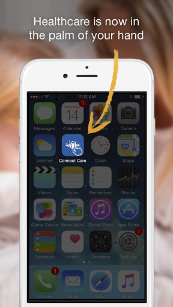
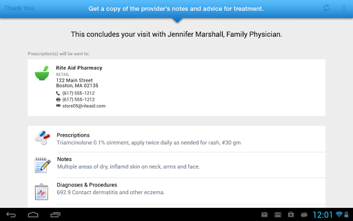
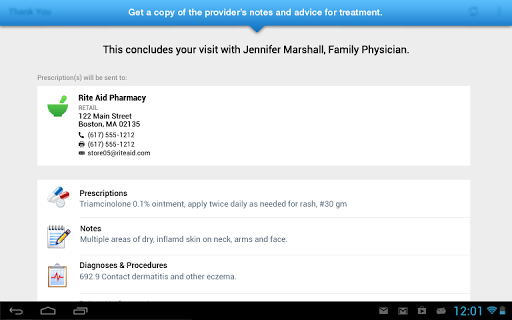
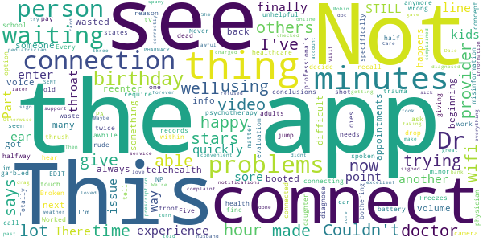

# Intermountain Connect Care
App version ``12.0.16.005_01``

Analyzed with [covid-apps-observer](http://github.com/covid-apps-observer) project, version ``0.1``

## App overview
| | |
|-------------------------|-------------------------| 
| **Name**                                          | Intermountain Connect Care |
| **Unique identifier** | org.intermountainhealthcare.android.connectcare |
| **Link to Google Play** | [https://play.google.com/store/apps/details?id=org.intermountainhealthcare.android.connectcare](https://play.google.com/store/apps/details?id=org.intermountainhealthcare.android.connectcare) |
| **Summary**  | Connect with a clinician when you’re not feeling well 24/7/365 for $59/visit. |
| **Privacy policy** | [https://www.americanwell.com/privacy-policy/](https://www.americanwell.com/privacy-policy/) |
| **Latest version** | 12.0.16.005_01 |
| **Last update** | 2020-12-04 16:59:12 |
| **Recent changes** | We continue to improve the patient experience with these new features: • Performance enhancements to increase reliability and speed |
| **Installs**  | 100,000+ |
| **Category** | Medical |
| **First release** | Feb 1, 2016 |
| **Size**  | 48M |
| **Supported Android version**  | 5.0 and up |

### Description
> The Intermountain Connect Care app allows you or your child to visit with an Intermountain Healthcare clinician for certain urgent care conditions using your phone or tablet.  If you have cold or flu symptoms, sinus pain, sore throat, painful urination, a minor rash or skin issue, upset stomach, or other minor symptoms, use Connect Care 24/7/365 to quickly and conveniently get the care you need from wherever you are – just $59 a visit.  Some insurance plans accepted.
 Connect Care is a convenient, affordable way to get care from Intermountain clinicians. Our highly-trained, board certified nurse practitioners and physician assistants have many years of experience in urgent care, clinics, and hospitals, and are specially trained to provide care using telehealth. Your doctor will also be able to see the results of that visit in your medical record, and can incorporate it into your overall care. Depending on the issue at hand, the provider can diagnose, suggest follow up, and prescribe medication, when appropriate.
 Connect Care is not appropriate for all conditions. If you are unsure of whether you are having a life-threatening medical emergency, or are experiencing any of the following, please go to your nearest ER:
 • Chest pain or pressure
 • Uncontrolled bleeding
 • Sudden or severe pain
 • Coughing / vomiting blood
 • Difficulty breathing or shortness of breath
 • Sudden dizziness, weakness, change in vision, slurred speech, numbness, or other neurological changes
 • Severe or persistent vomiting or diarrhea
 • Changes in mental status, such as confusion
 • Assault, physical or sexual abuse, or child abuse
 Additional information about the Connect Care service can be found here: https://intermountainhealthcare.org/services/urgent-care/connect-care/

### User interface
The developers of the app provide the following screenshots in the Google play store.
| | | |
|:-------------------------:|:-------------------------:|:-------------------------:|
 |   |   |   | 
 |   |   |   | 
 |   |   |   | 
 |   |   |   | 
 |   |  

## Development team
In the following we report the main information provided by the development team in the Google play store.

| | |
|-------------------------|-------------------------|
| **Developer**  | Intermountain Healthcare |
| **Website**  | [http://intermountainhealthcare.org](http://intermountainhealthcare.org) |
| **Email** | Customer.Support@AmericanWell.com |
| **Physical address**  | - |
| **Other developed apps**  | [https://play.google.com/store/apps/developer?id=Intermountain+Healthcare](https://play.google.com/store/apps/developer?id=Intermountain+Healthcare) |

## Android support

| | |
|-------------------------|-------------------------|
| **Declared target Android version**  | Pie, version 9 (API level 28) |
| **Effective target Android version**  | Pie, version 9 (API level 28) |
| **Minimum supported Android version**  | Lollipop, version 5.0 (API level 21) |
| **Maximum target Android version**  | - |

The larger the difference between the minimum and maximum supported Android versions, the better. A larger difference means a wider audience. For example, old phones have a very low Android version, so a high minimum supported Android version means that the app cannot be used by users with old phones, thus leading to accessibility problems. 

## Requested permissions

In the following we report the complete list of the permissions requested by the app. 

| **Permission** | **Protection level** | **Description** | 
|-------------------------|-------------------------|-------------------------|
 **android.permission ACCESS_COARSE_LOCATION** | :warning:**Dangerous** | Allows an app to access approximate location. 
 **android.permission ACCESS_FINE_LOCATION** | :warning:**Dangerous** | Allows an app to access precise location. 
 **android.permission ACCESS_LOCATION_EXTRA_COMMANDS** | Normal | Allows an application to access extra location provider commands. 
 **android.permission ACCESS_NETWORK_STATE** | Normal | Allows applications to access information about networks. 
 **android.permission ACCESS_WIFI_STATE** | Normal | Allows applications to access information about Wi-Fi networks. 
 **android.permission BLUETOOTH** | Normal | Allows applications to connect to paired bluetooth devices. 
 **android.permission BROADCAST_STICKY** | Normal | Allows an application to broadcast sticky intents. 
 **android.permission CAMERA** | :warning:**Dangerous** | Required to be able to access the camera device. 
 **android.permission GET_TASKS** | Deprecated | This constant was deprecated in API level 21. No longer enforced. 
 **android.permission INTERNET** | Normal | Allows applications to open network sockets. 
 **android.permission MODIFY_AUDIO_SETTINGS** | Normal | Allows an application to modify global audio settings. 
 **android.permission READ_EXTERNAL_STORAGE** | :warning:**Dangerous** | Allows an application to read from external storage. 
 **android.permission READ_PHONE_STATE** | :warning:**Dangerous** | Allows read only access to phone state, including the phone number of the device, current cellular network information, the status of any ongoing calls, and a list of any PhoneAccounts registered on the device. 
 **android.permission RECEIVE_BOOT_COMPLETED** | Normal | Allows an application to receive the Intent.ACTION_BOOT_COMPLETED that is broadcast after the system finishes booting. 
 **android.permission RECORD_AUDIO** | :warning:**Dangerous** | Allows an application to record audio. 
 **android.permission REORDER_TASKS** | Normal | Allows an application to change the Z-order of tasks. 
 **android.permission SYSTEM_ALERT_WINDOW** | Signature - preinstalled - appop - pre23 - development | Allows an app to create windows using the type WindowManager.LayoutParams.TYPE_APPLICATION_OVERLAY, shown on top of all other apps. 
 **android.permission USE_BIOMETRIC** | Normal | Allows an app to use device supported biometric modalities. 
 **android.permission USE_FINGERPRINT** | Normal | This constant was deprecated in API level 28. Applications should request USE_BIOMETRIC instead 
 **android.permission VIBRATE** | Normal | Allows access to the vibrator. 
 **android.permission WAKE_LOCK** | Normal | Allows using PowerManager WakeLocks to keep processor from sleeping or screen from dimming. 
 **android.permission WRITE_EXTERNAL_STORAGE** | :warning:**Dangerous** | Allows an application to write to external storage. 
 **com.facebook.katana.provider ACCESS** | - | - 
 **com.google.android.c2dm.permission RECEIVE** | - | - 
 **com.google.android.finsky.permission BIND_GET_INSTALL_REFERRER_SERVICE** | - | - 
 **org.intermountainhealthcare.android.connectcare.permission C2D_MESSAGE** | - | - 

## Mentioned servers

| **Server** | **Registrant** | **Registrant country** | **Creation date** | 
|-------------------------|-------------------------|-------------------------|-------------------------|
 | amwell.com | American Well Corporation | :us: US | 2004-02-13 19:02:32 |
 | facebook.com | Facebook, Inc. | :us: US | 1997-03-29 05:00:00 |
 | doubleclick.net | Google Inc. | :us: US | 1996-01-16 05:00:00 |
 | googleadservices.com | Google LLC | :us: US | 2003-06-19 16:34:53 |
 | google.com | Google LLC | :us: US | 1997-09-15 04:00:00 |
 | googlesyndication.com | Google LLC | :us: US | 2003-01-21 06:17:24 |
 | googleapis.com | Google LLC | :us: US | 2005-01-25 17:52:26 |
 | google-analytics.com | Google LLC | :us: US | 2005-07-18 19:24:32 |
 | app-measurement.com | Google LLC | :us: US | 2015-06-19 20:13:31 |
 | appboy.com | Braze, Inc. | :us: US | 2008-10-06 23:28:32 |
 | braze.com | Braze, Inc. | :us: US | 2000-01-19 02:18:28 |
 | branch.io | Branch | :us: US | 2011-11-10 13:52:13 |
 | optimizely.com | Optimizely | :us: US | 2010-01-11 03:01:32 |
 | twitter.com | Twitter, Inc. | :us: US | 2000-01-21 16:28:17 |
 | crashlytics.com | Google LLC | :us: US | 2011-01-21 15:30:40 |
 | bnc.lt | - | - | 2016-11-14 00:00:00 |
 | gstatic.com | Google LLC | :us: US | 2008-02-11 15:31:25 |
 | ggpht.com | Google LLC | :us: US | 2008-01-16 18:55:33 |

## Security analysis 

Below we report the main security warnings raised by our execution of the [Androwarn](https://github.com/maaaaz/androwarn) security analysis tool.

**Telephony identifiers leakage**
> - This application reads the ISO country code equivalent for the SIM provider's country code 
> - This application reads the ISO country code equivalent of the current registered operator's MCC (Mobile Country Code) 
> - This application reads the MCC+MNC of the provider of the SIM 
> - This application reads the device phone type value 
> - This application reads the numeric name (MCC+MNC) of current registered operator 
> - This application reads the operator name 
> - This application reads the phone's current state 
> - This application reads the radio technology (network type) currently in use on the device for data transmission 

**Connection interfaces exfiltration**
> - This application reads details about the currently active data network 
> - This application tries to find out if the currently active data network is metered 

**Telephony services abuse**
> - This application makes phone calls 

**Audio video eavesdropping**
> - This application captures video from the 'CAMERA' source 

**Suspicious connection establishment**
> - This application opens a Socket and connects it to the remote address '' on the 'N/A' port  
> - This application opens a Socket and connects it to the remote address 'Ljava/lang/StringBuilder;->toString()Ljava/lang/String;' on the 'N/A' port  
> - This application opens a Socket and connects it to the remote address 'Ljava/net/Proxy;->type()Ljava/net/Proxy$Type;' on the 'N/A' port  
> - This application opens a Socket and connects it to the remote address 'timeout' on the 'N/A' port  

**Code execution**
> - This application loads a native library 
> - This application loads a native library: 'VidyoClientApp' 
> - This application loads a native library: 'ndkVideoClient' 
> - This application executes a UNIX command containing this argument: '2' 

## User ratings and reviews

Below we provide information about how end users are reacting to the app in terms of ratings and reviews in the Google Play store.

### Ratings

The Intermountain Connect Care app has been installed by more than **100000** times. At this time, **1130** rated the app and its average score is **4.035398**. Below we show the distribution of the ratings across the usual star-based rating of Google Play

:star::star::star::star::star:: 710

:star::star::star::star:: 150

:star::star::star:: 50

:star::star:: 40

:star:: 180

### Reviews 

#### 5-star reviews

> Great, got me in in the early morning hours before urgent cares were even open.  :date: __2021-01-26 14:03:49__

> The provider was very concerned about why I was using connect care. She was just a caring person.  :date: __2021-01-17 23:08:12__

> So convenient. Can't wait to share with my college student. Be prepared to fill in information as you would at a doctor's office.  :date: __2021-01-14 23:20:59__

> Nice that I didn't have to take off work. Easy to access!  :date: __2021-01-12 17:03:39__

> This was awesome,,,the practitioner was fast and very nice.  :date: __2021-01-07 16:48:24__

> It was nice to have access to a doctor so late at night!  :date: __2020-12-19 06:17:18__

> Super convenient!  :date: __2020-12-14 16:17:17__

> This has been a reliable app. It's so nice getting to see a doctor right from my house.  :date: __2020-12-12 20:31:42__

> Great experience  :date: __2020-12-09 05:47:31__

> I'm very happy with connect care, they help me right away😊😊😊  :date: __2020-11-13 22:42:02__

#### 4-star reviews

> Great service, you just have to wait a little sometimes.  :date: __2020-11-18 05:55:57__

> I am upset as i cannot remenber my password once again  :date: __2020-11-04 01:38:23__

> The only frustrating part was they say they treat everything...except earaches...go figure. My doc office didnt want to see me, they sent me to this app....I've lived long enough to know I dont like this techno filled world. Just too odd for this old gal. Now headed to instacare.  :date: __2020-10-16 19:00:53__

> A bit spotty but overall a clear communication experience  :date: __2020-08-12 23:24:52__

> Good  :date: __2020-08-12 21:55:30__

> It was a very professional appointment! & the app was easy to use it was nice during the app process to have step by step instructions.  :date: __2020-06-29 19:28:10__

> Easy  :date: __2020-06-11 22:11:42__

> Saved me a trip to an urgentcare where they would do multiple tests to diagnose me with something that I already knew I had. Love love this app however they did not have my insurance listed. I am not sure why because I go to Intermountain often enough to know they take my insurance.  :date: __2020-06-09 04:13:18__

> Great! We finally connected this time!  :date: __2020-06-08 21:24:38__

> It kept glitching in and out but we got through it.  :date: __2020-05-05 17:59:53__

#### 3-star reviews

> Risky, the PA I got said that it didnt look like an allergic reaction and said to go to insta care. I did and the provider said I was an allergic reaction. 59 dollars to 173  :date: __2020-12-07 19:36:44__

> Easy to use  :date: __2020-09-22 13:54:52__

> Ads are set to kill.  :date: __2020-06-02 17:28:00__

> All went well but the sound and video kept digitizing and buffering.  :date: __2020-05-18 18:28:39__

> A bit confusing  :date: __2020-05-07 05:50:32__

> Choppy interface/ lag  :date: __2020-05-04 22:22:35__

> The PA I saw was great, but the app seemed to have issues working properly. I could see my doctor, and I could see my video was being captured by my device, but he had trouble seeing me multiple times during the visit. I know my wifi signal is strong because I used it to work from home today. Not sure what the problem was. However, I did really, really appreciate not having to wait in a doctor's office during COVID-19. I'll continue to use the service again and see if the app works next time.  :date: __2020-04-09 16:39:30__

> It kept telling me that it needed more access to my phone, even when I granted all access.  :date: __2020-03-26 21:54:27__

> Kind of confusing how to set up the app  :date: __2020-03-26 17:05:42__

> I wasn't too impressed. The wait times were comparable to instacare, but at least I didn't have to sit in a waiting room full of sick people for 3 hours. The lady tried to prescribe me amoxicillin when I had marked that I was allergic to penicillin so I know she didn't even look over my file. Works in a pinch though.  :date: __2020-03-18 05:43:31__

#### 2-star reviews

> Not do happy with some things  :date: __2021-01-26 03:57:34__

> I was next to see someone 6 times and got booted back to the beginning, had to reenter my info, and wasted 45 minutes.  :date: __2020-10-19 03:38:49__

> I have had many telehealth appointments and always something happens with the connection or the volume of the voice. It's very difficult when you are trying to do psychotherapy about trauma and halfway through the connection dies or you can't hear your provider anymore. This needs lots of work!  :date: __2020-08-13 23:10:26__

> Every time I call it has problems connecting. It doesn't matter what wifi I am using or if im not using wifi at all. And I've also had connections with my doctors drop and had to recall and pay twice just to be seen.  :date: __2020-07-01 04:41:31__

> Couldn't see the others person  :date: __2020-06-29 22:28:45__

> The NP's and PA's are the most unhelpful and rude health professionals I've ever spoken with, and I am in healthcare. They jump to conclusions and give misinformation ( adults can't get thrush??). EDIT. The app was fine. That's the only reason I'm giving 2 stars.  :date: __2020-06-13 21:52:25__

> Never connected with doctor. Totally a waste of an hour and half.  :date: __2020-05-25 05:37:12__

> Not able to connect - no video  :date: __2020-05-18 18:38:55__

> Freezes a lot.  :date: __2020-05-06 00:20:16__

> Worked before but now it only records the front camera (the wrong one) and the physician says they can only see lines, like a garbled old school tv. Broken video...  :date: __2020-04-24 06:33:34__

#### 1-star reviews

> Messages stopped working on app and online! I keep getting an error when all fields filled in.  :date: __2021-01-29 20:11:04__

> Update: 2 hours of down time now. I'm trying to see a decent doctor for a misdiagnosis from Dr. Tyler D'Hulst about my hand. He said tendonitis but it's turned into a bulge in my tendon and it feels like it split and latched onto an adjacent tendon in my hand. My middle and ring finger on my dominant hand will not move independently anymore 24/7/365 is a lie I've been trying to get on for an hour and it just says they're "upgrading my experience". I don't see downtime as an upgraded experience!  :date: __2021-01-16 10:02:42__

> Why there is no summary or report of the appointment? The appointment was okay, the Dr. said she was gonna send in a request for OTC meds to my pharmacy, got there to pick it up, but of course it wasn't there and they had no idea and since it is OTC just go and pick it up. But what?! No details were given by the Dr about the type of meds and there is no record of it anywhere in the app. So basically the only way yo find out is to have another appointment for another $40....  :date: __2020-11-27 22:15:45__

> It wouldn't accept passwords from two different accounts. Connected to internet too.  :date: __2020-11-24 07:29:04__

> Unable to enter insurance into BLUE CROSS BLUE SHIELD not on provided list Unable to edit out mistaken insurance. I have limited computer skills. Filling out the other info was a waste of time.  :date: __2020-11-13 03:48:34__

> This app is garbage and so is the desktop version. I've been waiting an hour and a half and it just keeps glitching and kicking me out of my spot in line. It gave the option to connect with the provider by phone call instead, so I hit that option and still nothing. No call. No video appointment. Nothing. Guess I'll get dressed and have my hubby take me to the instacare instead. I better not get billed for this.  :date: __2020-11-10 21:43:07__

> Third appointment on connect care third time that the app will not work.  :date: __2020-10-14 17:26:00__

> Installed just to check a covid test result. I see no way of doing that. The only thing I see is how to make an appointment. What a waste if time.  :date: __2020-10-02 16:35:27__

> This app i not user friendly I have typed in my information +5 times correctly, then stating your unsure it is who I say I am.. I know you guys are slammed but honestly please do something. I've waited on the phone with tech support on regards of my Account info for over 40 minutes. Then I got annoyed and hung up. Called again and once again still on the phone for more than 20 minutes. The auto record states you will only be waiting for 20 minutes.  :date: __2020-09-25 01:55:53__

> I waited two hours to be seen, and kept getting canceled on each time I got to my turn on the waitlist. Four different times. I hate leaving negative reviews, but this experience was awful and extremely frustrating.  :date: __2020-09-15 20:56:55__

