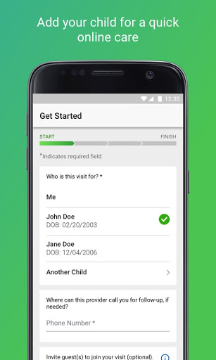

# MU Health Care Video Visits
App version ``12.0.16.005_01``

Analyzed with [covid-apps-observer](http://github.com/covid-apps-observer) project, version ``0.1``

## App overview
| | |
|-------------------------|-------------------------| 
| **Name**&nbsp;&nbsp;&nbsp;&nbsp;&nbsp;&nbsp;&nbsp;&nbsp;&nbsp;&nbsp;&nbsp;&nbsp;&nbsp;&nbsp;&nbsp;&nbsp;&nbsp;&nbsp;&nbsp;&nbsp;&nbsp;&nbsp;&nbsp;&nbsp;&nbsp;&nbsp;&nbsp;&nbsp;&nbsp;&nbsp;&nbsp;&nbsp;&nbsp;&nbsp;&nbsp;&nbsp;&nbsp;&nbsp;&nbsp;&nbsp;  | MU Health Care Video Visits |
| **Unique identifier** | org.muhealth.android.umhs.videovisits |
| **Link to Google Play** | [https://play.google.com/store/apps/details?id=org.muhealth.android.umhs.videovisits](https://play.google.com/store/apps/details?id=org.muhealth.android.umhs.videovisits) |
| **Summary**  | Provides a fast and easy way to see a doctor on your smartphone or computer. |
| **Privacy policy** | [http://www.muhealth.org/about/contact/privacy](http://www.muhealth.org/about/contact/privacy) |
| **Latest version** | 12.0.16.005_01 |
| **Last update** | 2020-10-25 03:12:34 |
| **Recent changes** | We continue to improve the patient experience with these new features: • Performance enhancements to increase reliability and speed |
| **Installs**  | 5,000+ |
| **Category** | Medical |
| **First release** | Dec 7, 2017 |
| **Size**  | 55M |
| **Supported Android version**  | 5.0 and up |

### Description
> Looking for a faster, easier way to see a doctor? With video visits, you can see a provider anytime from your smartphone, tablet or computer. It is easy to use, private, and secure.
 Video visits are great for when your doctor’s office is closed, you’re too sick or too busy to see someone in person, or even when you’re traveling.
 What are the benefits of video visits?
 Patients enjoy the hassle-free experience of online visits, including:
 · Affordable, easy, and convenient
 · Your choice of U.S. board-certified doctors
 · No appointment, no waiting
 · 24/7/365 mobile or web access
 · Consults and diagnoses, prescriptions as appropriate
  
 What can doctors treat with video visits?
 · Cold/flu
 · Sore throat
 · Fever
 · Abdominal pain
 · Sinus infection
 · Pink eye
 · Ear infection  
 · Migraines
  
 Who are the doctors?
 Clinical services are provided by Online Care Group — the nation’s first and largest primary care group devoted to telehealth. These doctors:
 · Have an average of 15 years of experience in primary and urgent care
 · Are U.S. board certified, licensed and credentialed
 · Have profiles, so you can see their education and practice experience
 · Are rated by other patients, so you can review and select the doctor that meets your needs
 Doctors providing video visits are not affiliated with MU Health Care.
 Who is eligible for video visits?
 Patients only need access to a computer, tablet or smartphone with camera and audio. 
 How do video visits work?
 Visit with a provider by downloading and launching the video visits app on your desktop or mobile device and following the prompts to start your appointment.
 How is my privacy protected?
 Video visits use a secure and encrypted system that meets strict HIPAA regulations to safeguard your information.
 If you are an MU Health Care patient, a note about your visit will be sent to your MU Health Care provider. If you are not an MU Health Care patient, we will retain your contact information in order to inform you about services that might be of interest.
 For more information, visit muhealth.org/video-visits

### User interface
The developers of the app provide the following screenshots in the Google play store.
| | | |
|:-------------------------:|:-------------------------:|:-------------------------:|
 |   |   |   | 
 |   |   |   | 
 |   |   |   | 

## Development team
In the following we report the main information provided by the development team in the Google play store.

| | |
|-------------------------|-------------------------|
| **Developer**  | University of Missouri |
| **Website**  | [https://www.muhealth.org/conditions-treatments/video-visits](https://www.muhealth.org/conditions-treatments/video-visits) |
| **Email** | mudoitappsdevsupport@missouri.edu |
| **Physical address**  | [Division of IT 615 Locust St, Columbia, MO 65211](https://www.google.com/maps/search/Division%20of%20IT%20615%20Locust%20St,%20Columbia,%20MO%2065211) (Google Maps) |
| **Other developed apps**  | [https://play.google.com/store/apps/developer?id=University+of+Missouri](https://play.google.com/store/apps/developer?id=University+of+Missouri) |

## Android support

| | |
|-------------------------|-------------------------|
| **Declared target Android version**  | Android10, version 10 (API level 29) |
| **Effective target Android version**  | Android10, version 10 (API level 29) |
| **Minimum supported Android version**  | Lollipop, version 5.0 (API level 21) |
| **Maximum target Android version**  | - |

The larger the difference between the minimum and maximum supported Android versions, the better. A larger difference means a wider audience. For example, old phones have a very low Android version, so a high minimum supported Android version means that the app cannot be used by users with old phones, thus leading to accessibility problems. 

## Requested permissions

In the following we report the complete list of the permissions requested by the app. 

| **Permission** | **Protection level** | **Description** | 
|-------------------------|-------------------------|-------------------------|
 **android.permission ACCESS_COARSE_LOCATION** | :warning:**Dangerous** | Allows an app to access approximate location. 
 **android.permission ACCESS_FINE_LOCATION** | :warning:**Dangerous** | Allows an app to access precise location. 
 **android.permission ACCESS_LOCATION_EXTRA_COMMANDS** | Normal | Allows an application to access extra location provider commands. 
 **android.permission ACCESS_NETWORK_STATE** | Normal | Allows applications to access information about networks. 
 **android.permission ACCESS_WIFI_STATE** | Normal | Allows applications to access information about Wi-Fi networks. 
 **android.permission BLUETOOTH** | Normal | Allows applications to connect to paired bluetooth devices. 
 **android.permission BROADCAST_STICKY** | Normal | Allows an application to broadcast sticky intents. 
 **android.permission CAMERA** | :warning:**Dangerous** | Required to be able to access the camera device. 
 **android.permission GET_TASKS** | Deprecated | This constant was deprecated in API level 21. No longer enforced. 
 **android.permission INTERNET** | Normal | Allows applications to open network sockets. 
 **android.permission MODIFY_AUDIO_SETTINGS** | Normal | Allows an application to modify global audio settings. 
 **android.permission READ_EXTERNAL_STORAGE** | :warning:**Dangerous** | Allows an application to read from external storage. 
 **android.permission READ_PHONE_STATE** | :warning:**Dangerous** | Allows read only access to phone state, including the phone number of the device, current cellular network information, the status of any ongoing calls, and a list of any PhoneAccounts registered on the device. 
 **android.permission RECEIVE_BOOT_COMPLETED** | Normal | Allows an application to receive the Intent.ACTION_BOOT_COMPLETED that is broadcast after the system finishes booting. 
 **android.permission RECORD_AUDIO** | :warning:**Dangerous** | Allows an application to record audio. 
 **android.permission REORDER_TASKS** | Normal | Allows an application to change the Z-order of tasks. 
 **android.permission SYSTEM_ALERT_WINDOW** | Signature - preinstalled - appop - pre23 - development | Allows an app to create windows using the type WindowManager.LayoutParams.TYPE_APPLICATION_OVERLAY, shown on top of all other apps. 
 **android.permission USE_BIOMETRIC** | Normal | Allows an app to use device supported biometric modalities. 
 **android.permission USE_FINGERPRINT** | Normal | This constant was deprecated in API level 28. Applications should request USE_BIOMETRIC instead 
 **android.permission VIBRATE** | Normal | Allows access to the vibrator. 
 **android.permission WAKE_LOCK** | Normal | Allows using PowerManager WakeLocks to keep processor from sleeping or screen from dimming. 
 **android.permission WRITE_EXTERNAL_STORAGE** | :warning:**Dangerous** | Allows an application to write to external storage. 
 **com.facebook.katana.provider ACCESS** | - | - 
 **com.google.android.c2dm.permission RECEIVE** | - | - 
 **com.google.android.finsky.permission BIND_GET_INSTALL_REFERRER_SERVICE** | - | - 
 **org.muhealth.android.umhs.videovisits.permission C2D_MESSAGE** | - | - 

## Mentioned servers

| **Server** | **Registrant** | **Registrant country** | **Creation date** | 
|-------------------------|-------------------------|-------------------------|-------------------------|
 | amwell.com | American Well Corporation | :us: US | 2004-02-13 19:02:32 |
 | facebook.com | Facebook, Inc. | :us: US | 1997-03-29 05:00:00 |
 | doubleclick.net | Google Inc. | :us: US | 1996-01-16 05:00:00 |
 | googleadservices.com | Google LLC | :us: US | 2003-06-19 16:34:53 |
 | google.com | Google LLC | :us: US | 1997-09-15 04:00:00 |
 | googlesyndication.com | Google LLC | :us: US | 2003-01-21 06:17:24 |
 | google-analytics.com | Google LLC | :us: US | 2005-07-18 19:24:32 |
 | app-measurement.com | Google LLC | :us: US | 2015-06-19 20:13:31 |
 | appboy.com | Braze, Inc. | :us: US | 2008-10-06 23:28:32 |
 | braze.com | Braze, Inc. | :us: US | 2000-01-19 02:18:28 |
 | optimizely.com | Optimizely | :us: US | 2010-01-11 03:01:32 |
 | twitter.com | Twitter, Inc. | :us: US | 2000-01-21 16:28:17 |
 | branch.io | Branch | :us: US | 2011-11-10 13:52:13 |
 | gstatic.com | Google LLC | :us: US | 2008-02-11 15:31:25 |
 | crashlytics.com | Google LLC | :us: US | 2011-01-21 15:30:40 |
 | bnc.lt | - | - | 2016-11-14 00:00:00 |
 | ggpht.com | Google LLC | :us: US | 2008-01-16 18:55:33 |

## Security analysis 

Below we report the main security warnings raised by our execution of the [Androwarn](https://github.com/maaaaz/androwarn) security analysis tool.

**Telephony identifiers leakage**
> - This application reads the ISO country code equivalent for the SIM provider's country code 
> - This application reads the ISO country code equivalent of the current registered operator's MCC (Mobile Country Code) 
> - This application reads the MCC+MNC of the provider of the SIM 
> - This application reads the device phone type value 
> - This application reads the numeric name (MCC+MNC) of current registered operator 
> - This application reads the operator name 
> - This application reads the phone's current state 
> - This application reads the radio technology (network type) currently in use on the device for data transmission 

**Connection interfaces exfiltration**
> - This application reads details about the currently active data network 
> - This application tries to find out if the currently active data network is metered 

**Telephony services abuse**
> - This application makes phone calls 

**Audio video eavesdropping**
> - This application captures video from the 'CAMERA' source 

**Suspicious connection establishment**
> - This application opens a Socket and connects it to the remote address ' returned no addresses for  ; port is out of range' on the 'N/A' port  
> - This application opens a Socket and connects it to the remote address '' on the 'N/A' port  
> - This application opens a Socket and connects it to the remote address 'Ljava/net/Proxy;->type()Ljava/net/Proxy$Type;' on the 'N/A' port  
> - This application opens a Socket and connects it to the remote address 'timeout' on the 'N/A' port  

**Code execution**
> - This application loads a native library 
> - This application executes a UNIX command containing this argument: '2' 

## User ratings and reviews

Below we provide information about how end users are reacting to the app in terms of ratings and reviews in the Google Play store.

### Ratings

The MU Health Care Video Visits app has been installed by more than **5000** times. At this time, **41** rated the app and its average score is **4.5609756**. Below we show the distribution of the ratings across the usual star-based rating of Google Play

:star::star::star::star::star:: 34

:star::star::star::star:: 2

:star::star::star:: 2

:star::star:: 0

:star:: 3

### Reviews 

#### 5-star reviews

> Super Easy to use. So convenient.  :date: __2020-09-06 17:47:36__

> Super awesome  :date: __2020-07-26 02:34:52__

> Great  :date: __2020-05-28 15:52:21__

> Great exprience with the doc she addressed the issue answed all questions and was very helpful  :date: __2020-05-02 06:22:07__

> Was fast and reasonably priced. They only charged me a regular office visit copay instead of an urgent room copay. Which is what I would have done instead. Easy to do and saved me a lot of time.  :date: __2020-05-01 19:05:13__

> Quick, professional and the face 2 face very helpful. No "waiting room" to sit in with other sick patients was definitely a benefit and offered additional comfort.  :date: __2020-04-04 17:09:09__

> Very easy to use.  :date: __2020-03-30 16:06:11__

> Very professional and helpful.  :date: __2020-03-27 17:17:13__

> Everything went smoothly  :date: __2020-03-04 16:01:31__

> The physician I saw was so very nice and extremely helpful! I will definitely use this app again!  :date: __2020-02-23 19:24:47__

#### 4-star reviews

> Easy to navigate and meet with a doctor quickly  :date: __2020-06-23 20:20:59__

> Fast and knowledgeable and got me help right away  :date: __2020-03-23 01:04:02__

#### 3-star reviews

> Waited over an hour even though the app stated I was next that my visit wpuld begin shortly.  :date: __2020-03-25 23:32:10__

> Keeps telling me my adderss is invalid and it is not !  :date: __2019-11-16 18:10:18__

#### 2-star reviews

No recent reviews available with 2 stars.

#### 1-star reviews

> Lies, says free covid chat but yet wants me to pay $60  :date: __2020-07-13 15:55:56__

