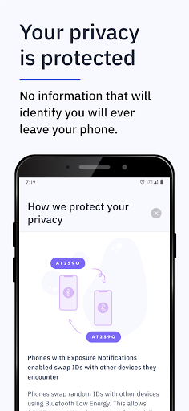
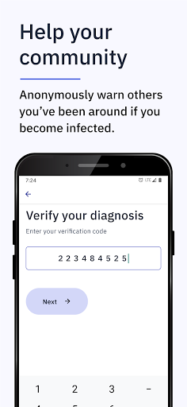
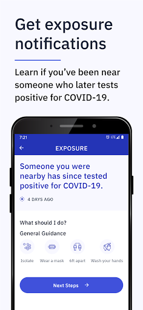
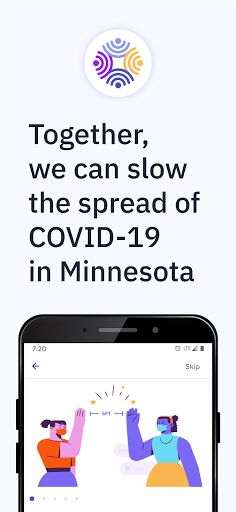
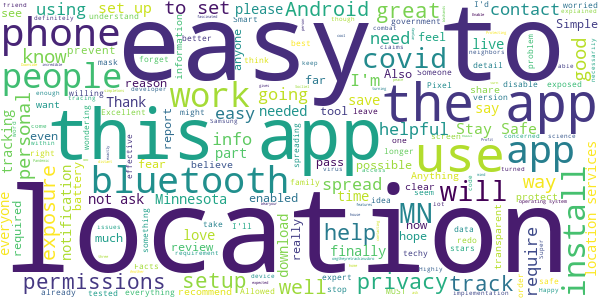
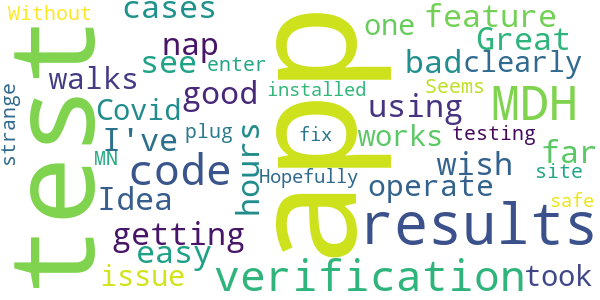
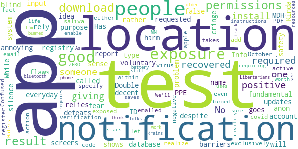
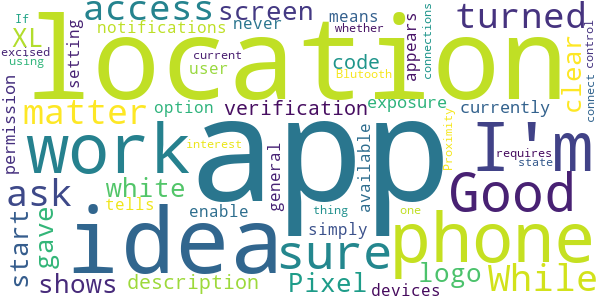
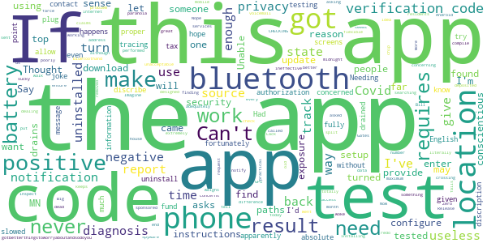

# COVIDaware MN
App version ``1.1.1``

Analyzed with [covid-apps-observer](http://github.com/covid-apps-observer) project, version ``0.1``

## App overview
| | |
|-------------------------|-------------------------| 
| **Name**&nbsp;&nbsp;&nbsp;&nbsp;&nbsp;&nbsp;&nbsp;&nbsp;&nbsp;&nbsp;&nbsp;&nbsp;&nbsp;&nbsp;&nbsp;&nbsp;&nbsp;&nbsp;&nbsp;&nbsp;&nbsp;&nbsp;&nbsp;&nbsp;&nbsp;&nbsp;&nbsp;&nbsp;&nbsp;&nbsp;&nbsp;&nbsp;&nbsp;&nbsp;&nbsp;&nbsp;&nbsp;&nbsp;&nbsp;&nbsp;  | COVIDaware MN |
| **Unique identifier** | org.pathcheck.covidsafepathsBt.mn |
| **Link to Google Play** | [https://play.google.com/store/apps/details?id=org.pathcheck.covidsafepathsBt.mn](https://play.google.com/store/apps/details?id=org.pathcheck.covidsafepathsBt.mn) |
| **Summary**  | Receive alerts about potential exposure to COVID-19 in Minnesota |
| **Privacy policy** | [https://covidawaremn.com/privacy-policy.shtml](https://covidawaremn.com/privacy-policy.shtml) |
| **Latest version** | 1.1.1 |
| **Last update** | 2020-11-18 19:02:42 |
| **Recent changes** | -  Initial release of COVID-19 Exposure Notifications |
| **Installs**  | 50,000+ |
| **Category** | Tools |
| **First release** | Sep 30, 2020 |
| **Size**  | 65M |
| **Supported Android version**  | 6.0 and up |

### Description
> COVIDaware MN is the official exposure notification app of the State of Minnesota. With the COVIDaware MN app, your phone gets notified when you may have been exposed to COVID-19. The app is built with privacy-preserving Exposure Notification technology developed by Apple and Google in partnership with the nonprofit PathCheck Foundation. COVIDaware MN exchanges anonymous Bluetooth keys with other app users when you are within 6 feet of each other for more than 15 minutes. If an app user reports they tested positive for COVID-19, the phones they exchanged keys with are anonymously notified. The notifications let Minnesotans know when they should take extra care and get tested. Nobody ever knows your location or identity, and no information on the use of this app can be traced back to you.
 COVIDaware MN is made available by the State of Minnesota to help slow the spread of COVID-19 in our communities. Like wearing a mask, social distancing, and washing hands, it adds another layer to our defense against the virus. No single layer is completely effective by itself, but when used together, they make us all safer. The app is part of a comprehensive contact tracing initiative managed by the Minnesota Department of Health (MDH). If you test positive for COVID-19, an MDH contact investigator will provide a test verification code you enter into the COVIDaware MN app. After you enter the verification code, other app users will be anonymously notified that they were near someone who has recently tested positive. No personal data or location tracking occurs within this app. The app’s source code is available to the public and has been carefully inspected by privacy and security experts. For complete information, visit https://covidawaremn.com.
 Help us slow the spread of COVID-19 in Minnesota by sharing COVIDaware MN with your friends and family. Let’s be COVID aware, MN!

### User interface
The developers of the app provide the following screenshots in the Google play store.
| | | |
|:-------------------------:|:-------------------------:|:-------------------------:|
 |   |   |   | 
 |  

## Development team
In the following we report the main information provided by the development team in the Google play store.

| | |
|-------------------------|-------------------------|
| **Developer**  | State of Minnesota |
| **Website**  | [https://covidawaremn.com](https://covidawaremn.com) |
| **Email** | covidawaremn@state.mn.us |
| **Physical address**  | - |
| **Other developed apps**  | [https://play.google.com/store/apps/developer?id=State+of+Minnesota](https://play.google.com/store/apps/developer?id=State+of+Minnesota) |

## Android support

| | |
|-------------------------|-------------------------|
| **Declared target Android version**  | - |
| **Effective target Android version**  | - |
| **Minimum supported Android version**  | Marshmallow, version 6.0 (API level 23) |
| **Maximum target Android version**  | - |

The larger the difference between the minimum and maximum supported Android versions, the better. A larger difference means a wider audience. For example, old phones have a very low Android version, so a high minimum supported Android version means that the app cannot be used by users with old phones, thus leading to accessibility problems. 

## Requested permissions

In the following we report the complete list of the permissions requested by the app. 

| **Permission** | **Protection level** | **Description** | 
|-------------------------|-------------------------|-------------------------|
 **android.permission ACCESS_NETWORK_STATE** | Normal | Allows applications to access information about networks. 
 **android.permission ACCESS_WIFI_STATE** | Normal | Allows applications to access information about Wi-Fi networks. 
 **android.permission BLUETOOTH** | Normal | Allows applications to connect to paired bluetooth devices. 
 **android.permission FOREGROUND_SERVICE** | Normal | Allows a regular application to use Service.startForeground. 
 **android.permission INTERNET** | Normal | Allows applications to open network sockets. 
 **android.permission RECEIVE_BOOT_COMPLETED** | Normal | Allows an application to receive the Intent.ACTION_BOOT_COMPLETED that is broadcast after the system finishes booting. 
 **android.permission VIBRATE** | Normal | Allows access to the vibrator. 
 **android.permission WAKE_LOCK** | Normal | Allows using PowerManager WakeLocks to keep processor from sleeping or screen from dimming. 

## Mentioned servers

| **Server** | **Registrant** | **Registrant country** | **Creation date** | 
|-------------------------|-------------------------|-------------------------|-------------------------|
 | bugsnag.com | Bugsnag Inc. | GB | 2011-08-18 03:26:10 |
 | android.com | Google LLC | :us: US | 1997-06-23 04:00:00 |
 | google.com | Google LLC | :us: US | 1997-09-15 04:00:00 |
 | github.com | GitHub, Inc. | :us: US | 2007-10-09 18:20:50 |

## Security analysis 

Below we report the main security warnings raised by our execution of the [Androwarn](https://github.com/maaaaz/androwarn) security analysis tool.

**Telephony identifiers leakage**
> - This application reads the numeric name (MCC+MNC) of current registered operator 
> - This application reads the operator name 

**Connection interfaces exfiltration**
> - This application reads details about the currently active data network 
> - This application tries to find out if the currently active data network is metered 

**Suspicious connection establishment**
> - This application opens a Socket and connects it to the remote address 'Ljava/lang/StringBuilder;->toString()Ljava/lang/String;' on the ': connect, resolve' port  
> - This application opens a Socket and connects it to the remote address 'Ljava/lang/StringBuilder;->toString()Ljava/lang/String;' on the 'N/A' port  
> - This application opens a Socket and connects it to the remote address 'Ljava/net/Proxy;->type()Ljava/net/Proxy$Type;' on the 'N/A' port  
> - This application opens a Socket and connects it to the remote address 'No route to  ' on the 'N/A' port  
> - This application opens a Socket and connects it to the remote address 'timeout' on the 'N/A' port  

**Pim data leakage**
> - This application accesses data stored in the clipboard 

**Code execution**
> - This application loads a native library 
> - This application executes a UNIX command 

## User ratings and reviews

Below we provide information about how end users are reacting to the app in terms of ratings and reviews in the Google Play store.

### Ratings

The COVIDaware MN app has been installed by more than **50000** times. At this time, **203** rated the app and its average score is **4.174603**. Below we show the distribution of the ratings across the usual star-based rating of Google Play

:star::star::star::star::star:: 150

:star::star::star::star:: 9

:star::star::star:: 9

:star::star:: 3

:star:: 32

### Reviews 

#### 5-star reviews

> Protecting yourself and others is cool, pass it on.  :date: __2020-12-12 19:33:17__

> Works well on my Pixel. Did not ask me for permissions, as expected.  :date: __2020-12-12 15:59:34__

> Easy to setup and does exactly what it says it will do. It uses bluetooth for contacting other phones so you will need bluetooth on.  :date: __2020-12-12 03:46:12__

> thank you mn government :)  :date: __2020-12-10 17:02:36__

> This gives me great peace of mind. Another tool to track possible exposures. I turn off bluetooth and location if I'm at home, and on again before I leave the house, and everything works. No need to redo setup (which is just turning on both features anyway). Downside is you'll only get a possible exposure notification if the person you're exposed to also has the app, and has it enabled at the same time you do.  :date: __2020-12-06 08:08:51__

> 1. Install app. 2. Enable location??!!!?11?!omgtheyretrackinusbro 3. ???????? 4. Profit! Location has to be enabled in order for the app to use bluetooth, simpletons. Get over it already.  :date: __2020-12-06 03:00:06__

> So far great.  :date: __2020-12-05 21:52:52__

> This app is a "MUST" during this Pandemic! I am fascinated at how incredible it is. KUDOS TO THE DEVELOPERS.  :date: __2020-12-05 20:33:09__

> Wearyour*mask* # one Washands* # Two Socliel distant#three Bullshitt by Appointment#Four ABSOLTLEEY SEX with out me Nomber six and allways checktempiture +104take t0 emergence room asap!!!!!!! Eat planty of salids Get lots of Rest +biulds Amune sistem+  :date: __2020-12-05 07:31:49__

> I am nervous about all of our phones constantly talking to everyone. Someone is going to screw all this up and take advantage of the vulnerability  :date: __2020-12-04 14:04:38__

#### 4-star reviews

> Excellent information  :date: __2020-12-10 15:11:22__

> Great idea. But I don't know anyone that uses the app. I doubt a lot of people have the app install. It defeats the purpose of being useful if only a handful if people are using the app.  :date: __2020-12-08 23:56:12__

> Good idea but the app doesn't start on my phone (Pixel 4 XL). It just shows a white screen with the logo.  :date: __2020-12-07 15:36:10__

> the only reason I give it four stars is because I don't know if it works yet or not but it seems to function on my phone and my tablet and my laptop so until I know for sure that it works that's all I have to say.  :date: __2020-12-06 19:26:31__

> Carol M  :date: __2020-12-06 02:15:38__

> Good idea, but needs support of the places that provides the tests. which currently do not provide a verification code with a positive test.  :date: __2020-12-02 05:45:58__

> I wish that there was a nap so I can see where cases are getting bad it would be a good feature.  :date: __2020-11-27 19:22:55__

> Great Idea  :date: __2020-11-25 00:10:39__

> I've only been using the app for 24 hours and so far it's easy to operate and walks you clearly through what the app does and how it works. My one issue is that I took a Covid test through an MDH testing site and my test results don't have a verification code. Without a verification code I can't enter my results in the app. Seems strange that we can't plug our MDH test results into our MN app. Hopefully they'll fix that!  :date: __2020-11-24 14:58:46__

> I just installed the app for my safe  :date: __2020-11-24 01:24:29__

#### 3-star reviews

> Has only one notification type called "Exposure Notification" which, despite it's name, fires everyday on exposure database updates. Had to silence this annoying notification, so defeats the purpose! More fundamental flaws: doesn't account for PPE or if barriers between people, & relies on voluntary positive test input rather than MDH registry. Good: No location permissions required. App Info screens shows "No permissions requested". Double blind anon ID system is good. No BT issues like others.  :date: __2020-12-13 18:40:51__

> Really you're putting out an app with no dark mode? Have you not paid attention to any other applications or operating system pushes and updates? I love staring into a flashlight.  :date: __2020-12-12 23:05:07__

> I'm not sure that this app is really doing anything useful. The way it's set up is completely voluntary. So even if a user has Covid-19, they don't actually have to record it. And what about the people who don't download the app and use it? I'm not convinced that this app is accomplishing it's intended purpose.  :date: __2020-12-12 14:19:09__

> I wish there was a way to effectively use it and not have bluetooth on 24/7.  :date: __2020-12-06 08:54:01__

> I've read some of the reviews and some are mentioning being alerted if exposed. That would only happen if you were near someone who was infected, had the app, and followed through to report. There's many ways you could be exposed without being alerted at all. The app may have an impact and if many many people used it the impact could be significant. But maybe not.  :date: __2020-12-06 03:10:14__

> Kinda cringe  :date: __2020-12-02 21:59:16__

> While this app is a decent idea, my fear is that it could do more harm than good by giving people a false sense of safety. The problem is that some people will rely on the exposure report exclusively and not realize they've been exposed. This is because so few people install the app and even if someone does test positive it takes active action to register that fact.  :date: __2020-12-01 21:35:25__

> The app does not let you specify if you have had and recovered from the virus. I had it in October and have since recovered.  :date: __2020-11-25 15:44:32__

> So how do we add a covid test result? My saliva test results (negative) did not have a verification code emailed with the test results either within the email or the PDF.  :date: __2020-11-24 18:36:34__

> Confused with apple download instructions.  :date: __2020-11-24 17:09:27__

#### 2-star reviews

> Didn't all around like because of the constant notifications even with the Bluetooth off.  :date: __2020-12-12 05:41:09__

> After having setup the app, now when I start it, it just shows the splash screen.  :date: __2020-12-12 02:53:31__

> An expected disappointment. The app itself is truthful that is doesn't save ur location or personal info .... ( I checked in my settings and looked at the app permissions - none)... but that statement is true only because CovidAware isn't , Google is .. on Android 10 and below , isn't that like almost every device . Smh . The app would be good if it wasnt on the Google platform .  :date: __2020-12-06 16:48:18__

> Battery killer  :date: __2020-12-06 06:25:44__

> I'm sure the app works but it gave no clear description on how to get a verification code  :date: __2020-12-02 23:36:53__

> While a good idea, currently the app does not work with my phone 😔 as it does not ask for permission for exposure notifications it simply tells you to enable them, which means the option to do so never appears on the phone. I like the idea and the app in general, until it asks the user for the access it won't work with all available devices  :date: __2020-11-26 22:56:42__

> While setting this up, the app requires location to be turned on. If the only thing the app does is connect to other Blutooth connections with the app, location shouldn't matter. Proximity matters. I have no interest in having my location turned on, whether or not I can control which apps have access to location. This should be excised, as I won't be using this app in it's current state with location on. I'm sure I'm not the only one.  :date: __2020-11-23 22:57:29__

#### 1-star reviews

> Installed three weeks ago. Crashes upon opening. Totally worthless.  :date: __2020-12-13 17:07:13__

> Did not allow the input of the very valuable information needed for the apps purpose. (ie) would not allow the verification code from MDH to be input. Curious how many positive cases were unable to be input. Not an extra security from the virus when it doesn't work!  :date: __2020-12-13 04:10:05__

> Did not let me add my reference #  :date: __2020-12-13 04:09:47__

> Bad idea! I uninstalled and my phone is still saying its just turned off.  :date: __2020-12-12 19:53:37__

> Wasn't accurate since my roommate ended up being diagnosed with COVID and the app still told me I had no known exposures.  :date: __2020-12-11 17:08:42__

> Popped up to install this app because of "government" mandate. Biggest problem is "Zero" star review is not available to rate.  :date: __2020-12-10 20:58:10__

> This app sucks. I was potentially exposed and it didn't alert me. It must only work if everyone has it. Just stupid.  :date: __2020-12-10 16:57:03__

> No need to track me. Start with the blm and antifa crowd, you know the super spreaders.  :date: __2020-12-10 05:02:47__

> I tested positive and where do i enter that.  :date: __2020-12-09 06:22:38__

> Totally useless  :date: __2020-12-09 04:21:30__

