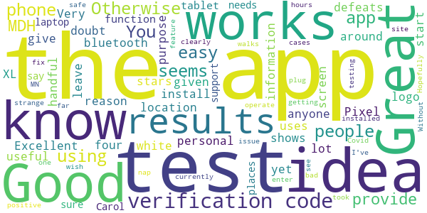

# COVIDaware MN
App version ``1.1.1``

Analyzed with [covid-apps-observer](http://github.com/covid-apps-observer) project, version ``0.1``

## App overview
| | |
|-------------------------|-------------------------| 
| **Name**                                          | COVIDaware MN |
| **Unique identifier** | org.pathcheck.covidsafepathsBt.mn |
| **Link to Google Play** | [https://play.google.com/store/apps/details?id=org.pathcheck.covidsafepathsBt.mn](https://play.google.com/store/apps/details?id=org.pathcheck.covidsafepathsBt.mn) |
| **Summary**  | Receive alerts about potential exposure to COVID-19 in Minnesota |
| **Privacy policy** | [https://covidawaremn.com/privacy-policy.shtml](https://covidawaremn.com/privacy-policy.shtml) |
| **Latest version** | 1.1.1 |
| **Last update** | 2020-11-18 19:02:42 |
| **Recent changes** | -  Initial release of COVID-19 Exposure Notifications |
| **Installs**  | 50,000+ |
| **Category** | Tools |
| **First release** | Sep 30, 2020 |
| **Size**  | 65M |
| **Supported Android version**  | 6.0 and up |

### Description
> COVIDaware MN is the official exposure notification app of the State of Minnesota. With the COVIDaware MN app, your phone gets notified when you may have been exposed to COVID-19. The app is built with privacy-preserving Exposure Notification technology developed by Apple and Google in partnership with the nonprofit PathCheck Foundation. COVIDaware MN exchanges anonymous Bluetooth keys with other app users when you are within 6 feet of each other for more than 15 minutes. If an app user reports they tested positive for COVID-19, the phones they exchanged keys with are anonymously notified. The notifications let Minnesotans know when they should take extra care and get tested. Nobody ever knows your location or identity, and no information on the use of this app can be traced back to you.
 COVIDaware MN is made available by the State of Minnesota to help slow the spread of COVID-19 in our communities. Like wearing a mask, social distancing, and washing hands, it adds another layer to our defense against the virus. No single layer is completely effective by itself, but when used together, they make us all safer. The app is part of a comprehensive contact tracing initiative managed by the Minnesota Department of Health (MDH). If you test positive for COVID-19, an MDH contact investigator will provide a test verification code you enter into the COVIDaware MN app. After you enter the verification code, other app users will be anonymously notified that they were near someone who has recently tested positive. No personal data or location tracking occurs within this app. The app’s source code is available to the public and has been carefully inspected by privacy and security experts. For complete information, visit https://covidawaremn.com.
 Help us slow the spread of COVID-19 in Minnesota by sharing COVIDaware MN with your friends and family. Let’s be COVID aware, MN!

### User interface
The developers of the app provide the following screenshots in the Google play store.
| | | |
|:-------------------------:|:-------------------------:|:-------------------------:|
 |   |   |   | 
 |  

## Development team
In the following we report the main information provided by the development team in the Google play store.

| | |
|-------------------------|-------------------------|
| **Developer**  | State of Minnesota |
| **Website**  | [https://covidawaremn.com](https://covidawaremn.com) |
| **Email** | covidawaremn@state.mn.us |
| **Physical address**  | - |
| **Other developed apps**  | [https://play.google.com/store/apps/developer?id=State+of+Minnesota](https://play.google.com/store/apps/developer?id=State+of+Minnesota) |

## Android support

| | |
|-------------------------|-------------------------|
| **Declared target Android version**  | - |
| **Effective target Android version**  | - |
| **Minimum supported Android version**  | Marshmallow, version 6.0 (API level 23) |
| **Maximum target Android version**  | - |

The larger the difference between the minimum and maximum supported Android versions, the better. A larger difference means a wider audience. For example, old phones have a very low Android version, so a high minimum supported Android version means that the app cannot be used by users with old phones, thus leading to accessibility problems. 

## Requested permissions

In the following we report the complete list of the permissions requested by the app. 

| **Permission** | **Protection level** | **Description** | 
|-------------------------|-------------------------|-------------------------|
 **android.permission ACCESS_NETWORK_STATE** | Normal | Allows applications to access information about networks. 
 **android.permission ACCESS_WIFI_STATE** | Normal | Allows applications to access information about Wi-Fi networks. 
 **android.permission BLUETOOTH** | Normal | Allows applications to connect to paired bluetooth devices. 
 **android.permission FOREGROUND_SERVICE** | Normal | Allows a regular application to use Service.startForeground. 
 **android.permission INTERNET** | Normal | Allows applications to open network sockets. 
 **android.permission RECEIVE_BOOT_COMPLETED** | Normal | Allows an application to receive the Intent.ACTION_BOOT_COMPLETED that is broadcast after the system finishes booting. 
 **android.permission VIBRATE** | Normal | Allows access to the vibrator. 
 **android.permission WAKE_LOCK** | Normal | Allows using PowerManager WakeLocks to keep processor from sleeping or screen from dimming. 

## Mentioned servers

| **Server** | **Registrant** | **Registrant country** | **Creation date** | 
|-------------------------|-------------------------|-------------------------|-------------------------|
 | bugsnag.com | Bugsnag Inc. | GB | 2011-08-18 03:26:10 |
 | android.com | Google LLC | :us: US | 1997-06-23 04:00:00 |
 | google.com | Google LLC | :us: US | 1997-09-15 04:00:00 |
 | github.com | GitHub, Inc. | :us: US | 2007-10-09 18:20:50 |

## Security analysis 

Below we report the main security warnings raised by our execution of the [Androwarn](https://github.com/maaaaz/androwarn) security analysis tool.

**Telephony identifiers leakage**
> - This application reads the numeric name (MCC+MNC) of current registered operator 
> - This application reads the operator name 

**Connection interfaces exfiltration**
> - This application reads details about the currently active data network 
> - This application tries to find out if the currently active data network is metered 

**Suspicious connection establishment**
> - This application opens a Socket and connects it to the remote address 'Ljava/lang/StringBuilder;->toString()Ljava/lang/String;' on the ': connect, resolve' port  
> - This application opens a Socket and connects it to the remote address 'Ljava/lang/StringBuilder;->toString()Ljava/lang/String;' on the 'N/A' port  
> - This application opens a Socket and connects it to the remote address 'Ljava/net/Proxy;->type()Ljava/net/Proxy$Type;' on the 'N/A' port  
> - This application opens a Socket and connects it to the remote address 'No route to  ' on the 'N/A' port  
> - This application opens a Socket and connects it to the remote address 'timeout' on the 'N/A' port  

**Pim data leakage**
> - This application accesses data stored in the clipboard 

**Code execution**
> - This application loads a native library 
> - This application executes a UNIX command 

## User ratings and reviews

Below we provide information about how end users are reacting to the app in terms of ratings and reviews in the Google Play store.

### Ratings

The COVIDaware MN app has been installed by more than **50000** times. At this time, **203** rated the app and its average score is **4.174603**. Below we show the distribution of the ratings across the usual star-based rating of Google Play

:star::star::star::star::star:: 150

:star::star::star::star:: 9

:star::star::star:: 9

:star::star:: 3

:star:: 32

### Reviews 

#### 5-star reviews

> Easy to use... but nobody in my family is willing to use it. There is too much fear about being tracked. The amount of distrust in...well, everything....is going to prevent this from being effective. Which is awful, because I'd do anything to stop this from spreading more. Facts no longer seem to matter  :date: __2020-11-29 19:27:04__

> good  :date: __2020-11-29 18:41:06__

> Do it  :date: __2020-11-29 00:11:03__

> For people whom want to be aware, I'd recommend this app! It's very helpful too.  :date: __2020-11-28 17:34:30__

> Do it. Smart concept and could definitely be helpful. Spread the word! Protect each other & please don't make false claims about the app you are unwilling to try to understand. That is what we need less of, folks. Thank you MN!  :date: __2020-11-28 14:59:21__

> Does what it says!  :date: __2020-11-28 05:24:03__

> I can confirm that for Samsung S9 absolitly *no* permissions allowed or requested.  :date: __2020-11-28 02:33:31__

> Great idea! Much needed.  :date: __2020-11-27 20:19:21__

> Five stars under the presupposition that it works as well as it claims to. The largest weakness of something like this is people not using it, so spread the word. That the app requires a code to verify positivity prevents people from trolling the service, which should assure people wary of an app like this. Please share!  :date: __2020-11-27 16:54:53__

> Very easy to install and use app! Does NOT ask for any Permissions and does NOT track you in normal use. Only Bluetooth is running to check with others using the app. Purely Autonomous! Good on Minnesota! Stay Safe everyone!  :date: __2020-11-27 08:25:42__

#### 4-star reviews

> I wish that there was a nap so I can see where cases are getting bad it would be a good feature.  :date: __2020-11-27 19:22:55__

> Great Idea  :date: __2020-11-25 00:10:39__

> I've only been using the app for 24 hours and so far it's easy to operate and walks you clearly through what the app does and how it works. My one issue is that I took a Covid test through an MDH testing site and my test results don't have a verification code. Without a verification code I can't enter my results in the app. Seems strange that we can't plug our MDH test results into our MN app. Hopefully they'll fix that!  :date: __2020-11-24 14:58:46__

> I just installed the app for my safe  :date: __2020-11-24 01:24:29__

#### 3-star reviews

> Not sure not im from not from that area but it works fine  :date: __2020-11-29 13:21:12__

> Has only one notification type called "Exposure Notification" which, despite it's name, goes off everyday when it updates the exposure database. Pointless and annoying. Fundamental flaws: doesn't account for PPE or if barriers between people, relies on voluntary positive test input rather than MDH registry. Good: No location permissions required. App Info screens shows "No permissions requested". Double blind anon ID system is good.  :date: __2020-11-27 14:38:21__

> The app does not let you specify if you have had and recovered from the virus. I had it in October and have since recovered.  :date: __2020-11-25 15:44:32__

> So how do we add a covid test result? My saliva test results (negative) did not have a verification code emailed with the test results either within the email or the PDF.  :date: __2020-11-24 18:36:34__

> Confused with apple download instructions.  :date: __2020-11-24 17:09:27__

> Location? Not sure what is requiring location turned on? My install required ZERO permissions other than to enable app notifications. We'll see how it uses resources before giving more stars. If this app saves one life in MN it is worth it. Haters of civility and Libertarians should not download!  :date: __2020-11-23 23:29:50__

> Doesn't track your location, but requires location to be on, not just bluetooth. As someone with an older phone, that drains my battery. I still think folks should download this if they can, but I'm bummed it won't work for me.  :date: __2020-11-23 22:23:20__

#### 2-star reviews

> While a good idea, currently the app does not work with my phone 😔 as it does not ask for permission for exposure notifications it simply tells you to enable them, which means the option to do so never appears on the phone. I like the idea and the app in general, until it asks the user for the access it won't work with all available devices  :date: __2020-11-26 22:56:42__

> While setting this up, the app requires location to be turned on. If the only thing the app does is connect to other Blutooth connections with the app, location shouldn't matter. Proximity matters. I have no interest in having my location turned on, whether or not I can control which apps have access to location. This should be excised, as I won't be using this app in it's current state with location on. I'm sure I'm not the only one.  :date: __2020-11-23 22:57:29__

#### 1-star reviews

> Lack of Source Code is totally unacceptable. Release the source and let MN residents download it, inspect it, asked compile it ourselves to ensure maximum privacy.  :date: __2020-11-29 07:29:25__

> This app is a great idea, however, it is not flexible enough to be practical. I did the setup when I got the app. I then turned off my Bluetooth and location. I don't need them on in the house. Went for a walk today, so I turned on mobile data, GPS, and bluetoothand thought the app was working. Nope. You have to redo setup every time you turn off those services. Makes the app useless.  :date: __2020-11-28 19:27:39__

> You have to have bluetooth on all the time, which drains my battery. I just end up with a dead phone and that out weighs my covid-19 paranoia.  :date: __2020-11-27 23:53:27__

> Just want to be like Bill Gates and put a chip in us  :date: __2020-11-27 20:53:53__

> Notification that it is CHECKING for exposures, and no split in Android notifications to only tell you when it's FOUND an exposure. Big difference, and woke my 6 month old up at midnight as it performed this "check." We need an app like this, but we need something better than this app which makes a farce out of being on top of things.  :date: __2020-11-27 06:50:28__

> Requires Bluetooth to be on???  :date: __2020-11-26 13:41:21__

> Recall Walz for violating multiple constitutional rights.  :date: __2020-11-25 22:04:43__

> App does not accept your test result code.  :date: __2020-11-25 20:25:08__

> How the hell do I go about getting a verification code so I can update that my test came back negative for Covid-19? If this was instructed some where within the app this app would get 5 stars. Since there is no link or anything there's no way for me to update to the community. That's the whole reason why we have this app. Not only for our own safety but for others as well.  :date: __2020-11-25 17:19:53__

> If a person would be conscientious enough to get a test, and enter the results in this app, wouldn't they be conscientious enough to self isolate for 10 days or does this give them "permission" to get out into the public. Also, wouldn't this app give people a false sense of security in regards to those who do not use the app and may be positive?  :date: __2020-11-25 04:23:14__

