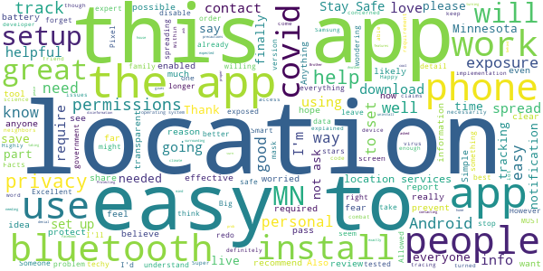
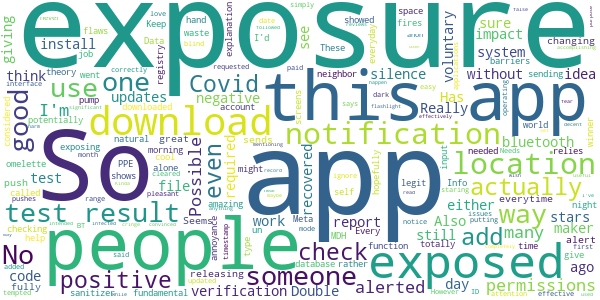
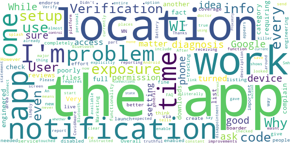

# COVIDaware MN
App version ``1.1.1``

Analyzed with [covid-apps-observer](http://github.com/covid-apps-observer) project, version ``0.1``

## App overview
| | |
|-------------------------|-------------------------| 
| **Name**                                          | COVIDaware MN |
| **Unique identifier** | org.pathcheck.covidsafepathsBt.mn |
| **Link to Google Play** | [https://play.google.com/store/apps/details?id=org.pathcheck.covidsafepathsBt.mn](https://play.google.com/store/apps/details?id=org.pathcheck.covidsafepathsBt.mn) |
| **Summary**  | Receive alerts about potential exposure to COVID-19 in Minnesota |
| **Privacy policy** | [https://covidawaremn.com/privacy-policy.shtml](https://covidawaremn.com/privacy-policy.shtml) |
| **Latest version** | 1.1.1 |
| **Last update** | 2020-11-18 19:02:42 |
| **Recent changes** | -  Initial release of COVID-19 Exposure Notifications |
| **Installs**  | 50,000+ |
| **Category** | Tools |
| **First release** | Sep 30, 2020 |
| **Size**  | 65M |
| **Supported Android version**  | 6.0 and up |

### Description
> COVIDaware MN is the official exposure notification app of the State of Minnesota. With the COVIDaware MN app, your phone gets notified when you may have been exposed to COVID-19. The app is built with privacy-preserving Exposure Notification technology developed by Apple and Google in partnership with the nonprofit PathCheck Foundation. COVIDaware MN exchanges anonymous Bluetooth keys with other app users when you are within 6 feet of each other for more than 15 minutes. If an app user reports they tested positive for COVID-19, the phones they exchanged keys with are anonymously notified. The notifications let Minnesotans know when they should take extra care and get tested. Nobody ever knows your location or identity, and no information on the use of this app can be traced back to you.
 COVIDaware MN is made available by the State of Minnesota to help slow the spread of COVID-19 in our communities. Like wearing a mask, social distancing, and washing hands, it adds another layer to our defense against the virus. No single layer is completely effective by itself, but when used together, they make us all safer. The app is part of a comprehensive contact tracing initiative managed by the Minnesota Department of Health (MDH). If you test positive for COVID-19, an MDH contact investigator will provide a test verification code you enter into the COVIDaware MN app. After you enter the verification code, other app users will be anonymously notified that they were near someone who has recently tested positive. No personal data or location tracking occurs within this app. The app’s source code is available to the public and has been carefully inspected by privacy and security experts. For complete information, visit https://covidawaremn.com.
 Help us slow the spread of COVID-19 in Minnesota by sharing COVIDaware MN with your friends and family. Let’s be COVID aware, MN!

### User interface
The developers of the app provide the following screenshots in the Google play store.
| | | |
|:-------------------------:|:-------------------------:|:-------------------------:|
 |   |   |   | 
 |  

## Development team
In the following we report the main information provided by the development team in the Google play store.

| | |
|-------------------------|-------------------------|
| **Developer**  | State of Minnesota |
| **Website**  | [https://covidawaremn.com](https://covidawaremn.com) |
| **Email** | covidawaremn@state.mn.us |
| **Physical address**  | - |
| **Other developed apps**  | [https://play.google.com/store/apps/developer?id=State+of+Minnesota](https://play.google.com/store/apps/developer?id=State+of+Minnesota) |

## Android support

| | |
|-------------------------|-------------------------|
| **Declared target Android version**  | - |
| **Effective target Android version**  | - |
| **Minimum supported Android version**  | Marshmallow, version 6.0 (API level 23) |
| **Maximum target Android version**  | - |

The larger the difference between the minimum and maximum supported Android versions, the better. A larger difference means a wider audience. For example, old phones have a very low Android version, so a high minimum supported Android version means that the app cannot be used by users with old phones, thus leading to accessibility problems. 

## Requested permissions

In the following we report the complete list of the permissions requested by the app. 

| **Permission** | **Protection level** | **Description** | 
|-------------------------|-------------------------|-------------------------|
 **android.permission ACCESS_NETWORK_STATE** | Normal | Allows applications to access information about networks. 
 **android.permission ACCESS_WIFI_STATE** | Normal | Allows applications to access information about Wi-Fi networks. 
 **android.permission BLUETOOTH** | Normal | Allows applications to connect to paired bluetooth devices. 
 **android.permission FOREGROUND_SERVICE** | Normal | Allows a regular application to use Service.startForeground. 
 **android.permission INTERNET** | Normal | Allows applications to open network sockets. 
 **android.permission RECEIVE_BOOT_COMPLETED** | Normal | Allows an application to receive the Intent.ACTION_BOOT_COMPLETED that is broadcast after the system finishes booting. 
 **android.permission VIBRATE** | Normal | Allows access to the vibrator. 
 **android.permission WAKE_LOCK** | Normal | Allows using PowerManager WakeLocks to keep processor from sleeping or screen from dimming. 

## Mentioned servers

| **Server** | **Registrant** | **Registrant country** | **Creation date** | 
|-------------------------|-------------------------|-------------------------|-------------------------|
 | bugsnag.com | Bugsnag Inc. | GB | 2011-08-18 03:26:10 |
 | android.com | Google LLC | :us: US | 1997-06-23 04:00:00 |
 | google.com | Google LLC | :us: US | 1997-09-15 04:00:00 |
 | github.com | GitHub, Inc. | :us: US | 2007-10-09 18:20:50 |

## Security analysis 

Below we report the main security warnings raised by our execution of the [Androwarn](https://github.com/maaaaz/androwarn) security analysis tool.

**Telephony identifiers leakage**
> - This application reads the numeric name (MCC+MNC) of current registered operator 
> - This application reads the operator name 

**Connection interfaces exfiltration**
> - This application reads details about the currently active data network 
> - This application tries to find out if the currently active data network is metered 

**Suspicious connection establishment**
> - This application opens a Socket and connects it to the remote address 'Ljava/lang/StringBuilder;->toString()Ljava/lang/String;' on the ': connect, resolve' port  
> - This application opens a Socket and connects it to the remote address 'Ljava/lang/StringBuilder;->toString()Ljava/lang/String;' on the 'N/A' port  
> - This application opens a Socket and connects it to the remote address 'Ljava/net/Proxy;->type()Ljava/net/Proxy$Type;' on the 'N/A' port  
> - This application opens a Socket and connects it to the remote address 'No route to  ' on the 'N/A' port  
> - This application opens a Socket and connects it to the remote address 'timeout' on the 'N/A' port  

**Pim data leakage**
> - This application accesses data stored in the clipboard 

**Code execution**
> - This application loads a native library 
> - This application executes a UNIX command 

## User ratings and reviews

Below we provide information about how end users are reacting to the app in terms of ratings and reviews in the Google Play store.

### Ratings

The COVIDaware MN app has been installed by more than **50000** times. At this time, **203** rated the app and its average score is **4.174603**. Below we show the distribution of the ratings across the usual star-based rating of Google Play

:star::star::star::star::star:: 150

:star::star::star::star:: 9

:star::star::star:: 9

:star::star:: 3

:star:: 32

### Reviews 

#### 5-star reviews

> Wearyour*mask* # one Washands* # Two Socliel distant#three Bullshitt by Appointment#Four ABSOLTLEEY SEX with out me Nomber six and allways checktempiture +104take t0 emergence room asap!!!!!!! Eat planty of salids Get lots of Rest +biulds Amune sistem+  :date: __2020-12-05 07:31:49__

> I am nervous about all of our phones constantly talking to everyone. Someone is going to screw all this up and take advantage of the vulnerability  :date: __2020-12-04 14:04:38__

> Updated review - love the app. Simple. Understandable. However, it relies on the idea that people will report their covid results to the app. I feel like people who are going out and exposing others to their illness are not going to report it to this app, or even have this app at all... So I don't understand how that part works.  :date: __2020-12-04 13:57:53__

> Excellent app! Allowed me to find individuals with Covid so I could finally catch it and no longer have to worry whether or not I'm immune or not. Just lookup the best Covid Party locations and voila! Now I'm sick and willing to pass it along to anyone that just wants to get over it so they can see family and friends again.  :date: __2020-12-02 22:39:16__

> I don't leave me bluetooth enabled for battery and security reasons, so this app will not work for me.  :date: __2020-12-02 21:45:15__

> Easy setup. No personal info required. Install it and forget it. And if you get an alert you should get tested.  :date: __2020-12-02 21:18:54__

> Not a techy expert but am 'privacy aware'. Heard the MN Covid Team when this was announced. YOUR LOCATION is NOT stored permanently & metadata is not gathered. The expert described how it works in techy detail & it made me feel ok. I suggest doing a search for a video of this announcement or read a brief online to allay your fears.  :date: __2020-12-02 20:24:06__

> If you're worried about location services, you should see how much FB is tracking you. The NSA can track you any time your phone is on. Don't carry a phone if you're really that worried. App was easy to install, works as intended.  :date: __2020-12-02 20:16:49__

> I experienced no significant battery life impact by using this app. I don't know what some of these other reviewers are on about...  :date: __2020-12-02 18:59:13__

> I think my greatest annoyance with this app is that it briefly pops up a notification once in a while (once every 6 or 12 hours?) saying that it's checking for exposures. But since it's immediately dismissed, I'm sometimes left wondering what just caused my phone to buzz. It might be better to move that to a dedicated log screen. It's good to know that the app is doing something, but that doesn't feel like the right way to show it. At least disable the vibration.  :date: __2020-12-02 13:50:57__

#### 4-star reviews

> Good idea, but needs support of the places that provides the tests. which currently do not provide a verification code with a positive test.  :date: __2020-12-02 05:45:58__

> I wish that there was a nap so I can see where cases are getting bad it would be a good feature.  :date: __2020-11-27 19:22:55__

> Great Idea  :date: __2020-11-25 00:10:39__

> I've only been using the app for 24 hours and so far it's easy to operate and walks you clearly through what the app does and how it works. My one issue is that I took a Covid test through an MDH testing site and my test results don't have a verification code. Without a verification code I can't enter my results in the app. Seems strange that we can't plug our MDH test results into our MN app. Hopefully they'll fix that!  :date: __2020-11-24 14:58:46__

> I just installed the app for my safe  :date: __2020-11-24 01:24:29__

#### 3-star reviews

> Has only one notification type called "Exposure Notification" which, despite it's name, goes off everyday exposure database updates. Had to silence this annoying notification, so defeats the purpose! More fundamental flaws: doesn't account for PPE or if barriers between people, relies on voluntary positive test input rather than MDH registry. Good: No location permissions required. App Info screens shows "No permissions requested". Double blind anon ID system is good.  :date: __2020-12-04 14:32:53__

> Kinda cringe  :date: __2020-12-02 21:59:16__

> While this app is a decent idea, my fear is that it could do more harm than good by giving people a false sense of safety. The problem is that some people will rely on the exposure report exclusively and not realize they've been exposed. This is because so few people install the app and even if someone does test positive it takes active action to register that fact.  :date: __2020-12-01 21:35:25__

> The app does not let you specify if you have had and recovered from the virus. I had it in October and have since recovered.  :date: __2020-11-25 15:44:32__

> So how do we add a covid test result? My saliva test results (negative) did not have a verification code emailed with the test results either within the email or the PDF.  :date: __2020-11-24 18:36:34__

> Confused with apple download instructions.  :date: __2020-11-24 17:09:27__

> Location? Not sure what is requiring location turned on? My install required ZERO permissions other than to enable app notifications. We'll see how it uses resources before giving more stars. If this app saves one life in MN it is worth it. Haters of civility and Libertarians should not download!  :date: __2020-11-23 23:29:50__

> Doesn't track your location, but requires location to be on, not just bluetooth. As someone with an older phone, that drains my battery. I still think folks should download this if they can, but I'm bummed it won't work for me.  :date: __2020-11-23 22:23:20__

#### 2-star reviews

> Good idea but the app doesn't start on my phone (Pixel 4 XL). It just shows a white screen with the logo.  :date: __2020-12-03 15:14:48__

> I'm sure the app works but it gave no clear description on how to get a verification code  :date: __2020-12-02 23:36:53__

> While a good idea, currently the app does not work with my phone 😔 as it does not ask for permission for exposure notifications it simply tells you to enable them, which means the option to do so never appears on the phone. I like the idea and the app in general, until it asks the user for the access it won't work with all available devices  :date: __2020-11-26 22:56:42__

> While setting this up, the app requires location to be turned on. If the only thing the app does is connect to other Blutooth connections with the app, location shouldn't matter. Proximity matters. I have no interest in having my location turned on, whether or not I can control which apps have access to location. This should be excised, as I won't be using this app in it's current state with location on. I'm sure I'm not the only one.  :date: __2020-11-23 22:57:29__

#### 1-star reviews

> I got a test, negative fortunately, but it won't allow me to report the result because it requires a verification code that I wasn't given. If this happens to people with positive tests, what's the point of even using it?  :date: __2020-12-05 01:25:40__

> The app has some fully discription screens but provides a message to configure the app that makes no sense. It doesn't discribe how to configure the app also they could use proper English. The state could also provide instructions or ways to get information how to make it work.  :date: __2020-12-04 16:01:57__

> Had to uninstall after it slowed my phone down and drained the battery. I hope the state didn't use our tax $$$ to fund.  :date: __2020-12-04 01:33:28__

> Can't plug in my results  :date: __2020-12-03 20:23:44__

> Thought I'd give this a try since I've got Covid but apparently I can't let others know without an authorization code and I never got one. MN has been an absolute joke as far as testing and contact tracing is concerned.  :date: __2020-12-03 05:06:39__

> Needing bluetooth on drains the battery too much, uninstalled.  :date: __2020-12-03 00:41:31__

> #gotbetterthingstoworryaboutandsodoyou  :date: __2020-12-02 21:58:01__

> App seems to be poorly designed in dealing with problem of crossing paths with someone who has tested positive. More concerning, however, are the privacy and security concerns this app fails to adequately address (although it claims to).  :date: __2020-12-02 21:42:40__

> Imagine installing literally state sponsored spyware Zero reason we don't have access to source code  :date: __2020-12-02 19:46:53__

> It was sucky  :date: __2020-12-02 19:44:30__

