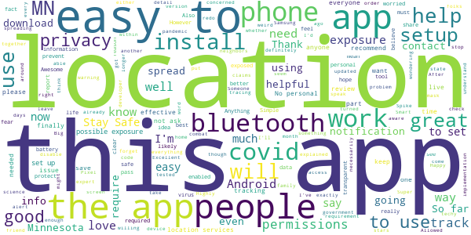

# COVIDaware MN
App version ``1.6.1``

Analyzed with [covid-apps-observer](http://github.com/covid-apps-observer) project, version ``0.1``

## App overview
| | |
|-------------------------|-------------------------| 
| **Name**                                          | COVIDaware MN |
| **Unique identifier** | org.pathcheck.covidsafepathsBt.mn |
| **Link to Google Play** | [https://play.google.com/store/apps/details?id=org.pathcheck.covidsafepathsBt.mn](https://play.google.com/store/apps/details?id=org.pathcheck.covidsafepathsBt.mn) |
| **Summary**  | Receive alerts about potential exposure to COVID-19 in Minnesota |
| **Privacy policy** | [https://covidawaremn.com/privacy-policy.shtml](https://covidawaremn.com/privacy-policy.shtml) |
| **Latest version** | 1.6.1 |
| **Last update** | 2020-12-23 02:24:55 |
| **Recent changes** | Thank you for using COVIDaware MN!  This update includes:  - Improved multi-language support - Clearer information about verification codes - More accurate exposure detection settings - Support for simpler verification code entry links |
| **Installs**  | 100,000+ |
| **Category** | Tools |
| **First release** | Sep 30, 2020 |
| **Size**  | 65M |
| **Supported Android version**  | 6.0 and up |

### Description
> COVIDaware MN is the official exposure notification app of the State of Minnesota. With the COVIDaware MN app, your phone gets notified when you may have been exposed to COVID-19. The app is built with privacy-preserving Exposure Notification technology developed by Apple and Google in partnership with the nonprofit PathCheck Foundation. COVIDaware MN exchanges anonymous Bluetooth keys with other app users when you are within 6 feet of each other for more than 15 minutes. If an app user reports they tested positive for COVID-19, the phones they exchanged keys with are anonymously notified. The notifications let Minnesotans know when they should take extra care and get tested. Nobody ever knows your location or identity, and no information on the use of this app can be traced back to you.
 COVIDaware MN is made available by the State of Minnesota to help slow the spread of COVID-19 in our communities. Like wearing a mask, social distancing, and washing hands, it adds another layer to our defense against the virus. No single layer is completely effective by itself, but when used together, they make us all safer. The app is part of a comprehensive contact tracing initiative managed by the Minnesota Department of Health (MDH). If you test positive for COVID-19, an MDH contact investigator will provide a test verification code you enter into the COVIDaware MN app. After you enter the verification code, other app users will be anonymously notified that they were near someone who has recently tested positive. No personal data or location tracking occurs within this app. The app’s source code is available to the public and has been carefully inspected by privacy and security experts. For complete information, visit https://covidawaremn.com.
 Help us slow the spread of COVID-19 in Minnesota by sharing COVIDaware MN with your friends and family. Let’s be COVID aware, MN!

### User interface
The developers of the app provide the following screenshots in the Google play store.
| | | |
|:-------------------------:|:-------------------------:|:-------------------------:|
 |   |   |   | 
 |  

## Development team
In the following we report the main information provided by the development team in the Google play store.

| | |
|-------------------------|-------------------------|
| **Developer**  | State of Minnesota |
| **Website**  | [https://covidawaremn.com](https://covidawaremn.com) |
| **Email** | covidawaremn@state.mn.us |
| **Physical address**  | - |
| **Other developed apps**  | [https://play.google.com/store/apps/developer?id=State+of+Minnesota](https://play.google.com/store/apps/developer?id=State+of+Minnesota) |

## Android support

| | |
|-------------------------|-------------------------|
| **Declared target Android version**  | - |
| **Effective target Android version**  | - |
| **Minimum supported Android version**  | Marshmallow, version 6.0 (API level 23) |
| **Maximum target Android version**  | - |

The larger the difference between the minimum and maximum supported Android versions, the better. A larger difference means a wider audience. For example, old phones have a very low Android version, so a high minimum supported Android version means that the app cannot be used by users with old phones, thus leading to accessibility problems. 

## Requested permissions

In the following we report the complete list of the permissions requested by the app. 

| **Permission** | **Protection level** | **Description** | 
|-------------------------|-------------------------|-------------------------|
 **android.permission ACCESS_NETWORK_STATE** | Normal | Allows applications to access information about networks. 
 **android.permission ACCESS_WIFI_STATE** | Normal | Allows applications to access information about Wi-Fi networks. 
 **android.permission BLUETOOTH** | Normal | Allows applications to connect to paired bluetooth devices. 
 **android.permission FOREGROUND_SERVICE** | Normal | Allows a regular application to use Service.startForeground. 
 **android.permission INTERNET** | Normal | Allows applications to open network sockets. 
 **android.permission RECEIVE_BOOT_COMPLETED** | Normal | Allows an application to receive the Intent.ACTION_BOOT_COMPLETED that is broadcast after the system finishes booting. 
 **android.permission VIBRATE** | Normal | Allows access to the vibrator. 
 **android.permission WAKE_LOCK** | Normal | Allows using PowerManager WakeLocks to keep processor from sleeping or screen from dimming. 

## Mentioned servers

| **Server** | **Registrant** | **Registrant country** | **Creation date** | 
|-------------------------|-------------------------|-------------------------|-------------------------|
 | bugsnag.com | Bugsnag Inc. | GB | 2011-08-18 03:26:10 |
 | android.com | Google LLC | :us: US | 1997-06-23 04:00:00 |
 | google.com | Google LLC | :us: US | 1997-09-15 04:00:00 |
 | github.com | GitHub, Inc. | :us: US | 2007-10-09 18:20:50 |

## Security analysis 

Below we report the main security warnings raised by our execution of the [Androwarn](https://github.com/maaaaz/androwarn) security analysis tool.

**Telephony identifiers leakage**
> - This application reads the numeric name (MCC+MNC) of current registered operator 
> - This application reads the operator name 

**Connection interfaces exfiltration**
> - This application reads details about the currently active data network 
> - This application tries to find out if the currently active data network is metered 

**Suspicious connection establishment**
> - This application opens a Socket and connects it to the remote address 'Ljava/lang/StringBuilder;->toString()Ljava/lang/String;' on the ': connect, resolve' port  
> - This application opens a Socket and connects it to the remote address 'Ljava/lang/StringBuilder;->toString()Ljava/lang/String;' on the 'N/A' port  
> - This application opens a Socket and connects it to the remote address 'Ljava/net/Proxy;->type()Ljava/net/Proxy$Type;' on the 'N/A' port  
> - This application opens a Socket and connects it to the remote address 'No route to  ' on the 'N/A' port  
> - This application opens a Socket and connects it to the remote address 'timeout' on the 'N/A' port  

**Pim data leakage**
> - This application accesses data stored in the clipboard 

**Code execution**
> - This application loads a native library 
> - This application executes a UNIX command 

## User ratings and reviews

Below we provide information about how end users are reacting to the app in terms of ratings and reviews in the Google Play store.

### Ratings

The COVIDaware MN app has been installed by more than **100000** times. At this time, **404** rated the app and its average score is **3.4455445**. Below we show the distribution of the ratings across the usual star-based rating of Google Play

:star::star::star::star::star:: 184

:star::star::star::star:: 40

:star::star::star:: 48

:star::star:: 36

:star:: 96

### Reviews 

#### 5-star reviews

> I just got my j and j shot today  :date: __2021-05-22 06:48:25__

> No warning so far!?  :date: __2021-05-08 04:20:12__

> I LOVE IT YEAAAA  :date: __2021-05-06 14:45:07__

> Awesome app  :date: __2021-04-12 19:41:17__

> Havent had any major issues so far, to speak of..certainly a work in progress  :date: __2021-02-27 03:28:13__

> Gdonna892 @gmailcom  :date: __2021-02-24 06:59:47__

> It's a very good way to keep up with the pandemic in my home state.  :date: __2021-02-21 03:19:51__

> I like the fact that this app checks for covid it alerts you to let you know what exactly its doing. Most Recommended  :date: __2021-02-16 20:26:02__

> Call V's in your head and what you did in your life will kill you  :date: __2021-02-15 05:50:20__

> Good  :date: __2021-02-05 23:46:01__

#### 4-star reviews

> Wish this app gave me a choice to make notifications silent, but still able to read. Automatically makes a sound and is annoying, but I don't want to turn the notification off  :date: __2021-05-26 21:43:10__

> Ok  :date: __2021-05-24 00:44:21__

> have had any poblms yet.  :date: __2021-04-20 20:15:01__

> We're doing better  :date: __2021-04-08 14:03:07__

> I don't know yet I just downloaded the app  :date: __2021-04-05 02:08:19__

> Why can't this be loaded onto a Fire HD tablet either via the Amazon app store or the Google play store that I also have on a Fire tablet? This would be extremely helpful for many nursing home residents that use Fire tablets and have numerous visitors and many staff possibly exposing them to Covid.  :date: __2021-03-31 23:06:45__

> Not sure exactly how to make this work.  :date: __2021-02-04 23:38:55__

> Good medicine  :date: __2021-01-12 19:16:40__

> Very easy and personal.  :date: __2020-12-28 01:18:37__

> Excellent information  :date: __2020-12-10 15:11:22__

#### 3-star reviews

> HogWash  :date: __2021-04-12 18:39:53__

> I got sick today again all day getting I'm not giving you and single drop!!!!!!!!!!  :date: __2021-04-08 01:12:55__

> Sends notifications late at night and early in the morning. Irritating!  :date: __2021-04-05 18:19:52__

> Great if you live in MN  :date: __2021-02-15 00:36:46__

> This app was making my phone battery drain significantly faster than usual. Uninstalled it and sure enough, I'm back to having plenty of charge left at the end of the day. Also, I'm not sure how useful it was, when it only reports exposures of 15+ minutes, in a world with highly contagious mutations and aerosols lingering after people have moved on. Good idea, but since I'm being extra-careful, I'm uninstalling and having my phone battery function normally.  :date: __2021-02-08 18:18:46__

> Not as useful as I thought it would be.  :date: __2021-02-02 08:36:50__

> App is simple to use. Haven't been exposed so not sure if it's working. But a new bug has emerged. It's no longer updating my exposure checks. The notification stays active and can't be dismissed. I am uninstalling until it can be fixed. Don't feel like seeing a constant notification but isn't actually checking my exposure.  :date: __2021-01-13 14:40:41__

> Broken! The checking exposure notification doesn't ever go away. This is completely unacceptable as it will cause people to delete the app.  :date: __2021-01-13 06:56:40__

> Virus control  :date: __2021-01-08 00:06:45__

> So far, I can't tell, but tomorrow I go to hospital. I expect it will go off like crazy there. Not sure what the range is...6'? 20'? For airborne virus, 6' is no where near enough distance. I surmized that in January 2020, based on YouTube reports of medical analyst Dr. John Campbell. Check his channel out.  :date: __2020-12-29 19:44:24__

#### 2-star reviews

> I guess if you're really into covid like that but I don't want to be notified every 10 minutes about people that had to go I'm vaccinated I'm good  :date: __2021-05-18 14:24:17__

> It never reported a thing even when I was exposed to Covid and it did a download to my phone every check. Now I have to go in and delete all those downloads...not happy.😑🤬  :date: __2021-05-05 17:15:11__

> Eh.... obviously needs work.  :date: __2021-04-20 17:38:42__

> Not all that helpfull  :date: __2021-04-03 02:53:37__

> Annoying, I work at home and only go out if I need to go out. I dont want my Bluetooth on 24/7. Have a "home" button that stops the annoying message saying it can tract since I don't have my Bluetooth on  :date: __2021-03-24 16:25:10__

> I find that my phone does not have enough space to install this app. I have 2 big apps on my phone, and that is all that I can fit. It would be nice if cell phones were less expensive or if my employer issued me a cell phone, but they aren't and they don't, I am not paying $30-$200 per month for a cell phone. $125/year is plenty! So call my land-line or send me an email.  :date: __2021-03-12 22:04:43__

> Random notifications with no information in them, no information from MN about how or whether it has been effective... seemed a bit pointless.  :date: __2021-03-10 05:25:28__

> I tested this app with someone I know had recently tested positive for Covid-19 2 days after they entered their confirmation code. I never recieved a notice or warning. My phone was next to this person's phone on a table for two hours on three different days? I'm concerned about the purpose for this application and where this information is going and why.. I think logically and am not afflicted with episodes of paranoia. Please explain.  :date: __2021-02-26 09:16:08__

> This app gives very vague information about potential exposure. It caused me to be quarantined for exposure to a neighbor whom I rarely ever see. That placed me closer to that neighbor than I normally would be. After testing negative on the 6th day, I decided to remove the app from my phone.  :date: __2021-02-18 14:08:36__

> Downloads multiples files every day, there is no settings I have limited data and there is no download with confirmation to see if we want to wait on the updates. It's downloads showing in notifications bar. This behavior is not acceptable to me...as I have Limited data each month. Give us the option to download these files for the app when we are ina Wi-Fi spot..I don't want to use my cellular data all the time, give us the ability to stop auto downloads till we get to wifi spot. Thanks  :date: __2021-02-04 04:32:02__

#### 1-star reviews

> Because this app is state specific, it does little good since I am traveling out of state about half the time. When I am in MN I live alone and would prefer to turn the Bluetooth off when home or out of state since there is zero chance of exposure but that is not an option without frequent notice that I need to turn Bluetooth on.  :date: __2021-05-24 23:30:09__

> Tired of the constant notifications that it's checking for exposures with no option to turn that notification off without turning off exposure notifications. This is getting deleted.  :date: __2021-05-07 17:05:14__

> There's a bug that occasionally causes this app to check for exposures about once a minute nonstop.  :date: __2021-04-29 07:23:17__

> It keeps checking exposures every 2 minutes  :date: __2021-04-27 17:39:43__

> It does not work  :date: __2021-04-13 21:23:16__

> Useless. If you have covid you will know by... being sick!  :date: __2021-04-13 20:00:19__

> Got a positive result through the city of mpls' testing site at the convention center today. To report my positive to the app I need a code. My results didn't come with a code.  :date: __2021-04-06 05:35:57__

> Full of adds  :date: __2021-04-05 20:25:30__

> Wasn't able to enter my code for a positive test. Boyfriend entered his code and I was never alerted about coming into contact with him? ?  :date: __2021-04-01 00:24:15__

> Buggy and annoying. The "checking exposures" notification will pop up on top of literally everything else even though a background process running is my lowest priority unless I've actually been exposed. And sometimes it gets stuck in a loop causing it to pop up over and over for a period of about 5 minutes. And during that 5 minutes, the app itself won't even open - it gets stuck on the splash screen. Edit: uninstalling because still no fix and just got 20 notifications in a row.  :date: __2021-03-31 19:32:39__

