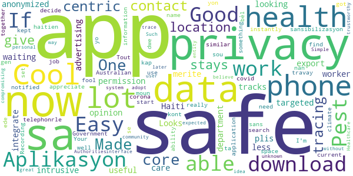
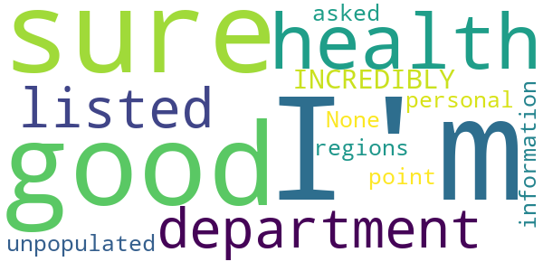
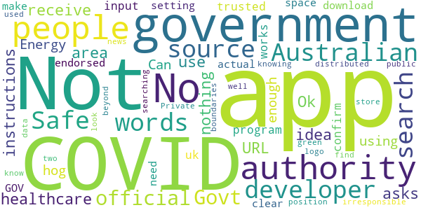

# PathCheck SafePlaces
App version ``1.3.1 (2)``

Analyzed with [covid-apps-observer](http://github.com/covid-apps-observer) project, version ``0.1``

## App overview
| | |
|-------------------------|-------------------------| 
| **Name**&nbsp;&nbsp;&nbsp;&nbsp;&nbsp;&nbsp;&nbsp;&nbsp;&nbsp;&nbsp;&nbsp;&nbsp;&nbsp;&nbsp;&nbsp;&nbsp;&nbsp;&nbsp;&nbsp;&nbsp;&nbsp;&nbsp;&nbsp;&nbsp;&nbsp;&nbsp;&nbsp;&nbsp;&nbsp;&nbsp;&nbsp;&nbsp;&nbsp;&nbsp;&nbsp;&nbsp;&nbsp;&nbsp;&nbsp;&nbsp;  | PathCheck SafePlaces |
| **Unique identifier** | org.pathcheck.covidsafepaths |
| **Link to Google Play** | [https://play.google.com/store/apps/details?id=org.pathcheck.covidsafepaths](https://play.google.com/store/apps/details?id=org.pathcheck.covidsafepaths) |
| **Summary**  | Compare public COVID data with your own private location history where available |
| **Privacy policy** | [https://pathcheck.org/privacy-policy/](https://pathcheck.org/privacy-policy/) |
| **Latest version** | 1.3.1 (2) |
| **Last update** | 2020-08-05 02:37:44 |
| **Recent changes** | • You can now delete your Location History. • We think you&#39;ll find the calendar interface is a bit more clear. • We&#39;ve made improvements to the Exposure Notifications (ENs). |
| **Installs**  | 10,000+ |
| **Category** | Tools |
| **First release** | Apr 15, 2020 |
| **Size**  | 37M |
| **Supported Android version**  | 5.0 and up |

### Description
> PathCheck (formerly COVID Safe Paths) can privately save the places you visit and store them on your phone. Subscribe to Healthcare Authorities in your area for information about COVID-19 near you, where available. 
 Receive alerts from your local Healthcare Authority with information about potential exposure to COVID-19.
 We are a global movement to develop free, open-source, privacy-by-design tools for residents, public health officials, and larger communities.
 The PathCheck program has spun out of initial privacy-first research conducted by MIT and TripleBlind, into a newly created non-profit called PathCheck Foundation, established with the initial purpose of supporting global rollout of the PathCheck app and associated tools for contact tracers and healthcare authorities. 
 The goal of PathCheck is to help enable the reemergence and re-opening of economies and communities.  Through global partnerships, we are prepared to support public health officials everywhere in the effort to slow the spread of COVID-19.

### User interface
The developers of the app provide the following screenshots in the Google play store.
| | | |
|:-------------------------:|:-------------------------:|:-------------------------:|
 |   |   |   | 
 |   |   |   | 

## Development team
In the following we report the main information provided by the development team in the Google play store.

| | |
|-------------------------|-------------------------|
| **Developer**  | Path Check, Inc |
| **Website**  | [https://pathcheck.org](https://pathcheck.org) |
| **Email** | support@pathcheck.org |
| **Physical address**  | - |
| **Other developed apps**  | [https://play.google.com/store/apps/developer?id=Path+Check,+Inc](https://play.google.com/store/apps/developer?id=Path+Check,+Inc) |

## Android support

| | |
|-------------------------|-------------------------|
| **Declared target Android version**  | Pie, version 9 (API level 28) |
| **Effective target Android version**  | Pie, version 9 (API level 28) |
| **Minimum supported Android version**  | Lollipop, version 5.0 (API level 21) |
| **Maximum target Android version**  | - |

The larger the difference between the minimum and maximum supported Android versions, the better. A larger difference means a wider audience. For example, old phones have a very low Android version, so a high minimum supported Android version means that the app cannot be used by users with old phones, thus leading to accessibility problems. 

## Requested permissions

In the following we report the complete list of the permissions requested by the app. 

| **Permission** | **Protection level** | **Description** | 
|-------------------------|-------------------------|-------------------------|
 **android.hardware location** | - | - 
 **android.permission ACCESS_BACKGROUND_LOCATION** | :warning:**Dangerous** | Allows an app to access location in the background. 
 **android.permission ACCESS_COARSE_LOCATION** | :warning:**Dangerous** | Allows an app to access approximate location. 
 **android.permission ACCESS_FINE_LOCATION** | :warning:**Dangerous** | Allows an app to access precise location. 
 **android.permission ACCESS_LOCATION_EXTRA_COMMANDS** | Normal | Allows an application to access extra location provider commands. 
 **android.permission ACCESS_NETWORK_STATE** | Normal | Allows applications to access information about networks. 
 **android.permission ACCESS_WIFI_STATE** | Normal | Allows applications to access information about Wi-Fi networks. 
 **android.permission AUTHENTICATE_ACCOUNTS** | - | - 
 **android.permission FOREGROUND_SERVICE** | Normal | Allows a regular application to use Service.startForeground. 
 **android.permission GET_TASKS** | Deprecated | This constant was deprecated in API level 21. No longer enforced. 
 **android.permission INTERNET** | Normal | Allows applications to open network sockets. 
 **android.permission READ_APP_BADGE** | - | - 
 **android.permission READ_SYNC_SETTINGS** | Normal | Allows applications to read the sync settings. 
 **android.permission RECEIVE_BOOT_COMPLETED** | Normal | Allows an application to receive the Intent.ACTION_BOOT_COMPLETED that is broadcast after the system finishes booting. 
 **android.permission VIBRATE** | Normal | Allows access to the vibrator. 
 **android.permission WAKE_LOCK** | Normal | Allows using PowerManager WakeLocks to keep processor from sleeping or screen from dimming. 
 **android.permission WRITE_EXTERNAL_STORAGE** | :warning:**Dangerous** | Allows an application to write to external storage. 
 **android.permission WRITE_SYNC_SETTINGS** | Normal | Allows applications to write the sync settings. 
 **com.anddoes.launcher.permission UPDATE_COUNT** | - | - 
 **com.android.vending CHECK_LICENSE** | - | - 
 **com.google.android.c2dm.permission RECEIVE** | - | - 
 **com.google.android.finsky.permission BIND_GET_INSTALL_REFERRER_SERVICE** | - | - 
 **com.google.android.gms.permission ACTIVITY_RECOGNITION** | - | - 
 **com.htc.launcher.permission READ_SETTINGS** | - | - 
 **com.htc.launcher.permission UPDATE_SHORTCUT** | - | - 
 **com.huawei.android.launcher.permission CHANGE_BADGE** | - | - 
 **com.huawei.android.launcher.permission READ_SETTINGS** | - | - 
 **com.huawei.android.launcher.permission WRITE_SETTINGS** | - | - 
 **com.majeur.launcher.permission UPDATE_BADGE** | - | - 
 **com.oppo.launcher.permission READ_SETTINGS** | - | - 
 **com.oppo.launcher.permission WRITE_SETTINGS** | - | - 
 **com.sec.android.provider.badge.permission READ** | - | - 
 **com.sec.android.provider.badge.permission WRITE** | - | - 
 **com.sonyericsson.home.permission BROADCAST_BADGE** | - | - 
 **com.sonymobile.home.permission PROVIDER_INSERT_BADGE** | - | - 
 **me.everything.badger.permission BADGE_COUNT_READ** | - | - 
 **me.everything.badger.permission BADGE_COUNT_WRITE** | - | - 

## Mentioned servers

| **Server** | **Registrant** | **Registrant country** | **Creation date** | 
|-------------------------|-------------------------|-------------------------|-------------------------|
 | android.com | Google LLC | :us: US | 1997-06-23 04:00:00 |
 | google.com | Google LLC | :us: US | 1997-09-15 04:00:00 |
 | xml.org | OASIS Open | :us: US | 1997-02-03 05:00:00 |
 | facebook.com | Facebook, Inc. | :us: US | 1997-03-29 05:00:00 |
 | pinterest.com | DNStination Inc. | :us: US | 2009-11-26 19:21:23 |
 | twitter.com | Twitter, Inc. | :us: US | 2000-01-21 16:28:17 |
 | googleapis.com | Google LLC | :us: US | 2005-01-25 17:52:26 |

## Security analysis 

Below we report the main security warnings raised by our execution of the [Androwarn](https://github.com/maaaaz/androwarn) security analysis tool.

**Telephony identifiers leakage**
> - This application reads the numeric name (MCC+MNC) of current registered operator 
> - This application reads the operator name 
> - This application reads the phone number string for line 1, for example, the MSISDN for a GSM phone 

**Location lookup**
> - This application reads location information from all available providers (WiFi, GPS etc.) 

**Connection interfaces exfiltration**
> - This application reads details about the currently active data network 
> - This application tries to find out if the currently active data network is metered 

**Suspicious connection establishment**
> - This application opens a Socket and connects it to the remote address '' on the 'N/A' port  
> - This application opens a Socket and connects it to the remote address 'Ljava/lang/StringBuilder;->toString()Ljava/lang/String;' on the ': connect, resolve' port  
> - This application opens a Socket and connects it to the remote address 'Ljava/lang/StringBuilder;->toString()Ljava/lang/String;' on the 'N/A' port  
> - This application opens a Socket and connects it to the remote address 'Ljava/net/Proxy;->type()Ljava/net/Proxy$Type;' on the 'N/A' port  
> - This application opens a Socket and connects it to the remote address 'timeout' on the 'N/A' port  

**Pim data leakage**
> - This application accesses the downloads folder 
> - This application accesses data stored in the clipboard 

**Code execution**
> - This application loads a native library 
> - This application executes a UNIX command 

## User ratings and reviews

Below we provide information about how end users are reacting to the app in terms of ratings and reviews in the Google Play store.

### Ratings

The PathCheck SafePlaces app has been installed by more than **10000** times. At this time, **73** rated the app and its average score is **4.1643834**. Below we show the distribution of the ratings across the usual star-based rating of Google Play

:star::star::star::star::star:: 54

:star::star::star::star:: 3

:star::star::star:: 2

:star::star:: 2

:star:: 12

### Reviews 

#### 5-star reviews

> Made with privacy at its core.  :date: __2020-07-05 04:32:14__

> One of the very few safe and privacy-centric contact tracing app.  :date: __2020-07-05 04:31:47__

> I like that any location data stays on my phone until I give permission to export it to a health care worker and that it is then anonymized. Looks a lot less intrusive then all the targeted advertising that tracks me and a lot more useful, in my opinion. Cool looking app. Now just waiting for my health department to integrate it.  :date: __2020-06-26 01:51:35__

> Haiti merite plis sansibilizasyon nan sans sa kap ede moun kont corona.... Aplikasyon sa se yon bèl travay....  :date: __2020-05-08 21:20:02__

> Tout haitien ta dwe gen aplikasyon sa sou telephonrle yo. Good job  :date: __2020-05-07 21:19:54__

> Just got notified of the data instantly now. I'm safe! Easy to use.  :date: __2020-05-03 05:08:46__

> Pest  :date: __2020-04-30 23:52:20__

> Good  :date: __2020-04-29 16:13:05__

> Easy to set up and I appreciate that my information is kept on my phone so it is safe.  :date: __2020-04-27 17:36:59__

> Works really well  :date: __2020-04-27 16:11:12__

#### 4-star reviews

No recent reviews available with 4 stars.

#### 3-star reviews

No recent reviews available with 3 stars.

#### 2-star reviews

> I'm not sure what good this does when there's only 5 health department listed and 3 of them are in INCREDIBLY unpopulated regions. 🤦‍♀️  :date: __2020-08-24 22:15:11__

> None of my personal information has been asked for... What's the point???  :date: __2020-04-28 02:37:53__

#### 1-star reviews

> No instructions how to use! I have no idea where to get the "healthcare authority" URL the app asks for and therefore receive nothing about COVID in my area.  :date: __2020-07-01 11:44:15__

> Ok  :date: __2020-05-14 07:35:03__

> Energy hog. Not enough people using it.  :date: __2020-05-11 03:28:14__

> Can developer of this program confirm if it works in the uk. If it does what trusted source or authority do i input when setting up  :date: __2020-04-28 11:26:45__

> Do not download this app, search "Covid Safe" with a space between the words to get the actual Australian Government app.  :date: __2020-04-27 00:29:56__

> NOT THE AUSTRALIAN GOV APP  :date: __2020-04-27 00:05:25__

> Not the app endorsed by the government  :date: __2020-04-26 23:34:36__

> The app developers need to make it clear this isn't the official government app. It's irresponsible for them to position this in the store knowing people are searching for the Govt App. To find the Govt App search "Covid safe" as two words and look for the official green logo distributed on well know public news sources.  :date: __2020-04-26 11:11:39__

> Private data is being used beyond COVID-19 boundaries.  :date: __2020-04-26 08:59:35__

