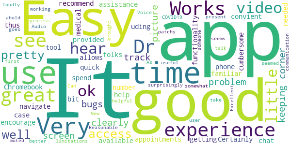
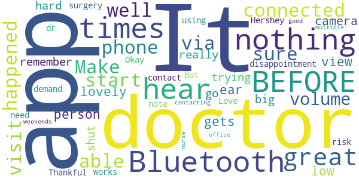
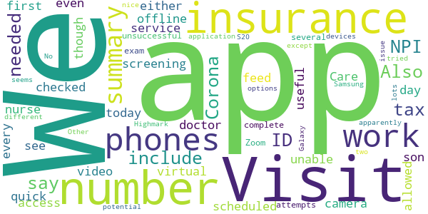

# Penn State Health OnDemand
App version ``12.0.16.005_01``

Analyzed with [covid-apps-observer](http://github.com/covid-apps-observer) project, version ``0.1``

## App overview
| | |
|-------------------------|-------------------------| 
| **Name**&nbsp;&nbsp;&nbsp;&nbsp;&nbsp;&nbsp;&nbsp;&nbsp;&nbsp;&nbsp;&nbsp;&nbsp;&nbsp;&nbsp;&nbsp;&nbsp;&nbsp;&nbsp;&nbsp;&nbsp;&nbsp;&nbsp;&nbsp;&nbsp;&nbsp;&nbsp;&nbsp;&nbsp;&nbsp;&nbsp;&nbsp;&nbsp;&nbsp;&nbsp;&nbsp;&nbsp;&nbsp;&nbsp;&nbsp;&nbsp;  | Penn State Health OnDemand |
| **Unique identifier** | org.pennstatehealth.android.pshh.ondemand |
| **Link to Google Play** | [https://play.google.com/store/apps/details?id=org.pennstatehealth.android.pshh.ondemand](https://play.google.com/store/apps/details?id=org.pennstatehealth.android.pshh.ondemand) |
| **Summary**  | Access healthcare providers from wherever you are, whenever you need them! |
| **Privacy policy** | [https://www.americanwell.com/privacy-policy/](https://www.americanwell.com/privacy-policy/) |
| **Latest version** | 12.0.16.005_01 |
| **Last update** | 2020-10-22 17:14:50 |
| **Recent changes** | We continue to improve the patient experience with these new features: • Performance enhancements to increase reliability and speed |
| **Installs**  | 10,000+ |
| **Category** | Medical |
| **First release** | Jul 24, 2018 |
| **Size**  | 52M |
| **Supported Android version**  | 5.0 and up |

### Description
> Now, board-certified health care providers can care for you or your child wherever you are, whenever you need them, from the convenience of your own mobile device or computer. From coughs and sore throats, to minor skin irritations and joint pain – we have you covered. An easier way to access both adult and pediatric care teams for urgent clinical care needs and common concerns – on your schedule, and in about 10 minutes!
 Your virtual visit may even be less expensive than your other care options, compared to urgent care clinics and emergency rooms.
 Simply download the app and register, and then select a provider and ‘click.’
 Once you select a provider, the online communication begins shortly thereafter! Telehealth providers accessed via the Penn State Health OnDemand app will diagnose, may suggest follow-up care, and can prescribe medication.
 Healthcare that meets you where you are and at your convenience; helping you feel better and return to your life sooner.
 Penn State Health OnDemand can be used for various common symptoms and concerns:
 • Allergies
 • Cough
 • Eye infections
 • Joint pain or strains
 • Lower back pain
 • Minor rashes and skin concerns
 • Painful urination
 • Sore throat
 • Stuffy and runny nose
  
 The Penn State Health OnDemand telehealth program is not be appropriate for all concerns. The following symptoms should not be treated by a telehealth provider; go to the closest emergency room for in-person care:
 • Assault, physical or sexual abuse, or child abuse
 • Changes in mental status or confusion
 • Chest pain or pressure
 • Coughing/vomiting blood
 • Difficulty breathing or shortness of breath
 • Severe or persistent vomiting or diarrhea
 • Sudden dizziness, weakness, change in vision, slurred speech, numbness, or other neurological changes
 • Sudden or severe pain
 • Uncontrolled bleeding

### User interface
The developers of the app provide the following screenshots in the Google play store.
| | | |
|:-------------------------:|:-------------------------:|:-------------------------:|
 |   |   |   | 
 |   |   |   | 
 |   |   |   | 
 |   |   |   | 

## Development team
In the following we report the main information provided by the development team in the Google play store.

| | |
|-------------------------|-------------------------|
| **Developer**  | Penn State Health |
| **Website**  | [http://www.pennstatehealth.org](http://www.pennstatehealth.org) |
| **Email** | innovate@pennstatehealth.psu.edu |
| **Physical address**  | [Penn State Health 500 University Dr MCH162 Hershey, PA 17033](https://www.google.com/maps/search/Penn%20State%20Health%20500%20University%20Dr%20MCH162%20Hershey,%20PA%2017033) (Google Maps) |
| **Other developed apps**  | [https://play.google.com/store/apps/developer?id=Penn+State+Health](https://play.google.com/store/apps/developer?id=Penn+State+Health) |

## Android support

| | |
|-------------------------|-------------------------|
| **Declared target Android version**  | Android10, version 10 (API level 29) |
| **Effective target Android version**  | Android10, version 10 (API level 29) |
| **Minimum supported Android version**  | Lollipop, version 5.0 (API level 21) |
| **Maximum target Android version**  | - |

The larger the difference between the minimum and maximum supported Android versions, the better. A larger difference means a wider audience. For example, old phones have a very low Android version, so a high minimum supported Android version means that the app cannot be used by users with old phones, thus leading to accessibility problems. 

## Requested permissions

In the following we report the complete list of the permissions requested by the app. 

| **Permission** | **Protection level** | **Description** | 
|-------------------------|-------------------------|-------------------------|
 **android.permission ACCESS_COARSE_LOCATION** | :warning:**Dangerous** | Allows an app to access approximate location. 
 **android.permission ACCESS_FINE_LOCATION** | :warning:**Dangerous** | Allows an app to access precise location. 
 **android.permission ACCESS_LOCATION_EXTRA_COMMANDS** | Normal | Allows an application to access extra location provider commands. 
 **android.permission ACCESS_NETWORK_STATE** | Normal | Allows applications to access information about networks. 
 **android.permission ACCESS_WIFI_STATE** | Normal | Allows applications to access information about Wi-Fi networks. 
 **android.permission BLUETOOTH** | Normal | Allows applications to connect to paired bluetooth devices. 
 **android.permission BROADCAST_STICKY** | Normal | Allows an application to broadcast sticky intents. 
 **android.permission CAMERA** | :warning:**Dangerous** | Required to be able to access the camera device. 
 **android.permission GET_TASKS** | Deprecated | This constant was deprecated in API level 21. No longer enforced. 
 **android.permission INTERNET** | Normal | Allows applications to open network sockets. 
 **android.permission MODIFY_AUDIO_SETTINGS** | Normal | Allows an application to modify global audio settings. 
 **android.permission READ_EXTERNAL_STORAGE** | :warning:**Dangerous** | Allows an application to read from external storage. 
 **android.permission READ_PHONE_STATE** | :warning:**Dangerous** | Allows read only access to phone state, including the phone number of the device, current cellular network information, the status of any ongoing calls, and a list of any PhoneAccounts registered on the device. 
 **android.permission RECEIVE_BOOT_COMPLETED** | Normal | Allows an application to receive the Intent.ACTION_BOOT_COMPLETED that is broadcast after the system finishes booting. 
 **android.permission RECORD_AUDIO** | :warning:**Dangerous** | Allows an application to record audio. 
 **android.permission REORDER_TASKS** | Normal | Allows an application to change the Z-order of tasks. 
 **android.permission SYSTEM_ALERT_WINDOW** | Signature - preinstalled - appop - pre23 - development | Allows an app to create windows using the type WindowManager.LayoutParams.TYPE_APPLICATION_OVERLAY, shown on top of all other apps. 
 **android.permission USE_BIOMETRIC** | Normal | Allows an app to use device supported biometric modalities. 
 **android.permission USE_FINGERPRINT** | Normal | This constant was deprecated in API level 28. Applications should request USE_BIOMETRIC instead 
 **android.permission VIBRATE** | Normal | Allows access to the vibrator. 
 **android.permission WAKE_LOCK** | Normal | Allows using PowerManager WakeLocks to keep processor from sleeping or screen from dimming. 
 **android.permission WRITE_EXTERNAL_STORAGE** | :warning:**Dangerous** | Allows an application to write to external storage. 
 **com.facebook.katana.provider ACCESS** | - | - 
 **com.google.android.c2dm.permission RECEIVE** | - | - 
 **com.google.android.finsky.permission BIND_GET_INSTALL_REFERRER_SERVICE** | - | - 
 **org.pennstatehealth.android.pshh.ondemand.permission C2D_MESSAGE** | - | - 

## Mentioned servers

| **Server** | **Registrant** | **Registrant country** | **Creation date** | 
|-------------------------|-------------------------|-------------------------|-------------------------|
 | amwell.com | American Well Corporation | :us: US | 2004-02-13 19:02:32 |
 | facebook.com | Facebook, Inc. | :us: US | 1997-03-29 05:00:00 |
 | doubleclick.net | Google Inc. | :us: US | 1996-01-16 05:00:00 |
 | googleadservices.com | Google LLC | :us: US | 2003-06-19 16:34:53 |
 | google.com | Google LLC | :us: US | 1997-09-15 04:00:00 |
 | googlesyndication.com | Google LLC | :us: US | 2003-01-21 06:17:24 |
 | google-analytics.com | Google LLC | :us: US | 2005-07-18 19:24:32 |
 | app-measurement.com | Google LLC | :us: US | 2015-06-19 20:13:31 |
 | appboy.com | Braze, Inc. | :us: US | 2008-10-06 23:28:32 |
 | braze.com | Braze, Inc. | :us: US | 2000-01-19 02:18:28 |
 | optimizely.com | Optimizely | :us: US | 2010-01-11 03:01:32 |
 | twitter.com | Twitter, Inc. | :us: US | 2000-01-21 16:28:17 |
 | branch.io | Branch | :us: US | 2011-11-10 13:52:13 |
 | gstatic.com | Google LLC | :us: US | 2008-02-11 15:31:25 |
 | crashlytics.com | Google LLC | :us: US | 2011-01-21 15:30:40 |
 | bnc.lt | - | - | 2016-11-14 00:00:00 |
 | ggpht.com | Google LLC | :us: US | 2008-01-16 18:55:33 |

## Security analysis 

Below we report the main security warnings raised by our execution of the [Androwarn](https://github.com/maaaaz/androwarn) security analysis tool.

**Telephony identifiers leakage**
> - This application reads the ISO country code equivalent for the SIM provider's country code 
> - This application reads the ISO country code equivalent of the current registered operator's MCC (Mobile Country Code) 
> - This application reads the MCC+MNC of the provider of the SIM 
> - This application reads the device phone type value 
> - This application reads the numeric name (MCC+MNC) of current registered operator 
> - This application reads the operator name 
> - This application reads the phone's current state 
> - This application reads the radio technology (network type) currently in use on the device for data transmission 

**Connection interfaces exfiltration**
> - This application reads details about the currently active data network 
> - This application tries to find out if the currently active data network is metered 

**Telephony services abuse**
> - This application makes phone calls 

**Audio video eavesdropping**
> - This application captures video from the 'CAMERA' source 

**Suspicious connection establishment**
> - This application opens a Socket and connects it to the remote address ' returned no addresses for  ; port is out of range' on the 'N/A' port  
> - This application opens a Socket and connects it to the remote address '' on the 'N/A' port  
> - This application opens a Socket and connects it to the remote address 'Ljava/net/Proxy;->type()Ljava/net/Proxy$Type;' on the 'N/A' port  
> - This application opens a Socket and connects it to the remote address 'timeout' on the 'N/A' port  

**Code execution**
> - This application loads a native library 
> - This application executes a UNIX command containing this argument: '2' 

## User ratings and reviews

Below we provide information about how end users are reacting to the app in terms of ratings and reviews in the Google Play store.

### Ratings

The Penn State Health OnDemand app has been installed by more than **10000** times. At this time, **350** rated the app and its average score is **4.63**. Below we show the distribution of the ratings across the usual star-based rating of Google Play

:star::star::star::star::star:: 292

:star::star::star::star:: 28

:star::star::star:: 10

:star::star:: 3

:star:: 17

### Reviews 

#### 5-star reviews

> App worked flawlessly. Excellent !!!  :date: __2021-02-04 19:24:15__

> Good  :date: __2021-02-02 19:23:32__

> Great  :date: __2021-02-02 15:55:36__

> Very handy  :date: __2021-01-27 14:19:20__

> Super Easy. No glitches. Reminders before appointments are great.  :date: __2021-01-27 13:31:45__

> I like it  :date: __2021-01-26 14:47:12__

> Lets just say that I am an "older" person that at times has some difficulty with computers. This app was easy to work through and my video appointment went very well. Thanks Russ Miller  :date: __2021-01-25 19:51:29__

> Great  :date: __2021-01-25 14:57:11__

> Always a pleasant visit with Dr Gomaa.and staff all are great  :date: __2021-01-22 16:30:45__

> Exceptional  :date: __2021-01-15 21:00:41__

#### 4-star reviews

> The experience was ok. I could hear and see my Dr. clearly. The problem was my Dr. could hear me, but she could not see me. My video was on, I could see my picture in the corner of my screen.  :date: __2021-02-01 15:11:25__

> Easy to use.  :date: __2021-01-25 16:48:01__

> The app does have its little bugs, but it's great for keeping track of appointments and the video chat works pretty well.  :date: __2020-10-28 14:26:32__

> Works great  :date: __2020-09-04 21:04:46__

> Great medical access tool. Its a bit cumbersome to navigate but allows quick convient access to Drs. A help phone number is provided in case assistance is needed with app. Certainly would recommend uding thus app and encourage folks to spend a little time getting familiar with available functionality.  :date: __2020-08-31 16:00:56__

> Could not do it on Chromebook.  :date: __2020-06-26 18:00:31__

> Good  :date: __2020-06-23 20:20:17__

> Very good app  :date: __2020-06-22 20:54:09__

> It was surprisingly easy to use.  :date: __2020-06-03 20:22:09__

> Easy to use!  :date: __2020-05-28 22:40:15__

#### 3-star reviews

> Okay. It was a dr app.  :date: __2020-12-17 21:45:53__

> It's great - when it works.  :date: __2020-11-18 16:55:44__

> Love Hershey!! On demand is great for those at risk! Thankful for this app! But can't contact a doctor that I had surgery with and who I need a note from after contacting the nurse's office multiple times.  :date: __2020-09-15 18:28:32__

> good for weekends  :date: __2019-05-18 21:38:16__

#### 2-star reviews

> Visit summary does not include NPI number or tax ID number, both of which are needed for insurance. Also, they say Corona screening 7:00 a.m. to 7:00 p.m., but the day I checked every nurse was offline. This app can be useful for quick first Care service, however.  :date: __2021-01-16 18:42:33__

> I had a virtual visit scheduled today for my son. The doctor was unable to see our video feed on either of our phones even though we allowed access to the camera. We had to complete the exam over Zoom after several unsuccessful attempts to get this application to work. Other than this issue, it seems like a nice app with lots of potential. We tried the app on two different Galaxy S20+ phones.  :date: __2020-11-12 03:12:03__

> No insurance options except Highmark and doesn't work on Samsung devices apparently.  :date: __2019-07-07 18:45:30__

#### 1-star reviews

> Very unsatisfied, how can you see a child's throat through a damn phone camera, I'll never even go to that doctor's office again  :date: __2020-10-29 11:47:46__

> Keeps crashing, but even when it does work, the UI is terrible.  :date: __2020-09-26 16:03:55__

> Does not to open  :date: __2020-09-09 16:04:28__

> Not doctor related  :date: __2020-08-08 20:40:11__

> Got connected and it kept saying I was next in turn for 2hrs and counting!  :date: __2020-08-06 17:40:25__

> I logged in for my appointment, 15 minutes early as instructed, and the doctor never connected. I was left in the virtual "waiting room" for over two hours. I had to contact the doctor's office on the phone myself. The app now says that I "missed my appointment." The doctor's staff says I did everything right and they aren't sure what happened.  :date: __2020-07-01 19:02:34__

> Worked fine for me, until I added my kids. Now when I log in, it becomes a slow strobe light. Uninstalled and reinstalled, same thing, app chokes and tech support cannot see why.  :date: __2020-06-08 15:47:48__

> Crashed my phone, even when not using ....it runs in background.  :date: __2020-05-15 13:58:40__

> The app itself is fine but the issue is which insurance companies they accept. They ONLY except High Mark and not Aetna which is the health insurance provided by Penn State University. Bizarre, Penn State Health does not accept PSU health insurance. They don't accept Medicare as well.  :date: __2020-04-01 12:38:17__

> Not good talk to nurse and trying to get visit summary been a week haven't got yet  :date: __2020-03-26 16:45:32__

