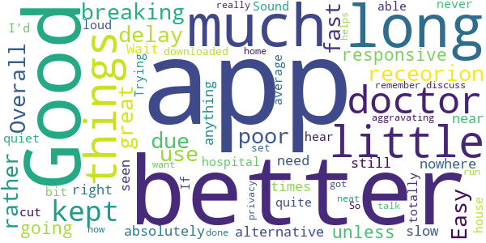

# Penn Highlands MyHealthNow
App version ``12.9.01.000_00``

Analyzed with [covid-apps-observer](http://github.com/covid-apps-observer) project, version ``0.1``

## App overview
| | |
|-------------------------|-------------------------| 
| **Name**&nbsp;&nbsp;&nbsp;&nbsp;&nbsp;&nbsp;&nbsp;&nbsp;&nbsp;&nbsp;&nbsp;&nbsp;&nbsp;&nbsp;&nbsp;&nbsp;&nbsp;&nbsp;&nbsp;&nbsp;&nbsp;&nbsp;&nbsp;&nbsp;&nbsp;&nbsp;&nbsp;&nbsp;&nbsp;&nbsp;&nbsp;&nbsp;&nbsp;&nbsp;&nbsp;&nbsp;&nbsp;&nbsp;&nbsp;&nbsp;  | Penn Highlands MyHealthNow |
| **Unique identifier** | org.phhealthcare.android.phhc.myhealthnow |
| **Link to Google Play** | [https://play.google.com/store/apps/details?id=org.phhealthcare.android.phhc.myhealthnow](https://play.google.com/store/apps/details?id=org.phhealthcare.android.phhc.myhealthnow) |
| **Summary**  | Penn Highlands MyHealthNow offers online 24/7 care you need now. |
| **Privacy policy** | [https://www.americanwell.com/privacy-policy/](https://www.americanwell.com/privacy-policy/) |
| **Latest version** | 12.9.01.000_00 |
| **Last update** | 2021-04-09 23:52:03 |
| **Recent changes** | We continue to improve the patient experience with these new features: • Performance enhancements to increase reliability and speed |
| **Installs**  | 5,000+ |
| **Category** | Medical |
| **First release** | Apr 2, 2019 |
| **Size**  | 53M |
| **Supported Android version**  | 5.0 and up |

### Description
> Penn Highlands MyHealthNow offers online, 24/7, care you need now from anywhere.
 The MyHealthNow free mobile app makes connecting with a doctor fast, easy and convenient. MyHealthNow currently offers provider consults through QCareNow, an on-demand clinic providing evaluation and treatment for minor illnesses or injuries, with new services coming soon.
 No appointment is needed to connect with a provider on QCareNow!
 The average wait time is less than 10 minutes to consult with a state-licensed health provider. Visits are just $49 and may be covered by your insurance provider. An easily accessible claims receipt will be available after your visit to simplify the reimbursement claims process.
 In most cases, you’ll enjoy the convenience of a virtual provider visit with the added freedom to choose from a list of available experts who will provide you with a consultation, and work to diagnose your medical issue, recommend treatment and, if medically-necessary, forward your prescription to the pharmacy of your choice.
 When to use MyHealthNow:
 • Instead of visiting one of our QCare Walk-in clinics
 • During or after normal business hours, including nights, weekends and holidays
 • If your primary care physician is not available
 • If you are too ill to drive to a doctor’s office
 • If traveling and in need of medical care
 If you or your child is experiencing one or more of the conditions below, and you are in need of care right now, QCareNow is for you:
 • Flu-like symptoms
 • Fever
 • Vomiting
 • Coughs, colds or sinus problems
 • Earaches
 • Sprains
 • Back pain
 • Rashes
 • Minor eye problems
 • Minor cuts and abrasions
 • Minor aches and pains
 • Bladder infections
 • Tick and insect bites

### User interface
The developers of the app provide the following screenshots in the Google play store.
| | | |
|:-------------------------:|:-------------------------:|:-------------------------:|
 |   |   |   | 
 |   |   |   | 
 |   |   |   | 
 |   |   |   | 

## Development team
In the following we report the main information provided by the development team in the Google play store.

| | |
|-------------------------|-------------------------|
| **Developer**  | Penn Highlands Healthcare |
| **Website**  | [http://www.phhealthcare.org](http://www.phhealthcare.org) |
| **Email** | AMWellDev@phhealthcare.org |
| **Physical address**  | - |
| **Other developed apps**  | [https://play.google.com/store/apps/developer?id=Penn+Highlands+Healthcare](https://play.google.com/store/apps/developer?id=Penn+Highlands+Healthcare) |

## Android support

| | |
|-------------------------|-------------------------|
| **Declared target Android version**  | Android10, version 10 (API level 29) |
| **Effective target Android version**  | Android10, version 10 (API level 29) |
| **Minimum supported Android version**  | Lollipop, version 5.0 (API level 21) |
| **Maximum target Android version**  | - |

The larger the difference between the minimum and maximum supported Android versions, the better. A larger difference means a wider audience. For example, old phones have a very low Android version, so a high minimum supported Android version means that the app cannot be used by users with old phones, thus leading to accessibility problems. 

## Requested permissions

In the following we report the complete list of the permissions requested by the app. 

| **Permission** | **Protection level** | **Description** | 
|-------------------------|-------------------------|-------------------------|
 **android.permission ACCESS_COARSE_LOCATION** | :warning:**Dangerous** | Allows an app to access approximate location. 
 **android.permission ACCESS_FINE_LOCATION** | :warning:**Dangerous** | Allows an app to access precise location. 
 **android.permission ACCESS_LOCATION_EXTRA_COMMANDS** | Normal | Allows an application to access extra location provider commands. 
 **android.permission ACCESS_NETWORK_STATE** | Normal | Allows applications to access information about networks. 
 **android.permission ACCESS_WIFI_STATE** | Normal | Allows applications to access information about Wi-Fi networks. 
 **android.permission BLUETOOTH** | Normal | Allows applications to connect to paired bluetooth devices. 
 **android.permission BROADCAST_STICKY** | Normal | Allows an application to broadcast sticky intents. 
 **android.permission CAMERA** | :warning:**Dangerous** | Required to be able to access the camera device. 
 **android.permission GET_TASKS** | Deprecated | This constant was deprecated in API level 21. No longer enforced. 
 **android.permission INTERNET** | Normal | Allows applications to open network sockets. 
 **android.permission MODIFY_AUDIO_SETTINGS** | Normal | Allows an application to modify global audio settings. 
 **android.permission READ_EXTERNAL_STORAGE** | :warning:**Dangerous** | Allows an application to read from external storage. 
 **android.permission READ_PHONE_STATE** | :warning:**Dangerous** | Allows read only access to phone state, including the phone number of the device, current cellular network information, the status of any ongoing calls, and a list of any PhoneAccounts registered on the device. 
 **android.permission RECEIVE_BOOT_COMPLETED** | Normal | Allows an application to receive the Intent.ACTION_BOOT_COMPLETED that is broadcast after the system finishes booting. 
 **android.permission RECORD_AUDIO** | :warning:**Dangerous** | Allows an application to record audio. 
 **android.permission REORDER_TASKS** | Normal | Allows an application to change the Z-order of tasks. 
 **android.permission SYSTEM_ALERT_WINDOW** | Signature - preinstalled - appop - pre23 - development | Allows an app to create windows using the type WindowManager.LayoutParams.TYPE_APPLICATION_OVERLAY, shown on top of all other apps. 
 **android.permission USE_BIOMETRIC** | Normal | Allows an app to use device supported biometric modalities. 
 **android.permission USE_FINGERPRINT** | Normal | This constant was deprecated in API level 28. Applications should request USE_BIOMETRIC instead 
 **android.permission VIBRATE** | Normal | Allows access to the vibrator. 
 **android.permission WAKE_LOCK** | Normal | Allows using PowerManager WakeLocks to keep processor from sleeping or screen from dimming. 
 **android.permission WRITE_EXTERNAL_STORAGE** | :warning:**Dangerous** | Allows an application to write to external storage. 
 **com.facebook.katana.provider ACCESS** | - | - 
 **com.google.android.c2dm.permission RECEIVE** | - | - 
 **com.google.android.finsky.permission BIND_GET_INSTALL_REFERRER_SERVICE** | - | - 
 **org.phhealthcare.android.phhc.myhealthnow.permission C2D_MESSAGE** | - | - 

## Mentioned servers

| **Server** | **Registrant** | **Registrant country** | **Creation date** | 
|-------------------------|-------------------------|-------------------------|-------------------------|
 | amwell.com | American Well Corporation | :us: US | 2004-02-13 19:02:32 |
 | facebook.com | Facebook, Inc. | :us: US | 1997-03-29 05:00:00 |
 | doubleclick.net | Google Inc. | :us: US | 1996-01-16 05:00:00 |
 | googleadservices.com | Google LLC | :us: US | 2003-06-19 16:34:53 |
 | google.com | Google LLC | :us: US | 1997-09-15 04:00:00 |
 | googlesyndication.com | Google LLC | :us: US | 2003-01-21 06:17:24 |
 | google-analytics.com | Google LLC | :us: US | 2005-07-18 19:24:32 |
 | app-measurement.com | Google LLC | :us: US | 2015-06-19 20:13:31 |
 | appboy.com | Braze, Inc. | :us: US | 2008-10-06 23:28:32 |
 | braze.com | Braze, Inc. | :us: US | 2000-01-19 02:18:28 |
 | optimizely.com | Optimizely | :us: US | 2010-01-11 03:01:32 |
 | twitter.com | Twitter, Inc. | :us: US | 2000-01-21 16:28:17 |
 | branch.io | Branch | :us: US | 2011-11-10 13:52:13 |
 | gstatic.com | Google LLC | :us: US | 2008-02-11 15:31:25 |
 | crashlytics.com | Google LLC | :us: US | 2011-01-21 15:30:40 |
 | bnc.lt | - | - | 2016-11-14 00:00:00 |
 | ggpht.com | Google LLC | :us: US | 2008-01-16 18:55:33 |

## Security analysis 

Below we report the main security warnings raised by our execution of the [Androwarn](https://github.com/maaaaz/androwarn) security analysis tool.

**Telephony identifiers leakage**
> - This application reads the ISO country code equivalent for the SIM provider's country code 
> - This application reads the ISO country code equivalent of the current registered operator's MCC (Mobile Country Code) 
> - This application reads the device phone type value 
> - This application reads the numeric name (MCC+MNC) of current registered operator 
> - This application reads the operator name 
> - This application reads the phone's current state 
> - This application reads the radio technology (network type) currently in use on the device for data transmission 

**Connection interfaces exfiltration**
> - This application reads details about the currently active data network 
> - This application tries to find out if the currently active data network is metered 

**Telephony services abuse**
> - This application makes phone calls 

**Audio video eavesdropping**
> - This application captures video from the 'CAMERA' source 

**Suspicious connection establishment**
> - This application opens a Socket and connects it to the remote address ' returned no addresses for  ; port is out of range' on the 'N/A' port  
> - This application opens a Socket and connects it to the remote address '' on the 'N/A' port  
> - This application opens a Socket and connects it to the remote address 'Ljava/net/Proxy;->type()Ljava/net/Proxy$Type;' on the 'N/A' port  
> - This application opens a Socket and connects it to the remote address 'timeout' on the 'N/A' port  

**Code execution**
> - This application loads a native library 
> - This application executes a UNIX command containing this argument: '2' 

## User ratings and reviews

Below we provide information about how end users are reacting to the app in terms of ratings and reviews in the Google Play store.

### Ratings

The Penn Highlands MyHealthNow app has been installed by more than **5000** times. At this time, **82** rated the app and its average score is **4.731707**. Below we show the distribution of the ratings across the usual star-based rating of Google Play

:star::star::star::star::star:: 67

:star::star::star::star:: 12

:star::star::star:: 1

:star::star:: 0

:star:: 2

### Reviews 

#### 5-star reviews

> Excellent  :date: __2020-12-09 16:01:14__

> Great for fast covid screaming and test order  :date: __2020-12-08 20:02:33__

> Kept us safe from Covid 19 exposure. We are "at risk" persons. Appreciate being able to communicate with our doctor safely.  :date: __2020-10-26 18:20:29__

> Easy peasy. Wait was a bit long but I would wait just as long if not longer at my pcp  :date: __2020-10-02 15:00:22__

> Excellent!!  :date: __2020-09-15 16:26:39__

> Easy and convenient to use.  :date: __2020-09-08 17:10:02__

> It was helpful WHEN you could get it downloaded  :date: __2020-07-22 18:25:08__

> EXCELLENT!!!  :date: __2020-06-15 22:01:28__

> Great experience  :date: __2020-06-09 15:03:35__

> Great  :date: __2020-06-08 18:27:13__

#### 4-star reviews

> Good but kept breaking up due to poor receorion  :date: __2020-07-23 19:12:59__

> Overall a great app, but there was a rather long delay.  :date: __2020-04-21 17:37:22__

> Easy to use fast and responsive much better than going in for little things unless you absolutely need to be seen right then and there it's a better alternative. Wait times are still slow but that's with anything nowhere near as long as a hospital would be on average  :date: __2020-04-16 21:54:39__

> Was good but cut out quite a bit  :date: __2020-04-08 21:50:00__

> Sound isn't very loud. If my house hadn't been totally quiet, I'd have never been able to hear my doctor. Trying to get this app downloaded and set up was a little aggravating but now that I got it done, this is a really neat app! So much better than having to run to the doctor! I can talk to him in the privacy of my own home. This also helps me to remember the things I want to discuss with him.  :date: __2020-04-01 19:40:18__

#### 3-star reviews

> Sound was very choppy and missing pieces  :date: __2020-03-24 18:09:12__

#### 2-star reviews

No recent reviews available with 2 stars.

#### 1-star reviews

> App fried the camera on my phone.  :date: __2020-04-08 23:30:09__

> I could not find the lung center on Friday just Q-Care. The Lung Center called me on Friday stating that how they will do my appointment on 3/30/2020. I have an appointment with the Lung Center this morning 3/30/2020.  :date: __2020-03-30 14:06:00__

