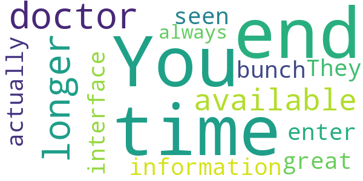

# ProMedica OnDemand
App version ``12.9.01.000_00``

Analyzed with [covid-apps-observer](http://github.com/covid-apps-observer) project, version ``0.1``

## App overview
| | |
|-------------------------|-------------------------| 
| **Name**&nbsp;&nbsp;&nbsp;&nbsp;&nbsp;&nbsp;&nbsp;&nbsp;&nbsp;&nbsp;&nbsp;&nbsp;&nbsp;&nbsp;&nbsp;&nbsp;&nbsp;&nbsp;&nbsp;&nbsp;&nbsp;&nbsp;&nbsp;&nbsp;&nbsp;&nbsp;&nbsp;&nbsp;&nbsp;&nbsp;&nbsp;&nbsp;&nbsp;&nbsp;&nbsp;&nbsp;&nbsp;&nbsp;&nbsp;&nbsp;  | ProMedica OnDemand |
| **Unique identifier** | org.promedica.android.pmed.ondemand |
| **Link to Google Play** | [https://play.google.com/store/apps/details?id=org.promedica.android.pmed.ondemand](https://play.google.com/store/apps/details?id=org.promedica.android.pmed.ondemand) |
| **Summary**  | ProMedica OnDemand allows you to see a medical provider on your time - 24/7/365. |
| **Privacy policy** | [https://www.americanwell.com/privacy-policy/](https://www.americanwell.com/privacy-policy/) |
| **Latest version** | 12.9.01.000_00 |
| **Last update** | 2021-04-08 23:53:44 |
| **Recent changes** | We continue to improve the patient experience with these new features: • Performance enhancements to increase reliability and speed |
| **Installs**  | 10,000+ |
| **Category** | Medical |
| **First release** | Jan 27, 2017 |
| **Size**  | 54M |
| **Supported Android version**  | 5.0 and up |

### Description
> ProMedica OnDemand allows you to speak to a provider on your time – 24 hours a day, 7 days a week, 365 days a year. It's easy to use, private and secure. A virtual video chat makes receiving care for common ailments affordable, convenient and fast.
  
 ProMedica OnDemand is great during overnight hours, when you’re on the road for vacation or work, or when anything prevents you from making it to the doctor’s office.
  
 What are the benefits of ProMedica OnDemand?
 -          Accessible anytime via mobile or web
 -          Low cost
 -          No travel required
 -          Online credit card payment
 -          Prescriptions to your pharmacy
  
 Use ProMedica OnDemand for symptoms and conditions such as:
 -          Cold
 -          Flu
 -          Rash
 -          Urinary tract infection
 -          Pink eye
 -          Allergies
 -          Vomiting
 -          Diarrhea
 -          Sore throat
 -          Sinus infection
 -          Fever
  
 For emergencies, dial 911 immediately.

### User interface
The developers of the app provide the following screenshots in the Google play store.
| | | |
|:-------------------------:|:-------------------------:|:-------------------------:|
 |   |   |   | 
 |   |   |   | 
 |   |   |   | 
 |   |   |   | 

## Development team
In the following we report the main information provided by the development team in the Google play store.

| | |
|-------------------------|-------------------------|
| **Developer**  | ProMedica Health System, Inc. |
| **Website**  | - |
| **Email** | digital.communications@promedica.org |
| **Physical address**  | - |
| **Other developed apps**  | [https://play.google.com/store/apps/developer?id=ProMedica+Health+System,+Inc.](https://play.google.com/store/apps/developer?id=ProMedica+Health+System,+Inc.) |

## Android support

| | |
|-------------------------|-------------------------|
| **Declared target Android version**  | Android10, version 10 (API level 29) |
| **Effective target Android version**  | Android10, version 10 (API level 29) |
| **Minimum supported Android version**  | Lollipop, version 5.0 (API level 21) |
| **Maximum target Android version**  | - |

The larger the difference between the minimum and maximum supported Android versions, the better. A larger difference means a wider audience. For example, old phones have a very low Android version, so a high minimum supported Android version means that the app cannot be used by users with old phones, thus leading to accessibility problems. 

## Requested permissions

In the following we report the complete list of the permissions requested by the app. 

| **Permission** | **Protection level** | **Description** | 
|-------------------------|-------------------------|-------------------------|
 **android.permission ACCESS_COARSE_LOCATION** | :warning:**Dangerous** | Allows an app to access approximate location. 
 **android.permission ACCESS_FINE_LOCATION** | :warning:**Dangerous** | Allows an app to access precise location. 
 **android.permission ACCESS_LOCATION_EXTRA_COMMANDS** | Normal | Allows an application to access extra location provider commands. 
 **android.permission ACCESS_NETWORK_STATE** | Normal | Allows applications to access information about networks. 
 **android.permission ACCESS_WIFI_STATE** | Normal | Allows applications to access information about Wi-Fi networks. 
 **android.permission BLUETOOTH** | Normal | Allows applications to connect to paired bluetooth devices. 
 **android.permission BROADCAST_STICKY** | Normal | Allows an application to broadcast sticky intents. 
 **android.permission CAMERA** | :warning:**Dangerous** | Required to be able to access the camera device. 
 **android.permission GET_TASKS** | Deprecated | This constant was deprecated in API level 21. No longer enforced. 
 **android.permission INTERNET** | Normal | Allows applications to open network sockets. 
 **android.permission MODIFY_AUDIO_SETTINGS** | Normal | Allows an application to modify global audio settings. 
 **android.permission READ_EXTERNAL_STORAGE** | :warning:**Dangerous** | Allows an application to read from external storage. 
 **android.permission READ_PHONE_STATE** | :warning:**Dangerous** | Allows read only access to phone state, including the phone number of the device, current cellular network information, the status of any ongoing calls, and a list of any PhoneAccounts registered on the device. 
 **android.permission RECEIVE_BOOT_COMPLETED** | Normal | Allows an application to receive the Intent.ACTION_BOOT_COMPLETED that is broadcast after the system finishes booting. 
 **android.permission RECORD_AUDIO** | :warning:**Dangerous** | Allows an application to record audio. 
 **android.permission REORDER_TASKS** | Normal | Allows an application to change the Z-order of tasks. 
 **android.permission SYSTEM_ALERT_WINDOW** | Signature - preinstalled - appop - pre23 - development | Allows an app to create windows using the type WindowManager.LayoutParams.TYPE_APPLICATION_OVERLAY, shown on top of all other apps. 
 **android.permission USE_BIOMETRIC** | Normal | Allows an app to use device supported biometric modalities. 
 **android.permission USE_FINGERPRINT** | Normal | This constant was deprecated in API level 28. Applications should request USE_BIOMETRIC instead 
 **android.permission VIBRATE** | Normal | Allows access to the vibrator. 
 **android.permission WAKE_LOCK** | Normal | Allows using PowerManager WakeLocks to keep processor from sleeping or screen from dimming. 
 **android.permission WRITE_EXTERNAL_STORAGE** | :warning:**Dangerous** | Allows an application to write to external storage. 
 **com.facebook.katana.provider ACCESS** | - | - 
 **com.google.android.c2dm.permission RECEIVE** | - | - 
 **com.google.android.finsky.permission BIND_GET_INSTALL_REFERRER_SERVICE** | - | - 
 **org.promedica.android.pmed.ondemand.permission C2D_MESSAGE** | - | - 

## Mentioned servers

| **Server** | **Registrant** | **Registrant country** | **Creation date** | 
|-------------------------|-------------------------|-------------------------|-------------------------|
 | amwell.com | American Well Corporation | :us: US | 2004-02-13 19:02:32 |
 | facebook.com | Facebook, Inc. | :us: US | 1997-03-29 05:00:00 |
 | doubleclick.net | Google Inc. | :us: US | 1996-01-16 05:00:00 |
 | googleadservices.com | Google LLC | :us: US | 2003-06-19 16:34:53 |
 | google.com | Google LLC | :us: US | 1997-09-15 04:00:00 |
 | googlesyndication.com | Google LLC | :us: US | 2003-01-21 06:17:24 |
 | google-analytics.com | Google LLC | :us: US | 2005-07-18 19:24:32 |
 | app-measurement.com | Google LLC | :us: US | 2015-06-19 20:13:31 |
 | appboy.com | Braze, Inc. | :us: US | 2008-10-06 23:28:32 |
 | braze.com | Braze, Inc. | :us: US | 2000-01-19 02:18:28 |
 | optimizely.com | Optimizely | :us: US | 2010-01-11 03:01:32 |
 | twitter.com | Twitter, Inc. | :us: US | 2000-01-21 16:28:17 |
 | branch.io | Branch | :us: US | 2011-11-10 13:52:13 |
 | gstatic.com | Google LLC | :us: US | 2008-02-11 15:31:25 |
 | crashlytics.com | Google LLC | :us: US | 2011-01-21 15:30:40 |
 | bnc.lt | - | - | 2016-11-14 00:00:00 |
 | ggpht.com | Google LLC | :us: US | 2008-01-16 18:55:33 |

## Security analysis 

Below we report the main security warnings raised by our execution of the [Androwarn](https://github.com/maaaaz/androwarn) security analysis tool.

**Telephony identifiers leakage**
> - This application reads the ISO country code equivalent for the SIM provider's country code 
> - This application reads the ISO country code equivalent of the current registered operator's MCC (Mobile Country Code) 
> - This application reads the device phone type value 
> - This application reads the numeric name (MCC+MNC) of current registered operator 
> - This application reads the operator name 
> - This application reads the phone's current state 
> - This application reads the radio technology (network type) currently in use on the device for data transmission 

**Connection interfaces exfiltration**
> - This application reads details about the currently active data network 
> - This application tries to find out if the currently active data network is metered 

**Telephony services abuse**
> - This application makes phone calls 

**Audio video eavesdropping**
> - This application records audio from the 'VOICE_RECOGNITION' source  
> - This application captures video from the 'CAMERA' source 

**Suspicious connection establishment**
> - This application opens a Socket and connects it to the remote address ' returned no addresses for  ; port is out of range' on the 'N/A' port  
> - This application opens a Socket and connects it to the remote address '' on the 'N/A' port  
> - This application opens a Socket and connects it to the remote address 'Ljava/net/Proxy;->type()Ljava/net/Proxy$Type;' on the 'N/A' port  
> - This application opens a Socket and connects it to the remote address 'timeout' on the 'N/A' port  

**Code execution**
> - This application loads a native library 
> - This application executes a UNIX command containing this argument: '2' 

## User ratings and reviews

Below we provide information about how end users are reacting to the app in terms of ratings and reviews in the Google Play store.

### Ratings

The ProMedica OnDemand app has been installed by more than **10000** times. At this time, **104** rated the app and its average score is **4.66**. Below we show the distribution of the ratings across the usual star-based rating of Google Play

:star::star::star::star::star:: 86

:star::star::star::star:: 11

:star::star::star:: 2

:star::star:: 1

:star:: 4

### Reviews 

#### 5-star reviews

> So fast and so helpful! And it was cheaper than going to urgent care!  :date: __2021-05-17 21:34:42__

> Excellent. I don't like going to my doctor right now so I prefer using this as an option. Great doctors. I've only had one I found a bit rude but we all have those days. I didn't have a long wait and the doctors are thorough.  :date: __2021-02-25 01:03:37__

> Convenient. Easy to use  :date: __2021-02-19 09:07:55__

> Great very helpful  :date: __2021-01-27 00:32:10__

> Awesome  :date: __2021-01-19 20:57:19__

> Just had our first appointment for my daughter and it went so smoothly. I was nervous at first, but the doctor was patient, listened to our concerns and asked a lot of questions. This is a great app and I definitely will use again.  :date: __2020-11-04 18:53:36__

> THANK YOU SO MUCH.  :date: __2020-07-25 15:37:15__

> Excellent and easy  :date: __2020-07-22 21:52:48__

> Great!  :date: __2020-04-25 17:05:45__

> Very pleasant and helpful  :date: __2020-04-11 16:32:36__

#### 4-star reviews

> You can combine several hospitals together if they use Epic. Haven't figured out the best way to combine dissimilar systems into Mychart. Also trying to figure out the best app to use to import data like pulse, heart rate, pain levels, and exercising habits.  :date: __2020-06-12 00:34:41__

> Volume on trying hear provider was very quiet, but other than it was a great way to deal with a simple ear infection.  :date: __2020-04-07 20:24:20__

> Great  :date: __2019-11-25 20:41:57__

> was ok  :date: __2019-03-06 16:29:45__

> easy to use! provider was polite, professional, and very informative.  :date: __2019-01-20 18:10:03__

> Super easy, Dr asked what was necessary to what I needed. Swift, and better than going to the Dr. Office.  :date: __2018-01-01 16:57:56__

#### 3-star reviews

> Easy to use but some of the doctors are rude and dont listen to issues  :date: __2020-06-23 05:26:10__

#### 2-star reviews

> You have to enter in a bunch of information before being seen, but by the time you get to the end, the doctor is no longer available. The interface is great, but I can't actually get to a doctor. They are always no longer available by the time I get to the end.  :date: __2020-09-17 19:59:47__

#### 1-star reviews

> Pitiful.. screw you  :date: __2020-05-25 23:40:11__

> according to my insurance this should be free but they tried to bill me 59 dollars what the heck  :date: __2019-08-08 15:30:32__

> This service is very misleading as I consulted the website prior to paying $59 to be told that this service would not be able to help. The attached shows exactly how you advertise this service. I was unable to leave home or visit a doctors office for the condition my child needed treatment for which was advertised on the website. That was an easy $59 for the doctor and useless/expensive for me. I Would never recommend this service to anyway. False Advertising!!  :date: __2019-02-18 23:07:09__

> Wanted an app for MyChart, and this is what it takes me to. There is no app for MyChart. You'd think as big as the organization is they'd come up with an app that does what the CUSTOMER wants.  :date: __2017-10-30 18:33:07__

