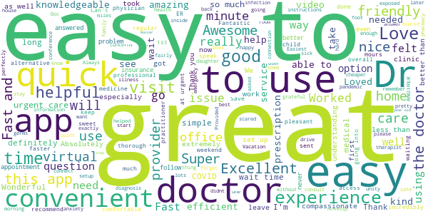
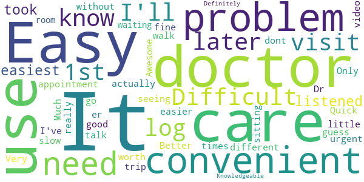
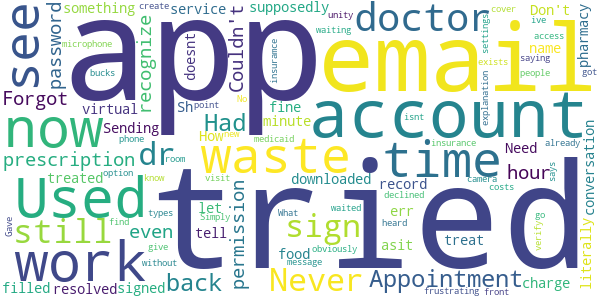

# UnityPoint Health Virtual Care
App version ``12.0.19.010_02``

Analyzed with [covid-apps-observer](http://github.com/covid-apps-observer) project, version ``0.1``

## App overview
| | |
|-------------------------|-------------------------| 
| **Name**                                          | UnityPoint Health Virtual Care |
| **Unique identifier** | org.unitypoint.android.upth.virtualcare |
| **Link to Google Play** | [https://play.google.com/store/apps/details?id=org.unitypoint.android.upth.virtualcare](https://play.google.com/store/apps/details?id=org.unitypoint.android.upth.virtualcare) |
| **Summary**  | UnityPoint Health Virtual Care. Care when you need it, where you need it. |
| **Privacy policy** | [https://www.americanwell.com/privacy-policy/](https://www.americanwell.com/privacy-policy/) |
| **Latest version** | 12.0.19.010_02 |
| **Last update** | 2021-03-08 15:04:34 |
| **Recent changes** | We continue to improve the patient experience with these new features: • Performance enhancements to increase reliability and speed |
| **Installs**  | 10,000+ |
| **Category** | Medical |
| **First release** | Mar 29, 2017 |
| **Size**  | 53M |
| **Supported Android version**  | 5.0 and up |

### Description
> UnityPoint Health Virtual Care allows you to see a doctor anytime on your mobile device. Our network of providers are board certified in the areas of family medicine, internal medicine, urgent care and pediatrics. They are available 24/7, with no appointment needed. UnityPoint Health Virtual Care allows you to be seen when you need it, where you need it. It brings healthcare home, so that you can feel better, faster.

### User interface
The developers of the app provide the following screenshots in the Google play store.
| | | |
|:-------------------------:|:-------------------------:|:-------------------------:|
 |   |   |   | 
 |   |   |   | 
 |   |   |   | 
 |   |   |   | 

## Development team
In the following we report the main information provided by the development team in the Google play store.

| | |
|-------------------------|-------------------------|
| **Developer**  | UnityPoint Health |
| **Website**  | - |
| **Email** | unitypointhealth.developers2@gmail.com |
| **Physical address**  | - |
| **Other developed apps**  | [https://play.google.com/store/apps/developer?id=UnityPoint+Health](https://play.google.com/store/apps/developer?id=UnityPoint+Health) |

## Android support

| | |
|-------------------------|-------------------------|
| **Declared target Android version**  | Android10, version 10 (API level 29) |
| **Effective target Android version**  | Android10, version 10 (API level 29) |
| **Minimum supported Android version**  | Lollipop, version 5.0 (API level 21) |
| **Maximum target Android version**  | - |

The larger the difference between the minimum and maximum supported Android versions, the better. A larger difference means a wider audience. For example, old phones have a very low Android version, so a high minimum supported Android version means that the app cannot be used by users with old phones, thus leading to accessibility problems. 

## Requested permissions

In the following we report the complete list of the permissions requested by the app. 

| **Permission** | **Protection level** | **Description** | 
|-------------------------|-------------------------|-------------------------|
 **android.permission ACCESS_COARSE_LOCATION** | :warning:**Dangerous** | Allows an app to access approximate location. 
 **android.permission ACCESS_FINE_LOCATION** | :warning:**Dangerous** | Allows an app to access precise location. 
 **android.permission ACCESS_LOCATION_EXTRA_COMMANDS** | Normal | Allows an application to access extra location provider commands. 
 **android.permission ACCESS_NETWORK_STATE** | Normal | Allows applications to access information about networks. 
 **android.permission ACCESS_WIFI_STATE** | Normal | Allows applications to access information about Wi-Fi networks. 
 **android.permission BLUETOOTH** | Normal | Allows applications to connect to paired bluetooth devices. 
 **android.permission BROADCAST_STICKY** | Normal | Allows an application to broadcast sticky intents. 
 **android.permission CAMERA** | :warning:**Dangerous** | Required to be able to access the camera device. 
 **android.permission GET_TASKS** | Deprecated | This constant was deprecated in API level 21. No longer enforced. 
 **android.permission INTERNET** | Normal | Allows applications to open network sockets. 
 **android.permission MODIFY_AUDIO_SETTINGS** | Normal | Allows an application to modify global audio settings. 
 **android.permission READ_EXTERNAL_STORAGE** | :warning:**Dangerous** | Allows an application to read from external storage. 
 **android.permission READ_PHONE_STATE** | :warning:**Dangerous** | Allows read only access to phone state, including the phone number of the device, current cellular network information, the status of any ongoing calls, and a list of any PhoneAccounts registered on the device. 
 **android.permission RECEIVE_BOOT_COMPLETED** | Normal | Allows an application to receive the Intent.ACTION_BOOT_COMPLETED that is broadcast after the system finishes booting. 
 **android.permission RECORD_AUDIO** | :warning:**Dangerous** | Allows an application to record audio. 
 **android.permission REORDER_TASKS** | Normal | Allows an application to change the Z-order of tasks. 
 **android.permission SYSTEM_ALERT_WINDOW** | Signature - preinstalled - appop - pre23 - development | Allows an app to create windows using the type WindowManager.LayoutParams.TYPE_APPLICATION_OVERLAY, shown on top of all other apps. 
 **android.permission USE_BIOMETRIC** | Normal | Allows an app to use device supported biometric modalities. 
 **android.permission USE_FINGERPRINT** | Normal | This constant was deprecated in API level 28. Applications should request USE_BIOMETRIC instead 
 **android.permission VIBRATE** | Normal | Allows access to the vibrator. 
 **android.permission WAKE_LOCK** | Normal | Allows using PowerManager WakeLocks to keep processor from sleeping or screen from dimming. 
 **android.permission WRITE_EXTERNAL_STORAGE** | :warning:**Dangerous** | Allows an application to write to external storage. 
 **com.facebook.katana.provider ACCESS** | - | - 
 **com.google.android.c2dm.permission RECEIVE** | - | - 
 **com.google.android.finsky.permission BIND_GET_INSTALL_REFERRER_SERVICE** | - | - 
 **org.unitypoint.android.upth.virtualcare.permission C2D_MESSAGE** | - | - 

## Mentioned servers

| **Server** | **Registrant** | **Registrant country** | **Creation date** | 
|-------------------------|-------------------------|-------------------------|-------------------------|
 | amwell.com | American Well Corporation | :us: US | 2004-02-13 19:02:32 |
 | facebook.com | Facebook, Inc. | :us: US | 1997-03-29 05:00:00 |
 | doubleclick.net | Google Inc. | :us: US | 1996-01-16 05:00:00 |
 | googleadservices.com | Google LLC | :us: US | 2003-06-19 16:34:53 |
 | google.com | Google LLC | :us: US | 1997-09-15 04:00:00 |
 | googlesyndication.com | Google LLC | :us: US | 2003-01-21 06:17:24 |
 | google-analytics.com | Google LLC | :us: US | 2005-07-18 19:24:32 |
 | app-measurement.com | Google LLC | :us: US | 2015-06-19 20:13:31 |
 | appboy.com | Braze, Inc. | :us: US | 2008-10-06 23:28:32 |
 | braze.com | Braze, Inc. | :us: US | 2000-01-19 02:18:28 |
 | optimizely.com | Optimizely | :us: US | 2010-01-11 03:01:32 |
 | twitter.com | Twitter, Inc. | :us: US | 2000-01-21 16:28:17 |
 | branch.io | Branch | :us: US | 2011-11-10 13:52:13 |
 | gstatic.com | Google LLC | :us: US | 2008-02-11 15:31:25 |
 | crashlytics.com | Google LLC | :us: US | 2011-01-21 15:30:40 |
 | bnc.lt | - | - | 2016-11-14 00:00:00 |
 | ggpht.com | Google LLC | :us: US | 2008-01-16 18:55:33 |

## Security analysis 

Below we report the main security warnings raised by our execution of the [Androwarn](https://github.com/maaaaz/androwarn) security analysis tool.

**Telephony identifiers leakage**
> - This application reads the ISO country code equivalent for the SIM provider's country code 
> - This application reads the ISO country code equivalent of the current registered operator's MCC (Mobile Country Code) 
> - This application reads the MCC+MNC of the provider of the SIM 
> - This application reads the device phone type value 
> - This application reads the numeric name (MCC+MNC) of current registered operator 
> - This application reads the operator name 
> - This application reads the phone's current state 
> - This application reads the radio technology (network type) currently in use on the device for data transmission 

**Connection interfaces exfiltration**
> - This application reads details about the currently active data network 
> - This application tries to find out if the currently active data network is metered 

**Telephony services abuse**
> - This application makes phone calls 

**Audio video eavesdropping**
> - This application captures video from the 'CAMERA' source 

**Suspicious connection establishment**
> - This application opens a Socket and connects it to the remote address ' returned no addresses for  ; port is out of range' on the 'N/A' port  
> - This application opens a Socket and connects it to the remote address '' on the 'N/A' port  
> - This application opens a Socket and connects it to the remote address 'Ljava/net/Proxy;->type()Ljava/net/Proxy$Type;' on the 'N/A' port  
> - This application opens a Socket and connects it to the remote address 'timeout' on the 'N/A' port  

**Code execution**
> - This application loads a native library 
> - This application executes a UNIX command containing this argument: '2' 

## User ratings and reviews

Below we provide information about how end users are reacting to the app in terms of ratings and reviews in the Google Play store.

### Ratings

The UnityPoint Health Virtual Care app has been installed by more than **10000** times. At this time, **405** rated the app and its average score is **4.71**. Below we show the distribution of the ratings across the usual star-based rating of Google Play

:star::star::star::star::star:: 349

:star::star::star::star:: 28

:star::star::star:: 12

:star::star:: 0

:star:: 16

### Reviews 

#### 5-star reviews

> That was easy and pretty awesome!  :date: __2021-04-12 16:48:30__

> Awesome and prompt. I love it! It's all inclusive as well and I am extremely grateful for that during these times.  :date: __2021-04-04 01:16:31__

> I love this experience  :date: __2021-03-20 04:34:59__

> Quick and easy the Doctors are extremely nice and helpful!  :date: __2021-03-07 21:56:52__

> It's so easy and the providers are compassionate!  :date: __2021-03-05 16:33:18__

> I had good luck with this app.  :date: __2021-02-23 16:21:26__

> Very Easy to Use.  :date: __2021-02-18 00:46:18__

> Excellent, concerned for my care and issues  :date: __2021-02-12 18:20:40__

> So easy and quick  :date: __2021-01-17 14:51:41__

> Wonderful experience. Doc was very helpful with my problem and answered all questions i had.  :date: __2020-12-30 04:14:38__

#### 4-star reviews

> Difficult to log in 1st visit.  :date: __2021-03-04 17:59:30__

> The doctor listened and took care of me  :date: __2021-02-22 21:05:47__

> Easy to use.  :date: __2021-02-10 16:49:25__

> It was the easiest appointment I've ever had, but the problem is without actually seeing me it's just a guess.  :date: __2020-12-15 20:57:57__

> Quick and easy  :date: __2020-07-12 14:48:36__

> It was good  :date: __2020-07-02 03:27:46__

> It was different but fine.  :date: __2020-04-27 14:54:38__

> Awesome  :date: __2020-04-22 22:47:31__

> Only problem - no video.  :date: __2020-04-20 15:10:11__

> Much easier and more convenient than a trip to urgent care or the er.  :date: __2019-11-10 17:39:11__

#### 3-star reviews

> App is fine but I was out of town and needed to input a Pharmacy in the town I am visiting. The App did not give me an opportunity to do that. Thankfully I remembered this and told the doctor. i would have been very frustrated if the prescription was sent back to my hometown.  :date: __2020-12-23 22:49:27__

> They double charged my card for one visit. Was on hold for 30+ minutes with customer support and still wasn't able to get ahold of anyone. Extremely frustrated. The app itself is a good idea and talking to a doctor was convenient from home. Just dont like being charged twice.  :date: __2020-03-19 13:50:21__

> the doctors are knowledgeable and it's wonderful to have an option to see a care provider virtually. my major issue is connectivity. i waited in queue for 30 minutes to see a provider and was kicked out, having to start all over again and wait for even longer to get assistance.  :date: __2019-01-10 16:27:45__

> It's a good start.  When signing up I had to enter my DOB which was difficult.  The calender defaulted to 2016 and no way to easily change it.  I had to tap 60 times to get to my DOB.  :date: __2017-06-20 01:16:28__

#### 2-star reviews

> Pick a path and stick to it; MyCharts is already in use.  :date: __2020-05-03 04:02:48__

> Not what i wanted  :date: __2020-02-21 13:58:46__

#### 1-star reviews

> Used to work fine, now I get an err name not resolved  :date: __2021-04-12 17:38:27__

> Sh@#$%^&*  :date: __2021-01-18 19:40:06__

> Need food  :date: __2020-12-08 08:34:57__

> Don't waste your time. They tell you they can't treat you and to see a doctor and still charge for a 3 minute conversation for something that supposedly can be treated with this service. Never again.  :date: __2020-07-05 16:43:06__

> I just downloaded the app to sign up for a virtual dr. Appointment. Had the appointment then tried to get back on to see if my prescription had been filled. The pharmacy didn't have any record of the dr. Sending any prescription. The app won't let me sign back on asit doesn't recognize the email I used. I literally just signed up an hour before but the app doesnt recognize my email now. How frustrating.  :date: __2020-05-08 23:36:43__

> Gave permission to access camera, phone, and microphone and it still says go to settings to give permission.  :date: __2020-04-21 17:12:08__

> I waited for an hour in their "waiting room". I got to 5 people in front of me, and then I get a message saying the Doctor has declined my visit. No other explanation. What a waste of time.  :date: __2020-03-23 17:18:17__

> they have 4 types of insuramce that ive never even heard of. medicaid isnt even on there and I know they cover it...  :date: __2019-05-24 21:37:14__

> Forgot my password so I tried the forgot password option. Couldn't find my account. Tried to create a new account with the same email. Can't because the account already exists (obviously). A+...  :date: __2018-10-28 21:57:34__

> Simply does not work. Couldn't verify my unity point insurance and costs 40 bucks without.  :date: __2018-01-25 20:53:32__

