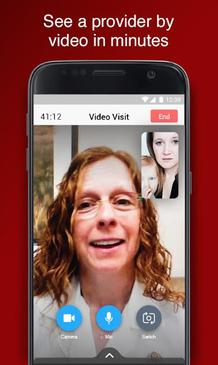

# UW Health Care Anywhere - Video Visit
App version ``12.0.19.010_02``

Analyzed with [covid-apps-observer](http://github.com/covid-apps-observer) project, version ``0.1``

## App overview
| | |
|-------------------------|-------------------------| 
| **Name**                                          | UW Health Care Anywhere - Video Visit |
| **Unique identifier** | org.uwhealth.android.uhuw.videovisit |
| **Link to Google Play** | [https://play.google.com/store/apps/details?id=org.uwhealth.android.uhuw.videovisit](https://play.google.com/store/apps/details?id=org.uwhealth.android.uhuw.videovisit) |
| **Summary**  | Start a video visit for instant access to a UW Health primary care provider |
| **Privacy policy** | [https://www.americanwell.com/privacy-policy/](https://www.americanwell.com/privacy-policy/) |
| **Latest version** | 12.0.19.010_02 |
| **Last update** | 2021-02-02 19:58:28 |
| **Recent changes** | We continue to improve the patient experience with these new features: • Performance enhancements to increase reliability and speed |
| **Installs**  | 5,000+ |
| **Category** | Medical |
| **First release** | Sep 8, 2017 |
| **Size**  | 52M |
| **Supported Android version**  | 5.0 and up |

### Description
> Leave the waiting rooms behind. Log into UW Health Care Anywhere to get easy, quick access to a primary care provider, whenever you and your family need non-emergency care. From the comfort of your home or work – even in the palm of your hand – UW Health Care Anywhere is available 24/7, providing video doctor visits using your smartphone, tablet or computer equipped with a web camera.
 The process is fast and easy. Download the UW Health Care Anywhere mobile app and set up an account – you’ll be one step ahead when you need to see a doctor.
 Feel better, faster. With UW Health Care Anywhere, you may see a health care provider within minutes for conditions including:
 ·         Bronchitis
 ·         Cough
 ·         Cold
 ·         Flu
 ·         Fever
 ·         Sinus infection
 ·         Respiratory infection
 ·         Sore throat
 ·         Urinary tract infection
 ·         Vomiting
 ·         Diarrhea
 ·         Pinkeye
 ·         Sprains and strains
 ·         Headache
 Depending on the issue, the health care provider can provide a diagnosis, suggest follow-up care and prescribe medication, when appropriate. Providers are available to see you for a video visit 24 hours a day, every day of the year. Not all illnesses can be addressed via UW Health Care Anywhere – if necessary, you may be directed to go to the Emergency Department to receive care in person.

### User interface
The developers of the app provide the following screenshots in the Google play store.
| | | |
|:-------------------------:|:-------------------------:|:-------------------------:|
 |   |   |   | 
 |   |   |   | 

## Development team
In the following we report the main information provided by the development team in the Google play store.

| | |
|-------------------------|-------------------------|
| **Developer**  | UW Health |
| **Website**  | [http://www.uwhealth.org](http://www.uwhealth.org) |
| **Email** | ehealth-oncall@uwhealth.org |
| **Physical address**  | - |
| **Other developed apps**  | [https://play.google.com/store/apps/developer?id=UW+Health](https://play.google.com/store/apps/developer?id=UW+Health) |

## Android support

| | |
|-------------------------|-------------------------|
| **Declared target Android version**  | Android10, version 10 (API level 29) |
| **Effective target Android version**  | Android10, version 10 (API level 29) |
| **Minimum supported Android version**  | Lollipop, version 5.0 (API level 21) |
| **Maximum target Android version**  | - |

The larger the difference between the minimum and maximum supported Android versions, the better. A larger difference means a wider audience. For example, old phones have a very low Android version, so a high minimum supported Android version means that the app cannot be used by users with old phones, thus leading to accessibility problems. 

## Requested permissions

In the following we report the complete list of the permissions requested by the app. 

| **Permission** | **Protection level** | **Description** | 
|-------------------------|-------------------------|-------------------------|
 **android.permission ACCESS_COARSE_LOCATION** | :warning:**Dangerous** | Allows an app to access approximate location. 
 **android.permission ACCESS_FINE_LOCATION** | :warning:**Dangerous** | Allows an app to access precise location. 
 **android.permission ACCESS_LOCATION_EXTRA_COMMANDS** | Normal | Allows an application to access extra location provider commands. 
 **android.permission ACCESS_NETWORK_STATE** | Normal | Allows applications to access information about networks. 
 **android.permission ACCESS_WIFI_STATE** | Normal | Allows applications to access information about Wi-Fi networks. 
 **android.permission BLUETOOTH** | Normal | Allows applications to connect to paired bluetooth devices. 
 **android.permission BROADCAST_STICKY** | Normal | Allows an application to broadcast sticky intents. 
 **android.permission CAMERA** | :warning:**Dangerous** | Required to be able to access the camera device. 
 **android.permission GET_TASKS** | Deprecated | This constant was deprecated in API level 21. No longer enforced. 
 **android.permission INTERNET** | Normal | Allows applications to open network sockets. 
 **android.permission MODIFY_AUDIO_SETTINGS** | Normal | Allows an application to modify global audio settings. 
 **android.permission READ_EXTERNAL_STORAGE** | :warning:**Dangerous** | Allows an application to read from external storage. 
 **android.permission READ_PHONE_STATE** | :warning:**Dangerous** | Allows read only access to phone state, including the phone number of the device, current cellular network information, the status of any ongoing calls, and a list of any PhoneAccounts registered on the device. 
 **android.permission RECEIVE_BOOT_COMPLETED** | Normal | Allows an application to receive the Intent.ACTION_BOOT_COMPLETED that is broadcast after the system finishes booting. 
 **android.permission RECORD_AUDIO** | :warning:**Dangerous** | Allows an application to record audio. 
 **android.permission REORDER_TASKS** | Normal | Allows an application to change the Z-order of tasks. 
 **android.permission SYSTEM_ALERT_WINDOW** | Signature - preinstalled - appop - pre23 - development | Allows an app to create windows using the type WindowManager.LayoutParams.TYPE_APPLICATION_OVERLAY, shown on top of all other apps. 
 **android.permission USE_BIOMETRIC** | Normal | Allows an app to use device supported biometric modalities. 
 **android.permission USE_FINGERPRINT** | Normal | This constant was deprecated in API level 28. Applications should request USE_BIOMETRIC instead 
 **android.permission VIBRATE** | Normal | Allows access to the vibrator. 
 **android.permission WAKE_LOCK** | Normal | Allows using PowerManager WakeLocks to keep processor from sleeping or screen from dimming. 
 **android.permission WRITE_EXTERNAL_STORAGE** | :warning:**Dangerous** | Allows an application to write to external storage. 
 **com.facebook.katana.provider ACCESS** | - | - 
 **com.google.android.c2dm.permission RECEIVE** | - | - 
 **com.google.android.finsky.permission BIND_GET_INSTALL_REFERRER_SERVICE** | - | - 
 **org.uwhealth.android.uhuw.videovisit.permission C2D_MESSAGE** | - | - 

## Mentioned servers

| **Server** | **Registrant** | **Registrant country** | **Creation date** | 
|-------------------------|-------------------------|-------------------------|-------------------------|
 | amwell.com | American Well Corporation | :us: US | 2004-02-13 19:02:32 |
 | facebook.com | Facebook, Inc. | :us: US | 1997-03-29 05:00:00 |
 | doubleclick.net | Google Inc. | :us: US | 1996-01-16 05:00:00 |
 | googleadservices.com | Google LLC | :us: US | 2003-06-19 16:34:53 |
 | google.com | Google LLC | :us: US | 1997-09-15 04:00:00 |
 | googlesyndication.com | Google LLC | :us: US | 2003-01-21 06:17:24 |
 | google-analytics.com | Google LLC | :us: US | 2005-07-18 19:24:32 |
 | app-measurement.com | Google LLC | :us: US | 2015-06-19 20:13:31 |
 | appboy.com | Braze, Inc. | :us: US | 2008-10-06 23:28:32 |
 | braze.com | Braze, Inc. | :us: US | 2000-01-19 02:18:28 |
 | optimizely.com | Optimizely | :us: US | 2010-01-11 03:01:32 |
 | twitter.com | Twitter, Inc. | :us: US | 2000-01-21 16:28:17 |
 | branch.io | Branch | :us: US | 2011-11-10 13:52:13 |
 | gstatic.com | Google LLC | :us: US | 2008-02-11 15:31:25 |
 | crashlytics.com | Google LLC | :us: US | 2011-01-21 15:30:40 |
 | bnc.lt | - | - | 2016-11-14 00:00:00 |
 | ggpht.com | Google LLC | :us: US | 2008-01-16 18:55:33 |

## Security analysis 

Below we report the main security warnings raised by our execution of the [Androwarn](https://github.com/maaaaz/androwarn) security analysis tool.

**Telephony identifiers leakage**
> - This application reads the ISO country code equivalent for the SIM provider's country code 
> - This application reads the ISO country code equivalent of the current registered operator's MCC (Mobile Country Code) 
> - This application reads the MCC+MNC of the provider of the SIM 
> - This application reads the device phone type value 
> - This application reads the numeric name (MCC+MNC) of current registered operator 
> - This application reads the operator name 
> - This application reads the phone's current state 
> - This application reads the radio technology (network type) currently in use on the device for data transmission 

**Connection interfaces exfiltration**
> - This application reads details about the currently active data network 
> - This application tries to find out if the currently active data network is metered 

**Telephony services abuse**
> - This application makes phone calls 

**Audio video eavesdropping**
> - This application captures video from the 'CAMERA' source 

**Suspicious connection establishment**
> - This application opens a Socket and connects it to the remote address ' returned no addresses for  ; port is out of range' on the 'N/A' port  
> - This application opens a Socket and connects it to the remote address '' on the 'N/A' port  
> - This application opens a Socket and connects it to the remote address 'Ljava/net/Proxy;->type()Ljava/net/Proxy$Type;' on the 'N/A' port  
> - This application opens a Socket and connects it to the remote address 'timeout' on the 'N/A' port  

**Code execution**
> - This application loads a native library 
> - This application executes a UNIX command containing this argument: '2' 

## User ratings and reviews

Below we provide information about how end users are reacting to the app in terms of ratings and reviews in the Google Play store.

### Ratings

The UW Health Care Anywhere - Video Visit app has been installed by more than **5000** times. At this time, **116** rated the app and its average score is **4.71**. Below we show the distribution of the ratings across the usual star-based rating of Google Play

:star::star::star::star::star:: 97

:star::star::star::star:: 15

:star::star::star:: 0

:star::star:: 0

:star:: 4

### Reviews 

#### 5-star reviews

> Easy, convenient, if your insurance allows for it, use it. 9/10 times is a lot quicker than going in-person especially during business hours  :date: __2021-06-01 20:52:06__

> Clear enough to understand professional approach very helpful  :date: __2021-04-28 18:01:26__

> Fast easy and awesome  :date: __2021-04-11 18:56:36__

> Ecellent! Dr. Withers is a true professional. Prescribed amoxicillin for my teeth and 72 hour headache that has been getting worse by the day! I have total confidence in UW Health as you have always treated me with respect from day 1. This saved me from going to urgent care. I will be picking up my prescription at Walgreen's as soon as they open today. This has been a terrible last 4 days dealing with this and quite a few of my other ailments. Thank you Dr. Wither's and UW Health for everything  :date: __2020-12-19 12:25:06__

> Was very useful  :date: __2020-12-13 18:53:16__

> Excellent, user friendly  :date: __2020-12-12 23:39:36__

> Quick and useful  :date: __2020-10-25 14:06:34__

> Easy!  :date: __2020-10-05 18:24:58__

> Was fast to get in and provider was just as helpful online as in person!  :date: __2020-08-28 20:54:19__

> This was amazing. It was the first time we used this. We live 45 minutes away from the nearest urgent care and this took 10 minutes total!!!  :date: __2020-06-21 15:50:57__

#### 4-star reviews

> Talked to a professional and did not have to go to the er or urgent care  :date: __2021-04-12 02:00:13__

> Good, but still had to be seen in person for bladder infection  :date: __2020-12-27 19:42:36__

> Entered info should be saved so if the doctor gets taken while filling the form you don't have to do it again after selecting another doctor.  :date: __2020-06-17 23:06:48__

> Dropped call and reconnected multiple times. But still convenient.  :date: __2020-06-11 13:21:34__

> Good and convenient service  :date: __2020-05-08 20:58:55__

> Video was a little off.  :date: __2020-04-06 20:25:41__

> I had to uninstall it as it didn't allow the microphone to work. After installing it and setting it up again it worked  :date: __2019-11-22 02:04:53__

> Pretty great app except it kicked me out the first time trying to set up an appointment when i tried to chose a pharmacy. Otherwise was really quick and easy.  :date: __2019-05-29 01:21:08__

> Convent and Worth the time  :date: __2018-10-22 04:06:45__

#### 3-star reviews

> The app works great but I happened to be out of state during my video visit so the doctor refused to see me. She said it was considered practicing medicine across state lines which violates her license and that UW was very strict about that. I totally understood and told the doctor to disconnect our call. But that requirement should be made clear in all communications made with patients. Many of us travel extensively for work. Make sure you are in the state when you have an appointment.  :date: __2021-02-25 21:19:35__

#### 2-star reviews

No recent reviews available with 2 stars.

#### 1-star reviews

> Got transferred twice, waited a half hour, and spoke with the rudest doctor. They can't handle common things like ear infections so it's pretty worthless app and process. Coupled with the charge (should be fully covered by insurance) this app and essentially the entire process is useless. If you have a runny nose I guess this might be up your alley, but otherwise it's a complete waste of time and technology for them to offer this service and then not offer care.  :date: __2020-11-22 03:10:22__

> Covid19 hotline told me to talk to a doctor immediatly, and i put in my insurance and it still wants me to pay exactly 50 bucks to video chat. America is better than this.  :date: __2020-03-30 05:29:22__

> Won't connect me to video chat despite having permissions to do so. Tried twice which took two hours cuz each time I had to wait for a doctor to try to connect which then ended up not connecting and the doctor disconnected. Not what we need in this health crisis! Using android smart phone LG5. Just installed this today.  :date: __2020-03-18 20:07:17__

> ... 😖  :date: __2020-03-18 06:26:40__

> No services in ILLINOIS  :date: __2018-02-16 18:21:37__

