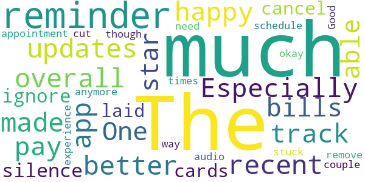
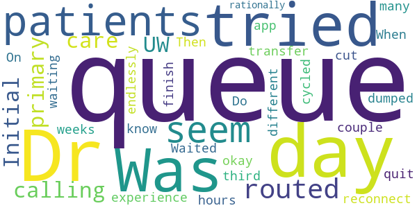
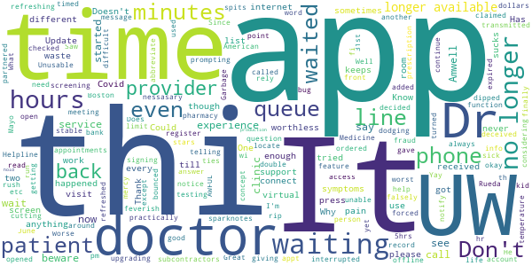

# UW Medicine Virtual Clinic
App version ``12.0.16.005_01``

Analyzed with [covid-apps-observer](http://github.com/covid-apps-observer) project, version ``0.1``

## App overview
| | |
|-------------------------|-------------------------| 
| **Name**&nbsp;&nbsp;&nbsp;&nbsp;&nbsp;&nbsp;&nbsp;&nbsp;&nbsp;&nbsp;&nbsp;&nbsp;&nbsp;&nbsp;&nbsp;&nbsp;&nbsp;&nbsp;&nbsp;&nbsp;&nbsp;&nbsp;&nbsp;&nbsp;&nbsp;&nbsp;&nbsp;&nbsp;&nbsp;&nbsp;&nbsp;&nbsp;&nbsp;&nbsp;&nbsp;&nbsp;&nbsp;&nbsp;&nbsp;&nbsp;  | UW Medicine Virtual Clinic |
| **Unique identifier** | org.uwmedicine.android.wash.virtualclinic |
| **Link to Google Play** | [https://play.google.com/store/apps/details?id=org.uwmedicine.android.wash.virtualclinic](https://play.google.com/store/apps/details?id=org.uwmedicine.android.wash.virtualclinic) |
| **Summary**  | UW Medicine Virtual Clinic offers 24/7 healthcare for most minor illnesses. |
| **Privacy policy** | [https://www.americanwell.com/privacy-policy/](https://www.americanwell.com/privacy-policy/) |
| **Latest version** | 12.0.16.005_01 |
| **Last update** | 2020-10-25 16:56:45 |
| **Recent changes** | We continue to improve the patient experience with these new features: • Performance enhancements to increase reliability and speed |
| **Installs**  | 5,000+ |
| **Category** | Medical |
| **First release** | Aug 23, 2019 |
| **Size**  | 52M |
| **Supported Android version**  | 5.0 and up |

### Description
> UW Medicine Virtual Clinic offers 24/7 care with a medical provider of your choice from anywhere in the U.S. During your visit, your medical provider can diagnose and prescribe treatment for a variety of minor illnesses and injuries (see below).
 How it Works
 • Download the app
 • Choose your provider 
 • Connect with your provider in minutes
 • Receive a personalized summary of your visit by email or through UW Medicine’s patient portal eCare (for existing patients)
 About the Virtual Clinic
 • Seek care for you, your child or another family member. 
 • Available any time of day or night (24/7) from anywhere, e.g., your home or office.
 • No appointments are necessary.
 • Visits typically last about 20 minutes.
 • Visits are secure and confidential. 
 • Costs only $35 per visit and is covered by some health plans.
 • The fee is payable with a Health Savings Account (HAS), Flexible Savings Account (FSA), Healthcare Reimbursement Account (HRA) or credit card.
 • Visits are free to UMP Plus members of the UW Medicine Accountable Care Network. 
 • Get connected to specialty care if needed.
 • Prescriptions are available if needed. Choose and save your pharmacy.
 If you do not have a primary care provider and you wish to find and establish care with one, you may visit the UW Medicine website or call 206-520-7811 and a service representative will be happy to help you.
 Most Common Conditions We Treat
 The UW Medicine Virtual Clinic medical providers treat a variety of urgent illnesses and minor injuries. They will always assess you as an individual, based on your own unique circumstances, including the severity of your illness. Sometimes we may need to refer you for in-person care for proper diagnosis and treatment. 
 • Acne
 • Allergies
 • Asthma
 • Athlete's Foot
 • Back Pain
 • Bladder Infection
 • Burns
 • Colds
 • Congestion
 • Constipation
 • Cut
 • Cough 
 • Skin conditions
 • Diarrhea
 • Ear Pain
 • Eye Issues
 • Fever
 • Flu
 • Headache
 • Hives
 • Insect Bites
 • Nausea
 • Pink Eye 
 • Rash
 • Scrapes and Bruises
 • Shingles
 • Sinus Symptoms
 • Sore Throat
 • Sprains
 • Stomach Flu
 • Urinary Tract Infection in adult women
 • Vomiting
 • Yeast Infection

### User interface
The developers of the app provide the following screenshots in the Google play store.
| | | |
|:-------------------------:|:-------------------------:|:-------------------------:|
 |   |   |   | 
 |   |   |   | 
 |   |   |   | 
 |   |   |   | 

## Development team
In the following we report the main information provided by the development team in the Google play store.

| | |
|-------------------------|-------------------------|
| **Developer**  | UW Medicine |
| **Website**  | - |
| **Email** | itc@americanwell.com |
| **Physical address**  | - |
| **Other developed apps**  | [https://play.google.com/store/apps/developer?id=UW+Medicine](https://play.google.com/store/apps/developer?id=UW+Medicine) |

## Android support

| | |
|-------------------------|-------------------------|
| **Declared target Android version**  | Android10, version 10 (API level 29) |
| **Effective target Android version**  | Android10, version 10 (API level 29) |
| **Minimum supported Android version**  | Lollipop, version 5.0 (API level 21) |
| **Maximum target Android version**  | - |

The larger the difference between the minimum and maximum supported Android versions, the better. A larger difference means a wider audience. For example, old phones have a very low Android version, so a high minimum supported Android version means that the app cannot be used by users with old phones, thus leading to accessibility problems. 

## Requested permissions

In the following we report the complete list of the permissions requested by the app. 

| **Permission** | **Protection level** | **Description** | 
|-------------------------|-------------------------|-------------------------|
 **android.permission ACCESS_COARSE_LOCATION** | :warning:**Dangerous** | Allows an app to access approximate location. 
 **android.permission ACCESS_FINE_LOCATION** | :warning:**Dangerous** | Allows an app to access precise location. 
 **android.permission ACCESS_LOCATION_EXTRA_COMMANDS** | Normal | Allows an application to access extra location provider commands. 
 **android.permission ACCESS_NETWORK_STATE** | Normal | Allows applications to access information about networks. 
 **android.permission ACCESS_WIFI_STATE** | Normal | Allows applications to access information about Wi-Fi networks. 
 **android.permission BLUETOOTH** | Normal | Allows applications to connect to paired bluetooth devices. 
 **android.permission BROADCAST_STICKY** | Normal | Allows an application to broadcast sticky intents. 
 **android.permission CAMERA** | :warning:**Dangerous** | Required to be able to access the camera device. 
 **android.permission GET_TASKS** | Deprecated | This constant was deprecated in API level 21. No longer enforced. 
 **android.permission INTERNET** | Normal | Allows applications to open network sockets. 
 **android.permission MODIFY_AUDIO_SETTINGS** | Normal | Allows an application to modify global audio settings. 
 **android.permission READ_EXTERNAL_STORAGE** | :warning:**Dangerous** | Allows an application to read from external storage. 
 **android.permission READ_PHONE_STATE** | :warning:**Dangerous** | Allows read only access to phone state, including the phone number of the device, current cellular network information, the status of any ongoing calls, and a list of any PhoneAccounts registered on the device. 
 **android.permission RECEIVE_BOOT_COMPLETED** | Normal | Allows an application to receive the Intent.ACTION_BOOT_COMPLETED that is broadcast after the system finishes booting. 
 **android.permission RECORD_AUDIO** | :warning:**Dangerous** | Allows an application to record audio. 
 **android.permission REORDER_TASKS** | Normal | Allows an application to change the Z-order of tasks. 
 **android.permission SYSTEM_ALERT_WINDOW** | Signature - preinstalled - appop - pre23 - development | Allows an app to create windows using the type WindowManager.LayoutParams.TYPE_APPLICATION_OVERLAY, shown on top of all other apps. 
 **android.permission USE_BIOMETRIC** | Normal | Allows an app to use device supported biometric modalities. 
 **android.permission USE_FINGERPRINT** | Normal | This constant was deprecated in API level 28. Applications should request USE_BIOMETRIC instead 
 **android.permission VIBRATE** | Normal | Allows access to the vibrator. 
 **android.permission WAKE_LOCK** | Normal | Allows using PowerManager WakeLocks to keep processor from sleeping or screen from dimming. 
 **android.permission WRITE_EXTERNAL_STORAGE** | :warning:**Dangerous** | Allows an application to write to external storage. 
 **com.facebook.katana.provider ACCESS** | - | - 
 **com.google.android.c2dm.permission RECEIVE** | - | - 
 **com.google.android.finsky.permission BIND_GET_INSTALL_REFERRER_SERVICE** | - | - 
 **org.uwmedicine.android.wash.virtualclinic.permission C2D_MESSAGE** | - | - 

## Mentioned servers

| **Server** | **Registrant** | **Registrant country** | **Creation date** | 
|-------------------------|-------------------------|-------------------------|-------------------------|
 | amwell.com | American Well Corporation | :us: US | 2004-02-13 19:02:32 |
 | facebook.com | Facebook, Inc. | :us: US | 1997-03-29 05:00:00 |
 | doubleclick.net | Google Inc. | :us: US | 1996-01-16 05:00:00 |
 | googleadservices.com | Google LLC | :us: US | 2003-06-19 16:34:53 |
 | google.com | Google LLC | :us: US | 1997-09-15 04:00:00 |
 | googlesyndication.com | Google LLC | :us: US | 2003-01-21 06:17:24 |
 | google-analytics.com | Google LLC | :us: US | 2005-07-18 19:24:32 |
 | app-measurement.com | Google LLC | :us: US | 2015-06-19 20:13:31 |
 | appboy.com | Braze, Inc. | :us: US | 2008-10-06 23:28:32 |
 | braze.com | Braze, Inc. | :us: US | 2000-01-19 02:18:28 |
 | optimizely.com | Optimizely | :us: US | 2010-01-11 03:01:32 |
 | twitter.com | Twitter, Inc. | :us: US | 2000-01-21 16:28:17 |
 | branch.io | Branch | :us: US | 2011-11-10 13:52:13 |
 | gstatic.com | Google LLC | :us: US | 2008-02-11 15:31:25 |
 | crashlytics.com | Google LLC | :us: US | 2011-01-21 15:30:40 |
 | bnc.lt | - | - | 2016-11-14 00:00:00 |
 | ggpht.com | Google LLC | :us: US | 2008-01-16 18:55:33 |

## Security analysis 

Below we report the main security warnings raised by our execution of the [Androwarn](https://github.com/maaaaz/androwarn) security analysis tool.

**Telephony identifiers leakage**
> - This application reads the ISO country code equivalent for the SIM provider's country code 
> - This application reads the ISO country code equivalent of the current registered operator's MCC (Mobile Country Code) 
> - This application reads the MCC+MNC of the provider of the SIM 
> - This application reads the device phone type value 
> - This application reads the numeric name (MCC+MNC) of current registered operator 
> - This application reads the operator name 
> - This application reads the phone's current state 
> - This application reads the radio technology (network type) currently in use on the device for data transmission 

**Connection interfaces exfiltration**
> - This application reads details about the currently active data network 
> - This application tries to find out if the currently active data network is metered 

**Telephony services abuse**
> - This application makes phone calls 

**Audio video eavesdropping**
> - This application captures video from the 'CAMERA' source 

**Suspicious connection establishment**
> - This application opens a Socket and connects it to the remote address ' returned no addresses for  ; port is out of range' on the 'N/A' port  
> - This application opens a Socket and connects it to the remote address '' on the 'N/A' port  
> - This application opens a Socket and connects it to the remote address 'Ljava/net/Proxy;->type()Ljava/net/Proxy$Type;' on the 'N/A' port  
> - This application opens a Socket and connects it to the remote address 'timeout' on the 'N/A' port  

**Code execution**
> - This application loads a native library 
> - This application executes a UNIX command containing this argument: '2' 

## User ratings and reviews

Below we provide information about how end users are reacting to the app in terms of ratings and reviews in the Google Play store.

### Ratings

The UW Medicine Virtual Clinic app has been installed by more than **5000** times. At this time, **73** rated the app and its average score is **3.9863014**. Below we show the distribution of the ratings across the usual star-based rating of Google Play

:star::star::star::star::star:: 48

:star::star::star::star:: 7

:star::star::star:: 2

:star::star:: 1

:star:: 15

### Reviews 

#### 5-star reviews

> Quick, friendly great help great  :date: __2020-12-14 23:46:34__

> Fast, professional, excellent care. Only issue was some glitches in sound quality which made communication a bit slower. Otherwise, a really helpful and convenient app, will definitely use again.  :date: __2020-09-20 05:13:06__

> Very efficient.  :date: __2020-07-26 23:32:33__

> Great  :date: __2020-07-25 21:23:44__

> AMAZING BEST APP EVER TO COME OUT, LOVE IT SO MUCH! SEE A REAL DOCTOR AT THE COMFORT OF YOUR HOME  :date: __2020-07-19 23:52:58__

> Very easy to use and quick to get a hold of someone  :date: __2020-04-21 01:55:36__

> Worked perfect  :date: __2020-04-13 00:23:36__

> Great and easy  :date: __2020-04-05 07:39:16__

> Good experience glad I'm not putting anyone at risk for Covid  :date: __2020-04-03 16:47:41__

> Excellent app!!!  :date: __2020-04-02 21:57:17__

#### 4-star reviews

> It was okay!  :date: __2020-04-19 06:46:51__

> Good experience, audio cut out a couple of times though.  :date: __2019-10-15 07:22:49__

#### 3-star reviews

> Can't be sure this is for University of Washington. My logon doesn't work but works on my desktop.  :date: __2020-06-02 21:36:24__

#### 2-star reviews

> Was routed into this after calling a UW primary care. Initial experience was okay. Then tried to reconnect after a couple of weeks. Waited in queue for 3 days only to be dumped out after hours of waiting each day. Do the Drs. know how many patients are in their queue? When they quit, patients just seem to get cut off. On third day app tried to transfer me to a different Dr. but just cycled endlessly. Seems like Drs. can't finish their queues rationally.  :date: __2020-03-20 22:59:46__

#### 1-star reviews

> Unusable, just keeps giving me a notice that my internet was interrupted then prompting me to press "okay" and refreshing to do it again.  :date: __2021-03-25 18:06:18__

> Has a bug, keeps telling me I need internet access even though I'm on wi-fi  :date: __2021-03-22 01:44:38__

> unable to open app.  :date: __2021-02-03 23:44:38__

> This app can't be used. It always say we're upgrading your experience.  :date: __2021-01-20 21:03:56__

> The clinic is a rip-off. The Doctors are subcontractors who can't help you with anything UW and just read you Mayo Clinic sparknotes. They couldn't answer anything about Covid-19 testing/screening even though they list th at as a feature in the app. It's a waste of $35 dollars and is practically fraud considering how they rush your meeting while dodging every question as "They Don't Know". Worse yet I called the UW Helpline and they falsely claimed that this was nessasary for appointments now.  :date: __2020-06-06 19:15:10__

> Could not locate my record..??  :date: __2020-05-27 18:23:44__

> One of the worst experiences of my life. Don't be deceived because it says UW Medicine! The UW has partnered with American Well(Amwell) in Boston and they run this clinic. Saw a virtual "DR" who was worthless for 3/4 minutes. He ordered a prescription for me but never transmitted to pharmacy. Amwell even "double dipped" into my bank account also. Beware, beware, beware of this app and don't use. It's not UW Drs that you get to see! Update: UW is cutting ties with Amwell on June 30, 2020. Yay!  :date: __2020-05-04 23:08:01__

> I had all the symptoms for covid except feverish temperature. Since it was difficult to get an appt at the dr. I decided to use the app to get checked, i was on the wait line for a good hr till my phone screen turned off. I opened my phone again, the app had refreshed so i had to register my patient info, symptoms,etc again. I was 31st person on the wait list, my screen timed out again and this happened another 2-3 times over 5hrs till i just gave up.  :date: __2020-05-01 00:03:39__

> Does not function, forced to rely on an app that spits me out of the queue. AWFUL.  :date: __2020-03-29 00:00:32__

> When I was signing up, I didn't know that there is a word limit so I tried to abbreviate and by the time I press continue, it says, my time expired so I started again. Then I started waiting under Dr Rueda at 11:47 am and by 1:23 pm I received a message that the Dr is no longer available. What? Why? Patients are in pain why the added pain. Have mercy  :date: __2020-03-23 22:03:39__

