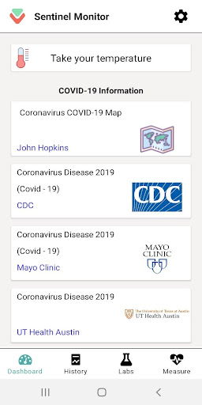

# Sentinel Monitor (COVID-19 Management)
App version ``1.5``

Analyzed with [covid-apps-observer](http://github.com/covid-apps-observer) project, version ``0.1``

## App overview
| | |
|-------------------------|-------------------------| 
| **Name**&nbsp;&nbsp;&nbsp;&nbsp;&nbsp;&nbsp;&nbsp;&nbsp;&nbsp;&nbsp;&nbsp;&nbsp;&nbsp;&nbsp;&nbsp;&nbsp;&nbsp;&nbsp;&nbsp;&nbsp;&nbsp;&nbsp;&nbsp;&nbsp;&nbsp;&nbsp;&nbsp;&nbsp;&nbsp;&nbsp;&nbsp;&nbsp;&nbsp;&nbsp;&nbsp;&nbsp;&nbsp;&nbsp;&nbsp;&nbsp;  | Sentinel Monitor (COVID-19 Management) |
| **Unique identifier** | tracker.healthcare.sentinel |
| **Link to Google Play** | [https://play.google.com/store/apps/details?id=tracker.healthcare.sentinel](https://play.google.com/store/apps/details?id=tracker.healthcare.sentinel) |
| **Summary**  | Temperature and symptom tracking for patients with COVID-19 or flu |
| **Privacy policy** | [http://sentinel.healthcare/eula](http://sentinel.healthcare/eula) |
| **Latest version** | 1.5 |
| **Last update** | 2020-04-23 23:34:42 |
| **Recent changes** | New App Name: Sentinel Monitor Labs: Submit and view COVID-19 lab results (Only available at select testing sites) Additional attributes in user profile Additional sign up methods Spanish language option General app improvements |
| **Installs**  | 1,000+ |
| **Category** | Medical |
| **First release** | Mar 8, 2020 |
| **Size**  | 9.7M |
| **Supported Android version**  | 4.4 and up |

### Description
> The Sentinel Monitor allows for individuals who are not feeling well (COVID-19, Flu, etc) to track their temperature and associated symptoms. Sentinel Monitor can be used by individuals or in conjunction with approved healthcare organizations. 
 DISCLAIMER: ALL OF THE MATERIAL PROVIDED THROUGH SENTINEL'S SYMPTOM CHECKER PORTION OF THE PLATFORM, SUCH AS TEXT, GRAPHICS, PHOTOGRAPHS, IMAGES, MESSAGES, FORUM POSTINGS, AND ANY OTHER MATERIALS, ARE FOR INFORMATIONAL PURPOSES ONLY AND ARE NOT A SUBSTITUTE FOR PROFESSIONAL MEDICAL ADVICE OR TREATMENT. ALWAYS SEEK THE ADVICE OF YOUR PHYSICIAN OR OTHER QUALIFIED HEALTH PROVIDER WITH ANY QUESTIONS YOU MAY HAVE REGARDING YOUR HEALTH. NEVER DISREGARD PROFESSIONAL MEDICAL ADVICE OR DELAY IN SEEKING IT BECAUSE OF ANY INFORMATION PROVIDED THROUGH THE PLATFORM. ADDITIONALLY, COMPANY DOES NOT PROMISE ANY PARTICULAR RESULTS WITH REGARDS TO YOUR HEALTH IN CONNECTION WITH YOUR USE OF THE PLATFORM.  IF YOU THINK YOU HAVE A MEDICAL EMERGENCY, CALL YOUR DOCTOR OR YOUR LOCAL EMERGENCY PHONE NUMBER IMMEDIATELY.

### User interface
The developers of the app provide the following screenshots in the Google play store.
| | | |
|:-------------------------:|:-------------------------:|:-------------------------:|
 |   |   |   | 
 |  

## Development team
In the following we report the main information provided by the development team in the Google play store.

| | |
|-------------------------|-------------------------|
| **Developer**  | Sentinel Healthcare |
| **Website**  | [http://sentinel.healthcare](http://sentinel.healthcare) |
| **Email** | app-support@sentinel.healthcare |
| **Physical address**  | - |
| **Other developed apps**  | [https://play.google.com/store/apps/developer?id=Sentinel+Healthcare](https://play.google.com/store/apps/developer?id=Sentinel+Healthcare) |

## Android support

| | |
|-------------------------|-------------------------|
| **Declared target Android version**  | Android10, version 10 (API level 29) |
| **Effective target Android version**  | Android10, version 10 (API level 29) |
| **Minimum supported Android version**  | KitKat, version 4.4 - 4.4.4 (API level 19) |
| **Maximum target Android version**  | - |

The larger the difference between the minimum and maximum supported Android versions, the better. A larger difference means a wider audience. For example, old phones have a very low Android version, so a high minimum supported Android version means that the app cannot be used by users with old phones, thus leading to accessibility problems. 

## Requested permissions

In the following we report the complete list of the permissions requested by the app. 

| **Permission** | **Protection level** | **Description** | 
|-------------------------|-------------------------|-------------------------|
 **android.permission  ACCESS_COARSE_LOCATION** | - | - 
 **android.permission ACCESS_FINE_LOCATION** | :warning:**Dangerous** | Allows an app to access precise location. 
 **android.permission ACCESS_NETWORK_STATE** | Normal | Allows applications to access information about networks. 
 **android.permission BLUETOOTH** | Normal | Allows applications to connect to paired bluetooth devices. 
 **android.permission BLUETOOTH_ADMIN** | Normal | Allows applications to discover and pair bluetooth devices. 
 **android.permission CAMERA** | :warning:**Dangerous** | Required to be able to access the camera device. 
 **android.permission INTERNET** | Normal | Allows applications to open network sockets. 
 **android.permission WAKE_LOCK** | Normal | Allows using PowerManager WakeLocks to keep processor from sleeping or screen from dimming. 
 **com.google.android.c2dm.permission RECEIVE** | - | - 
 **com.google.android.finsky.permission BIND_GET_INSTALL_REFERRER_SERVICE** | - | - 

## Mentioned servers

| **Server** | **Registrant** | **Registrant country** | **Creation date** | 
|-------------------------|-------------------------|-------------------------|-------------------------|
 | googlesyndication.com | Google LLC | :us: US | 2003-01-21 06:17:24 |
 | google.com | Google LLC | :us: US | 1997-09-15 04:00:00 |
 | app-measurement.com | Google LLC | :us: US | 2015-06-19 20:13:31 |
 | ipify.org | Domains By Proxy, LLC | :us: US | 2014-01-05 22:02:15 |
 | ihealthlabs.com | REDACTED FOR PRIVACY | cn | 2011-10-13 07:43:43 |
 | googleapis.com | Google LLC | :us: US | 2005-01-25 17:52:26 |
 | googleadservices.com | Google LLC | :us: US | 2003-06-19 16:34:53 |
 | sematext.com | REDACTED FOR PRIVACY | :us: US | 2007-05-01 03:03:08 |
 | crashlytics.com | Google LLC | :us: US | 2011-01-21 15:30:40 |
 | arcgis.com | ESRI | :us: US | 1999-06-09 22:21:51 |
 | mayoclinic.org | Mayo Foundation for Medical Education and Research | :us: US | 1997-02-08 05:00:00 |
 | uthealthaustin.org | Domain Privacy Service FBO Registrant. | :us: US | 2017-02-20 15:26:07 |
 | healthdata.org | University of Washington | :us: US | 2012-09-05 15:15:20 |
 | sentinelboard.com | Contact Privacy Inc. Customer 1242799118 | :canada: CA | 2018-06-10 18:25:45 |
 | xmlpull.org | WhoisGuard, Inc. | PA | 2001-11-26 20:33:08 |
 | humanly.io | c/o whoisproxy.com | :us: US | 2018-08-10 02:39:54 |

## Security analysis 

Below we report the main security warnings raised by our execution of the [Androwarn](https://github.com/maaaaz/androwarn) security analysis tool.

**Telephony identifiers leakage**
> - This application reads the ISO country code equivalent for the SIM provider's country code 
> - This application reads the MCC+MNC of the provider of the SIM 
> - This application reads the Service Provider Name (SPN) 
> - This application reads the constant indicating the state of the device SIM card 
> - This application reads the device phone type value 
> - This application reads the numeric name (MCC+MNC) of current registered operator 
> - This application reads the operator name 
> - This application reads the radio technology (network type) currently in use on the device for data transmission 

**Connection interfaces exfiltration**
> - This application reads details about the currently active data network 
> - This application tries to find out if the currently active data network is metered 

**Suspicious connection establishment**
> - This application opens a Socket and connects it to the remote address '' on the 'N/A' port  
> - This application opens a Socket and connects it to the remote address 'Ljava/lang/StringBuilder;->toString()Ljava/lang/String;' on the 'N/A' port  
> - This application opens a Socket and connects it to the remote address 'Ljava/net/Proxy;->type()Ljava/net/Proxy$Type;' on the 'N/A' port  
> - This application opens a Socket and connects it to the remote address 'timeout' on the 'N/A' port  

**Code execution**
> - This application loads a native library: 'ECGOffline' 
> - This application loads a native library: 'ECGOnline' 
> - This application loads a native library: 'VeryFitMulti' 
> - This application loads a native library: 'iHealth' 
> - This application executes a UNIX command containing this argument: '' 

## User ratings and reviews

Below we provide information about how end users are reacting to the app in terms of ratings and reviews in the Google Play store.

### Ratings

The Sentinel Monitor (COVID-19 Management) app has been installed by more than **1000** times. At this time, **11** rated the app and its average score is **4.181818**. Below we show the distribution of the ratings across the usual star-based rating of Google Play

:star::star::star::star::star:: 8

:star::star::star::star:: 1

:star::star::star:: 0

:star::star:: 0

:star:: 2

### Reviews 

#### 5-star reviews

> Doe exactly what I need!  :date: __2020-12-03 04:54:28__

> Very easy to download, what a great way to help insure I can keep track of my Temperature and changes. Thank You Sentinel.  :date: __2020-03-12 04:02:10__

#### 4-star reviews

> Why is it so difficult to date of birth? Allow for typing in or something easy.  :date: __2020-05-06 23:19:23__

#### 3-star reviews

No recent reviews available with 3 stars.

#### 2-star reviews

No recent reviews available with 2 stars.

#### 1-star reviews

> It doesn't work at all.l installed bicause l wanted to be informed about Corona virus.but when l try to open it it doesn't open  :date: __2020-12-14 16:59:59__

> Don't work  :date: __2020-06-30 08:22:16__

