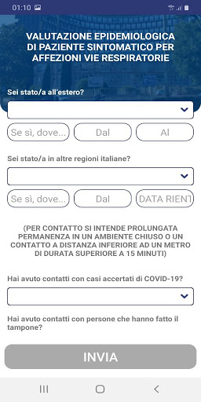

# LAZIOdrCovid
Version ``1.0.14``

## App overview


| | |
|-------------------------|-------------------------| 
| **Name**  | LAZIOdrCovid |
| **Unique identifier** | com.intellicare.covid |
| **Link to Google Play** | [https://play.google.com/store/apps/details?id=com.intellicare.covid](https://play.google.com/store/apps/details?id=com.intellicare.covid) |
| **Summary**  | Health remote monitoring platform for patients with COVID-19 risk. |
| **Privacy policy** | [https://www.salutelazio.it/documents/10182/59078875/PoliticaPrivacy+LazioDoctor.pdf/2707a744-fe9d-92c9-abb8-c2e749ce82a1](https://www.salutelazio.it/documents/10182/59078875/PoliticaPrivacy+LazioDoctor.pdf/2707a744-fe9d-92c9-abb8-c2e749ce82a1) |
| **Latest version** | 1.0.14 |
| **Last update** | 2020-04-23 23:10:26 |
| **Recent changes** | Aggiorniamo l&#39;app regolarmente per renderla sempre migliore. Scarica la versione più recente per avere tutte le funzioni, i miglioramenti delle prestazioni e la risoluzione di problemi tecnici disponibili. |
| **Installs**  | 50,000+ |
| **Category** | Medical |
| **First release** | Mar 16, 2020 |
| **Size**  | 32M |
| **Supported Android version**  | 6.0 and up |

### Description

```
La Regione Lazio offre la piattaforma Lazio Doctor per consultare informazioni utili legati all’emergenza COVID-19 e per connettere i pazienti con operatori sanitari e numero verde 800118800. Attraverso l’applicazione mobile scaricata sul telefono è possibile entrare in contatto con il proprio medico di base in modalità virtuale, ovunque, inviando in qualsiasi momento, le richieste di cui si ha bisogno. L’applicazione prevede comunicazioni testo-audio bidirezionali sicure tramite smartphone tra il cittadino ed il proprio medico. La videochiamata viene attivata, se necessario, dal medico per approfondire il quadro clinico del paziente.
La Regione Lazio ha voluto rendere disponibile, ai pro¬pri cittadini, una corsia veloce ed affidabile per la fruizione dei servizi sanitari efficace soprattutto nei momenti di emergenza e in sicurezza. L’applicazione è scaricabile gratuitamente su App Store (iPhone) e Play Store (telefoni Android) su smar¬tphone. La modalità di accesso è immediata. Basta poi seguire i semplici passaggi per accedere ai servizi disponibili.
```

### User interface
The developers of the app provide the following screenshots in the Google play store.
| | | |
|:-------------------------:|:-------------------------:|:-------------------------:|
 |   |   |   | 
 |   |   |   | 


## Development team
In the following we report the main information provided by the development team in the Google play store.

| | |
|-------------------------|-------------------------|
| **Developer**  | LAZIOcrea S.p.A. |
| **Website**  | - |
| **Email** | [mailto:mobile@laziocrea.it][mobile@laziocrea.it] |
| **Physical address**  | - |
| **Other developed apps**  | [https://play.google.com/store/apps/developer?id=LAZIOcrea+S.p.A.](https://play.google.com/store/apps/developer?id=LAZIOcrea+S.p.A.) |

## Android support

| | |
|-------------------------|-------------------------|
| **Declared target Android version**  | Android10, version 10 (API level 29) |
| **Effective target Android version**  | Android10, version 10 (API level 29) |
| **Minimum supported Android version**  | Marshmallow, version 6.0 (API level 23) |
| **Maximum target Android version**  | - |

## Requested permissions

In the following we report the complete list of the permissions requested by the app. 

| **Permission** | **Protection level** | **Description** | 
|-------------------------|-------------------------|-------------------------|
 **android.permission<br>ACCESS_NETWORK_STATE** | Normal | Allows applications to access information about networks. 
 **android.permission<br>CAMERA** | <p class="text-red mb-2">:warning:Dangerous</p> | Required to be able to access the camera device. 
 **android.permission<br>FLASHLIGHT** | - | - 
 **android.permission<br>INTERNET** | Normal | Allows applications to open network sockets. 
 **android.permission<br>MODIFY_AUDIO_SETTINGS** | Normal | Allows an application to modify global audio settings. 
 **android.permission<br>READ_EXTERNAL_STORAGE** | <p class="text-red mb-2">:warning:Dangerous</p> | Allows an application to read from external storage. 
 **android.permission<br>RECEIVE_BOOT_COMPLETED** | Normal | Allows an application to receive the Intent.ACTION_BOOT_COMPLETED that is broadcast after the system finishes booting. 
 **android.permission<br>RECORD_AUDIO** | <p class="text-red mb-2">:warning:Dangerous</p> | Allows an application to record audio. 
 **android.permission<br>USE_FULL_SCREEN_INTENT** | Normal | Required for apps targeting Build.VERSION_CODES.Q that want to use notification full screen intents. 
 **android.permission<br>VIBRATE** | Normal | Allows access to the vibrator. 
 **android.permission<br>WAKE_LOCK** | Normal | Allows using PowerManager WakeLocks to keep processor from sleeping or screen from dimming. 
 **android.permission<br>WRITE_EXTERNAL_STORAGE** | <p class="text-red mb-2">:warning:Dangerous</p> | Allows an application to write to external storage. 
 **android.webkit<br>PermissionRequest** | - | - 
 **com.google.android.c2dm.permission<br>RECEIVE** | - | - 
 **com.google.android.finsky.permission<br>BIND_GET_INSTALL_REFERRER_SERVICE** | - | - 


## Mentioned servers

| **Server** | **Registrant** | **Registrant country** | **Creation date** | 
|-------------------------|-------------------------|-------------------------|-------------------------|
 | googlesyndication.com | Google LLC | :us: US | 2003-01-21 06:17:24 |
 | google.com | - | - | 1997-09-15 04:00:00 |
 | app-measurement.com | - | - | 2015-06-19 20:13:31 |
 | googleadservices.com | - | - | 2003-06-19 16:34:53 |
 | color.org | International Color Consortium | :us: US | 1995-12-12 05:00:00 |
 | regione.lazio.it | Regione Lazio | :it: IT | 1996-12-17 00:00:00 |


## Security analysis 

Below we report the main security warnings raised by our execution of the [Androwarn](https://github.com/maaaaz/androwarn) security analysis tool.

**Connection interfaces exfiltration**
```
This application reads details about the currently active data network
This application tries to find out if the currently active data network is metered
```

**Telephony services abuse**
```
This application makes phone calls
```

**Suspicious connection establishment**
```
This application opens a Socket and connects it to the remote address 'Lc/a/a/a/a;->a(Ljava/lang/String;)Ljava/lang/StringBuilder;' on the 'N/A' port 
This application opens a Socket and connects it to the remote address 'Ljava/net/Proxy;->type()Ljava/net/Proxy$Type;' on the 'N/A' port 
This application opens a Socket and connects it to the remote address 'hostname == null ' on the 'N/A' port 
This application opens a Socket and connects it to the remote address 'timeout' on the 'N/A' port 
```

**Code execution**
```
This application loads a native library: 'jingle_peerconnection_so'
```


## User ratings and reviews

Below we provide information about how end users are reacting to the app in terms of ratings and reviews in the Google Play store.

### Ratings

The <<<APP_NAME>>> app has been installed by more than **<<<APP_MIN_INSTALLS>>>** times. At this time, **<<<APP_RATINGS>>>** rated the app and its average score is ***<<<APP_SCORE>>>. Below we show the distribution of the ratings across the usual star-based rating of Google Play
* Five stars: <<<APP_5_STARS>>>
* Four stars: <<<APP_4_STARS>>>
* Three stars: <<<APP_3_STARS>>>
* Two stars: <<<APP_2_STARS>>>
* One star: <<<APP_1_STAR>>>

### Reviews 

<p align="center">
>> wordcloud" width="200"/>
</p>

TODO placeholders for 10 random reviews

<p align="center">
>> wordcloud" width="200"/>
</p>

TODO placeholders for 10 random reviews

<p align="center">
>> wordcloud" width="200"/>
</p>

TODO placeholders for 10 random reviews

<p align="center">
>> wordcloud" width="200"/>
</p>

TODO placeholders for 10 random reviews

<p align="center">
>> wordcloud" width="200"/>
</p>
