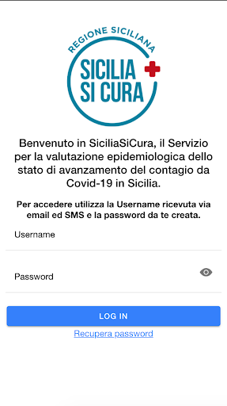
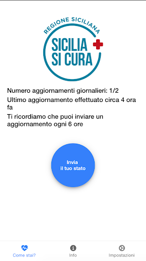
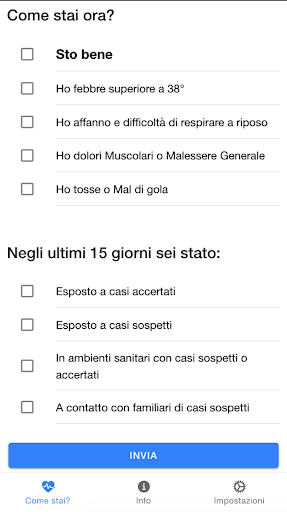

# Sicilia Si Cura
App version ``4.0``

Analyzed with [covid-apps-observer](http://github.com/covid-apps-observer) project, version ``0.1``

## App overview
| | |
|-------------------------|-------------------------| 
| **Name**&nbsp;&nbsp;&nbsp;&nbsp;&nbsp;&nbsp;&nbsp;&nbsp;&nbsp;&nbsp;&nbsp;&nbsp;&nbsp;&nbsp;&nbsp;&nbsp;&nbsp;&nbsp;&nbsp;&nbsp;&nbsp;&nbsp;&nbsp;&nbsp;&nbsp;&nbsp;&nbsp;&nbsp;&nbsp;&nbsp;&nbsp;&nbsp;&nbsp;&nbsp;&nbsp;&nbsp;&nbsp;&nbsp;&nbsp;&nbsp;  | Sicilia Si Cura |
| **Unique identifier** | com.siciliasicura.app |
| **Link to Google Play** | [https://play.google.com/store/apps/details?id=com.siciliasicura.app](https://play.google.com/store/apps/details?id=com.siciliasicura.app) |
| **Summary**  | App per valutazione epidemiologica avanzamento del contagio Covid-19 in Sicilia |
| **Privacy policy** | [https://siciliasicura.costruiresalute.it/welcome](https://siciliasicura.costruiresalute.it/welcome) |
| **Latest version** | 4.0 |
| **Last update** | 2020-04-28 13:14:44 |
| **Recent changes** | Effettuato aggiornamento di bug fix che in rari casi poteva causare il crash dell&#39;app. |
| **Installs**  | 1.000+ |
| **Category** | Salute e fitness |
| **First release** | 27 mar 2020 |
| **Size**  | 5,5M |
| **Supported Android version**  | 5.0 e versioni successive |

### Description
> La gestione della pandemia COVID-19, caratterizzata da una alta trasmissibilità del virus e da una contagiosità elevata anche durante il periodo asintomatico, richiede misure di isolamento sociale e di monitoraggio attivo delle condizioni di salute dei cittadini. 
 La Regione Siciliana ha avviato, dal 1 Marzo 2020, una procedura di registrazione per chi è entrato nel territorio regionale, indipendentemente dalla zona di provenienza e dal mezzo di trasporto attraverso il sito http://www.siciliacoronavirus.it, che è la modalità da utilizzare per poter ricevere le proprie credenziali per utilizzare l'APP Sicilia Si Cura.
 Tale procedura è stato un primo passo verso il monitoraggio attivo di uno dei principali veicoli di ingresso del virus: i contagiati asintomatici che inconsapevolmente agiscono da moltiplicatori di esposizione al rischio da COVID-19.
 Il passo successivo è quello di offrire uno strumento che consenta, volontariamente, l'invio periodico delle condizioni di salute delle persone registrate, consentendo l'incrocio dei dati sintomatologici da parte del Sistema Sanitario Regionale.
 Il Servizio "Sicilia Si Cura" ha l'obiettivo di creare un flusso continuo e trasparente di informazioni tra coloro che sono arrivati in Sicilia dopo il 1 Marzo 2020 e il Sistema di Gestione dell'Emergenza.
 Le informazioni riguardano le condizioni di salute, l'insorgenza di sintomi del COVID-19, l'eventuale esposizione a persone contagiate e l'indirizzo presso il quale si sta rimanendo in isolamento.
 La finalità è chiara: mantenere sotto controllo le condizioni di salute di chi è arrivato in Sicilia per identificare rapidamente l'insorgere di eventuali sintomi, intervenire celermente per la cura e mitigare i rischi di contagio per la popolazione.
 Nel rispetto della Privacy del cittadino, "Sicilia Si Cura" non esegue un monitoraggio attivo, in tempo reale, della posizione del suo utilizzatore, ma costituisce uno strumento per la condivisione volontaria delle proprie condizioni di salute su base bi-giornaliera. L'inserimento dell'indirizzo attuale è, volontario a cura dell'utente: l'APP verifica soltanto che l'indirizzo sia nell'ambito di un Comune della Regione Siciliana.
 Successivamente, nel momento dell'aggiornamento delle condizioni viene inviata la localizzazione dell'utente, al fine di confermare la sua presenza in un Comune della Regione Siciliana.
 Il Sistema di Gestione dell'Emergenza avrà la possibilità di accedere alle informazioni ricavate dall'APP per meglio gestire la curva epidemiologica in Sicilia.

### User interface
The developers of the app provide the following screenshots in the Google play store.
| | | |
|:-------------------------:|:-------------------------:|:-------------------------:|
 |   |   |   | 
 |  

## Development team
In the following we report the main information provided by the development team in the Google play store.

| | |
|-------------------------|-------------------------|
| **Developer**  | IES Solutions |
| **Website**  | [http://www.siciliacoronavirus.it](http://www.siciliacoronavirus.it) |
| **Email** | info@costruiresalute.it |
| **Physical address**  | - |
| **Other developed apps**  | [https://play.google.com/store/apps/developer?id=IES+Solutions](https://play.google.com/store/apps/developer?id=IES+Solutions) |

## Android support

| | |
|-------------------------|-------------------------|
| **Declared target Android version**  | Android10, version 10 (API level 29) |
| **Effective target Android version**  | Android10, version 10 (API level 29) |
| **Minimum supported Android version**  | Lollipop, version 5.0 (API level 21) |
| **Maximum target Android version**  | - |

## Requested permissions

In the following we report the complete list of the permissions requested by the app. 

| **Permission** | **Protection level** | **Description** | 
|-------------------------|-------------------------|-------------------------|
 **android.permission ACCESS_COARSE_LOCATION** | 
:warning:Dangerous
 | Allows an app to access approximate location. 
 **android.permission ACCESS_FINE_LOCATION** | 
:warning:Dangerous
 | Allows an app to access precise location. 
 **android.permission ACCESS_NETWORK_STATE** | Normal | Allows applications to access information about networks. 
 **android.permission INTERNET** | Normal | Allows applications to open network sockets. 
 **android.permission READ_EXTERNAL_STORAGE** | 
:warning:Dangerous
 | Allows an application to read from external storage. 
 **android.permission WAKE_LOCK** | Normal | Allows using PowerManager WakeLocks to keep processor from sleeping or screen from dimming. 
 **android.permission WRITE_EXTERNAL_STORAGE** | 
:warning:Dangerous
 | Allows an application to write to external storage. 
 **com.google.android.c2dm.permission RECEIVE** | - | - 

## Mentioned servers

| **Server** | **Registrant** | **Registrant country** | **Creation date** | 
|-------------------------|-------------------------|-------------------------|-------------------------|
 | google.com | Google LLC | :us: US | 1997-09-15 04:00:00 |
 | gstatic.com | Google LLC | :us: US | 2008-02-11 15:31:25 |
 | googleapis.com | Google LLC | :us: US | 2005-01-25 17:52:26 |

## Security analysis 

Below we report the main security warnings raised by our execution of the [Androwarn](https://github.com/maaaaz/androwarn) security analysis tool.

**Connection interfaces exfiltration**
> - This application reads details about the currently active data network 
> - This application tries to find out if the currently active data network is metered 

**Pim data leakage**
> - This application accesses the downloads folder 
> - This application accesses data stored in the clipboard 

**Code execution**
> - This application loads a native library: 'sqlc-native-driver' 

## User ratings and reviews

Below we provide information about how end users are reacting to the app in terms of ratings and reviews in the Google Play store.

### Ratings

The Sicilia Si Cura app has been installed by more than **1000** times. At this time, **42** rated the app and its average score is **3.3809524**. Below we show the distribution of the ratings across the usual star-based rating of Google Play
:star::star::star::star::star:: 22
:star::star::star::star:: 2
:star::star::star:: 3
:star::star:: 0
:star:: 15

### Reviews 

>> wordcloud" width="200"/>

TODO placeholders for 10 random reviews

>> wordcloud" width="200"/>

TODO placeholders for 10 random reviews

>> wordcloud" width="200"/>

TODO placeholders for 10 random reviews

>> wordcloud" width="200"/>

TODO placeholders for 10 random reviews

>> wordcloud" width="200"/>

