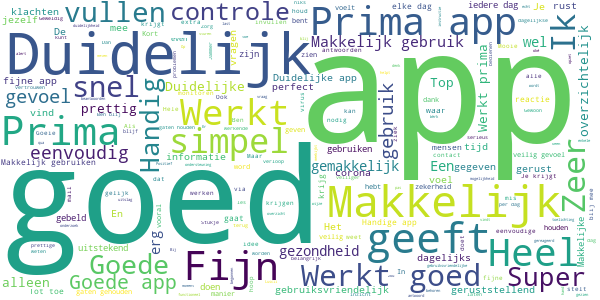
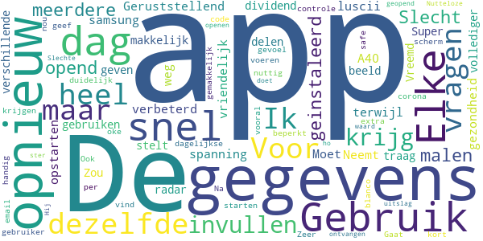

# Luscii
App version ``4.21.6``

Analyzed with [covid-apps-observer](http://github.com/covid-apps-observer) project, version ``0.1``

## App overview
| | |
|-------------------------|-------------------------| 
| **Name**&nbsp;&nbsp;&nbsp;&nbsp;&nbsp;&nbsp;&nbsp;&nbsp;&nbsp;&nbsp;&nbsp;&nbsp;&nbsp;&nbsp;&nbsp;&nbsp;&nbsp;&nbsp;&nbsp;&nbsp;&nbsp;&nbsp;&nbsp;&nbsp;&nbsp;&nbsp;&nbsp;&nbsp;&nbsp;&nbsp;&nbsp;&nbsp;&nbsp;&nbsp;&nbsp;&nbsp;&nbsp;&nbsp;&nbsp;&nbsp;  | Luscii |
| **Unique identifier** | nl.focuscura.beeldbelapp |
| **Link to Google Play** | [https://play.google.com/store/apps/details?id=nl.focuscura.beeldbelapp](https://play.google.com/store/apps/details?id=nl.focuscura.beeldbelapp) |
| **Summary**  | Welkom bij Luscii, de slimste gezondheidsapp voor zorg thuis of onderweg. |
| **Privacy policy** | [https://luscii.com/privacy-policy/](https://luscii.com/privacy-policy/) |
| **Latest version** | 4.21.6 |
| **Last update** | 2020-04-23 17:01:33 |
| **Recent changes** | In deze update hebben we het nieuwe aanmeldformulier toegevoegd voor De Corona Check. |
| **Installs**  | 50.000+ |
| **Category** | Medisch |
| **First release** | 8 mrt. 2016 |
| **Size**  | 35M |
| **Supported Android version**  | 7.0 en hoger |

### Description
> Wat is Luscii?
 Luscii maakt moderne zorg mogelijk. Met de Luscii app is het op voorschrift van een zorgorganisatie mogelijk om:
 - lichaamswaarden/symptomen in de gaten te houden
 - gerichte educatie te ontvangen over (omgaan met) ziekte of gezondheidsrisico's
 - op afstand te communiceren met zorgverleners
 Hoe werkt het?
 - Mensen dienen zich eerst aan te melden. Dat gaat normaal via een ziekenhuis. In geval van inzet in de corona crisis is aanmelden ook mogelijk op www.olvgcoronacheck.nl
 - De app vraagt dagelijks een aantal lichaamswaarden of symptomen door te geven. Deze zijn gebaseerd op een door zorgverleners voor de gebruiker ingesteld programma. Ook is er educatie in de app en contact op afstand.
 - Achter de app staat een medisch team paraat. Dit beoordeelt de antwoorden die gebruikers geven in de app (ondersteund door de techniek van de app). Als er een medische reden is om contact op te nemen, doen zij dat binnen 24 uur. Dat kan telefonisch of via een bericht. Ook is contact via beeldbellen mogelijk (let op: deze functie gebruikt OLVG corona check nog niet).
 OLVG corona check
 - Door de uitbraak van het coronavirus neemt de zorgvraag toe. Ziekenhuizen bereiden zich hierop voor door nieuwe middelen in te zetten naast de reguliere zorg. Samen met het Amsterdamse ziekenhuis OLVG heeft Luscii daarom de Luscii app hiervoor geschikt gemaakt. We noemen dit OLVG corona check.
 - OLVG corona check is bedoeld om grote groepen mensen met klachten die mogelijk door het coronavirus wordt veroorzaakt op afstand te kunnen begeleiden. Een medisch team beoordeelt de metingen die binnenkomen via de app van Luscii die voor OLVG corona check wordt gebruikt. OLVG corona check is gratis.
 - OLVG corona check is gestart voor mensen in de regio Groot Amsterdam. Er wordt gestreefd de regio's waarin de app beschikbaar is, uit te breiden. Meer informatie is te vinden op www.olvgcoronacheck.nl.
 Medisch hulpmiddel en gegevensverwerking
 Luscii is een CE gemarkeerd medisch hulpmiddel. Gegevens worden verwerkt volgens de Algemene Verordering Gegevensbescherming (AVG). Het privacyreglement en gebruikersvoorwaarden zijn te vinden op www.luscii.com. Luscii is gevestigd in Amsterdam, Nederland.

### User interface
The developers of the app provide the following screenshots in the Google play store.
| | | |
|:-------------------------:|:-------------------------:|:-------------------------:|
 |   |   |   | 
 |   |   |   | 
 |   |  

## Development team
In the following we report the main information provided by the development team in the Google play store.

| | |
|-------------------------|-------------------------|
| **Developer**  | Luscii Healthtech |
| **Website**  | [http://www.luscii.com](http://www.luscii.com) |
| **Email** | support@luscii.com |
| **Physical address**  | [Spuistraat 114A 1012 VA Amsterdam The Netherlands](https://www.google.com/maps/search/Spuistraat%20114A%201012%20VA%20Amsterdam%20The%20Netherlands) (Google Maps) |
| **Other developed apps**  | [https://play.google.com/store/apps/developer?id=Luscii+Healthtech](https://play.google.com/store/apps/developer?id=Luscii+Healthtech) |

## Android support

| | |
|-------------------------|-------------------------|
| **Declared target Android version**  | Android10, version 10 (API level 29) |
| **Effective target Android version**  | Android10, version 10 (API level 29) |
| **Minimum supported Android version**  | Nougat, version 7.0 (API level 24) |
| **Maximum target Android version**  | - |

The larger the difference between the minimum and maximum supported Android versions, the better. A larger difference means a wider audience. For example, old phones have a very low Android version, so a high minimum supported Android version means that the app cannot be used by users with old phones, thus leading to accessibility problems. 

## Requested permissions

In the following we report the complete list of the permissions requested by the app. 

| **Permission** | **Protection level** | **Description** | 
|-------------------------|-------------------------|-------------------------|
 **android.permission ACCESS_BACKGROUND_LOCATION** | :warning:**Dangerous** | Allows an app to access location in the background. 
 **android.permission ACCESS_COARSE_LOCATION** | :warning:**Dangerous** | Allows an app to access approximate location. 
 **android.permission ACCESS_FINE_LOCATION** | :warning:**Dangerous** | Allows an app to access precise location. 
 **android.permission ACCESS_NETWORK_STATE** | Normal | Allows applications to access information about networks. 
 **android.permission ACCESS_NOTIFICATION_POLICY** | Normal | Marker permission for applications that wish to access notification policy. 
 **android.permission ACCESS_WIFI_STATE** | Normal | Allows applications to access information about Wi-Fi networks. 
 **android.permission ACTIVITY_RECOGNITION** | :warning:**Dangerous** | Allows an application to recognize physical activity. 
 **android.permission BLUETOOTH** | Normal | Allows applications to connect to paired bluetooth devices. 
 **android.permission BLUETOOTH_ADMIN** | Normal | Allows applications to discover and pair bluetooth devices. 
 **android.permission CAMERA** | :warning:**Dangerous** | Required to be able to access the camera device. 
 **android.permission DISABLE_KEYGUARD** | Normal | Allows applications to disable the keyguard if it is not secure. 
 **android.permission FOREGROUND_SERVICE** | Normal | Allows a regular application to use Service.startForeground. 
 **android.permission INTERNET** | Normal | Allows applications to open network sockets. 
 **android.permission MODIFY_AUDIO_SETTINGS** | Normal | Allows an application to modify global audio settings. 
 **android.permission READ_EXTERNAL_STORAGE** | :warning:**Dangerous** | Allows an application to read from external storage. 
 **android.permission READ_PHONE_STATE** | :warning:**Dangerous** | Allows read only access to phone state, including the phone number of the device, current cellular network information, the status of any ongoing calls, and a list of any PhoneAccounts registered on the device. 
 **android.permission RECEIVE_BOOT_COMPLETED** | Normal | Allows an application to receive the Intent.ACTION_BOOT_COMPLETED that is broadcast after the system finishes booting. 
 **android.permission RECORD_AUDIO** | :warning:**Dangerous** | Allows an application to record audio. 
 **android.permission USE_FULL_SCREEN_INTENT** | Normal | Required for apps targeting Build.VERSION_CODES.Q that want to use notification full screen intents. 
 **android.permission VIBRATE** | Normal | Allows access to the vibrator. 
 **android.permission WAKE_LOCK** | Normal | Allows using PowerManager WakeLocks to keep processor from sleeping or screen from dimming. 
 **android.permission WRITE_EXTERNAL_STORAGE** | :warning:**Dangerous** | Allows an application to write to external storage. 
 **com.google.android.c2dm.permission RECEIVE** | - | - 
 **com.google.android.finsky.permission BIND_GET_INSTALL_REFERRER_SERVICE** | - | - 
 **nl.focuscura.beeldbelapp.permission C2D_MESSAGE** | - | - 

## Mentioned servers

| **Server** | **Registrant** | **Registrant country** | **Creation date** | 
|-------------------------|-------------------------|-------------------------|-------------------------|
 | googleapis.com | Google LLC | :us: US | 2005-01-25 17:52:26 |
 | ihealthlabs.com | - | cn | 2011-10-13 07:43:43 |
 | sematext.com | REDACTED FOR PRIVACY | :us: US | 2007-05-01 03:03:08 |
 | google.com | Google LLC | :us: US | 1997-09-15 04:00:00 |
 | w3.org | W3C | :us: US | 1994-07-06 04:00:00 |
 | xml.org | OASIS Open | :us: US | 1997-02-03 05:00:00 |
 | xmlpull.org | WhoisGuard, Inc. | PA | 2001-11-26 20:33:08 |
 | googlesyndication.com | Google LLC | :us: US | 2003-01-21 06:17:24 |
 | google-analytics.com | Google LLC | :us: US | 2005-07-18 19:24:32 |
 | app-measurement.com | Google LLC | :us: US | 2015-06-19 20:13:31 |
 | apple.com | Apple Inc. | :us: US | 1987-02-19 05:00:00 |
 | aomedia.org | Contact Privacy Inc. Customer 1243324949 | :canada: CA | 2015-08-24 14:07:31 |
 | googleapis.com | Google LLC | :us: US | 2005-01-25 17:52:26 |
 | googleadservices.com | Google LLC | :us: US | 2003-06-19 16:34:53 |
 | vimeo.com | Vimeo, Inc. | :us: US | 2004-12-15 08:38:55 |
 | branch.io | Branch | :us: US | 2011-11-10 13:52:13 |
 | crashlytics.com | Google LLC | :us: US | 2011-01-21 15:30:40 |
 | focuscura.com | REDACTED FOR PRIVACY | REDACTED FOR PRIVACY | 2010-05-20 14:02:28 |
 | luscii.com | Domains By Proxy, LLC | :us: US | 2018-06-21 09:46:19 |
 | focuscura.nl | - | - | 2003-01-30 00:00:00 |
 | twitter.com | Twitter, Inc. | :us: US | 2000-01-21 16:28:17 |
 | intercomcdn.com | Whois Privacy Service | :us: US | 2013-04-25 22:04:57 |
 | wistia.net | Wistia | :us: US | 2008-09-02 18:42:09 |
 | useloom.com | Whois Privacy Service | :us: US | 2016-10-03 00:10:39 |
 | wistia.com | Wistia | :us: US | 2007-03-18 21:58:55 |
 | youtube.com | Google LLC | :us: US | 2005-02-15 05:13:12 |
 | intercom.io | Intercom Ops | IE | 2011-08-15 11:52:53 |

## Security analysis 

Below we report the main security warnings raised by our execution of the [Androwarn](https://github.com/maaaaz/androwarn) security analysis tool.

**Telephony identifiers leakage**
> - This application reads the ISO country code equivalent of the current registered operator's MCC (Mobile Country Code) 
> - This application reads the numeric name (MCC+MNC) of current registered operator 
> - This application reads the operator name 

**Connection interfaces exfiltration**
> - This application reads details about the currently active data network 
> - This application tries to find out if the currently active data network is metered 

**Suspicious connection establishment**
> - This application opens a Socket and connects it to the remote address 'Ld/c/b/a/a;->a(Ljava/lang/String;)Ljava/lang/StringBuilder;' on the 'N/A' port  
> - This application opens a Socket and connects it to the remote address 'Ljava/lang/StringBuilder;->toString()Ljava/lang/String;' on the 'N/A' port  
> - This application opens a Socket and connects it to the remote address 'Ljava/net/Proxy;->type()Ljava/net/Proxy$Type;' on the 'N/A' port  
> - This application opens a Socket and connects it to the remote address 'No route to  ' on the 'N/A' port  
> - This application opens a Socket and connects it to the remote address 'Proxy.address() is not an InetSocketAddress:   returned no addresses for  Ljava/net/SocketException;' on the 'N/A' port  
> - This application opens a Socket and connects it to the remote address 'timeout' on the 'N/A' port  

**Code execution**
> - This application loads a native library: 'ECGOffline' 
> - This application loads a native library: 'ECGOnline' 
> - This application loads a native library: 'VidyoClient' 
> - This application loads a native library: 'iHealth' 
> - This application loads a native library: 'sodiumjni' 

## User ratings and reviews

Below we provide information about how end users are reacting to the app in terms of ratings and reviews in the Google Play store.

### Ratings

The Luscii app has been installed by more than **50000** times. At this time, **6151** rated the app and its average score is **4.3431854**. Below we show the distribution of the ratings across the usual star-based rating of Google Play

:star::star::star::star::star:: 3181

:star::star::star::star:: 2201

:star::star::star:: 545

:star::star:: 141

:star:: 80

### Reviews 

#### 5-star reviews

> Prima! Duidelijk!  :date: __2020-05-05 15:20:55__

> makkelijk invullen snel antwoord  :date: __2020-05-05 15:14:20__

> Supermakkelijk in gebruik.  :date: __2020-05-05 11:13:10__

> Simpel, doelgericht en veel toegevoegde waarde in deze tijd.  :date: __2020-05-05 10:09:30__

> Simpel gebruik, goede voorlichting  :date: __2020-05-05 08:53:58__

> Geen mening  :date: __2020-05-05 08:32:35__

> Duidelijke en eerlijke app. Je krijgt ook netjes een email na het invullen van je gegevens.  :date: __2020-05-05 07:46:40__

> Zeer gebruiksvriendelijk  :date: __2020-05-04 20:24:15__

> Prima app  :date: __2020-05-04 16:42:05__

> Controlle om jezelf te nlijven controleren.  :date: __2020-05-04 16:39:48__

#### 4-star reviews

> Goede app. Jammer dat ik na een ong. 3 keer gebruiken alleen nog maar een witte pagina krijg. Na verwijderen en verwijderen opnieuw downloaden werkt hij weer goed.  :date: __2020-05-05 12:32:37__

> Goed functioneel  :date: __2020-05-05 11:55:11__

> Ik vind het een goed initiatief, om dit te laten controle. Het is duidelijk en als er iets is en je geef het aan, dan nemen ze meteen contact.  :date: __2020-05-05 10:46:53__

> Duidelijk en makkelijk te gebruiken  :date: __2020-05-05 09:57:30__

> Je kunt ze niet mailen.  :date: __2020-05-04 11:48:37__

> Is goed  :date: __2020-05-04 09:08:34__

> Waarom niet 1x alles invullen en dan ná akkoord alles tegelijk versturen. Nu telkens versturen na ieder onderdeel is minder. Verder zeer tevreden!  :date: __2020-05-04 08:44:52__

> Lijkt goed te werken. Stelt geen vragen over pijn op de borstkas en maag-darmklachten.  :date: __2020-05-04 08:35:39__

> Prettig in gebruik  :date: __2020-05-04 00:50:16__

> Vindt het een prettige app en laat ook zien dat je ook al gaat het soms langzaam vooruit gaat. Was ik mis is een ruimte om.iets aan te geven, zelf ben ik ook kortademig vanwege hartproblemen dus komt bij mij nooit op 0 en geeft dan een vertekend beeld.  :date: __2020-05-03 20:42:55__

#### 3-star reviews

> Je moet ieder item apart verzenden. Veel geklik dus. Verder ok.  :date: __2020-05-05 11:55:29__

> Het is een omslachtige app. Je moet voor alles wat je invoert bevestigen en versturen. Waarom niet eerst alles invoeren en dan 1 totaal scherm maken met bevestiging en opsturen.  :date: __2020-05-04 00:21:12__

> Ik kan de ernst van de keelpijn niet aangeven  :date: __2020-05-03 21:49:23__

> Bij sommige vragen te weinig antwoorden  :date: __2020-05-03 21:18:42__

> Relatief traag, zou fijn zijn in 1x alles tegelijk in te kunnen sturen. En ook misschien handig om daarnaast optie voor geestelijke/emotionele gezondheid te pijlen, zoals slaap, stress, angst, verdriet, eenzaamheid, vermoeidheid etc  :date: __2020-05-03 15:49:51__

> Ik ben er blij mee met dit initiatief. Zo kan je toch bijhouden hoe het je vergaat en wordt er ook een deskundig oordeel over gegeven. Samen zijn we sterk!  :date: __2020-05-03 10:00:35__

> Steeds temperatuur opnemen is lastig.  :date: __2020-05-03 08:34:08__

> Simpel en snel  :date: __2020-05-02 17:45:08__

> Het steeds versturen is hinderlijk kan ook als de vragen allemaal ingevuld zijn  :date: __2020-05-01 19:09:33__

> Zou fijn zijn als er meer symptomen bij staan, zoals buikpijn, diarree, hoofdpijn.  :date: __2020-05-01 18:07:17__

#### 2-star reviews

> Neutraal geen inzicht wat het op grotere schaal oplevert. Met de ja /nee antwoorden op een aantal vragen mis je de mensen met zeer milde symptomen lijjt mij.  :date: __2020-05-05 12:26:35__

> Ik krijg mijn app niet meer open  :date: __2020-05-03 13:01:13__

> Voor een leek voelt het veilig. Vragen zijn standaard. Met een beetje kennis van gezondheid weet jezelf ook wel wat je moet doen.  :date: __2020-05-03 09:47:55__

> Vanaf vandaag werkt de app niet meer start wel op maar daarna blijft alles wit  :date: __2020-04-29 09:13:25__

> Elke vraag apart beantwoorden en versturen. Had het liever in 1x verstuurd.  :date: __2020-04-29 08:14:35__

> De app werkt sinds gisteren niet meer, dus ik kan ook niets meer opvoeren. Erg jammer.  :date: __2020-04-28 18:24:51__

> Mate van klachten kun je niet aangegeven. Ik ook andere veelgehoorde klachten.  :date: __2020-04-28 16:57:04__

> Nogal onhandig dat je de zes uitslagen niet in één keer kunt versturen.  :date: __2020-04-28 09:35:10__

> Lang niet alle klachten of symptomen kunnen aangegeven worden.  :date: __2020-04-28 02:02:53__

> Elk symptoom apart versturen  :date: __2020-04-27 11:14:42__

#### 1-star reviews

> Slecht  :date: __2020-05-05 09:25:06__

> App opend niet meer meerdere malen opnieuw geinstaleerd  :date: __2020-05-05 06:09:16__

> Geruststellend  :date: __2020-05-04 07:03:06__

> Neemt wat spanning weg!  :date: __2020-05-02 14:37:44__

> Gebruik vriendelijk en snel  :date: __2020-05-02 09:17:22__

> Elke dag dezelfde vragen, terwijl de gezondheid niet verbeterd.  :date: __2020-05-01 09:53:27__

> Moet mijn samsung A40 elke dag opnieuw opstarten om luscii te kunnen gebruiken.  :date: __2020-04-29 15:30:47__

> De app is te traag. De app "dividend radar" stelt dezelfde vragen en is snel en makkelijk. Vreemd dat de verschillende apps geen gegevens delen. Zou een vollediger beeld geven  :date: __2020-04-28 23:28:23__

> Super APP heel duidelijk. Voor mij zelf geef het als gebruiker een safe gevoel  :date: __2020-04-28 10:13:12__

> Gebruik nog kort,maar handig in te voeren de gegevens  :date: __2020-04-26 19:31:51__

